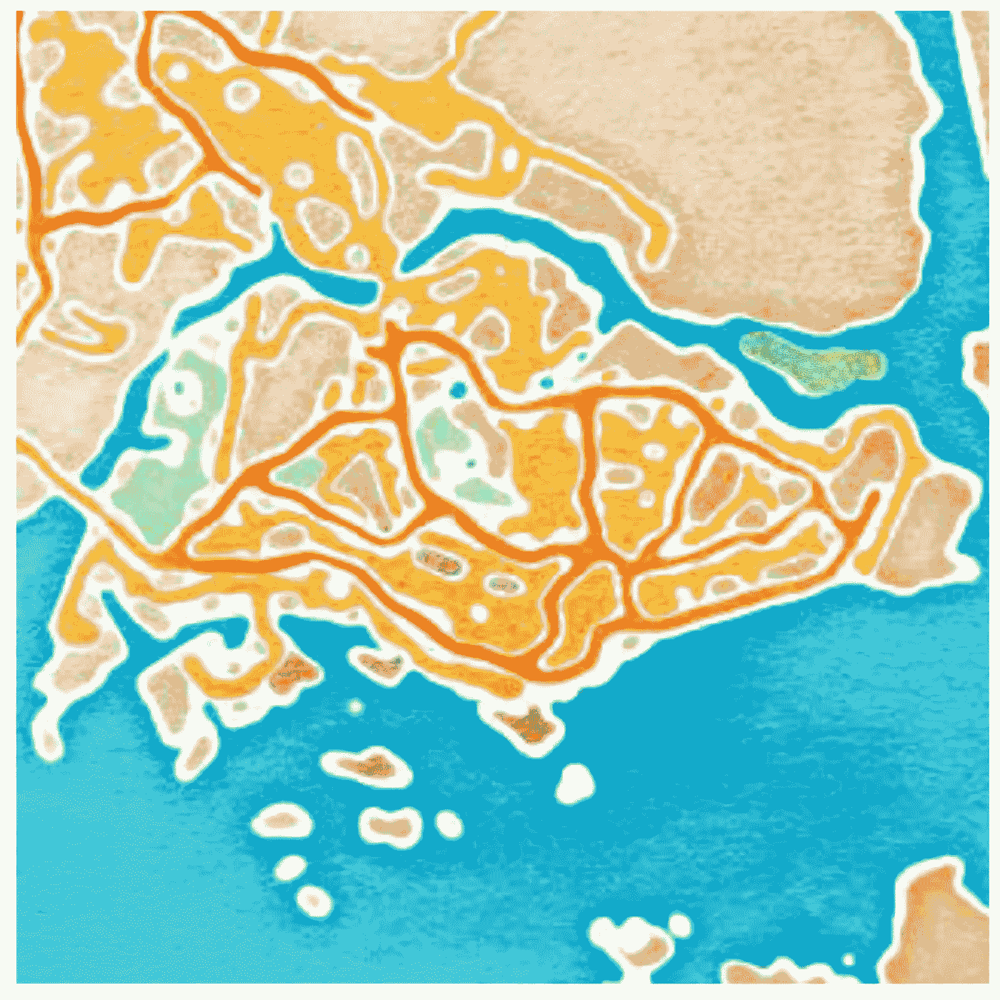
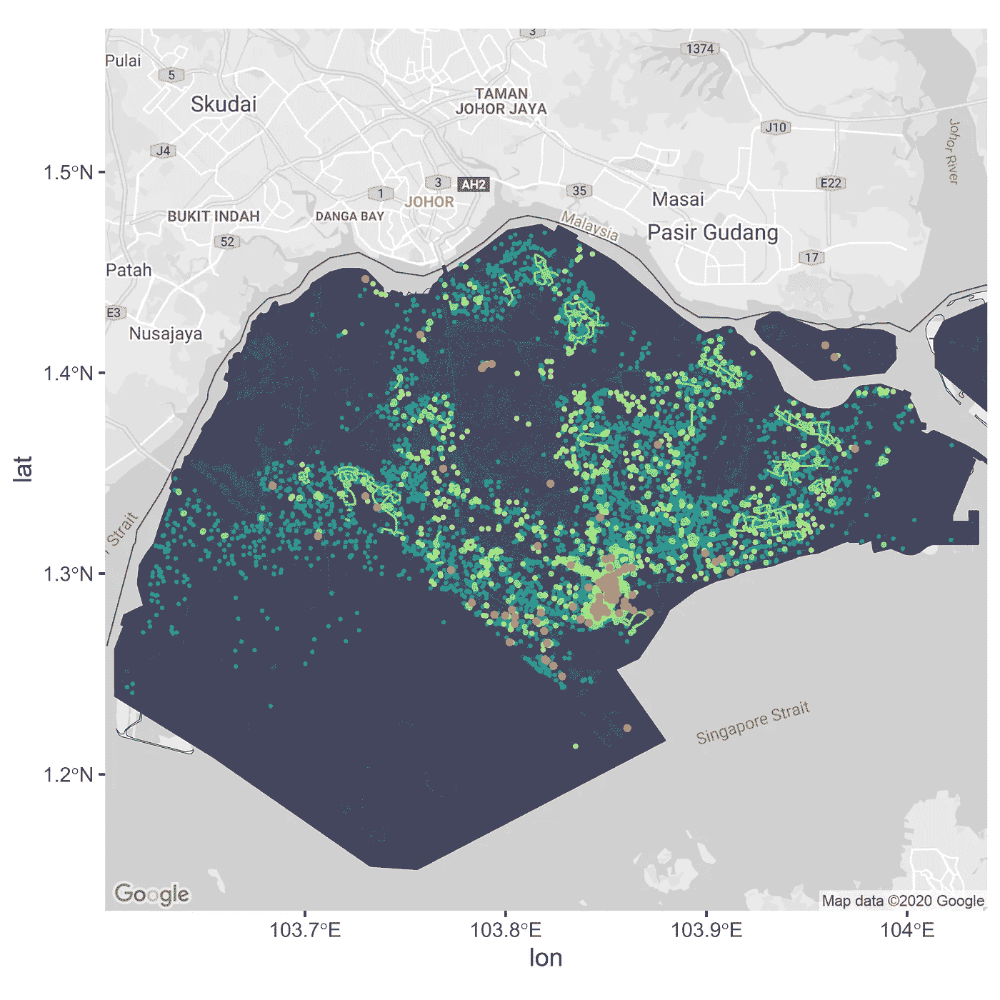

# 地图可视化的艺术:用数据点给新加坡岛着色

> 原文：<https://towardsdatascience.com/the-art-of-map-visualization-coloring-singapore-island-with-datapoints-41c7414adfed?source=collection_archive---------39----------------------->

## 一个简单的地图可视化指南！



新加坡岛的水彩地图

新加坡无疑是亚洲最热门的旅游目的地之一。尽管这个城市比纽约小，但它有你需要或想体验的一切。丰富的食物选择、街头(和奢侈品)购物、拥抱生物多样性的绿色城市，应有尽有！

在本文中，我们将使用 R 来可视化新加坡地图上的空间数据。

## API 设置和获取地图

首先，我们需要使用 get_map 函数获得一个地图背景。

```
#Load the R packages
library(ggplot2)
library(dplyr)
library(sf);
library(stringi)
library(ggmap)#Set your API Key
ggmap::register_google(key = "*your google api key*")#Get Singapore map as background
map <- get_map("singapore", maptype = "roadmap", zoom = 11, source = "google", color = "bw")*# There are many map types in the ggmap package to play around with!*
```

## 数据集上的免责声明

本文只关注新加坡岛。其他较小的岛屿不包括在可视化中。

## 数据源

本文使用的所有数据集均来自[data.gov.sg](https://data.gov.sg/)。新加坡政府提供大量数据供公众使用。在本文中，我从源代码下载了 KML (Keyhole markup language)文件，并使用 r

下载完 KML 文件后，将文件加载到 R 中进行处理。KML 数据集需要转换成 EPSG 3857 格式，这是谷歌使用的伪墨卡托投影坐标系。

```
# Load the KML file paths
cyclingPath <- "*KML file path on your PC*"
taxi <- "*KML file path on your PC*"
mrt <- "*KML file path on your PC*"
parks <-"*KML file path on your PC*"#Read the KML files in R
cyclingPathData <- st_read(cyclingPath)
taxiData <- st_read(taxi)
mrtData <- st_read(mrt)
parksData <- st_read(parks)# Transform KMLdata to EPSG 3857)
cyclingPathData_3857 <- st_transform(cyclingPathData, 3857)
taxi_3857 <- st_transform(taxiData, 3857)
mrt_3857 <- st_transform(mrtData, 3857)
parks_3857 <- st_transform(parksData, 3857)
```

## 在新加坡地图上叠加 EPSG 3857 数据集

在获得我们想要的新加坡地图并将数据集转换为正确的格式后，我们需要将数据集属性(点和面)要素与基础地图结合起来。以下代码将允许我们准确地将数据集和新加坡地图的经纬度点叠加在一起。

```
# Define a function to fix the bbox to be in EPSG:3857
ggmap_bbox <- function(map) {
  if (!inherits(map, "ggmap")) stop("map must be a ggmap object")

# Extract the bounding box (in lat/lon) from the ggmap to a numeric vector, and set the names to what sf::st_bbox expects:
  map_bbox <- setNames(unlist(attr(map, "bb")), 
                       c("ymin", "xmin", "ymax", "xmax"))

# Convert the bbox to an sf polygon, transform it to 3857, and convert back to a bbox (convoluted, but it works)  bbox_3857 <- st_bbox(st_transform(st_as_sfc(st_bbox(map_bbox, crs = 4326)), 3857))

# Overwrite the bbox of the ggmap object with the transformed coordinates 
  attr(map, "bb")$ll.lat <- bbox_3857["ymin"]
  attr(map, "bb")$ll.lon <- bbox_3857["xmin"]
  attr(map, "bb")$ur.lat <- bbox_3857["ymax"]
  attr(map, "bb")$ur.lon <- bbox_3857["xmax"]
  map
}# Use the function:
map <- ggmap_bbox(map)
```

## 使用 ggmap 函数映射数据集

在这篇文章中，我使用了从 data.gov.sg 获得的十个数据集来可视化新加坡岛上的食品机构、交通系统和娱乐活动场所

*   餐饮场所、小贩中心、超市
*   出租车站，捷运出口
*   公园、自行车道、健身房、水上运动场所
*   旅游景点

```
ggmap(map) + 
  coord_sf(crs = st_crs(3857)) + # force the ggplot2 map to be in 3857
  geom_sf(data = nationalSurvey_3857, col = "#46425B",lwd = 0.5, fill = "#46425B", inherit.aes = FALSE, show.legend = FALSE)+ 
  geom_sf(data = nationalLine_3857, col = "#435A74",lwd = 0.2, inherit.aes = FALSE, show.legend = FALSE) +
  #**food**
  geom_sf(data = eating_3857, col = "#219D98", lwd = 0.3, inherit.aes = FALSE, show.legend = FALSE) +
  geom_sf(data = hawker_3857, col = "#219D98",lwd = 0.3, inherit.aes = FALSE, show.legend = FALSE) +
  geom_sf(data = supermarket_3857, col = "#219D98",lwd = 0.2, inherit.aes = FALSE, show.legend = FALSE) +
  #**transportation**
  geom_sf(data = taxi_3857, col = "#80DA83", lwd = 0.6,inherit.aes = FALSE, show.legend = FALSE) +
  geom_sf(data = mrt_3857, col = "#80DA83", lwd =0.6,inherit.aes = FALSE, show.legend = FALSE) + 
  #**workout locations**
  geom_sf(data = gym_3857, col = "#CAF270",lwd = 0.5, inherit.aes = FALSE, show.legend = FALSE) +
  geom_sf(data = waterSports_3857, col = "#CAF270",lwd = 0.5, inherit.aes = FALSE, show.legend = FALSE) +
  geom_sf(data = Relaxparks_3857, col = "#CAF270",lwd = 0.5, inherit.aes = FALSE, show.legend = FALSE) +
  geom_sf(data = parks_3857, col = "#CAF270",lwd = 0.5, inherit.aes = FALSE, show.legend = FALSE) +
  geom_sf(data = cyclingPathData_3857, col = "#80DA83",lwd = 0.5, inherit.aes = FALSE, show.legend = FALSE) +
  #**tourism**
  geom_sf(data = tourist_3857, col = "#EE8F58", lwd = 1, inherit.aes = FALSE, show.legend = FALSE)
```

## 结果

在执行了上面的 R 代码之后，你应该能够得到一个新加坡地图，用所选的数据集着色！



新加坡地图，用食物、交通和娱乐地点着色

## 结论

大多数学院都位于新加坡海峡附近，新加坡海峡是市中心的核心区域。所以，如果你马上要去新加坡，你知道该去哪里！

R 中的 ggmap 包是一个强大的空间数据可视化包。Google、Stamen 和 Openstreetmap 有很多地图类型可以自己尝试！