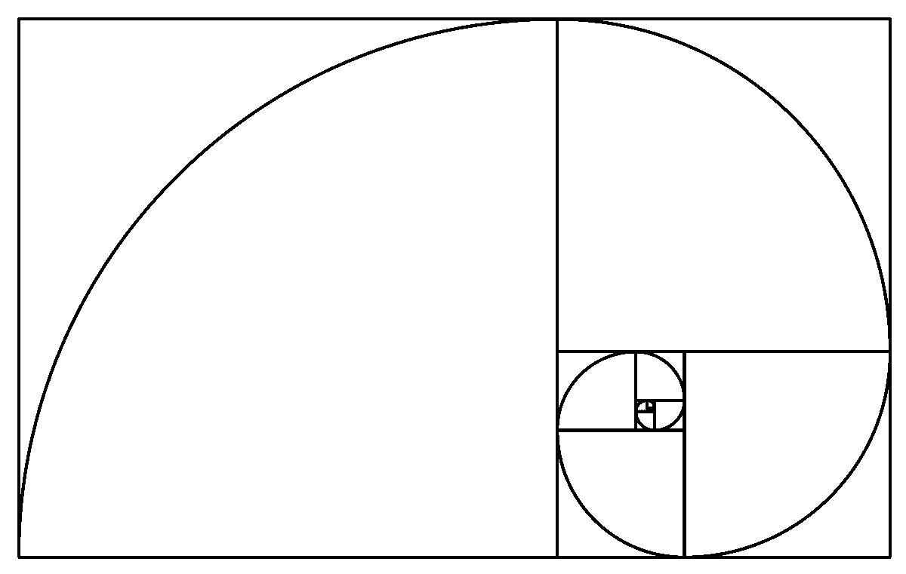
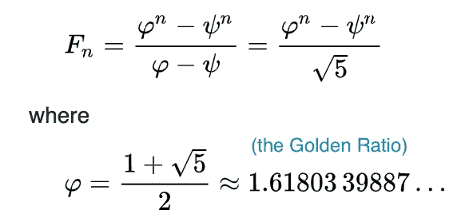
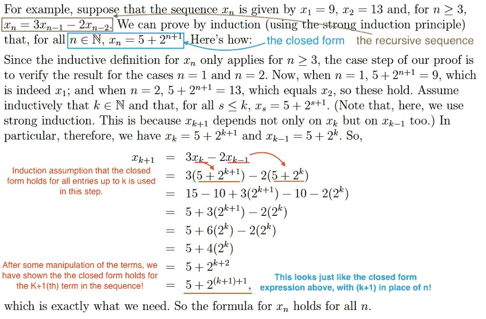
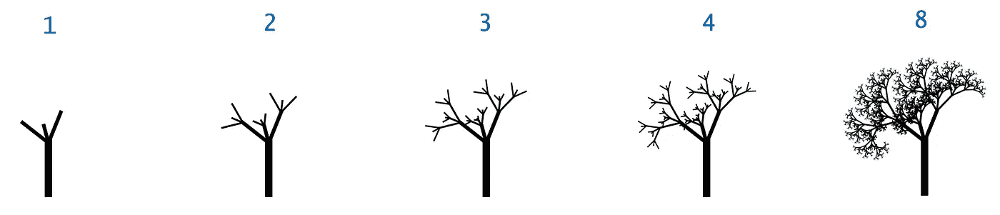
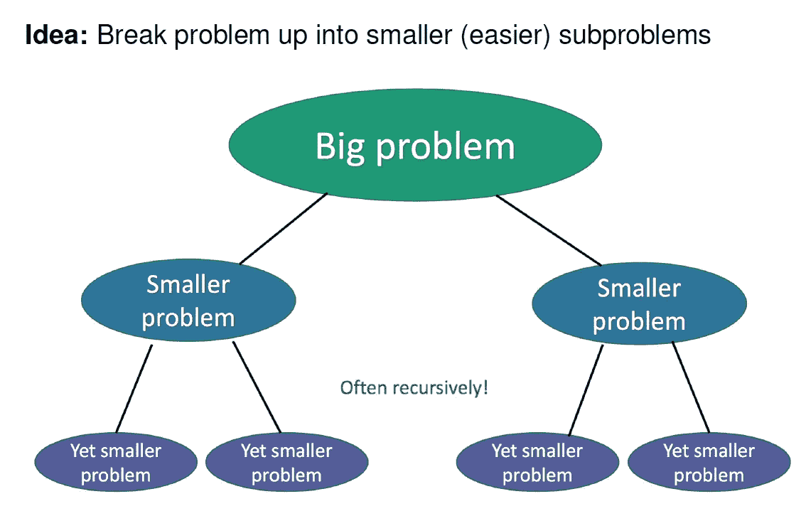

# 递归的艺术；与无限的联系。

> 原文：<https://towardsdatascience.com/the-art-of-recursion-a-connection-to-infinity-622292be0089?source=collection_archive---------38----------------------->

## 艺术、数学和编程中的递归之美。

不久前，我使用 PIP 将一些 python 包安装到一个新环境中。顾名思义，PIP 是 Python 中安装和管理包的标准包。出于好奇，我决定谷歌一下 PIP 代表什么…PIP = PIP 安装 Python。这让我陷入了递归首字母缩略词的*螺旋*——首字母缩略词指的是它自己。虽然递归首字母缩略词的早期例子似乎来自计算机科学领域，但现在也有一些组织使用递归名称*(见:VISA 和 FARM)。*


来源:阿尔夫·范·比姆/ CC0 ( [维基百科](https://commons.wikimedia.org/wiki/File:Droste_Cacao_Alcalinise_blikje,_foto4.JPG))

递归也可以在视觉上出现，例如上面的 Droste 可可罐。递归的想法是非常神奇的，因为即使它超出了我们所看到的，甚至超出了我们所画出的，在理论上，递归实体是无限扩展的。这就像站在两面镜子中间，看着自己的同一个影像延伸到一个无尽的不存在的(至少对我们的肉眼来说)走廊。

> 递归的威力显然在于用有限的语句定义无限的对象集的可能性。同样，一个有限的递归程序可以描述无限数量的计算，即使这个程序不包含显式的重复。
> 
> — [尼古拉斯·沃斯](https://en.wikipedia.org/wiki/Niklaus_Wirth)，*算法+数据结构=程序*，1976[【3】](https://en.wikipedia.org/wiki/Recursion_(computer_science)#cite_note-3)

## 数学和计算机科学中的递归

递归是数学和计算机科学中的一个重要分支。斯坦福哲学百科全书将递归函数定义为这样一种函数，它的“值是由应用于较小自变量的相同函数的应用来定义的”。递归的强大和美丽在于这个函数的强大。这个函数本身可能并不简单，但是一旦你破解了这个代码，它就是一个强大的函数。

递归在行动中——递归在数学和计算机科学中的应用。

**A .数学上:**递归函数为数学归纳法提供了一个范围，一种**数学上的工整证明技术**。(递归函数的结果可以是*美学上令人愉悦的*，例如斐波那契螺旋。)
**B .在计算机科学中:**递归是一种强大的算法工具，用于**解决否则必须迭代解决的问题**，需要跟踪迭代的每个实例的状态。



斐波纳契螺旋:不管你放大多少，你最终都会得到同样的图像。斐波那契螺旋中的比例被称为“黄金比例”。这个比例在自然和艺术中都能找到！来源:维基共享资源

# A.递归序列&归纳法证明

数学中的*序列*是指一系列数字 A₁、A₂、A₃…An.
*递归序列*是列表中的每个条目由列表中先前的条目定义的序列。例如 A₃ = 3A₂-2A₁.A₁和 A₂需要先被分配一个号码。

更一般地说，上面的例子将被定义为:
***x*n = 3*x*n-₁-2*x*n-₂对于所有 n > 2 和 *X* ₁ =某数 a， *X* ₂ =某数 B** 。*(序列中的前两个条目必须定义为递归公式依赖于这两个数字。)*

**斐波那契数列**是著名的递归数列，定义为:
Fn = Fn-₁ + Fn-₂，对于所有 n 个> 2。其中 F₁ = 1，F₂ =1。

递归的威力就在这里:你会如何寻找 A₃₀₀₀₀₀₀₀的值？你可以首先计算 A₁到 A₂₉₉₉₉₉₉₉.的价值*不理想*，除非你是超级计算机？即使是超级计算机，理论上也有极限。介绍递归序列的**封闭形式**。这是一种表示一个序列的一个条目的值的方式，不依赖于前面的值！



斐波纳契数列的封闭形式。Fn 由 n 定义，而不是序列的任何前面的值。

寻找递归关系的封闭形式是另一天的主题。应该注意的是*不是所有的递归序列都有一个封闭形式*(如果你设法找到一个，那会让你非常出名！！).所以让我们首先假设我们已经为封闭形式确定了一个*表达式*。

我们需要证明这个表达式确实适用于序列中的所有值*，并且将使用**数学归纳法来证明。**这个证明是优雅的，因为你**只需要证明*对某些值 k*** *成立，而 viola，你已经* ***证明了这对于序列中的所有值*** *成立！**



图片作者。来自 LSE《抽象数学导论》2016 的例子。

基本上，逻辑流程是这样的—
1。首先假设该表达式适用于直到 kᵗʰ条目的所有条目(k 是任意数)
2。然后证明它对后面的条目成立；即(k+1)ᵗʰ条目
3。因为 k 是任意选择的，所以它可以是任何整数。在我们开始证明之前，我们还表明它适用于构建序列的前两个条目(n=1，n=2)。**逻辑在整个序列中递归流动，因此通过数学归纳法，闭合形式对 n 的所有值(即序列中的所有条目)都成立。**

> 用[尼古拉斯·沃斯](https://en.wikipedia.org/wiki/Niklaus_Wirth)的话说，我们已经“用有限的语句定义了无限的对象集合”。

# B.递归函数和分治算法

在一些编程问题中，我们知道我们想要达到的目标，但是**可能不知道需要多少步骤，或者正确的路径**。这是因为*环境会改变*并且健壮的算法应该不管环境如何都工作。这就是递归可以帮助我们解决这些大问题的地方。



来源:[https://introcs.cs.princeton.edu/java/23recursion/](https://introcs.cs.princeton.edu/java/23recursion/)(无意侵犯版权)

编程中的递归与我们在自然界中看到的分支没有什么不同——每个分支都分支成更多的分支，向外延伸，最终覆盖一大片区域(例如，树、树根、灯光、河流三角洲)。在每一步，都必须根据一套固定的规则做出决定，这套规则适用于每一步。例如，在根中，新的分枝可能向土壤更肥沃的区域生长。这种情况循环发生，直到植物的根部伸展以给植物提供足够的养分，或者没有生长的空间。



来源:LSE 算法与编程 2019

同样的逻辑也适用于递归函数。破解的代码是这样的:**‘每一步应用的规则集是什么；**和**我们何时停止拓展业务？**

这本身就不是一个小问题。然而，一旦你能想出那个问题的答案，大多数编程语言都允许*递归函数*，那是一个可以调用自身的*函数。*这有助于执行你所确定的规则来灵活地解决问题。(我在这里要提醒的是，递归可能并不总是解决编程问题的最佳方式，事实上可能更复杂，但那是另一个故事了。)

我们举个例子 Python 中的 MergeSort 算法。MergeSort 是一种按升序对数字进行排序的算法。

```
def MergeSort(A):                  # Create the MergeSort algorithm
    if len(A) <= 1:
    return A m = len(A) // 2
    left = MergeSort(A[:m])        # Sort the left half of the list
    right = MergeSort(A[m:])       # Sort the right half of the list return Merge(left , right)     # merges the left and right
                                     elements which are both sorted
```

这可能首先会让人难以理解，我将把算法的细节留到以后再说。
**但基本概念依旧—** 1。规则是:在每一步，将列表分成两半，并对每一半进行排序。然后，使用合并规则合并每个排序后的一半。Merge 本身是一个函数，定义为按照升序合并两个排序列表。
2。**递归地将给定的列表分成两半，直到列表只包含一个元素。
3。然后**递归组合**排序后的一半，直到整个列表被排序。**

注意，我们不需要定义*划分列表的次数，*也不需要定义*要采取的一组特定的固定步骤。*这使得算法适用于任意数字组合或任意长度的列表。

> 再一次，用尼古拉斯·沃斯的话来说，“一个有限的递归程序可以描述无限次的计算，即使这个程序不包含显式的重复”。

# 太久没读了；

递归可以在自然界中观察到，在河流三角洲中树木伸展树枝或溪流的方式。递归也存在于艺术中，既有显式的(例如在 Droste tin 设计中)，也有隐式的(例如艺术中的斐波那契螺旋和比率)。

在数学和计算机科学中，递归是一种强大的方式，通过定义一组有限的规则或提供有限的证明来达到无限。

在数学中的递归序列中，递归允许我们**证明该表达式对序列的无限项**成立，通过证明它对某些项成立。

在编程中，递归函数**允许我们用一组有限的规则解决可能没有完全定义的问题**。

递归帮助我们在有限的时间内达到无限。

这篇文章献给我的初中老师，王老师，她教会了我们数学是美丽的。

斯坦福哲学百科全书:[https://plato.stanford.edu/entries/recursive-functions/](https://plato.stanford.edu/entries/recursive-functions/)

其他资源:【https://www.youtube.com/watch?v=PXwStduNw14】Eddie Woo 关于*数学是一种意义*的精彩 ted 演讲。