# (人工)聪明的投资者

> 原文：<https://towardsdatascience.com/the-artificially-intelligent-investor-379a180e199f?source=collection_archive---------60----------------------->

## 金融中的人工智能

## 使用 RNNs 生成投资建议


马库斯·斯皮斯克在 [Unsplash](https://unsplash.com/s/photos/finance?utm_source=unsplash&utm_medium=referral&utm_content=creditCopyText) 上的照片

莎士比亚戏剧，斯蒂芬·金的小说，甚至坎耶的歌词都曾作为生成文本的递归神经网络(RNNs)的训练数据。虽然这些项目很有趣，但我想为文本生成找到一个更实际的用途，并决定探索 RNNs 是否可以形成连贯的投资建议。在考虑了几个选项后，我选择用本杰明·格拉哈姆的《聪明的投资者 T4》来训练这个模型，这本书被沃伦·巴菲特称为“有史以来最好的投资书籍”。正如我们稍后将看到的，该模型的输出当然没有揭示击败市场的秘密，但思考人工智能是否有一天能够提供合理的财务建议仍然很有趣。

# RNNs:快速概述

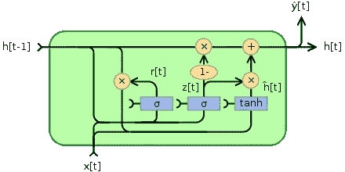

门控循环单元(图片来自[维基百科](https://en.wikipedia.org/wiki/Gated_recurrent_unit)

rnn 类似于人类的学习。当人类思考时，我们并不是每秒钟都从零开始思考。例如，在句子“鲍勃打篮球”中，我们知道鲍勃是打篮球的人，因为我们在阅读句子时保留了过去单词的信息。类似地，rnn 是具有反馈回路的神经网络，这允许它们在达到最终输出之前使用过去的信息。然而，随着时间间隔的增长，RNNs 只能连接最近的信息，而不能连接更早的信息。门控递归单元(gru)是 RNNs 的改进版本，它通过一个决定传递哪些信息相关的更新门和一个决定哪些过去的信息不相关的重置门来克服短期记忆问题。关于 GRUs 的深入解释，点击[这里](/understanding-gru-networks-2ef37df6c9be)。

*作者注:RNNs 的定义重用自我之前的文章* [*机器学习预测股票价格*](/predicting-stock-prices-using-a-keras-lstm-model-4225457f0233)

# *导入/加载数据*

*首先，我们进行必要的导入:Tensorflow、Numpy 和 os。*

```
*import tensorflow as tfimport numpy as npimport os*
```

*下一步是下载我们的数据，这是一个智能投资者的. txt 文件。我从文件中删除了前言、索引和一些图表，以帮助我们的模型生成更相关的文本。一旦我们下载了这个文件，我们看一下里面总共有多少个字符。*

```
*from google.colab import filesfiles.upload()text = open('The_Intelligent_Investor copy.txt', 'rb').read().decode(encoding='utf-8')print ('Length of text: {} characters'.format(len(text)))*
```

*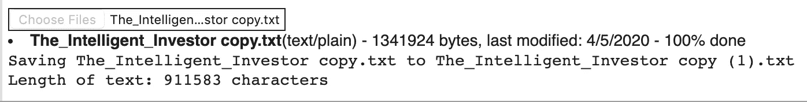*

# *预处理*

*让我们看看文件中有多少独特的字符。*

```
*vocab = sorted(set(text))print ('{} unique characters'.format(len(vocab)))*
```

*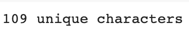*

*我们的模型不能理解字母，所以我们必须对文本进行矢量化。每个独特的字符被映射成一个整数，以便计算机理解，整数被映射到字符，以便我们以后可以解码计算机的输出。*

```
*#Maps characters to intschar2int = {char: num for num, char in enumerate(vocab)}#Maps ints to charactersint2char = np.array(vocab)#Intelligent Investor text represented as ints.text_as_int = np.array([char2int[char] for char in text])print(char2int)print(int2char)*
```

*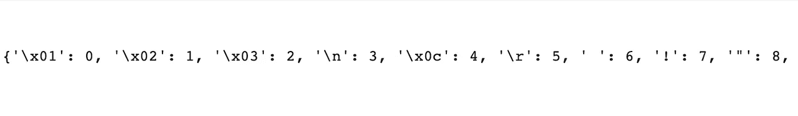*

*字符到整数映射的示例*

*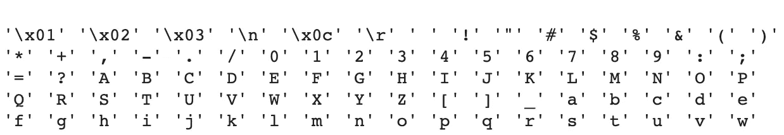*

*整数到字符映射的示例*

*我们训练 RNN 模型的目的是教会它在给定的字符序列后预测最可能的字符。为此，我们将把文本中的输入序列分成一个示例序列和目标序列。目标序列是右移一个字符的示例序列，因此文本块必须比序列长一个字符。例如，如果我们的文本是“股票”，示例序列将是“股票”，目标序列将是“库存”。*

```
*seq_length = 100examples_per_epoch = len(text)//(seq_length+1)
# Create examples and targets sequenceschar_dataset = tf.data.Dataset.from_tensor_slices(text_as_int)sequences = char_dataset.batch(seq_length+1, drop_remainder=True)def split_input_seq(chunk): example_text = chunk[:-1] target_text = chunk[1:] return example_text, target_textdataset = sequences.map(split_input_seq)#look at the first example and target sequencefor example_text, target_text in  dataset.take(1): print ('Example data: ',  repr(''.join(int2char[example_text.numpy()]))) print ('Target data:',  repr(''.join(int2char[target_text.numpy()])))*
```

*在训练我们的模型之前，我们将数据混洗并分段成批。混洗数据的目的是通过避免过度拟合来提高模型的性能，过度拟合是指模型学习训练数据过于紧密，无法很好地推广到测试集。*

```
*batch_size = 64buffer_size = 10000dataset = dataset.shuffle(buffer_size).batch(batch_size, drop_remainder=True)*
```

# *构建/培训我们的模型*

*使用为训练准备的数据，我们创建具有三层的模型。*

1.  *嵌入层是我们的输入层，它将每个字符的整数表示映射为 256 维的密集向量。*
2.  *GRU 层是我们的隐藏层，有 1024 个 RNN 单位。*
3.  *Softmax 层是我们的输出层，有 109 个潜在输出(109 个唯一字符中的一个)。*

```
*model = tf.keras.Sequential()model.add(tf.keras.layers.Embedding(len(vocab), 256, batch_input_shape=[batch_size, None]))model.add(tf.keras.layers.GRU(1024, return_sequences=True, stateful=True, recurrent_initializer='glorot_uniform'))model.add(tf.keras.layers.Dense(len(vocab)))#summary of our modelmodel.summary()*
```

*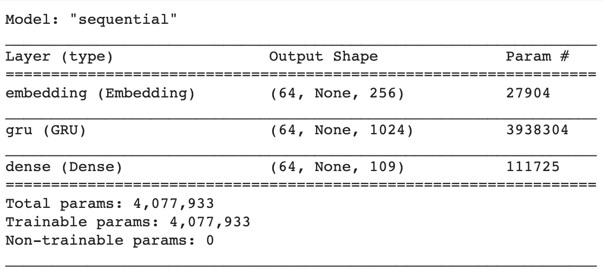*

*我们模型的总结*

*现在，我们用 Adam 优化器和稀疏分类交叉熵损失函数来编译我们的模型。*

```
*def loss(labels, logits):
    return tf.keras.losses.sparse_categorical_crossentropy(labels,         logits, from_logits=True)model.compile(optimizer='adam', loss=loss)*
```

*在我们训练模型之前，我们确保在训练期间保存检查点。通过保存检查点，我们可以用不同的批量快速重建我们的模型，并恢复保存的权重，而不是再次训练它。*

```
*checkpoint_dir = './training_checkpoints'checkpoint_prefix = os.path.join(checkpoint_dir, "ckpt_{epoch}")#Make sure the weights are savedcheckpoint_callback=tf.keras.callbacks.ModelCheckpoint(filepath=checkpoint_prefix, save_weights_only=True)history = model.fit(dataset, epochs=30, callbacks=[checkpoint_callback])*
```

# *生成文本*

*重新构建我们的模型，并加载批量大小更改为 1 的权重，这使得预测更简单。*

```
*model = tf.keras.Sequential()model.add(tf.keras.layers.Embedding(len(vocab), 256, batch_input_shape=[1, None]))model.add(tf.keras.layers.GRU(1024, return_sequences=True, stateful=True, recurrent_initializer='glorot_uniform'))model.add(tf.keras.layers.Dense(len(vocab)))#load weights from previous modelmodel.load_weights(tf.train.latest_checkpoint(checkpoint_dir))model.build(tf.TensorShape([1, None]))#summary of our modelmodel.summary()*
```

*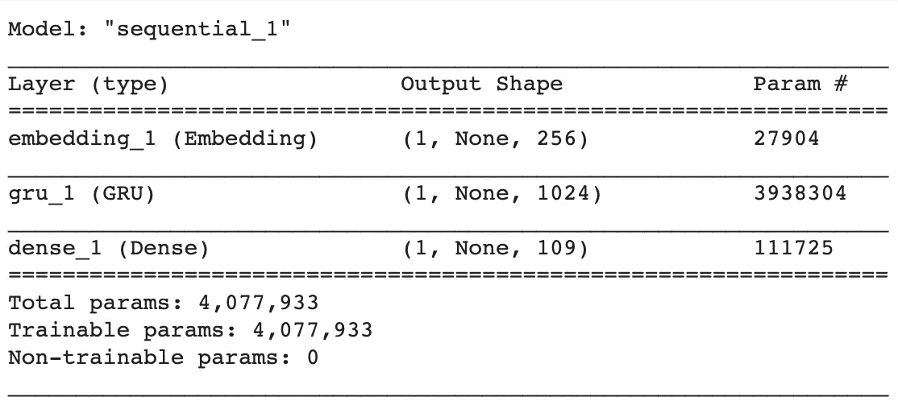*

*新模型概述*

*关键时刻到了:我们的模型最终揭示了它的投资建议！温度参数影响我们接收到的输出:较低的温度导致更保守的输出，而较高的温度导致更有创造性的输出，更容易出错。我们将在下面看到这样的例子。*

```
*#try any temperature in the range of 0.1 to 1def generate_text(model, start_string, temperature): # Number of characters to generate num_generate = 1000 # Converting our start string to numbers (vectorizing) input_eval = [char2int[s] for s in start_string] input_eval = tf.expand_dims(input_eval, 0) # Empty string to store our results text_generated = [] model.reset_states() for i in range(num_generate): predictions = model(input_eval) # remove the batch dimension predictions = tf.squeeze(predictions, 0) predictions = predictions / temperature predicted_id = tf.random.categorical(predictions,     
        num_samples=1)[-1,0].numpy() input_eval = tf.expand_dims([predicted_id], 0) text_generated.append(int2char[predicted_id]) return (start_string + ''.join(text_generated))print(generate_text(model, start_string="Advice: ", temperature=.5))*
```

*这是我们的模型在温度为 0.1 时产生的建议。*

*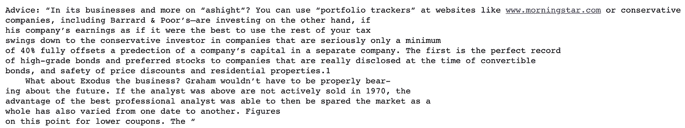*

*温度= 0.1*

*尽管这一结果与你应该遵循的任何投资建议都相去甚远，但它在模仿聪明的投资者方面做得相当不错。由于气温较低，我们的模型没有尝试创新，而是通过坚持段落格式中的标准句子来谨慎行事。让我们看看随着温度的升高，这是如何变化的。*

*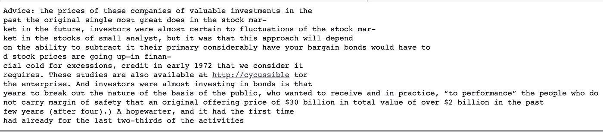*

*温度= 0.5*

*在温度为 0.5 时，我们可以开始看到输出的差异。我们的模型试图更有创造性，结果却犯了更多的错误。这方面的一个例子是在倒数第二行，括号使用不当。*

*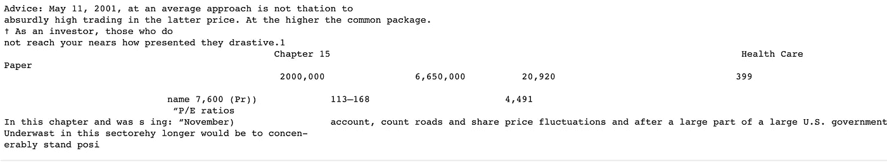*

*温度= 1*

*现在，温度为 1 时的差异非常明显，因为我们的模型试图生成表格。然而，创造性增加的代价是输出变得很难理解。我在不同的温度下提供了更多的输出，以供参考。*

*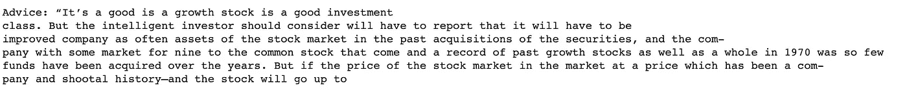*

*温度= 0.1*

*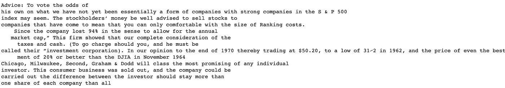*

*温度= 0.5*

*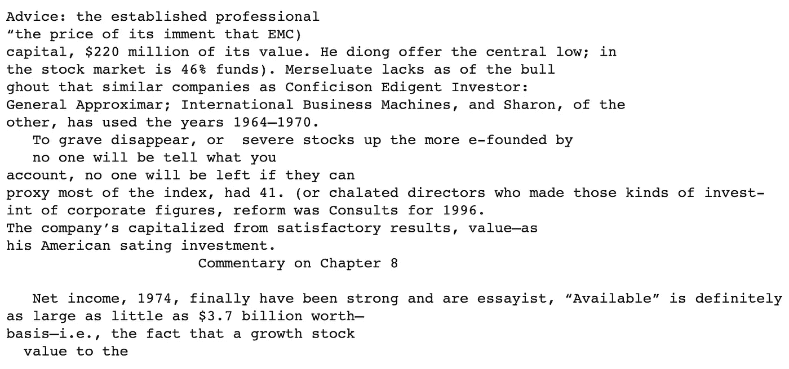*

*温度= 1*

# *结论*

*正如我们所看到的，RNNs 目前还不能取代投资顾问。也就是说，这里有一些我们可以尝试改进模型输出的方法。*

*   *增加纪元的数量*
*   *获得一个更好的训练数据集(当把*这个聪明的投资者*从 pdf 文件转换成 txt 文件时，一些格式被弄乱了)*
*   *使用 LSTM 图层代替 GRU 图层(lstm 是 RNN 的另一种改进类型)*

# *参考*

*[1]谷歌团队，[文本生成与 RNN](https://www.tensorflow.org/tutorials/text/text_generation) ，Tensorflow 核心*

*[2] Aurélien Géron，[使用 RNNs 和 Attention 进行自然语言处理](https://github.com/ageron/handson-ml2/blob/master/16_nlp_with_rnns_and_attention.ipynb)，使用 Scikit-Learn、Keras 和 TensorFlow 进行动手机器学习*

***先别走**！*

*我是 Roshan，16 岁，对人工智能和金融的交叉领域充满热情。如果你对应用于金融的 RNNs 有进一步的兴趣，可以看看这篇文章:[https://towards data science . com/predicting-stock-prices-using-a-keras-lstm-model-4225457 f 0233](/predicting-stock-prices-using-a-keras-lstm-model-4225457f0233)*

*在 Linkedin 上联系我:[https://www.linkedin.com/in/roshan-adusumilli-96b104194/](https://www.linkedin.com/in/roshan-adusumilli-96b104194/)*