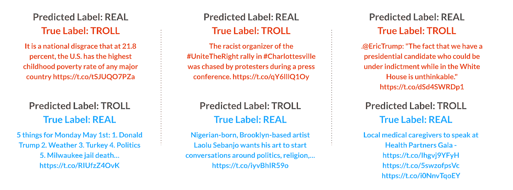
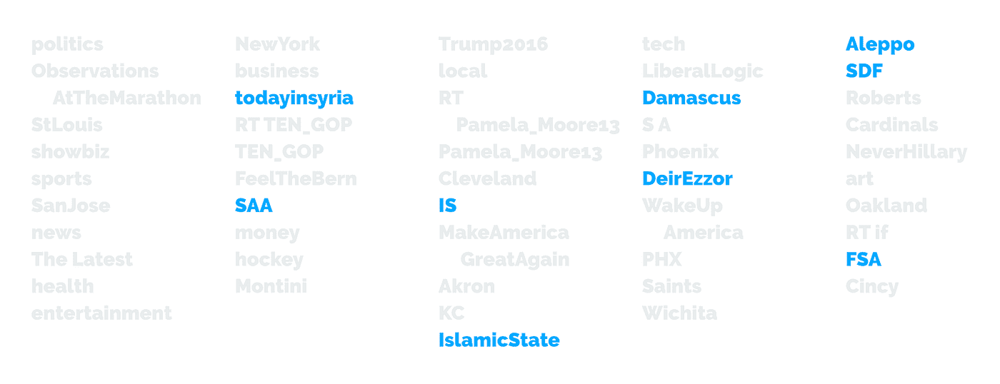

# Askeladden 算法

> 原文：<https://towardsdatascience.com/the-askeladden-algorithm-10859c349fc9?source=collection_archive---------37----------------------->

## [变更数据](https://towardsdatascience.com/tagged/data-for-change)

## 使用机器学习来理解选举干扰

*由* [*劳拉*](https://www.linkedin.com/in/lpintos/)*[*拉米罗*](https://www.linkedin.com/in/ramirocadavid/) *和* [*安娜*](https://www.linkedin.com/in/anna-ching-jacobson/)*

**

*通过 Shutterstock 获取图像(通过标准许可证获得)*

# ***第一部分|导言***

## *概观*

*2019 年 2 月，作为特别顾问罗伯特·穆勒调查俄罗斯政府干预 2016 年总统选举的一部分，美国司法部指控 13 名俄罗斯国民非法干预美国政治进程。被告为一家资金雄厚、俄罗斯国家支持的“巨魔工厂”工作，该工厂名为互联网研究机构(IRA)，据报道，该公司有 400 名员工(被称为“巨魔”)在圣彼得堡一栋不起眼的办公楼里工作 12 小时。爱尔兰共和军通过社交媒体，包括脸书、Instagram 和 Twitter，策划了一场复杂、协调的运动来传播虚假信息，并在美国政治中制造不和。*

*Twitter 发现并暂停了数千个此类恶意账户，在平台上从公众视野中删除了数百万条“巨魔”推文。虽然其他新闻媒体已经公布了样本，但很难理解爱尔兰共和军的努力的全部规模和范围，以及其战略和战术的细节。用布鲁金斯学会外交政策研究员阿琳娜·波利亚科娃的话说，*

> *“擦除内容并不能消除所造成的损害，它还阻止我们了解如何更好地为未来的此类攻击做准备。”*

*为了解决这个问题，并“符合我们的透明度原则，并增进公众对所谓外国影响活动的理解”，2018 年底，Twitter 公开了它认为可能来自国家支持的信息操作的推文和媒体档案。*

*根据 2018 年 12 月美国参议院情报特别委员会(SSCI)的简报，在被暂停的 IRA troll 账户中，约有 109 个账户伪装成新闻机构，包括美国当地新闻机构。我们这个项目的目标是开发一种机器学习算法，可以实现这种算法来加强 Twitter，防止像爱尔兰共和军这样的组织试图操纵媒体，以及违反 Twitter 服务条款的其他活动。具体来说，我们希望开发一种机器学习算法来预测这些“假新闻”巨魔推文。我们创造的算法是以 Askeladden 命名的，一个在挪威民间传说中智胜并击败巨魔的男孩。*

## *动机*

*除了在 Twitter 规定的严格定义的滥用范围内，该公司不对其用户帖子的真实性或意图负责。几乎可以肯定，这是由于监控和管理大量不断增加的内容所带来的实际挑战。然而，这种选择也可能是意识形态的；Twitter 通过其政策申明支持言论自由和公开对话。有许多个人“真正的”Twitter 用户发布类似于爱尔兰共和军的内容，可能有类似的意图。在大多数情况下，这些用户遵守 Twitter 用户协议。然而，我们认为爱尔兰共和军的巨魔与“真正的”巨魔有本质上的不同，不应该被给予同样的自由。*

*上述同一份 SSCI 报告告诉我们，爱尔兰共和军明确界定并协调了影响 2016 年大选的意图，表现出对唐纳德·特朗普的强烈和一贯的偏好，以及对其他许多共和党候选人的负面内容，包括特德·克鲁兹、马尔科·卢比奥、林赛·格雷厄姆、约翰·麦凯恩和本·卡森，以及他的大选对手希拉里·克林顿。Troll tweets 采用了蓄意的选民压制策略，包括恶意误导、候选人支持重定向和选民投票率下降。爱尔兰共和军是由敌对的外国政府指挥的，其行动是由外国人实施的，这更令人担忧。民主的核心原则——一个民族应该能够为自己选择最能管理和满足其政治需求的领导人——被任何外国选举干涉所违背。像爱尔兰共和军这样隐蔽的、口是心非的、故意歪曲事实的外来干涉，是对一个建立在公众信任基础上的机构的特别冒犯。*

*自称是合法新闻组织的“假新闻”巨魔通过冒充和操纵媒体实施了特别令人震惊的欺诈。利用现代媒体环境的碎片化,“假新闻”巨魔将民主的一个关键支柱武器化。此外，这些账户的影响范围远远超过大多数个人账户。在被暂停之前，44 个美国“假新闻”推特账户积累了 660，335 名粉丝，平均每个账户有 15，000 名粉丝(而推特用户平均只有不到 1，000 名粉丝)。这些账户中的许多表现类似，每天发布几十次文章和本地内容的链接。许多其他合法用户，包括几名高调的特朗普竞选成员(小唐纳德·特朗普、埃里克·特朗普、凯莉安妮·康威、布拉德·帕斯凯尔和迈克尔·弗林)，链接或转发这些账户的材料，使其内容合法化，并扩大其影响力，远远超出其粉丝。出于这些原因，我们认为“假新闻”值得我们项目的特别关注。*

*也许这个项目最令人信服的动机是巨魔的威胁依然存在；《SSCI 报告》指出，有证据表明社交媒体平台上持续存在干扰操作。为了防止我们现在知道在 2016 年选举期间发生的干涉在未来的选举中再次发生，必须采取措施积极保护美国的民主机构。*

# **第二部分|数据源&探索**

## *“假新闻”巨魔推文*

*Twitter 的 IRA 数据集包括所有公开的、未删除的推文，以及 Twitter 认为与 IRA 有关的 3613 个账户的媒体。这些用户在被暂停之前删除的推文(不包括在这些数据集中)占他们总活跃度的不到 1%。*

*对于我们的项目，我们决定专注于 **_tweets** 数据集，其中包括从 2009 年 5 月到 2018 年 6 月的 8，768，633 条独特的推文。该数据集包括 31 个变量，包括推文识别号、用户识别号(在暂停时关注者少于 5000 人的用户匿名)、用户的推特账号(与匿名用户的用户 id 相同)、推文的语言、推文的文本(提到的匿名账户已被替换为匿名用户 id)以及推文发布的时间。仅过滤英语推文后，数据集中有不到 300 万条独特的推文(2，997，181)。这些推文来自 3077 个不同的用户账户。*

**

**图 1:英语推文训练数据中的前十条推文。**

*我们将我们的关注期定义为 2016 年至 2018 年，以便与我们的真实新闻数据集的时间框架保持一致(见下文)。我们还认为，这一时间框架代表了 2016 年总统选举前后政治分歧不断升级的重要时期。*

*为了将“假新闻”巨魔与其他巨魔区分开来，我们根据包含“每日”、“新闻”、“今日”和“在线”等词的用户屏幕名称创建了一个子集。这产生了来自 33 个不同用户帐户的 296，949 条不同推文，这些帐户的屏幕名称包括 TodayNYCity、ChicagoDailyNew 和 KansasDailyNews。*

## *真正的新闻推文*

*哈佛数据世界(Harvard Dataverse)公布了一个数据集，其中包含从大约 4500 家新闻媒体的 Twitter 账户(即旨在传播新闻的媒体机构的账户)收集的 39695156 条推文的推文 id。媒体组织包括各种渠道，从美国当地报纸到外国电视台。它们是在 2016 年 8 月 4 日至 2018 年 7 月 20 日期间从 Twitter API 中收集的。*

*Twitter 的开发者政策(要求遵守该政策以换取 Twitter API 的密钥)对数据集的共享设置了限制。如果你正在分享推文的数据集，你只能公开分享推文的 id，而不是推文本身。因此，这个数据集只包含推文的 id。基于这些信息，我们从 Twitter API 中检索了完整的 tweet。我们选择了意识形态领域的各种英语新闻媒体，包括政治、福克斯新闻频道、CNN、《经济学人》和 MSNBC。我们总共收录了来自 49 个独立用户账户的 153，188 条独立推文。*

## *所有的新闻*

*为了进行这种分析，我们随机采样了“假新闻”troll tweets 数据集，以获得与真实新闻 tweets 数据集相同数量的 tweets。我们将巨魔推文和真实新闻推文连接在一起，产生了一个 306，376 条推文的组合数据集，这两个类之间相等。我们包括了每条推文的文本及其类别(“真实”或“巨魔”)。没有包括其他识别信息。*

## *特征抽出*

*使用计数矢量器，我们从数据集中提取了 470，051 个独特的特征。在“https”和“co”之后，这是目前为止最常见的功能，因为它们出现在所有其他推文的链接中，许多最常见的功能是标准的英语停用词，如“to”、“the”、“in”和“of”。令人惊讶的是，我们看到特征“trump”在真实新闻推文中出现的频率比 troll 推文中高得多，而特征“news”在 troll 推文中出现的频率比真实新闻推文中高得多。*

*对我们提取的特征的一个有趣的观察是，标准停用词在真实新闻推文中比在巨魔推文中出现得更频繁。这些单词通常不被认为在自然语言处理(NLP)中有用，因为它们无处不在并且缺乏与特定主题的关联。然而，在这个特殊的分析中，我们比较了一个班级，其中的课文可能主要是由英语母语者写的，而另一个班级的课文虽然是用英语写的，但可能主要是由俄语母语者写的。省略停用词，如定冠词“The”，介词“to”和“of”，以及动词“is”，是许多非英语母语者的特征。例如，俄语中没有冠词，所以以俄语为母语的人在学习英语时会很难理解这个概念，并且经常会省略诸如“the”之类的停用词。俄语中介词的使用与英语中有很大不同，这可能会导致错误，例如停用词“on”和“at”之间的混淆以及停用词“for”的省略。俄语也没有系词(连接动词)，这会导致英语中“is”等停用词的省略。*

*撇开停用词不谈，我们看到另一个有趣的区别:在每一类的前五十个最频繁出现的特征中，有三个值得注意的非停用词出现在真实新闻特征中，而不会出现在假新闻特征中，“总统”、“众议院”和“白色”。然而，还有许多不间断的词只出现在假新闻特写中，包括可以在耸人听闻的上下文中使用的词，如“警察”、“枪击”、“死亡”、“火灾”和“撞车”。这可能表明在我们的数据集中国家新闻和地方新闻的不平衡。或者，这可能是不同推文风格的特征，在这种情况下，troll 推文可能更明显地试图抓住读者的注意力。*

# ****第三部分|造型****

*借用情感分析的概念，我们使用 CountVectorizer 和 TFIDF 矢量器测试了许多不同的模型，包括 Bernoulli Naive Bayes、Logistic 回归、Ensemble (Logistic 回归、线性 SVC、Bernoulli Naive Bayes、Ridge 和 Passive Aggressive)、Random Forest 和 Doc2Vec。虽然我们的集成模型表现稍好，但基于其简约性和高准确性，我们选择了逻辑回归计数向量器二元模型进行进一步开发。*

**

*图 2:模型准确性结果。*

*我们探索了各种优化，包括使用停用词移除和许多其他定制预处理来预处理数据，以及在 C 值、min_df 和 max_features 上微调模型。然而，最终，使用未预处理数据的原始未优化模型提供了最佳性能。*

# ****第四部分|模型解读****

*观察“假新闻”推文的统计预测让我们对他们的策略有了一些了解。*

## *伪装*

*许多巨魔的推文看起来无关痛痒，集中在看似没有争议的话题上。12 条“最奇谈怪论”的推文中有 8 条——我们的模型最强烈预测是由奇谈怪论者发布的——是关于体育的。*

**

*图 3:前 12 个“最古怪”的推文。与体育相关的推文以蓝色显示。*

## *混乱*

*巨魔的推文听起来往往像真正的新闻推文。在 20 条最混乱——或预测错误——的推文中，80%是被误归类为真实新闻的巨魔推文。*

**

*图 4:“混乱”的推文样本。*

## *特征变化*

*巨魔推文的前五十个最具预测性的特征似乎各不相同。然而，经过更仔细的研究，模式出现了。*

**

*图 troll tweets 的前 50 个最具预测性的特征。*

**通用词**

*第一种是通用词的使用，如政治、新闻和当地。事实证明，真正的新闻推文不需要使用这种标签来告诉人们它们是什么——例如，CNN 不需要将其推文标记为新闻——你知道它们是新闻，因为你知道 CNN。另一方面，巨魔们似乎确实使用了这些标签——如果你试图让某人相信你实际上不是，这是一个合乎逻辑的举动。*

**

*图 troll tweets 前 50 个最具预测性的特征中的通用词。*

**政治口号**

*第二种模式是政治口号，既有支持特朗普的，也有反对希拉里的。这并不奇怪；正如我们前面提到的，爱尔兰共和军现在被证明一直试图影响 2016 年大选，使之有利于特朗普。合法的新闻机构不会使用这些短语也是有道理的。*

**

*图 7:政治口号位列巨魔推文最具预测性的 50 大特征之中。*

**叙**

*更令人惊讶的是第三种模式，与叙利亚相关的词的流行。也许这是因为这些巨魔正积极地试图影响叙利亚的事件——或者也许是因为真正的美国新闻对叙利亚的报道非常稀少。或者，这些推文可能是针对欧洲受众的，因为当时叙利亚在欧洲是一个更具争议的问题。*

**

*图 8:与叙利亚相关的词位列巨魔推文最具预测性的 50 个特征中。*

# ****第五部分|结论****

*自 2016 年大选以来收集的证据无可辩驳地表明，俄罗斯发动了一场协调、专业化的运动，以颠覆媒体的诚信，削弱美国的民主。2020 年 8 月，美国情报官员公开宣布，这种干涉仍在继续，要么是为了帮助特朗普总统赢得第二个任期，要么只是为了削弱对美国选举制度的信心。*

*美国国家反情报和安全中心的声明没有提供俄罗斯在 2020 年大选前的策略细节，只是将其描述为“在美国传播虚假信息，旨在破坏对我们民主进程的信心”。但我们知道的是，如果选民被俄罗斯巨魔的虚假信息误导，爱尔兰共和军在 2016 年采用的战术类型只能影响选举。我们深切希望 Askleladden 算法等项目能够帮助美国人提高对敌对外国政府可能如何试图操纵他们的认识，并在寻找和核实我们用来决定投票的信息时提高警惕。*

**该项目创建于* [*加州大学伯克利分校信息学院*](https://ischoolonline.berkeley.edu/data-science/)**的信息与数据科学硕士* *项目。***