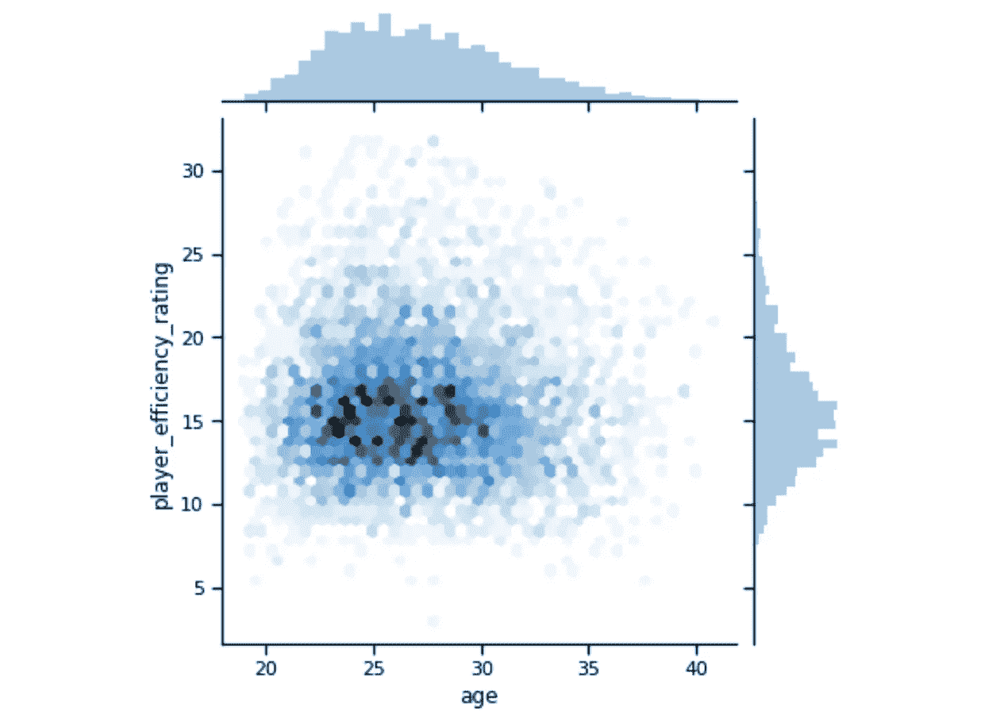
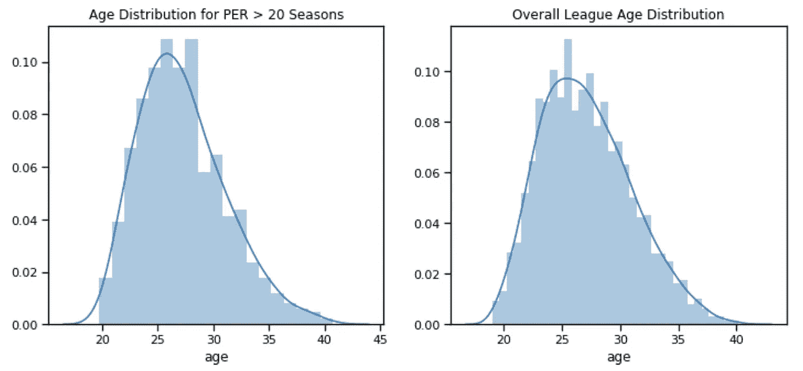
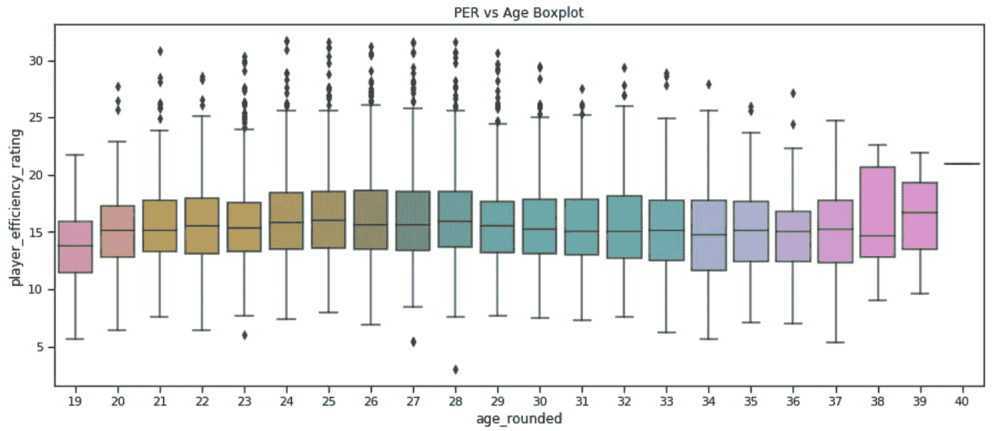
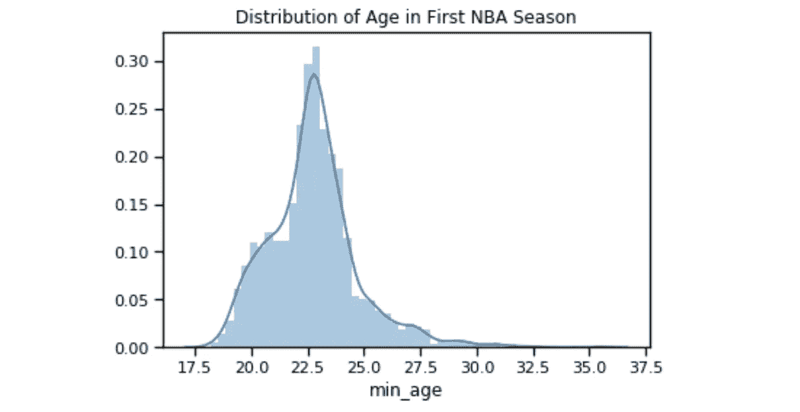
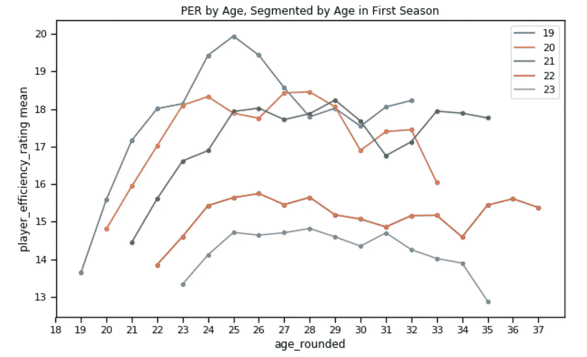

# 年龄的财富

> 原文：<https://towardsdatascience.com/the-asset-of-age-e4b45599ea94?source=collection_archive---------40----------------------->

## NBA 球员发展分析


切尔西·费伦南多在 [UnSplash](https://unsplash.com/) 上的照片

这是我每周体育主题系列的第三部分。每周，我都会展示以体育为中心的数据科学应用。

上周，我发表了一篇关于体育参考 API 的[介绍，并展示了该 API 如何用于构建一个全面的 NBA 球员统计数据集。本周，我将深入这个数据集，看看球员的发展。](/sports-reference-api-intro-dbce09e89e52)

NBA 球队喜欢选秀年轻球员，这不是什么秘密。无论是从国际联盟来到 NBA，还是在 NCAA 单干，青少年往往是第一批离开赛场的球员。年龄较大但更有成就的潜在客户往往必须等到第二轮，许多人没有被选中。很明显，NBA 球探将年龄视为一项资产，让我们来看看这是为什么。

一个显而易见的假设是，年轻球员在达到巅峰状态之前有更多的时间发展。但是什么时候是一个球员的全盛时期，他们真正发展了多少？事实上，每个球员的情况都不一样，但是数据中有一些趋势是可以确定的。

## 黄金时间

为了确定典型的 NBA 球员的黄金时期何时出现，我将根据年龄来看 PER ( [球员效率等级](https://en.wikipedia.org/wiki/Player_efficiency_rating))。PER 是一种先进的篮球统计，由霍林格开发，它试图将传统的得分指标结合成一个单一的评级。虽然 PER 远非完美，尤其是在衡量防守方面，但它已经是你在单一评级中能得到的最好的了。

我首先加载数据集并绘制一些简单的图来感受数据。关于如何生成这个数据集，参见我之前的[故事](/sports-reference-api-intro-dbce09e89e52)。我还做了一些额外的专栏，删除了不符合最低分钟数要求的赛季。

```
import pandas as pd
import numpy as np
import matplotlib.pyplot as plt
import seaborn as sns%matplotlib inlineseasons = pd.read_csv('Data/nba_player_stats_by_season.csv',
                      index_col = 'id')# Create a few extra columns
def get_min_age(player_id):
    return seasons[seasons['player_id'] == player_id]['age'].min()seasons['min_age'] = seasons['player_id'].apply(get_min_age)
seasons['min_age_rounded'] = seasons['min_age'].apply(lambda x: int(np.floor(x)))
seasons['age_rounded'] = seasons['age'].apply(lambda x: int(np.floor(x)))careers['min_age'] = careers['player_id'].apply(get_min_age)
careers['min_age_rounded'] = careers['min_age'].apply(lambda x: int(np.floor(x)))# remove seasons with less than 1500 minutes.
# this is the minimum minutes requirement per BBallRef to qualify for PER.qseasons = seasons[seasons['minutes_played'] > 1500]sns.set_context('notebook')
sns.jointplot(x = qseasons['age'],
              y = qseasons['player_efficiency_rating'],
              kind = 'hex');
```



每对年龄联合图

这张图表显示，最高的 PER 季节发生在 25 岁左右。接下来，我将查看 PER > 20 的季节的年龄分布，以及数据集中所有季节的总体年龄分布。作为参考，20 的命中率被认为是一个临界的全明星赛季。

```
plt.figure(figsize=(15,6))
sns.set_context('notebook')plt.subplot(1,2,1)
sns.distplot(qseasons[qseasons['player_efficiency_rating'] > 20]['age'])
plt.title('Age Distribution for PER > 20 Seasons')plt.subplot(1,2,2)
sns.distplot(qseasons['age'])
plt.title('Overall League Age Distribution');
```



从这里可以看出，高 PER 季节的分布与我们数据集中的整体年龄分布基本相同。虽然很有趣，但这并没有真正说明 20 多岁的球员会更好，目前为止我所展示的是大多数球员都在这个年龄段。为了更好地了解不同年龄的预期表现，箱线图可以清晰地显示每个年龄组的 PER 分布。

```
plt.figure(figsize=(15,6))
sns.set_context('notebook')
sns.boxplot(x = qseasons['age_rounded'],
            y = qseasons['player_efficiency_rating'])
plt.title('PER vs Age Boxplot');
```



现在我们正在谈话！这个箱线图很好地展示了数据，并表明 24-28 岁年龄段的球员比其他年龄段的球员有更高的预期表现。这通过由方框中间的线表示的 PER 中值、由方框顶部表示的第 75 百分位 PER 以及高 PER 异常值的丰度来显示。其他一些有趣的趋势也很明显。一个是 19 岁和 20 岁的球员通常不是很好。另一个原因是 36 岁以上的球员表现上升，这是只有最好的球员能够在这个年龄之后留在联盟的结果。

## 青春的价值

前面的部分仍然没有解释为什么球队如此强烈地支持青年选秀。如果 19 岁和 20 岁的球员通常效率较低，那么为什么不选择接近巅峰或者已经处于巅峰的老球员呢？回到年轻球员在达到巅峰状态之前有更多时间发展的假设，我将看看球员在职业生涯中是如何发展的。

为此，我将使用上面定义的“min_age”列对数据集进行分段，这只是表示球员在第一个赛季的年龄。下图是球员在 NBA 第一个赛季的年龄分布。

```
sns.distplot(careers['min_age']);
```



正如人们所料，大多数球员在他们的第一个 NBA 赛季都在 20 到 25 岁之间。一个按年龄划分的平均 PER 图，按球员在 NBA 第一个赛季的年龄划分，显示了年轻和年长年龄组非常不同的结果。以下代码生成此图。请注意，我将 18 岁和 19 岁这两个年龄段结合在一起，因为 18 岁这一年龄段本身就很小。

```
qseasons['min_age_rounded'] = qseasons['min_age_rounded'].apply(
                              lambda x: 19 if x <= 19 else x)# segment qseasons by min_age_rounded and plot
plt.figure(figsize=(10,6))
sns.set_context('notebook')
plt.xticks(ticks = [x for x in range(18,38)])
plt.title("PER by Age, Segmented by Entry Age")for i in range(19, 24): # filter data and aggregate
    temp_df = qseasons[qseasons['min_age_rounded'] == i]
              [['age_rounded', 'player_efficiency_rating']]
    temp_df = temp_df.groupby(by = 'age_rounded').agg(
              ['mean', 'count']) # remove multi-index, then remove seasons with low sample size
    temp_df.columns = [' '.join(col).strip() for col in
                       temp_df.columns.values]
    temp_df = temp_df[temp_df['player_efficiency_rating count'] >
                      10]['player_efficiency_rating mean'] # plot segment data
    sns.lineplot(x = temp_df.index, y = temp_df, label = i)
    sns.scatterplot(x = temp_df.index, y = temp_df);
```



在这里，我们可以看到，19 岁、20 岁和 21 岁年龄段的人在 25 岁左右比 22 岁和 23 岁年龄段的人更有效率。特别是，19 岁年龄组在 25 岁达到了令人印象深刻的高峰，这是 6 年复合改善的结果。在此期间，19 岁年龄段的球员平均能够提高 6 分以上的 PER。相比之下，22 岁的细分市场从入门到巅峰平均只能提高 2 个百分点。请注意，这些线是根据可用的样本大小截断的。

同样，使用箱线图可以进一步理解这些部分。各部分主要年份的 PER 箱线图有助于更全面地了解数据分布。这可以使用下面的代码来构造。

```
temp_df = qseasons[np.array(qseasons['min_age_rounded'] <= 23) &
                   np.array(qseasons['age_rounded'] <= 28) &
                   np.array(qseasons['age_rounded'] >= 24)]plt.figure(figsize=(10,6))
sns.set_context('notebook')
sns.boxplot(x = temp_df['min_age_rounded'],
            y = temp_df['player_efficiency_rating'])
plt.title('PER in Prime Years (24-28) by Entry Age');
```


## 萧条和偏见

虽然我已经表明，在评估潜在的 NBA 人才时，年龄是一个非常重要的考虑因素，但它肯定不是一切。有很多在 NBA 选秀中被选中的年轻球员的例子，他们从来没有取得什么成就。重要的是要记住相关性和因果关系是非常不同的概念，证明因果关系的门槛要高得多。这个分析只显示了相关性，但是值得思考一下为什么存在这种相关性。

主要原因是 NBA 选秀过程中固有的选择偏差。一个年轻的篮球运动员有强烈的动机尽快加入 NBA。状元秀的新秀薪水是数百万美元，早早进入 NBA 给了球员一个更长的潜在职业收入窗口。因此，在任何时候，最好的 19 岁球员几乎总是希望成为职业球员。明年，这个组中剩下的最好的球员将在 20 岁时成为职业球员。在大多数情况下，一个 22 岁的球员进入 NBA 是一个不够好，不能更早进入 NBA 的球员。所以我们有最优秀的球员在年轻的时候进入 NBA，然后最优秀的球员继续成为最优秀的球员。似乎很明显，不是吗？

事后看来，破产往往是对这种选择偏差误解的结果。在某些情况下，一支球队会选择一名球员，几乎完全是因为他们年轻。如果玩家没有真正证明自己是同龄人中的佼佼者，他们就很难领先。这是把相关性误认为因果关系，本质上是假设玩家会遵循上面显示的轨迹，因为他们还年轻。在其他情况下，一个球队会选择一个在大学四年级时发布了令人印象深刻的数据的老球员。在这些情况下，如果这个球员之前没有被证明是同龄人中的佼佼者，那么他们可能不值得接手已经证明了这一点的年轻球员。这是与第一个例子相反的错误，它完全忽略了选择偏差和相关性。

我希望你喜欢这篇文章。如果你有，请查看我的文章[战胜困难](/beating-the-odds-8d26b1a83f1b)、[体育参考 API 介绍](/sports-reference-api-intro-dbce09e89e52)和[其他](https://towardsdatascience.com/@acmuhr)。下周，我将再次使用这个 NBA 球员数据集来建立一个预测 2020 年以后 NBA 职业生涯的模型。