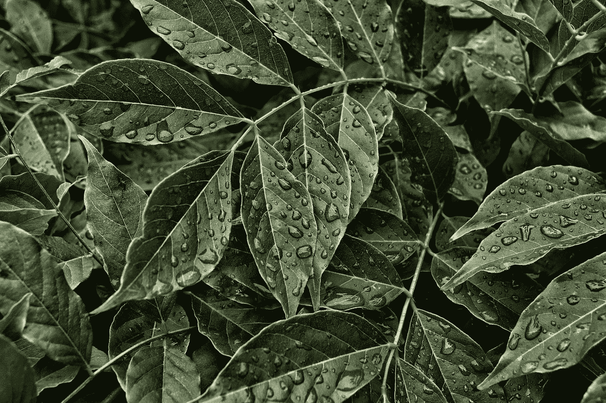

# 卡格尔比赛的精彩

> 原文：<https://towardsdatascience.com/the-awesomeness-of-kaggle-competitions-e30feabdf6b8?source=collection_archive---------41----------------------->

## ka ggle——数据科学学习园地面向所有对该领域感兴趣的人

凯文·Ku 在 [Unsplash](https://unsplash.com?utm_source=medium&utm_medium=referral) 上的照片

*免责声明:在数据科学和撰写文章方面，我都是初学者。这篇文章主要是针对那些不确定是否应该尝试 Kaggle 的读者。不是其中之一？你还是可以读一读。:)*

读者们好，

希望这篇文章能让你在新冠肺炎危机中保持健康。

今天，让我来分享一下我和 Kaggle 的经历。我将主要谈论卡格尔比赛。然而，其他部分也非常有用。首先，Kaggle 是什么？

# 什么是 Kaggle？

> **Kaggle** 是世界上最大的数据科学社区，拥有强大的工具和资源来帮助您实现数据科学目标。

当 Kaggle 说他们是世界上最大的数据科学社区时，他们是认真的。拥有超过 30，000 个公共数据集，300 多个主办的比赛和一些世界上最好的机器学习头脑 Kaggle 是数据科学初学者的酝酿地和专家的实践地。还有一个工作区，公司在那里发布他们的空缺职位。

# 我是如何被介绍到 Kaggle 比赛的

当我开始学习机器学习的课程时，那是我本科学习的第二年。我们应该选择一个 Kaggle 比赛，并尝试根据数据建立一个机器学习模型，作为我们课程项目的一部分。我们是一个五人团队，都是数据科学新手。我们天真地选择了一个艰难的比赛，这个比赛实际上在 Kaggle 上第一次带来了 U-net 架构——著名的 [Carvana 图像掩蔽挑战](https://www.kaggle.com/c/carvana-image-masking-challenge)。

简而言之，训练数据集包含从不同角度拍摄的汽车图像，并且这些图像都有遮罩。该想法是建立一个 ML 模型，将汽车图像作为输入，并将汽车从背景中分离出来。

**结果**？

我们是初学者，我们选择了一个困难的比赛——结果我们表现很差。我从那门课程和比赛中学到了很多东西，但和我们国家的大多数工科学生一样，我们专注于获得一份软件工程的工作，所以我们几乎没有继续练习。

# 快进三年…

虽然计算机视觉在过去三年里有了突飞猛进的发展，但我几乎没有做什么来跟上它。所以，我决定选择一个挑战，尽我所能——[植物病理学 2020](https://www.kaggle.com/c/plant-pathology-2020-fgvc7) 竞赛。

由[杰米·菲利普斯](https://unsplash.com/@jaimiephillips?utm_source=medium&utm_medium=referral)在 [Unsplash](https://unsplash.com?utm_source=medium&utm_medium=referral) 上拍摄的照片

# 植物病理学 2020 竞赛

> 影响农作物的许多疾病的误诊会导致化学品的滥用，从而导致耐药病原体菌株的出现、投入成本的增加和更多的疾病爆发，带来重大的经济损失和环境影响。目前基于人类侦察的疾病诊断既耗时又昂贵，尽管基于计算机视觉的模型有望提高效率，但由于受感染组织的年龄、遗传变异和树木内的光照条件导致的症状的巨大差异降低了检测的准确性。你可以在这里找到更多的。

从描述中可以看出，该竞赛旨在通过计算机视觉模型改进植物疾病的诊断。该数据集由苹果树叶的图像组成，任务是设计一个模型，将图像正确分类为 4 个不同的类别

1.  健康的
2.  锈
3.  痂
4.  多种疾病

我以个人身份参加了这次比赛。目前，我在排行榜上处于 46%的位置。比赛还有一个月就要结束了，谁知道我会不会进步一点，赢得我的第一枚铜牌。

**5 个关键学习点:-**

通过参加这次比赛，我学到了很多东西

1.  py torch——我在参加这个比赛中学到的第一件也是最激动人心的事情。PyTorch 由脸书大学的开发人员创建，可能是目前深度学习领域最热门的东西，在研究和行业中都被迅速采用。我以前没有使用 PyTorch 的经验，但这次我努力学习了。
2.  CNN——尽管我对 CNN 有一些基本的了解，但我可以使用 PyTorch 来实现它。
3.  迁移学习——迁移学习是现在市场上的另一个热门话题。许多模型在 ImageNet 数据集上进行了预训练，预训练的模型可以通过添加我们自己的全连接层直接使用。到目前为止，我使用 DenseNet121 和 Resnet101 进行实验，它们都显著提高了精确度，Resnet 比 DenseNet 稍好。
4.  张量处理单元(TPU)是谷歌最近专门为重型神经网络和机器学习算法开发的。现在我们可以在 Kaggle 上体验一下，因为他们允许每个用户每周 30 小时的免费 TPU。
5.  当我们试图改进模型的性能时，大部分的学习是在构建模型的第一个版本之后进行的。当我们看到其他用户发布的讨论和内核时，我们可以从他们那里学到很多东西。
6.  测试时间增加(TTA)和在线硬示例挖掘(OHEM)是我接下来要尝试的另外两种技术。最后，我会使用 R-CNN 而不是 CNN 来提高模型分数，看看我是否能获得我的第一枚铜牌。

# 结论

如你所见，如果你和我一样是初学者，最好在 Kaggle 上开始你的数据科学之路。你将有机会制作模型。学习曲线非常陡峭，如果你能每天投入 2-3 个小时，你会学到很多东西。Kaggle 社区很棒，如果你被卡住了，问了一个问题，大部分时间都会得到回答，人们不会评判。此外，如果你能和某人合作并分享你的知识，你会学得更快。最令人畏惧的是，迈出第一步，开始一件新的事情。一旦你做到了——这是非常令人兴奋的。

由于 Medium 不支持印度的合作伙伴计划，你可以考虑在这里给我买杯咖啡[。](http://buymeacoffee.com/dadip)

*欢呼*