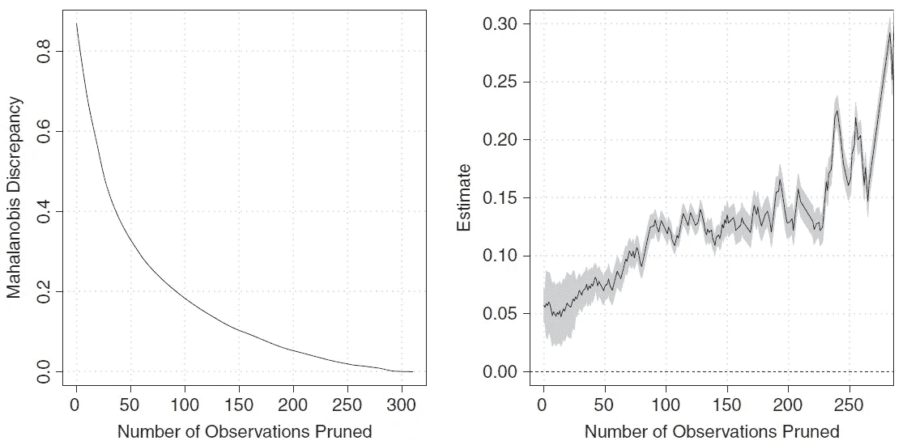
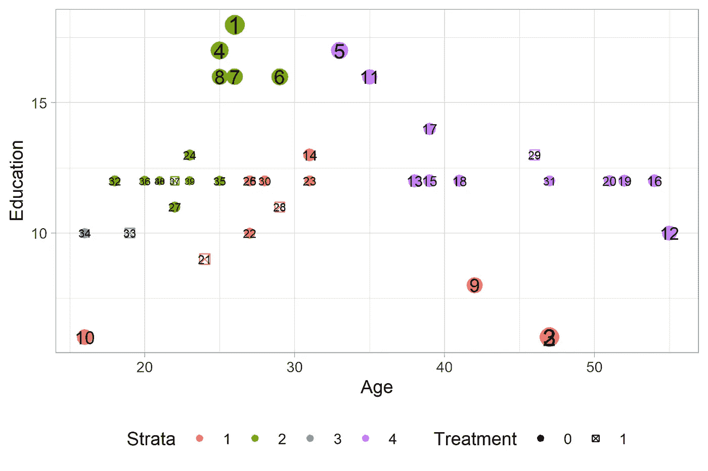
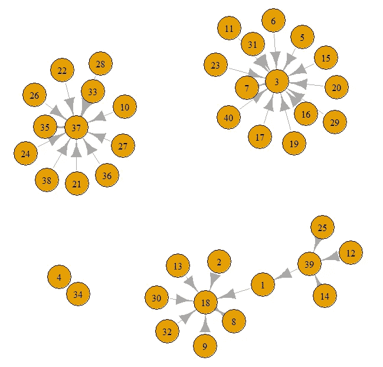

# 匹配中的平衡样本量边界

> 原文：<https://towardsdatascience.com/the-balance-sample-size-frontier-in-matching-f7929ff49022?source=collection_archive---------69----------------------->

## 它是什么，它是如何工作的？

[杰瑞米·托马斯](https://unsplash.com/@jeremythomasphoto?utm_source=medium&utm_medium=referral)在 [Unsplash](https://unsplash.com?utm_source=medium&utm_medium=referral) 上拍照

[Gary King](https://gking.harvard.edu/) 教授和他的同事[克里斯托弗·卢卡斯](http://christopherlucas.org/)和[理查德·a·尼尔森](https://polisci.mit.edu/people/richard-nielsen)在 2017 年*美国政治科学杂志*上发表了一篇名为《因果推理匹配方法中的平衡-样本规模前沿》的论文。在论文摘要中，他们写道:“我们提出了一种简化的因果推断匹配方法，该方法同时优化了平衡和匹配样本大小。”这篇论文引起了我的注意，因为它与匹配的重要偏差-方差权衡相关。

本文旨在对 King 等人(2017)提出的方法进行非技术性描述。这种方法如何工作，为什么工作？该方法的独特之处是什么？当我看报纸时，这些问题一直萦绕在我的脑海里。希望这篇文章也能帮助你回答这些问题。请注意，我希望您已经知道匹配的基本知识，这对理解下面的内容是必要的。如果你不知道，我推荐你阅读我以前的帖子(这里是[这里是](/looking-inside-mahalanobis-metric-matching-4e43cca46a6?source=friends_link&sk=b3ad528c602cbd455cec88d96f856912)，这里是[这里是](/matching-estimator-is-powerful-and-simple-82350f08515a?source=friends_link&sk=b8a73192ec18ea60f2cf8e17b2ae25f3))可能会有帮助。

# 问题是

那么什么是匹配边界呢？

> 匹配边界是“对于每个样本量，具有最大可能平衡的匹配解的集合。”(第 473 页，金等人著，2017 年)。

众所周知，匹配的一个关键目标是减少协变量的不平衡。通过匹配，我们得到一个在协变量上有更好平衡的匹配数据集。因此，我们可以更有把握地将差异归因于治疗，并且估计会更少偏差。

在实践中，我们通常不得不从数据集中删除不匹配的观察值。这就是卡尺匹配所做的——它丢弃距离大于研究者选择的最大容许差异的不良匹配。

丢弃数据可能会帮助我们获得更好的平衡。然而，它也可能增加因果效应估计的方差。这很直观——用更少的数据获得更多的不确定性。事实上，平衡和样本大小之间的权衡很大程度上是偏差和方差之间的权衡，而这两者对于估计量的质量都很重要。

你会使用一个更小的数据集(因此更高的方差)和更好的平衡(因此更小的偏差)吗？或者你会使用一个更大的数据组(因此方差更小)和更差的平衡(因此偏差更大)？所以，你现在可以看到问题了。

# 提议的解决方案

许多关于匹配的论文已经解决了平衡和样本大小之间的权衡问题，他们提出的策略是相似的:在获得平衡数据时(希望如此)，尽可能少地修剪数据。实施这些策略涉及任意选择(例如，丢弃哪些 ob)，并且已经提出了一些规则来指导这个过程(参见这里的综述)。但是你需要选择。

King 等人(2017)提出的解决方案是，你不要挑挑拣拣，而是展示你得到的一切。具体来说，他们建议在修剪数据时，显示在给定样本量中具有最佳协变量平衡的所有估计。称为匹配边界的一组估计值是最优的，因为每个估计值都是给定样本量时可以得到的最佳(最大平衡下的最小偏差)估计值。

下图很好地说明了匹配边界的概念，其中 King 等人(2017 年)展示了修剪数据(从最差匹配开始)如何随着 Mahalanobis 距离的减小(左图)增加数据平衡并改变治疗效果估计值(右图)。

图一。匹配边界。来源:King 等人(2017 年)

# 他们是如何得到匹配边界的？

那么他们是如何得到匹配边界的呢？他们分两步得到它。为了向您解释这些步骤，我使用了一个包含 40 个观察值的迷你数据集，这些观察值是从 lalonde 数据集中随机选择的。这个小型数据集有 5 个处理单位和 35 个对照单位。此外，为了简单起见，我只匹配两个变量:教育和年龄。我关注基于 Mahalanobis 距离度量的替换匹配，因为它很流行。

图 2 按治疗组(1-治疗组，0-对照组)显示了每个观察单位的两个协变量的值。

图二。具有 5 个处理单位和 35 个对照单位的迷你数据集中的协变量值

**在第一步，他们定义了一个数据驱动的规则来修剪数据。**

具体来说，他们从计算每个处理或控制单位的处理组之间的最小 Mahalanobis 距离开始。这里有一个例子。设迷你数据集中的五个处理单元是 B1、B2、B3、B4、B5。我们将计算控制单元(比如 A1)和每个处理单元之间的 Mahalanobis 距离。假设计算出的马氏距离分别为 1.5，1，3.2，4.4，3。在这种情况下，控制单元 A1 的最小马哈拉诺比斯距离是 1，并且与 A1 的最佳匹配是 B2。类似地，我们可以计算其他控制或处理单元的最小 Mahalanobis 距离。程序是一样的。

修剪数据的规则是，我们首先丢弃最小 Mahalanobis 距离相对较大的单元，无论它是处理单元还是对照单元。直观上，最小 Mahalanobis 距离度量数据集中一个单元和其余单元之间的相似性。根据规则，我们首先去除与其他单元相似度最低的单元。

在图 1 中，点的大小代表计算的最小距离。最小距离越大，点数越大。数字标签是最小距离的相对顺序，也是要丢弃的顺序。例如，我们可以看到在图 1 的最顶端，有一个标记为 1 的点。当我们开始修剪数据时，这个单元(恰好是一个控制单元)将是第一个被删除的单元。这是因为它具有最大的最小距离。然后修剪到具有第二大最小距离的另一个单元(在图 1 的底部)。在数据修剪的最后阶段，仅保留最小距离的单元。这些单元主要位于图 1 的左侧和中间部分。

在第二步，他们使用加权最小二乘法来估计治疗效果以及修剪数据。

一旦设定了用于删减数据的规则，他们就在删减数据的同时评估治疗效果。匹配边界只是所有这些估计的组合。

该估计基于加权最小二乘法。是的，它类似于逆概率加权(见这里的介绍)，但是使用了非常不同的权重。

他们分两步得到重量。首先，他们将数据点分配给地层，在图 1 中用颜色表示。从网络的角度来看，层之间的单元在匹配期间是彼此断开的，而层内的单元在匹配期间是相互连接的。例如，如果发现控制单元 A1 与处理单元 B1 最匹配，而 A1 也与处理单元 B2 最匹配。然后，A1、B1 和 B2 将被分配到同一层。

如果您仍然感到困惑，这里是匹配的网络图(图 3)(具有最低的 Mahalanobis 距离)。你可以在图中看到有四个集群。每个聚类被认为是一个层。

图 3。比赛的网络图

处理单元的重量仅为 1。对照单位的权重为(m0/m1)*(k1/k0)，其中 m0 和 m1 分别是数据集中对照和处理单位的数量。k1 和 k0 是包含观察结果的地层中的处理单元和控制单元的数量。

# 摘要

在这篇文章中，我讨论了匹配边界，这是 Hary King 教授和他的同事在 2017 年的论文中提出的一个概念。匹配边界是解决匹配中平衡和样本大小之间的权衡，也是偏倚和方差之间的权衡。我还向您展示了匹配边界可以通过两个步骤获得:定义修剪数据的规则，然后使用加权最小二乘法估计治疗效果。

在我看来，作者删减数据的方式并不新鲜。在修剪数据时，我们总是从丢弃最不匹配的单元开始。井径匹配做到了这一点，大部分发表的论文也做到了这一点。想法已经有了。他们在第二步定义权重的方式对我来说是新的。我从没在文献中见过这个。据我所知，大部分论文都用倾向得分的倒数作为权重。

综上所述，我认为匹配边界对于稳健性分析非常有用。使用匹配边界，您可以显示估计值如何对对匹配至关重要的公共支持假设的潜在违反敏感。

在我未来的帖子中，我将向您展示如何在 r 中获得匹配边界。此外，我将讨论在*大数据*和的背景下实施匹配边界的挑战，我还将与您分享我的策略和代码，它们可以有效地应对这些挑战。

# 参考

金、加里、克里斯托弗·卢卡斯和理查德·尼尔森。2017."因果推理匹配方法中的平衡样本量边界."*美国政治科学杂志*61(2):473–89。[https://doi.org/10.1111/ajps.12272](https://doi.org/10.1111/ajps.12272)。