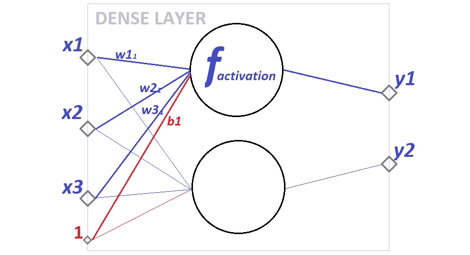

# 神经网络的基本构件

> 原文：<https://towardsdatascience.com/the-basic-building-block-of-neural-networks-a9b2e8f5c056?source=collection_archive---------37----------------------->

## 探索 Keras 的密集层，直到源代码

密集层(一个规则的全连接层)可能是最广泛使用和最著名的神经网络层。它是许多神经网络体系结构的基本构件。

了解密集层为进一步探索其他类型的层和更复杂的网络体系结构打下了坚实的基础。让我们深入到密集层，直到实现它的代码。

在本文中，我使用 Keras([https://keras.io/](https://keras.io/))来探索层的实现和源代码，但是一般来说，大多数类型的层都非常通用，主要原理并不太依赖于实现它们的实际库。

# 密集层概述

让我们先来看看这种层的可视化表示:



密集图层表示(由作者创建)

在本例中，密集层有 3 个输入、2 个单元(和输出)和一个偏置。让我们来看看每一个。

层输入在这里由 x1、x2、x3 表示。这就是数据的来源-这些数据可以是输入要素值，也可以是前一图层的输出。从技术上讲，这些可以是任何数值，但在大多数情况下，输入值将被规范化为[-1，1]的区间。可以手动或使用特殊图层(例如 Keras 中的 BatchNormalization 图层)进行归一化。

大圆圈代表单位。这是输入值被转换成输出的地方。在可视化中，输出由 y1 和 y2 表示。输出的数量总是与单位的数量相匹配。密集层是完全连接的，这意味着它将每个输入连接到每个输出。这自然意味着每个输入值都会影响(或者至少能够影响-如果相应的权重值不为零)每个输出值。

从输入到输出的转换由激活函数定义。该函数应用于输入值 x1、x2、x3，以获得输出值 y。该函数的结果受权重的影响，权重在可视化中表示为 w11、w21、w31。权重赋予模型学习的能力-基本上，神经网络模型学习的是所有层中的权重值。

可视化中还有一件事——红色数字“1”与所有单元连接，代表“偏差”。偏差指定了对输出值的一些外部影响，这些影响未被输入中提供的特征所覆盖。


Keras 标志(来自 keras.io)

# 喀拉斯的致密层

现在，让我们尝试将 Keras 中的密集层实现与我们的可视化结合起来。在 Keras 中，致密层定义如下:

```
tf.keras.layers.Dense(
    units,
    activation=None,
    use_bias=True,
    kernel_initializer="glorot_uniform",
    bias_initializer="zeros",
    kernel_regularizer=None,
    bias_regularizer=None,
    activity_regularizer=None,
    kernel_constraint=None,
    bias_constraint=None,
    **kwargs
)
```

从数学的角度来看，密集层实现了特征值和权值之间的矩阵乘法。

```
outputs = mat_mul(inputs, weights)
```

我不会在这里解释矩阵乘法背后的数学，我只提供一个例子，第一个输出基值是什么样子的:

**y1 = x1 * w11+x2 * w21+x3 * w31**

请注意，实际上，这不是最终的输出值，因为它可以通过激活函数和/或偏置向量进一步改变，我们将在本文稍后讨论。

现在，让我们通过 Keras 密集层的参数来了解它们的含义以及它们如何影响该层。

## 单位

第一个(也是唯一必须的)参数是“单位”。

*   **单位**:正整数，输出空间的维数。

“单位”指定层的单位数(和输出数)。在我们的可视化示例中 ***单位=2*** 。请注意，Keras 密集图层没有用于指定输入数量的参数。在 Keras 中，输入的数量由前一 NN 层的输出数量定义。

实际上，单元的数量定义了神经网络的“宽度”。这是为某些特定任务创建神经网络架构时需要调整的一个重要参数。密集层中的许多单元可能导致过度拟合，尤其是如果网络也很深(具有许多层)。另一方面，太少的单元会导致学习模式的能力有限。通常，使用的单元越多，应用的正则化就越多。

## 激活功能

参数“activation”是可选的，它定义了激活函数。

*   **激活**:要使用的激活功能。如果你没有指定任何东西，没有激活应用(即。“线性”激活:`a(x) = x`)。

如果我们查看 Keras 库的源代码，激活函数就在返回输出之前应用于输出。

```
if activation is not None:
    outputs = activation(outputs)
```

如果未指定激活功能(默认值为`None`，输出按原样返回。实际上，通常你需要一些激活函数来使神经网络预测合理的值。有许多可能的激活功能，具有不同的特征。对这些的概述超出了本文的范围。

## 偏见

正如我们从图层定义中看到的，在 Keras 中默认使用偏移，但可以选择关闭。

*   **use_bias** :布尔型，该层是否使用偏置矢量。

在我们的视觉化中，偏见用红色表示。有几种方法可以将它形象化——我喜欢把它想象成一个常量值为“1”的特征。注意，仍然为偏差向量的所有单元计算和优化权重，但是偏差向量对输出的影响不受真实特征值的影响。

为了更好地理解为什么需要偏差，让我们考虑一些特征值都为“0”的输入样本。如果没有偏差向量，所有输出也将始终为“0 ”,因为无论权重值是多少，当乘以“0”特征值时，它都将为零。因此，如果没有偏差，图层将无法正确响应“0”特征值。

实际上，大多数情况下，您不需要移除偏置向量。

如果我们查看 Keras 实现中关于密集层使用`use_bias`参数的代码，我们会发现以下内容(为了更好的可读性，跳过了一些代码部分):

```
if use_bias:
    bias = self.add_weight(
        'bias',
        shape=[self.units,],
        ...
        trainable=True)
else:
    bias = Noneif bias is not None:
    outputs = nn_ops.bias_add(outputs, bias)
```

因此，如果我们使用偏差，那么偏差权重会添加到输出值中。请注意，这发生在应用激活函数之前，因此伪代码中的整个公式如下所示:

> 输出=激活(点(输入，内核)+偏置)

## 初始值设定项

密集层有两个初始化器参数——内核(权重)和偏向初始化器。

*   **内核初始化器**:权重矩阵`kernel`的初始化器。
*   **bias_initializer** :偏置向量的初始化器。

简而言之，这些定义了所有权重的初始值，包括特征权重和偏置向量权重。

该模型将在训练过程中改变层权重。但是，如果合理地选择初始权重，模型可以更快地收敛到最优值。

默认情况下，要素权重将随机初始化为均匀分布。偏置权重将用零初始化。

## 正则化子

密集层有 3 个正则化参数:

*   **kernel _ regulator**:应用于`kernel`权重矩阵的正则化函数。
*   **bias _ regulator**:应用于偏置向量的正则化函数。
*   **activity _ regulator**:应用于层输出的正则化函数(其“激活”)。

正则化的主要任务是控制这些值，使它们尽可能低。受控制的值取决于正则化类型。

核正则化降低了权重的平均值。为什么避免巨大的重量值很重要？简单地说——使用的权重越大，模型在为它们选择不同值时的自由度就越大。这增加了模型方差，因此过度拟合的风险增加。

如果我们谈论技术上正则化是如何工作的——它们增加了额外的损失，这取决于权重的平均值。权重越大，损失越大——这反过来会迫使模型减少权重。

类似地，偏差正则化控制偏差的权重。并且活动正则化器控制输出值。

## 限制

定义约束函数的密集层有两个参数:

*   **kernel_constraint** :应用于`kernel`权重矩阵的约束函数。
*   **bias_constraint** :应用于偏置向量的约束函数。

这些函数类似于正则化函数，因为它们也控制权重。区别在于实现控制的方式。如果正则化引入了大权重的惩罚和附加损失，则约束直接限制权重的值，例如通过定义最大值。


[Robynne Hu](https://unsplash.com/@robynnexy?utm_source=medium&utm_medium=referral) 在 [Unsplash](https://unsplash.com?utm_source=medium&utm_medium=referral) 上的照片

# 结论

如果您刚刚开始学习神经网络，了解密集层是一个非常好的起点。

当然，理解神经网络背后的一般思想和数学是非常重要的，但要成功地设计有效的架构，您需要大量的实践和试错方法。那么为什么不现在就开始用 Keras 致密层做一些自己的实验呢？

感谢阅读！