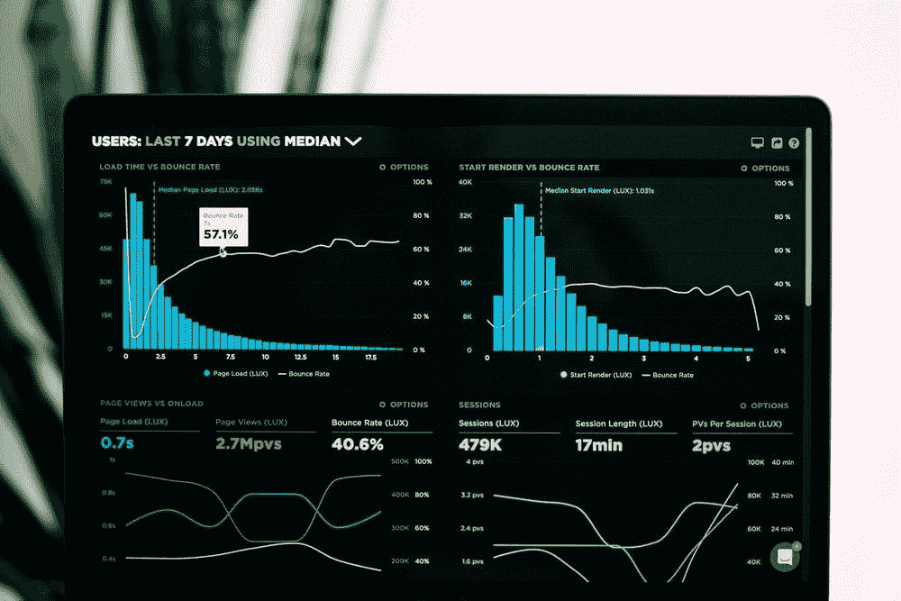
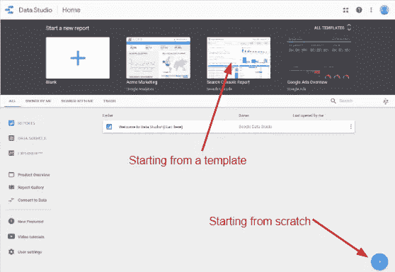
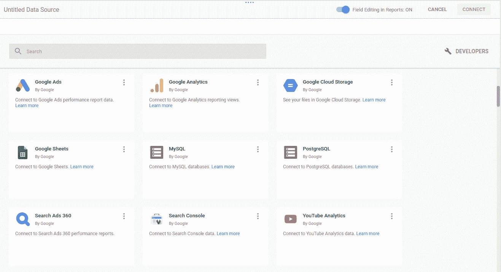
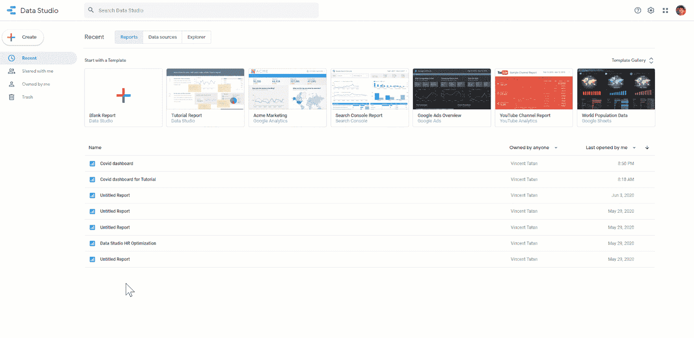
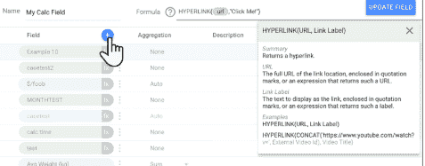
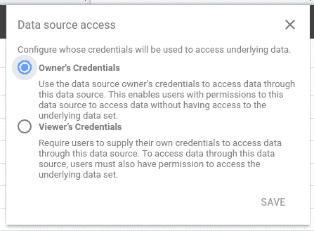
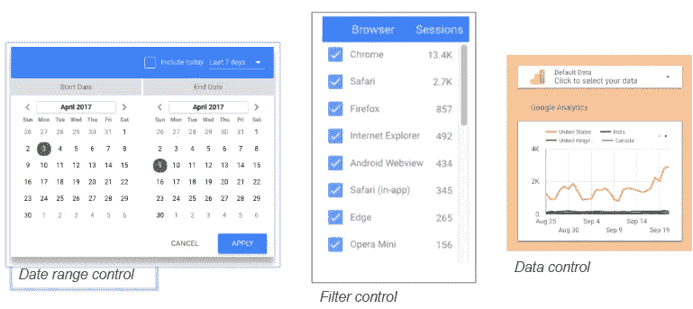
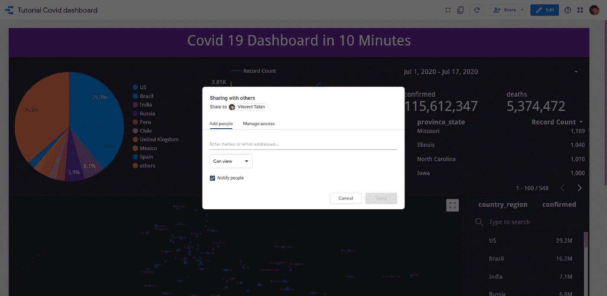

# 谷歌数据工作室的基础

> 原文：<https://towardsdatascience.com/the-basic-of-google-data-studio-72081f247220?source=collection_archive---------37----------------------->

## [实践教程](https://towardsdatascience.com/tagged/hands-on-tutorials)，我给有抱负的数据科学家和数据分析师的建议

## 使用公共数据集快速构建令人惊叹的数据可视化

[来源](https://unsplash.com/photos/JKUTrJ4vK00)

> *如果我告诉你，你可以在你的 Google Drive 中使用免费的、直观的、可共享的交互式仪表盘工具，那会怎么样？*
> 
> *欢迎来到* [*谷歌数据工作室*](http://datastudio.google.com/)

# 模式交流

对于数据科学家和分析师来说，将我们的数据和结果传达给非技术用户非常重要。我们需要制作和分享令人惊叹的仪表板，使其易于交互。

根据瑞典著名统计学家汉斯·罗斯林的说法。

> 我们大多数人需要听音乐才能明白它有多美。但通常这就是我们展示统计数据的方式:我们只展示音符，不演奏音乐。

数据可视化很美。它与我们的五种感官对话，而不仅仅是一连串冰冷、毫无生气的话语。问题是，我们如何快速构建一个仪表板。让我们来玩一下 Google Data Studio。

# *Google Data Studio 是一个******直观*** *，以及* ***可共享的交互式仪表盘*** *。***

*   *****免费*** *:托管在 Google Docs 上。如果你喜欢谷歌文档，那么你会喜欢谷歌数据工作室***
*   ****:拖拽，在* ***10 分钟内设计炫酷仪表盘******
*   ******可分享:*** *带链接的轻松报道和在线回购。****
*   ******互动仪表盘:*** *数据可视化和故事讲述****

***如需了解更多信息，请随意查看我对 [Google Data Studio](/how-to-build-a-great-dashboard-ee0518c3d3f7) 和[数据源(BigQuery](/visualizing-live-big-data-sources-freely-with-big-query-28c9b5ad985d) )的简要描述。***

***在本教程中，我将谈论谷歌数据工作室的基础，并挖掘我们如何能够快速创建一个交互式仪表板。***

# *****Data Studio 可视化步骤*****

## *****创建仪表板*****

***您可以从[模板或从零开始](https://datastudio.google.com/c/u/0/reporting/)创建您的报告。***

******

***创建新仪表板***

## ***创建数据源***

******

***数据源视图***

*****Google Data Studio 支持两种不同类型的数据模式:*****

1.  ******已修复:*** *谷歌自动将你的账户连接到产品进行优化(谷歌分析、Youtube 等)****
2.  ******灵活:*** *Google 为看不见的数据模式创建数据源阅读器→ CSV，大查询****

***有了这些数据源，Google 创建了一个可配置、可重用和可共享的数据源。它与大数据源工具如 [BigQuery](http://Data Source (BigQuery)) 无缝连接。***

## ***连接大查询+谷歌云公共数据集***

******

***Bigquery 数据提取***

***BigQuery 连接到谷歌云分布式计算平台，该平台在一个池中拥有数千个 CPU 来处理请求和作业，并通过[谷歌云公共数据集程序](https://cloud.google.com/public-datasets)提供公共数据。***

***您可以每月免费访问 1TB 的查询数据集，其中包含您投资组合中的大中型项目。***

## ***添加计算字段***

> ***我如何管理我所有的领域？***

***您可以用 50 多个函数创建指标和维度。Google Data Studio 自动为不同的数据变量建议数据类型(绿色表示分类，蓝色表示数字)。基于这些变量，您可以快速配置这些数据源，包括设置聚合函数。***

******

***添加计算字段***

## ***快速配置数据访问***

> ***观众能接触到敏感数据吗？***

***在每一个数据源中，您都有快速的选项来为所有者和查看者开放访问，这些选项是通用的且易于更改。***

*   *****所有者凭证**允许观众访问桌子和仪表板。***
*   *****观众凭证**仅允许观众访问仪表板。仪表板数据是聚合的，需要较少的数据策略。***

***如果有疑问，去查看观众的证件。***

******

***数据访问配置***

# ***创建报告***

> ***我没时间写报告。***
> 
> ***我只是想快速地将它形象化，然后四处玩耍。***

***别担心，Google Data Studio 涵盖了所有 3 个主要组件:图形、过滤器和 web 组件。***

> ***你可以随意摆弄我在 10 分钟内制作的[仪表盘。](https://datastudio.google.com/u/1/reporting/ef9d8fa4-8e83-4a98-81d9-e25301a17240/page/MImSB)***

******

***创建电晕跟踪器仪表板***

## ***谷歌数据工作室集成开发环境***

***IDE 基于拖放方法，您可以灵活地设计和样式化您的仪表板。***

******

***谷歌数据工作室集成开发环境***

***在菜单窗格中，您可以选择图形类型和数据菜单，以确定维度、聚合、排序、过滤器和新字段。***

***谷歌数据工作室已经包括了 9 个现成的图表(例如:时间序列、条形图、表格等)，你可以快速拖放到你喜欢的格式。***

## ***控制***

***控件是过滤器组件，用于交互和过滤图形。通过简单的拖放，您将能够创建**全局过滤器(适用于所有图表)**或**局部过滤器(仅适用于分组图表)。*****

******

***Google Data Studio 中的控件***

# ***共享报告***

> ***共享多个版本的报告很难***

***不用担心，谷歌数据工作室允许**在**一个真实来源内轻松共享**与**审计跟踪**。*****

*   *****轻松分享**:只需点击顶部的分享按钮，您就可以让合作者/读者参与进来/向利益相关者发送定期报告。***
*   *****审计跟踪**:想象你的同事不小心删除了所有的图表。不要慌！有一个版本控制窗格供您跟踪和恢复您的更改到一个干净的状态。***
*   *****真相来源之一**:还记得你上一次的 excelsheet 或 tableau 文件吗，比如“version-final”、“version-final-final”和“version-final-final-for-real”？谷歌工作室允许你在一个网址存储一切，以显示最新版本。***

***有了它，您可以将实时数据导入 dashboard，拖放交互式可视化效果，并轻松地与您的同事和经理分享。***

******

***跨多个组织的简单共享***

# ***进一步的文档供你学习！***

*   ***[最新消息](https://support.google.com/datastudio/answer/6311467?hl=en)***
*   ***[培训材料](https://support.google.com/datastudio/topic/9170843?hl=en&ref_topic=6267740)***
*   ***[创建报告](https://support.google.com/datastudio/topic/6369007?hl=en&ref_topic=6291037)***

# ***最后的想法***

***在本教程中，我们学习了谷歌数据工作室:***

1.  *****创建新的数据源:**导入大型查询并在几分钟内操作字段。***
2.  *****创建报告:**通过直观的 IDE、图表和过滤器***
3.  *****轻松共享、审计和一个真实来源:** Google Data Studio 允许在一个真实来源内轻松共享审计跟踪**。*****

***一如既往，如有任何问题，请通过 Linkedin[联系我。如果时间允许，我很乐意回答你的问题。](http://www.linkedin.com/in/vincenttatan/?source=post_page---------------------------)***

***索利·德奥·格洛丽亚***

# ***关于作者***

***文森特用 ML @ Google 对抗网络滥用。文森特使用高级数据分析、机器学习和软件工程来保护 Chrome 和 Gmail 用户。***

***除了在谷歌的工作，Vincent 还是《走向数据科学媒体》的特约撰稿人，为全球 50 万以上的观众提供有抱负的 ML 和数据从业者的指导。***

***在空闲时间，文森特在佐治亚理工学院攻读硕士学位，并为铁人三项/自行车旅行进行训练。***

***最后，请通过 [**LinkedIn**](http://www.linkedin.com/in/vincenttatan/?source=post_page---------------------------) **，** [**Medium**](https://medium.com/@vincentkernn?source=post_page---------------------------) **或** [**Youtube 频道**](https://www.youtube.com/user/vincelance1/videos?source=post_page---------------------------) 联系文森特***