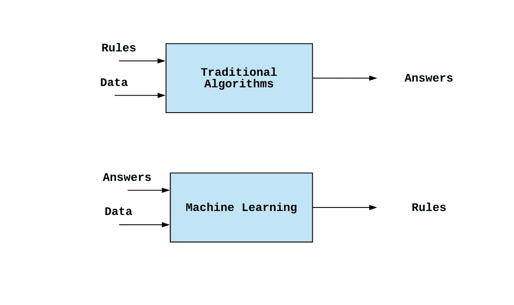
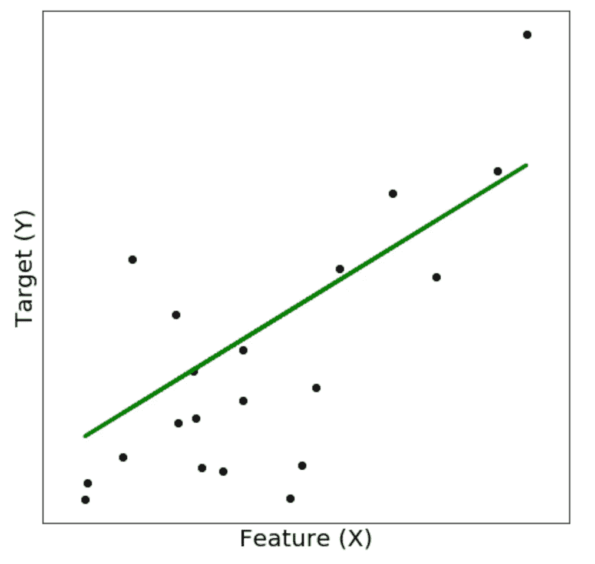
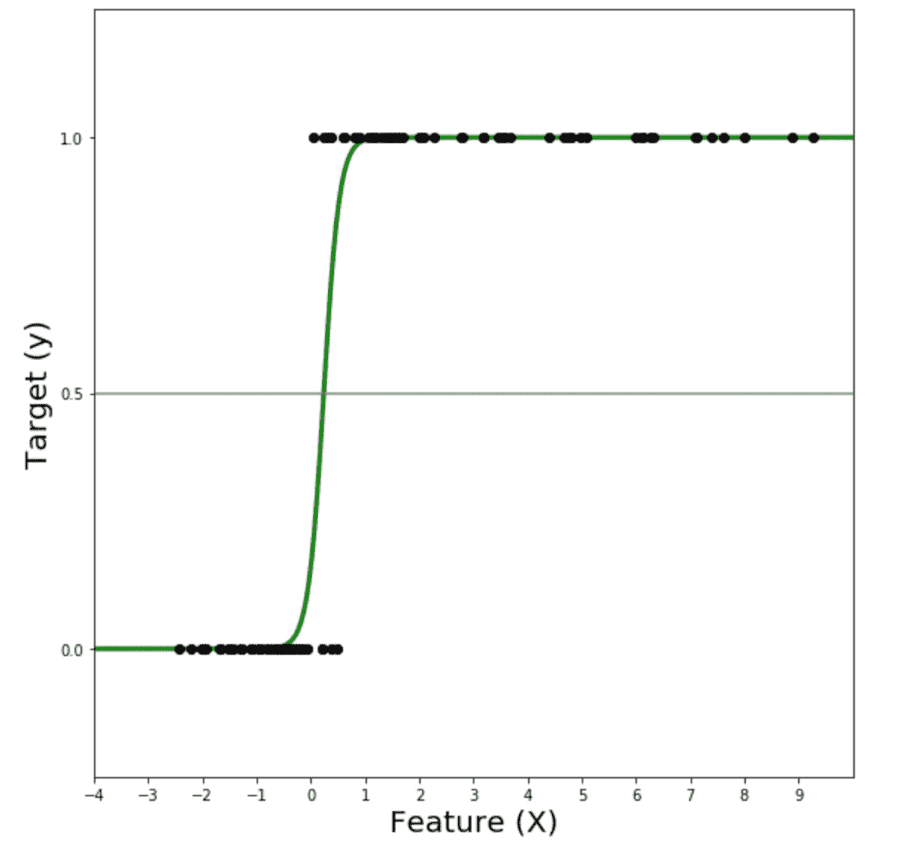

# 机器学习的基本概念

> 原文：<https://towardsdatascience.com/the-basic-underlying-concepts-of-machine-learning-28282c8421f4?source=collection_archive---------32----------------------->

## 深入探讨机器学习的基本概念

阿瑟尼·托古列夫在 [Unsplash](https://unsplash.com?utm_source=medium&utm_medium=referral) 上的照片

# 机器学习

机器学习是一个诱人的研究领域。机器学习是人工智能的一个子集，其算法围绕数学展开。机器学习已经改变了许多行业。利用机器学习的行业有医疗保健行业、金融、运输行业、制造行业、广告行业、汽车行业等。机器学习的影响如此之大，以至于许多行业都离不开机器学习。

“机器学习”这个术语是亚瑟·塞缪尔在 1952 年创造的。亚瑟·塞缪尔将机器学习描述为

> “在没有明确编程的情况下赋予计算机学习能力的研究领域”。

机器学习算法与传统编程算法有很大不同。传统的编程算法将规则和数据作为输入，并将答案作为输出，而机器学习将答案和数据作为输入，并将规则作为输出。

传统算法和机器学习算法的区别。PC:作者

你可能想知道产生规则作为输出有什么用。机器学习算法产生的规则被用来对新数据进行预测。

# 学习的类型

机器学习有不同类型的学习，适用于不同类型的现实世界的问题。可用的不同学习类型有:

*   监督学习
*   无监督学习
*   强化学习

## 监督学习

监督学习试图学习特征和标记的响应变量(或目标变量)之间的关系。将 X 视为特征，将 Y 视为响应变量，然后监督学习尝试学习数据中 X 到 Y 的映射。

监督学习进一步分为:

*   **回归**
*   **分类**

## 回归

回归是一种统计方法，用于找出特征和**连续目标变量**之间的关系，并预测未来样本。如果一个变量可以取区间内的任意值，则认为它是连续的。它可以取的值是无限的。

例如，0.1、2.2、3.1 是连续值。身高和体重被认为是连续值。

一些可用的回归算法是，

*   线性回归
*   多项式回归
*   决策树回归器
*   极端梯度推进回归器
*   自适应升压回归器
*   在神经网络的最后一层具有线性激活函数的人工神经网络。

关于人工神经网络的更多细节，请参考我的文章:[人工神经网络介绍](/an-introduction-to-artificial-neural-networks-5d2e108ff2c3)

线性回归。PC:作者

## 分类

分类任务尝试将实例分类到任何可用的类别中。如果响应变量(或目标)是**分类的**，则任务被认为是分类任务。如果我们能把一个变量归入一个确定的范畴，那么这个变量就被认为是范畴的。

例如，是或否，像红色、绿色等颜色..被认为是分类变量。

分类进一步分为:

*   二元分类
*   多类分类

## 二元分类

当目标变量是二元的(如是或否、真或假等)时，问题被称为二元分类问题。

**Logistic 回归**是一种广泛应用于二分类问题的算法。逻辑回归不同于线性回归。逻辑回归是一种分类算法，线性回归是一种回归算法。

逻辑回归。PC:作者

## 多类分类

当目标变量由多个类组成时，问题被称为多类分类问题。

可用于多类分类的一些算法是，

*   决策树分类器
*   支持向量机
*   梯度推进分类器
*   随机森林分类器
*   Ada Boost 分类器
*   在神经结构的最后一层具有 Softmax 激活函数的人工神经网络。

## 强化学习

强化学习试图在一个互动的环境中做出一系列的动作，以使回报最大化。每当期望的一组动作被执行时，提供奖励，并且类似地，每当不期望的动作被执行时，计算惩罚。

最常用的强化算法是 Q-learning 和 SARSA(状态-动作-奖励-状态-动作)。

# 用于处理机器学习问题的流水线

## 数据收集

在处理任何机器学习问题之前，数据收集是最重要的部分。收集高质量的数据是解决任何机器学习问题的第一步。收集相关数据有助于产生可靠的结果。然后，数据被分成训练集和测试集。该模型在训练集上被训练，并在测试集上被测试。

## 探索性数据分析

探索性数据分析(EDA)帮助您分析数据的质量和分布。数据可能包含影响数据统计测试的**异常值和偏斜度**。异常值是不符合其他数据一般行为的数据。偏斜是指数据的频率分布偏离了正态分布。许多统计测试都是在假设数据呈正态分布的情况下进行的，因此移除异常值并转换有偏差的数据非常重要。

## 数据预处理

数据预处理是机器学习中必不可少的步骤。如果在数据建模之前对数据进行预处理，可以获得非常有洞察力的结果。如果数据质量得到保证，我们就能获得可靠的结果。**不完整、嘈杂和不一致的数据**是真实世界数据集的固有特性。在将数据输入模型之前，必须对其进行预处理。

数据预处理中涉及的常见步骤有:

1.  **数据清理**
2.  **数据整合**
3.  **数据转换**
4.  **数据还原**

关于数据预处理的更多细节，请参考我的文章:[机器学习中的数据预处理管道](https://medium.com/swlh/data-preprocessing-and-data-modeling-for-kaggle-house-price-prediction-data-in-python-c04055ded258)

## 模特培训

模型训练是计算特征和目标之间的关系的学习过程。特征和目标之间的关系被表示为模型参数。然后，模型参数用于预测测试数据。每种算法的训练过程是不同的。

*   决策树算法和随机森林算法被称为非参数算法，这意味着它不利用参数(或系数)来预测新数据，而是构建一个树状结构来进行预测。

## 成本函数及其优化

成本函数用于衡量模型的性能。如果不优化成本函数，将模型部署到生产中是没有用的。成本函数告诉我们一个模型的表现有多好。成本函数将目标的实际值与目标的预测值进行比较。重要的是，我们要花时间选择一个适合数据的成本函数。成本函数的优化也可以被认为是模型训练。

关于成本函数及其优化的更多细节，请参考我的文章:[机器学习中回归的成本函数及其优化技术](/cost-functions-of-regression-and-its-optimization-techniques-in-machine-learning-2f5931cd33f1)

## 正规化

正则化是避免过度拟合的技术。过度拟合是指模型记住了特征和目标之间的关系，但未能归纳出新的、看不见的数据。过度拟合可能是由决策树模型等灵活模型引起的，也可能是由维数灾难引起的。像[特征选择](https://medium.com/analytics-vidhya/an-introduction-to-feature-selection-in-machine-learning-9d6f2d5e47)和特征提取这样的降维技术也可以防止过度拟合。过度拟合是指存在高方差和低偏差的情况。

正则化通常通过对成本函数应用惩罚来完成。最常用的正则化技术是，

*   套索回归
*   里脊回归
*   人工神经网络的辍学

## 超参数优化

超参数是对模型训练有影响的可调参数。超参数不同于模型参数，因为模型参数是训练阶段的结果，并且超参数由用户在训练阶段之前手动提供。

最常用的超参数优化技术是，

*   网格搜索
*   随机搜索
*   贝叶斯优化

## 模型解释

模型的保真度如何？我为什么要相信模型产生的结果？这些问题由模型解释技术来回答，这些技术试图解释为什么模型会得出这个结论。

*   SHAP(沙普利附加解释)
*   线性可解释的模型不可知解释

## 模型部署

经过训练的模型可以部署在生产环境中。生产环境是用户可以访问和利用所提供的服务的地方。数据工程师的角色是处理部署模型和从数据科学家和机器学习工程师那里抽象模型的复杂性。可以使用 Python web 框架(如 Flask、CherryPy、FastAPI)部署模型。

# 摘要

机器学习是一个迷人的研究领域，有可能彻底改变我们的未来。许多机器学习算法仍处于研发阶段。对机器学习工程师的需求与日俱增，在不久的将来需求将达到顶峰。机器学习总能让你兴奋不已！这是独一无二的！

**快乐的机器学习！**

## **谢谢你！**