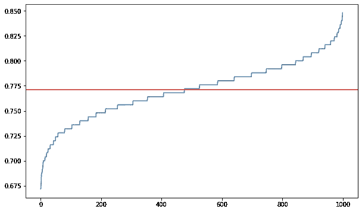
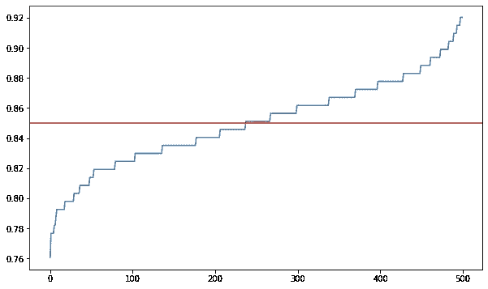
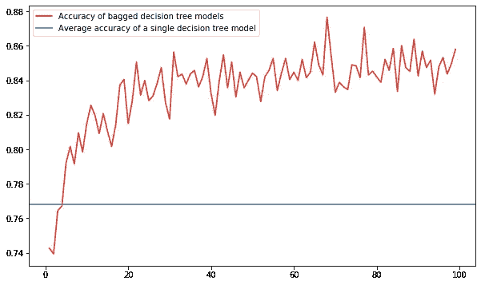
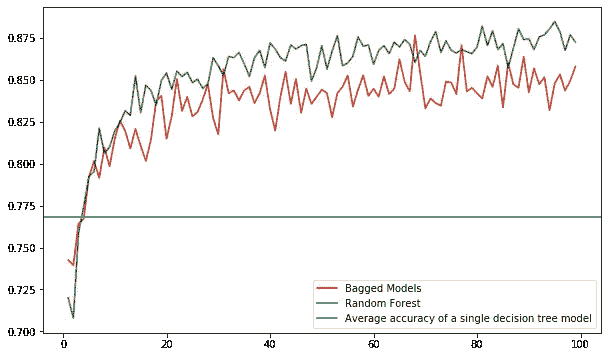
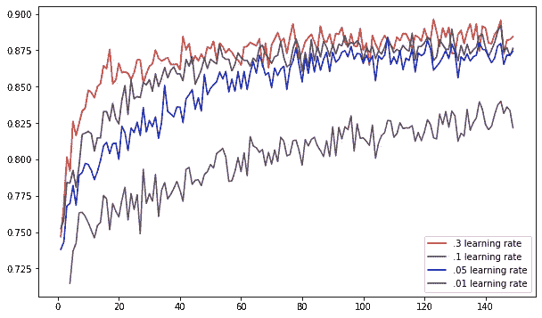
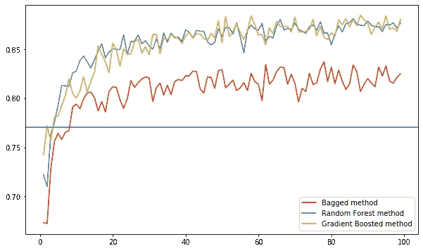
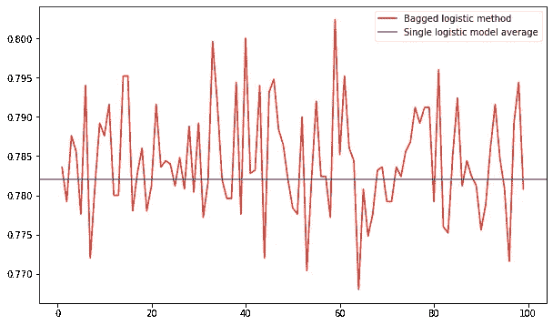

# 基础:集合方法

> 原文：<https://towardsdatascience.com/the-basics-ensemble-methods-13bd3f65f129?source=collection_archive---------37----------------------->

## 从头开始的数据科学

## 装袋，随机森林和提高性能的方法

集成方法是一句古老格言的数据科学版本:如果一个模型工作良好，多个模型协同工作甚至可以做得更好。当然，挑战之一是很难收集足够的数据来制作多个独立的模型。事实证明，只需一点点技巧，我们就可以从单个数据集构建不同的模型，并组合它们的输出以获得更好的结果。这些集成方法特别有助于扩展基于树的模型，包括分类器和回归器，并且通常优于树模型本身。

**自举模型**

决策树模型的一个挑战是它们的结构非常脆弱:正如我在我的[树模型简介](/the-basics-decision-tree-classifiers-b0d20394eaeb)中所讨论的，训练数据的微小变化会导致最终树的巨大变化。如果由于训练数据中的一些变化，树中的早期分裂之一在不同的地方或沿着不同的变量进行，则树的所有后续决策必然会不同。因此，建立在相似但不完全相同的数据上的决策树在结构和结果上可能彼此非常不同——或多或少准确，或多或少过度拟合，甚至以不同的方式过度拟合。

为了形象化这在实践中意味着什么，我生成了一个包含一千个点的示例数据集。然后，我随机抽取这些点的四分之三作为样本，在这个样本上拟合决策树模型，并测试其准确性。我这样做了 500 次，根据准确度对模型进行排序，并绘制出结果:

建立在重叠但不完全相同的数据上的 500 棵树模型的结果

平均而言，生成的模型大约 77%准确，但结果有很大的差异。一些模型的准确率不到 70%，而少数几个模型的准确率接近 85%。重要的是，尽管结果非常不同，但每个模型都是根据非常相似的数据训练的。事实上，每个模型都是在超过一半的总数据集上训练的，所以*一定有*在任何两个创建的模型的训练数据之间至少有一些重叠。

决策树是如此脆弱，以至于在大多数相同数据上训练的两棵树可以产生如此不同的结果，这一事实实际上允许我们从相同的数据集创建许多不同的和足够不同的模型。这一过程被称为“打包”，它缩短了两个步骤:引导和聚集。在第一步中， **bootstrapping** ，我们获取训练数据，并通过抽取随机样本来创建多个较小的数据集。这些较小的数据集中的每一个都用于训练单独的模型。然后，通过**聚合**结果，平均每个单独模型的输出，所有这些模型被用于生成预测(或者在分类问题中，你可以认为它是让模型对要预测的类进行“投票”)。

有点不可思议的是，这种聚合预测通常比单个模型的平均表现好得多。为了演示这一点，让我们重温一下我之前创建的训练数据。我又一次随机抽取了一些样本，创建了一些模型，并测量了它们的精确度，但这一次有了新的变化。我没有简单地对我的每个样本创建一个决策树模型，而是创建了 100 个不同的模型，并用这种 bagging 方法组合它们的预测。像我们之前做的那样排列结果精度，我们再次看到类似的形状，一些袋装模型比其他模型更精确，但我们的精度在整个曲线上都有所提高！

袋装树模型的准确性

以前，从数据集的子样本中导出的一个决策树的准确率约为 77%。然而，单个袋装模型的平均准确率为 85%。

你可能有一种感觉，这似乎不应该真的工作。当然，我们已经从一个模型发展到多个模型协同工作，但是我们的每一个新模型只在一部分可用数据上进行训练。以前我们只有一个模型，但是它利用了所有的数据。总的来说，我们没有获得更多的数据，甚至没有一次使用我们所有的数据，然而以某种方式将数据分成一堆小样本使我们能够从我们的模型中提取 8%以上的准确性。关键在于这样一个事实，即自举模型可能彼此非常不同。正如我们已经注意到的，两个建立在基本相同的数据上的决策树最终会有非常不同的结构。结合许多不同模型的结果，所有这些模型都建立在略有不同的数据上，这实际上给了我们许多不同的决策树结构。

可以想象，使用的自举模型的数量是一个关键因素。当您拥有众多不同的模型来响应不同的数据特征并产生不同的结果时，您就开始受益了。如果你只有两个或三个模型，你不可能胜过一个单独的决策树，因为即使你有一个以上的模型，你的模型也只是建立在较小的数据样本上。另一方面，一旦有了足够数量的模型，就已经从数据中提取了尽可能多的推理能力，添加更多的自举模型不会产生任何额外的好处(幸运的是，在一个袋装方法中有太多的模型通常不会产生过度拟合，尽管用这样的模型拟合和预测在计算上变得更加昂贵)。绘制自举模型的数量与聚合预测的准确性的关系图可以提供大量信息:

在某种程度上，袋装模型的准确性随着聚合模型的数量而增加

起初，袋装模型的表现不如平均单个决策树，但是在只有少数几个自举模型被添加到我们的集合(在这种情况下，四个或五个)之后，袋装模型开始明显优于平均单个模型的准确性。在 40 或 50 个自举模型之后，袋装模型的性能似乎趋于平稳，并且它不会从添加到整体的后续模型中获得太多额外的好处。

看到预测能力的巨大进步，你为什么还要使用一棵树呢？首先，正如你可能猜到的，训练和运行一棵树比训练和运行 100 棵树的计算量要少(即使每棵树稍微小一点)。另一方面，袋装模型失去了很多可解释性。以前，很容易将决策树的结构绘制成类似流程图的东西，并遵循它，查看哪些功能看起来很重要，关键值可能在哪里。现在，您已经有了一大堆要绘制的树，每一棵树都有不同的结构，不同的临界值集，每一个都给出了对模型“重要”的不同感觉。他们必然不会同意彼此，使它更难解释。

**下一步:随机森林**

正如我们所强调的，袋装模型有效的原因是因为被聚集的底层决策树彼此之间有足够的差异。你可以把每一棵底层树看作是以稍微不同的方式处理问题，做出不同的决策，并且可能从过程中收集到稍微不同的信息。一个自然的进展可能是使这些基础模型彼此更加不同，这是随机森林策略的核心。

随机森林模型的构建方式与袋装模型非常相似，其中有大量不同的决策树被训练，然后串联使用。关键区别在于，在随机森林中，除了在总体训练数据的略微不同的子样本上训练的树之外，它们每个都只使用随机选择的*特征变量*的样本。比方说，我使用的是通用的泰坦尼克号数据集，它有大约 8 个有意义的特征变量，包括乘客的性别、级别、票价和他们出发的地点。一个普通的袋装模型会聚集大量使用所有 8 个特征的决策树。随机森林模型将聚集决策树，每个决策树使用这些特征的不同子集。一棵树可能使用性别，阶级，年龄和小屋。另一个也可能碰巧使用性别和年龄，而不是班级或客舱，而是使用登机地点和兄弟姐妹的数量。

通过随机选择训练数据点的样本和正在使用的特征，随机森林在聚合决策树中创建了更多的多样性，因此可以从更多的角度处理预测问题。就像普通的袋装模型一样，随机森林的准确性随着集合中树木数量的增加而增加，在一定程度上。随着聚合树数量的增加，考虑我的示例数据集上的袋装模型和随机森林的性能:

随着聚集模型数量的增加，比较袋装和随机森林方法

像袋装模型一样，我们的随机森林开始时表现不如单棵树的平均水平。实际上，随机森林开始时的表现也不如袋装模型-请记住，随机森林中的每棵树不仅只使用了一小部分可用的训练数据，而且只使用了一小部分可用的功能，因此每棵树都不如使用所有功能的单棵树强大，并且您很可能会认为只有少量树木的随机森林的表现不如具有相同数量树木的袋装模型。一旦一些树被添加到森林中，性能会迅速提高。一旦森林有了十棵树，模型可能会从数据集中的每个要素和行中整合信息，并开始受益于我们在树中引入的多样性。在这种情况下，随机森林最终为我们的模型增加了大约 2.5%的准确性。

**略有不同的方法:助推**

最后要考虑的集合方法是 Boosting，它的工作方式与我们的 bagging 或随机森林方法不同。普通装袋和随机森林都并行生成多个模型并同时运行，以某种方式平均结果。Boosting 也创建多个树，但它是按顺序创建和运行它们的。创建第一决策树并使其适合数据。然后创建后续的树，但是该树不是直接适合数据的目标变量，而是适合第一树的*残差:也就是说，它适合第一树提供的预测是错误的量。对于回归树，这将是一些正数或负数，取决于模型超出或低于标记的程度。在分类问题中，这个误差项将简单地为 0(如果先前的树得到正确的预测)或+/-1。*

要做一个预测，你需要依次使用这两棵树。第一棵树进行预测，第二棵树基于它认为第一棵树的结果有多不正确来提供调整。当然，您不需要就此停止，您可以将第三棵树拟合到前两棵树一起使用的结果的残差中，以此类推，直到您拥有许多棵树。希望，随着每一棵后续的树，你可以进一步磨练预测，尽管与袋装模型不同，如果使用的树的数量变得过多，增强模型*容易过度拟合*。

实际上，为了让这一系列模型产生合理的结果，还有一个难题。如果你只是像我描述的那样连接多个模型，你的结果实际上可能一点也没有改善。一个模型会超调，然后下一个模型会矫枉过正，向另一个方向摆动得太远。为了确保模型实际上收敛于一个答案，后续模型的结果被称为“学习率”的收缩因子所贴现。降低学习率有助于避免过度拟合，但需要更多的模型才能达到好的效果。考虑一下，我们的数据集受到具有不同学习速率和树数量的增强树的攻击:

比较具有不同学习速率和顺序树数量的 boosted 方法

你会注意到，在这种情况下，增强的模型似乎都达到了大约相同的精度水平，尽管学习率较低的模型要花一点时间才能达到那个精度水平。

在我创建的示例数据集上，boosted 算法的工作效果与随机森林一样好，但不言而喻的是，根据您正在处理的数据类型，您的收益可能会有所不同:

集成方法的最终比较

在任何情况下，你都会注意到，所有这三种集成方法都比它们在概念上所依赖的单一决策树表现得更好。

**附录:使用其他类型模型的合奏怎么样？**

在这一点上，你可能会相信这些集成方法的力量，并开始想知道为什么我们把自己局限于决策树。我们可以使用 bootstrap 聚合来提高其他类型模型的性能吗？简单的回答是，像 bagging 这样的方法通常不适用于其他模型类型。例如，如果我们尝试用 bagging 逻辑模型代替决策树来解决分类问题，会怎么样？以下是我们汇总自举逻辑模型的结果:

尝试在许多逻辑模型上使用装袋方法

代表袋装逻辑模型的线不再显示明确的趋势，也不代表单一逻辑模型的任何显著改进。随着用于测试模型的样本的随机性，测量的准确性略有波动，但在任何聚合级别，打包的准确率都有可能低于单个逻辑模型的平均值。

这是为什么呢？因为我们在这里试图整合的逻辑模型太相似了。这种方法之所以有效，是因为决策树很脆弱，即使对训练数据进行很小的更改，也会创建结构非常不同的树。相比之下，使用稍微不同的数据集生成的两个逻辑模型可能彼此非常相似；它们将各自使用所有的特征，并且模型为每个特征找到的系数可能彼此接近。逻辑回归中的系数肯定会受到少数异常值的影响，但一旦样本达到数百个，单个新值就不太可能对最终系数值产生太大影响。

不幸的是，装袋并不是一个适合所有人的解决方案，但是对于基于树的方法来说，它是非常有效的。