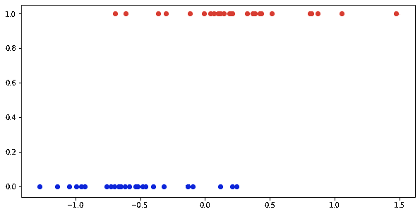
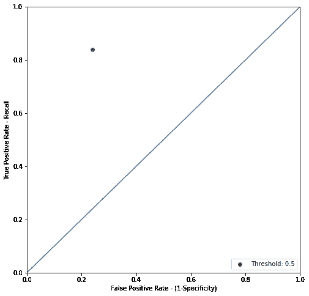
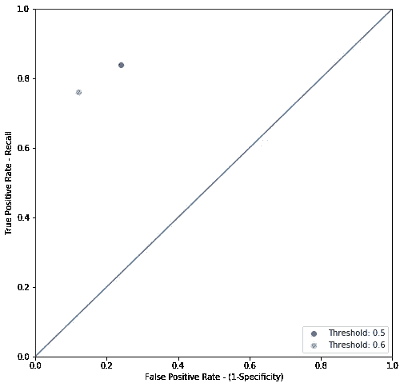

# 基础知识:评估分类器

> 原文：<https://towardsdatascience.com/the-basics-evaluating-classifiers-b0078a097732?source=collection_archive---------31----------------------->

## 从头开始的数据科学

## 准确度、精密度、召回率和 ROC 曲线解释

判断一个分类模型感觉应该比判断一个回归更容易。毕竟，你从分类模型得到的预测只能是对的或错的，而从回归模型得到的预测可能或多或少是错的，可能有任何程度的误差，或高或低。然而，判断一个分类并不像看起来那么简单。一个分类有不止一种正确或错误的方式，并且有多种方式将不同的正确和错误的方式组合成一个统一的度量。当然，所有这些不同的指标都有不同的、通常不直观的名称——精确度、召回率、F1、ROC 曲线——使得这个过程从外面看起来有点令人生畏。

尽管术语令人困惑，但每个分类标准背后都有很好的直觉。在他们的心里，有一个简单的问题:你的模型是用来做什么的。如果您心中有一个清晰的用例，那么应该很容易决定关注哪个指标。为了解释我的意思，让我们考虑一下在一个简单的例子中每个指标可能是什么样子。

**型号**

当我们讨论[逻辑回归](/the-basics-logistic-regression-and-regularization-828b0d2d206c)时，我们考虑了一个简单的问题，它被绘制成这样:

一个简单的分类问题

这里我们在 x 轴上有一些特征变量，在 y 轴上有一个分类变量，它只取值 0 或 1。如你所见，我还根据这些点所属的类别对它们进行了颜色编码。在这种情况下，随着 x 变量变得越来越大，点落入红色类的机会也就越来越大。对于一个真实世界的例子，也许 x 变量是汽车的英里数，红色类是是否有发动机故障。或者，x 变量是个人的血压，红色类别是他们是否患有心脏病。

我们为这些点拟合了一个逻辑模型，如下所示:

一个简单逻辑模型的分类问题

我们的回归曲线代表我们对一个点落入红色类别的概率的估计。随着你沿着曲线向右走，模型的估计概率也在上升。但是，要实际预测一个新点，您需要设置一些临界阈值，并将超过该阈值的任何值视为红色类的预测值。一个合理的阈值可能是 50% —如果模型认为一个点有超过 50%的机会属于目标类，那么您预测它确实属于该类。

在实践中，我们可以像这样可视化这个预测过程(请注意，我已经更改了点的颜色编码，以匹配模型预测它们属于哪个类，而不是它们实际属于哪个类):

使用 0.5 的阈值，我们的模型预测哪些点属于每个类别

现在我们可以很容易地看到，对于一个分类问题，有不止一种正确或错误的方式。在右上象限中，有被准确分类为红色的点，这些点是模型正确的第一种方式**真阳性*、*、**。在左下象限是同样被精确分类的蓝点，这些是**真阴性**。然而，在左上角的点应该被分类为红色，但是低于模型的阈值，被分类为蓝色。这些都是**假阴性**。在右下角，我们有相反的问题，点是正确的蓝色，但被归类为红色，**假阳性**。

请注意，我们可以在其他地方设置阈值，这将产生一组不同的预测。通过改变这个阈值，你可以改变有多少假阳性或假阴性。例如，在这种情况下，如果我们提高阈值，我们可以消除假阳性，但代价是增加假阴性:

我们的预测有一个 0.7 的新阈值

当要决定这个模型做得有多好时，你需要考虑这些不同方法之间的权衡。根据你关注的重点，你可以用不同的标准来衡量你的成功。

**准确性:我不关心假阳性/假阴性权衡，我正确的频率是多少？**

可能是最简单的度量准确性的指标——模型做出的正确预测数除以做出的预测总数。您可以将准确性正式描述为真阳性和真阴性以及假阳性和假阴性的函数，如下所示:

正确率是真阳性、真阴性、假阳性和假阴性数量的函数

尽管我认为这些度量标准的正式描述经常会模糊度量标准的内容。准确性评分虽然简单，但有很多优势。理解起来简单直观。它有明确的解释，通常不需要解释；准确度分数为 0.8 意味着 80%的预测是正确的。

仅考虑准确度分数有一些缺点。一方面，如果存在明显的阶级不平衡，它会变得混乱。例如，假设你正试图根据某人的血压来预测他是否会心脏病发作。但是在任何一年中，有多少人会有心脏病发作呢？答案是不到百分之一(美国 3 亿多人口中大约有 [80 万人](https://www.cdc.gov/heartdisease/facts.htm))。您的心脏病发作模型可以通过简单地猜测在任何给定的年份没有人会患心脏病而获得 99%的准确率！然而，很明显，这个模型实际上并没有用。

现在，在训练分类模型时，最好考虑您是否有很大的类不平衡，并通过对大多数类进行欠采样来进行校正，也就是说，如果一个类中有 100 个点，另一个类中有 1，000 个点，则从较大的类中随机抽取 200 个点，这样您的模型就可以训练更平衡的数据。希望思考心脏病发作的例子也说明了其他一些事情，那就是有时你可能想关注一个特定的结果，比如说某人是否会心脏病发作，即使模型的整体准确性下降。

**回忆:我正确地识别所有阳性类别很重要**

如果你的模型试图筛选心脏病发作的可能受害者，你最关心的可能是确保你能识别出每一个可能的病例。毕竟，不识别某人的缺点是他们会遭受意想不到的心脏病发作，而意外预测某人会患冠心病的缺点却没有那么严重。您可能希望降低阈值以捕捉更多的情况，即使这意味着看到整体准确性的下降。请记住，当您降低阈值时，您的假阴性会下降，但假阳性可能会上升:

我们预测的下限是 0.3

在这种情况下，您可能需要优先考虑不同的指标，回想一下。简而言之，回忆是你的模型正确识别的积极案例的一部分。你的模型捕捉到了多少会心脏病发作的人？同样，我们可以这样正式定义回忆:

召回率也称为真阳性率，您可能还会看到一个类似的指标，称为“特异性”，它相当于召回率，但用于真阴性率。

考虑回忆将你所有的注意力集中在识别积极类的实例上。注意，它实际上并没有考虑你对负类的预测是否正确。当然这是有风险的——如果你真的想，你可以通过简单地预测一切都属于积极的类别来最大化你的回忆价值。为了平衡这一点，您可以考虑另一个指标。

精度:我想确定如果我预测某个东西在正类中，它绝对是

精确度是你得到正确的积极预测的分数。从形式上讲，你可以这样定义它:

当正确识别每个实例并不重要时，您可能会强调某个实例的精确性，但是觉得错误地识别一个实例会有代价。例如，音乐流媒体服务可能会使用一种模型来预测听众是否会喜欢它可能推荐的一首新歌。他们没有识别听众可能喜欢的歌曲的成本，但如果他们错误地识别了一首歌曲，听众发现他们总是得到他们不喜欢的歌曲推荐给他们，他们可能会对服务不满意并离开它。

**F1:精确度和召回率似乎都很重要，我能两者兼顾吗？**

当然，理想情况下，你应该同时拥有高召回率和高精确度，正确地识别每一个肯定的类别，而不需要不准确地识别一堆否定的类别。为此，您可以使用 F1 分数，它是精确度和召回率的调和平均值:

像一个简单的准确性分数一样，F1 分数考虑了以某种形式正确地获得正面和负面类别。然而，与简单的准确性分数不同，F1 分数仍然会很好地工作，尽管存在等级不平衡。调和平均值比简单算术平均值更不利于极值(考虑一下，如果您的精度值是 1，但您的回忆值是 0，两者的简单平均值将是 0.5，但调和平均值将是 0)。

**考虑所有不同阈值的模型**

到目前为止，所考虑的每个指标都告诉您一些关于一组特定预测的信息——一个模型在一个阈值下的结果。如果您想要跨许多不同的阈值比较多个模型，该怎么办？为此，我们可以使用另一个工具，即受试者操作者特征，或 ROC 曲线。您可能已经注意到，通过考虑模型获得正面和负面类别正确的频率，我们的不同指标都接近一组预测的质量，不同类别的权重或多或少。在某种程度上，你可以将这一切归结为真阳性率和假阳性率——你有多长时间正确预测了一次，你有多长时间为了到达那里而不得不意外地错误分类了一个阴性点。ROC 曲线描绘了使用这两个比率的模型的性能。任何一组预测的性能都绘制在一个图表上，如下所示:

一个轴是真阳性率或回忆，另一个轴是假阳性率。可以想象的最好的预测集应该在左上方，在那里你的回忆是 1-你正确地识别了每个阳性类别-你的假阳性率是 0-你没有错误地分类任何阴性点。对角线代表这两个速率之间的等价交换；你可以把它想成一个随机模型的表现，就像抛硬币来决定类别，其中捕捉更多积极点的唯一方法是偶然捕捉一些消极点。

任何一组单独的预测都可以在此基础上绘制。在我们的第一个例子中，请记住我们将阈值设置为合理的 0.5:

计算真阳性率和假阳性率，我们可以这样绘制性能图:

如果我们将阈值提高一点，我们会捕捉到更多的负面信息，但会错过一些正面信息:

图表是这样的:

我们可以对任何级别的阈值这样做:

最后，我们可以将所有可能阈值的曲线连接起来，形成 ROC 曲线:

ROC 曲线使您可以看到在召回率和特异性之间的权衡，并比较不同模型在所有阈值上的性能。总的来说，你可能更喜欢向左上方延伸的模型，这样可以最大化它们和代表随机模型的对角线之间的面积。这种“曲线下面积”或 AUC 通常用于判断不同的模型。