# 基础:评估回归

> 原文：<https://towardsdatascience.com/the-basics-evaluating-regressions-91ffa7bde2b9?source=collection_archive---------25----------------------->

## 从头开始的数据科学

## 评估模型的误差和拟合优度

在所有的数据收集和数据清理之后，是时候拟合一个模型并进行一些预测了。实际上，为什么不尝试几种不同的模型呢——简单的线性回归或带有正则化方法的模型，如 Ridge 或 Lasso，也许是 KNN 或回归决策树。但是现在，你如何决定这些模型中哪一个实际上表现最好呢？有可能量化任何给定模型的效果吗？这实际上是一个棘手的问题，需要你平衡经常相互对立的多个目标。一方面，您希望最小化模型做出的任何给定预测的误差。另一方面，您希望您的模型能够一般化，能够很好地处理看不见的数据，这意味着避免过度拟合。有许多不同的度量标准可以用来沿着这些路线评估您的模型。有些人量化模型预测中存在的误差，有些人试图量化模型对基础数据中的方差的解释，有些人甚至进行调整，试图量化过度拟合。

**测量误差**

评估任何模型的第一步是考虑预测误差，即在所有可用的测试数据中，您的预测与给定点的真实值之间的差异。考虑一个简单的回归问题，有一个输入要素:

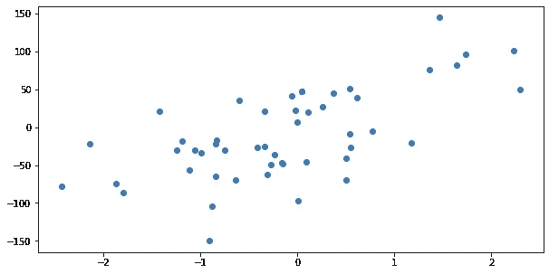

我们将尝试建模的点的集合

我们可以对这些点进行线性回归，并考虑误差，在这种情况下，误差简单地由这些点和我们拟合的直线之间的垂直距离表示:

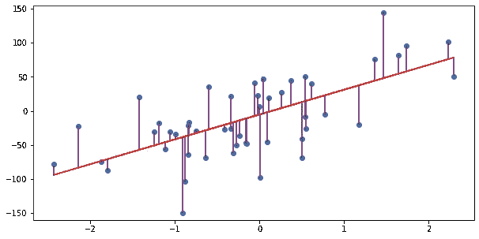

我们的点以及红色的线性回归线，模型的误差项用紫色线表示

当然，预测可以高于或低于真实值，因此通常误差项被平方或误差项的绝对值被考虑以避免负值抵消正值。考虑总误差的最简单方法是简单地将其相加，或者是绝对误差之和(SAE):

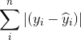

其中带帽子的 y 代表我们模型的预测

或误差平方和(SSE):

请注意，误差项也称为“残差”，因此您也可以将其视为残差平方和(SSR)。当然，目标是最小化这些总和。

为什么您会选择考虑平方误差项，而不是绝对误差？对误差项求平方会增加较大误差的影响。作为一个假设，考虑一个预测两点的简单情况。我们的第一个模型的第一个点的误差为 7，另一个点的误差为-3，因此绝对误差之和为 10。我们的第二个模型有-5 和 5 的误差，所以它的 SAE 也是 10。我们的最后一个模型对其中一个点没有误差，但对第二个点有 10 个误差；它的 SAE 也是 10。考虑到平方误差，我们可以对这些模型进行排序。误差为 7 和-3 的第一个模型的上证指数为 49 + 9 = 58。第二个错误为-5 和 5，其 SSE 为 25 + 25 = 50。最后一个模型的上证指数为 0 + 100 = 100。平方误差隐含地给予较大误差项更大的权重，即使总绝对误差是相同的。

当在相同的数据上对一个模型和另一个模型进行排序时，在某种程度上，这些总和就是你所需要的。然而，这些数字本身有点难以解释。一方面，随着样本量的增加，总和会增加；100 个点的总误差大于 10 个点的总误差并没有多大意义。因此，在描述模型的性能时，通常采用这些误差测量值的平均值，即平均绝对误差(MAE)和均方误差(MSE)。这些给你一个每次预测的误差量的度量。

平均绝对误差甚至有一个简单的解释——任何给定预测的平均误差——并且它有正确的单位。如果你的模型试图预测，比如说，某个美元值，那么任何一点的误差项也将是以美元为单位的数量，所以你的平均绝对误差实际上就是你的预测没有达到目标的平均美元数。均方差有点不同，它不再有和你预测的一样的单位。您的模型预测的是美元金额，但任何给定点的平方误差都是以美元平方表示的。出于这个原因，通常取均方误差的平方根，得到均方根误差(RMSE)。RMSE 与您预测的事物具有相同的单位，但它已偏向较大的误差项。它不像 MAE 那样容易直接解释，但它让您感觉到对异常值更敏感的误差，同时具有与目标变量大致相同的范围。

MAE、MSE 和 RMSE 是一个很好的起点，但有一个更常用但经常被误解的统计数据值得考虑:R 平方或决定系数。R 平方值试图量化数据中有多少总体方差是由您的模型解释的，并用于评估线性模型(有一些不同的“伪 R 平方”度量试图捕捉其他模型类型的类似情况)。有几种不同的方法可以计算 R 平方，但最简单的方法可能是用这个公式:

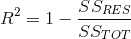

分数上面是残差平方和，你可能还记得，它和我们讨论过的误差平方和是一回事。底部是总平方和，这是一个类似的东西，但它通过对任何给定点到所有点的平均值的距离的平方求和来捕捉目标变量中的总体方差:

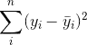

上面有横条的 y 表示 y 的平均值

R 平方值告诉我们，我们的模型解释了目标变量 y 的总方差的多少。0.6 的 R 平方告诉我们，我们的模型解释了目标变量方差的 60%，剩下的 40%是模型无法解释的。

【overfit 怎么办？

对误差求和时，误差越小越好似乎是理所当然的，当然，在某种程度上这是正确的，但误差本身的测量通常是不够的，因为只考虑求和误差往往会导致过度拟合。考虑以下模型符合我们在上面使用的虚拟数据。这是一个 K 设为 3 的 KNN 回归:

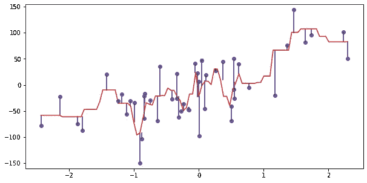

不可怕，但我们想尽量减少这些误差项。在我们的热情中，我们把 K 降低到 1:

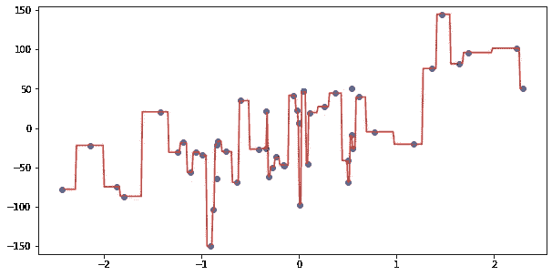

现在我们已经消除了所有不必要的错误！当然，代价是我们的模型不会泛化。它上下剧烈波动以捕捉我们数据中的每一点，它不太可能一般化。有没有我们可以用来避免这种情况的度量标准或方法？

第一个，也可能是最重要的答案是，好的数据和建模实践应该避免这种最坏的情况。特别是，必须将数据分为训练集和测试或验证集。当我们在一组点上进行训练，在另一组点上进行测试时，我们通常可以使用简单的误差度量来剔除过度拟合的模型。考虑我们的 KNN 明显过度拟合的情况，其中 K 设置为 1，但是这里我们将数据分为训练集和测试集，并且仅绘制测试集的误差项:

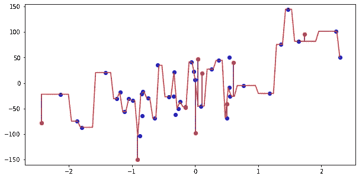

现在训练点是蓝色的，但是测试点是红色的。只有测试集的错误术语被图形化

我们经常遇到非常大的误差项。我们的上证指数是 2893。与之相比，K 设置为 3:

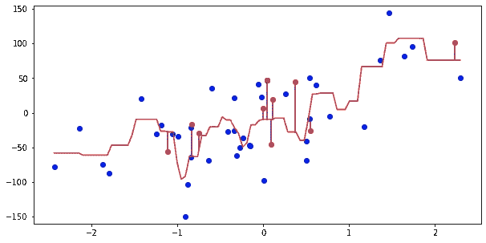

当然，模型中仍然存在误差，但是由于模型的预测不会如此剧烈地摇摆，我们避免了最大的误差。我们这里的上证只有 1163。

这种方法本身并不完全是防错的，特别是对于较小的数据集，因为您有点受到随机测试/训练分割的影响。如果我们对 K 设为 1 的 KNN 模型重复这个过程，我们可能会得到上面的图，误差特别大，或者我们可能会得到这个图，SSE 稍微合理一些，为 1，351:

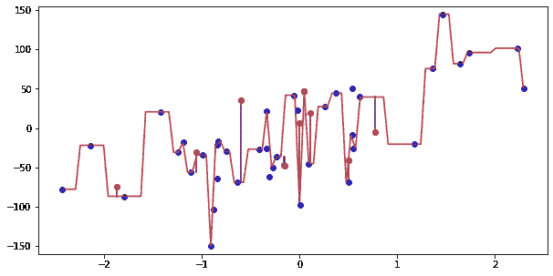

K 设置为 1 的另一个 KNN 模型，但是不同的(随机)测试/训练分割

或者，我们可能会得到这张带有明显误导性的上证指数 949 的图表:

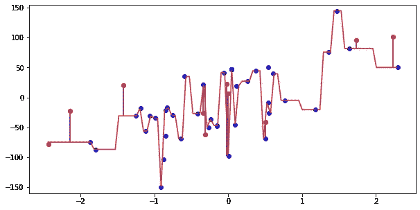

又是一天，又是一场考试/火车分裂

好运气(或者坏运气)得到一些测试点，这些测试点碰巧在一些训练点附近，这给了你一个不应该有的低误差度量。

将 K 的值降低到 1 的情况可能看起来有点做作，但是当您向多元回归中添加越来越多的解释变量时，类似的情况也会发生。随着您向模型中添加更多变量，您的误差测量值不可避免地下降，R 平方值不可避免地上升。添加一个几乎没有解释价值的变量可能不会使您的 R 平方值上升太多，但它永远不会使您的 R 平方下降，甚至添加一个无用的变量也会由于统计噪声而使您的 R 平方上升。

为了避免这种情况，我们可以转向这里讨论的最后一类度量标准，除了误差更小的模型之外，这些标准还支持更简单的模型。其中最简单的是调整后的 R 平方，它本质上就是你所知道和喜爱的 R 平方，但乘以一个随着变量数量增加而降低其值的项:

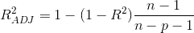

对 R 平方的校正，其中 n 表示样本中的点数，p 表示特征变量的数量

当您增加特征变量的数量时，调整后的 R 平方值会带来损失，因此您不能简单地在模型中加载无用的特征或交互项来人为提高 R 平方值。

另外两个概念相似的度量标准是阿凯克信息标准(AIC)和贝叶斯信息标准(BIC)。与调整后的 R-squared 一样，这两种度量都通过添加增加特征数量的惩罚来处理添加过多特征变量的可能性(BIC 中的这种惩罚实际上会随着我们样本中点数的增加而增加)，尽管与 R-squared 不同，它们使用一种称为似然函数的东西来测量模型的拟合度，这扩展了它们可以应用的模型数量。

我避免使用这两个指标的技术定义，因为它们可能看起来有点令人生畏，但我想强调的是，它们的操作方式与调整后的 R-squared 非常相似，测量拟合度，同时对模型复杂性施加惩罚。为了通过调整的 R 平方、AIC 或 BIC 度量来判断新变量的添加是有用的，对模型拟合的增加的益处需要大于对新变量的添加施加的惩罚。在所有条件相同的情况下，这些指标都倾向于更简单的模型，并要求模型复杂性的增加伴随着足够大的性能增加。