# 如何准备您的数据

> 原文：<https://towardsdatascience.com/the-basics-of-data-prep-7bb5f3af77ac?source=collection_archive---------13----------------------->

## 结构化、清理和丰富原始数据

[主播李](https://unsplash.com/@anchorlee?utm_source=medium&utm_medium=referral)在 [Unsplash](https://unsplash.com?utm_source=medium&utm_medium=referral) 上的照片

很少能以您需要的完全正确的形式获得数据。通常，您需要创建一些新变量，重命名现有变量，重新排列观察值，或者删除寄存器，以便使数据更容易处理。

这被称为**数据争论**(或准备)，是数据科学的关键部分。大多数情况下，您拥有的数据不能直接用于您的分析:它通常需要一些操作和调整，特别是如果您需要将其他来源的数据汇总到分析中。

本质上，原始数据是杂乱的(通常在开始时是不可用的)，你需要卷起袖子到达正确的地方。出于这个原因，你为使它足够“整洁”而采取的所有行动与你选择使用的算法一样重要。几乎在所有情况下，[数据争论是数学/建模](https://www.analyticsindiamag.com/industry-view-what-are-the-popular-tools-and-techniques-used-by-analytics-practitioners/)的先决条件，大部分时间都花在清理现实世界场景中的数据上。

> 让我们面对它:[数据不会准备好](https://thenextweb.com/podium/2019/06/19/data-science-automation-ai-custom-data-science/)或者不需要额外的努力就能被任何算法消耗掉。

因此，让我们讨论一些概念，帮助你面对这个有时看似艰巨的任务。实际上，数据集可以被认为是由变量(列)和观察值(行)组成的表格:

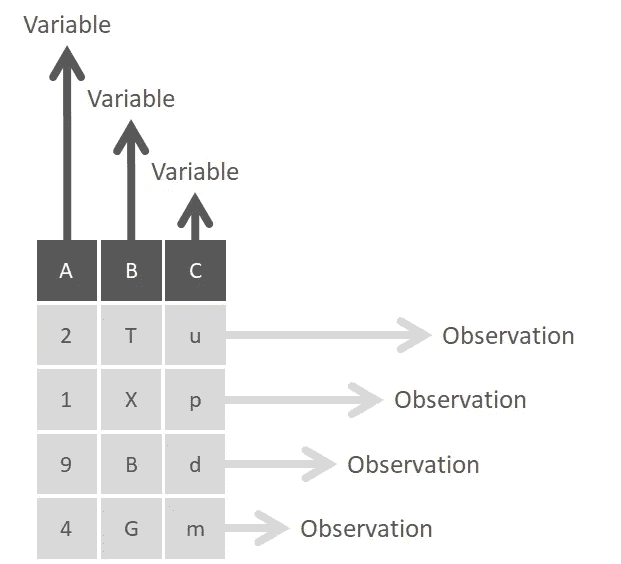

列是变量，行是观察值

列或变量应该都是相同的类型(例如，数字、日期、字符等)，而行或观察值(也称为“向量”)可以是所有类型数据的混合。

因此，要开始讨论数据准备，我们需要区分一个和多个数据集的数据争论。

# 单一数据集

处理单个数据集的主要任务是:

## 排序(排列)

数据争论的一个最基本的功能是根据变量的值或字符或者它们的选择对行进行排序。这可以按字母顺序，从最小到最大的数字，或其他。

在大多数情况下，您需要对一个单独的变量进行排序，但是通过定义一个主参数，然后定义后续的参数，可以对多个标准进行排序。

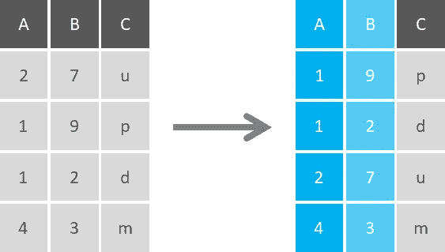

将变量 A 从最小到最大排序，然后将变量 B 从最大到最小排序

## 挑选

选择是根据定义的标准在数据集中选择列的活动。这可以简单到根据列的名称或位置选择列，或者在一系列列上使用不同的语句。可以通过在选择语句中使用“starts with”、“ends with”或“contains”等语句对列进行部分匹配，甚至可以从选择中排除特定的列(或一组列)。

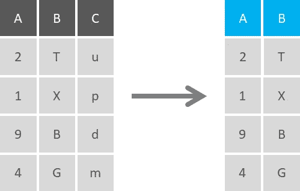

选择变量 A 和 B (C 被删除)

您可以使用条件选择来显示满足特定条件的列，例如，只显示包含数字数据或字符数据的列。反过来，您可以选择这些条件的否定，只选择不满足一个或多个条件的数据(例如，只显示没有日期格式的数据)。

此外，您可以对数值数据使用逻辑表达式，例如选择高于某个阈值的值或包含低于某个参数的平均值的值。

## 过滤器

当您不想在分析中包含数据集的所有行时，可以使用筛选函数返回符合一个或多个条件的行。这是一个子设置程序，允许您通过列、值的范围或甚至带有公差范围的近似值来选择特定值。使用字符，您可以根据完全或部分字符匹配进行过滤以包括或排除结果，还可以查找以特定术语开头、结尾或包含特定术语的寄存器。

按变量 A 中的奇数进行筛选

具有多个条件的过滤器可以与 AND、OR 和 NOT 条件结合使用，您甚至可以指定在两个条件中只有一个得到满足时返回值，而在两个条件都得到满足时不返回值。

与选择功能类似，过滤器可以无差别地应用于所有列，或者与条件一起使用，只返回符合条件的寄存器。筛选函数对于筛选出 NA 或缺失值行特别有用。您还可以过滤最高或最低值，只显示这些寄存器，而无需显示整个数据集行。

过滤是获得数据帧中的*唯一值*或*不同值*的正确方法，或者只是计算它们的数量。

## 总计

数据汇总是收集信息并以汇总形式表达信息的过程，目的是执行统计分析(汇总)或基于特定变量创建特定组(分组依据)。

*   **总结**

汇总运算使用单个数值来浓缩大量值，例如平均值或中值。汇总统计数据的其他示例包括总和、最小(最小值)、最大(最大值)和标准偏差:这些都是大量值的汇总。这样，单个数字就可以通过计算聚合来洞察潜在大型数据集的本质。

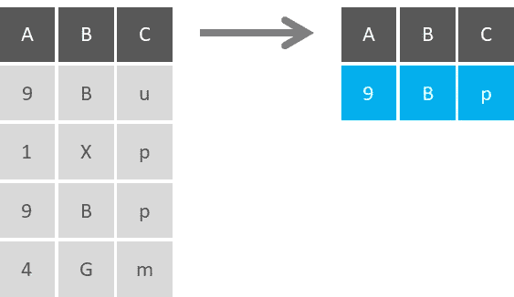

显示每个变量的**模式**(列中出现频率最高的值)

汇总可以是有条件的，即在执行操作之前陈述参数。例如，如果您考虑计算所有变量的平均值，您可以定义一个条件，只对数值变量这样做，因为分类变量会产生错误(它们没有平均值)。

*   **分组通过**

在大多数情况下，我们不仅仅希望汇总整个数据表，还希望按组获得汇总，这样可以更好地了解数据的分布情况。要做到这一点，您首先需要指定要用哪个(哪些)变量来划分数据，然后汇总这些类别。

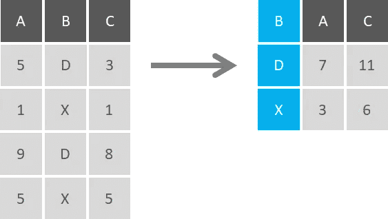

按变量 B 分组，并按平均值(变量 A)和总和(变量 C)汇总

Group by 是一个经典的聚合函数，当与 summarize 函数结合使用时，它变得非常强大。您可以按多个变量分组，然后同时汇总多个变量，这在您希望按类别细分变量时非常有用。这种方法也被称为**“拆分-应用-组合原则”**，在这种方法中，你将一个大问题分解成小的可管理的部分(拆分)，独立地操作每一部分(应用)，然后将所有部分重新组合在一起(组合)。

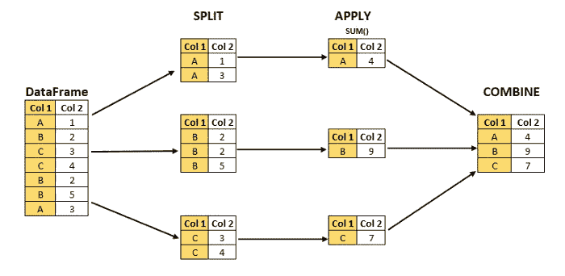

拆分-应用-组合原则。*来源:* [分析 Vidhya](https://medium.com/analytics-vidhya/split-apply-combine-strategy-for-data-mining-4fd6e2a0cc99)

## 改变

转换数据包括通过数据集中的现有值创建新的记录字段，这是数据准备的最重要的方面之一。确定何时(以及是否)需要数据转换并不容易，定义所需的转换类型就更复杂了。

但是你为什么要转换一个变量呢？[您可以将分类变量转换为更适合分类和回归模型的格式，或者使用对数转换将非线性模型转换为线性模型并处理倾斜数据。](https://www.kdnuggets.com/2019/06/7-steps-mastering-data-preparation-python.html)

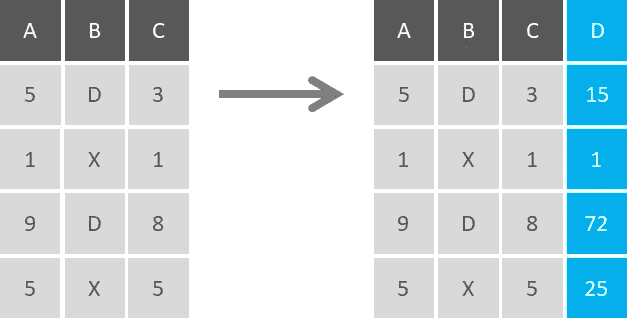

通过将变量 A 和 C 相乘构造的新生成的变量

您可以执行所有类型的转换(例如标准化、规范化或二进制化)，并将同一转换应用于多个变量。您可以连接变量来创建新的变量，或者执行基本的算术运算来创建它们。

## 替换

当你想把特定的字符转换成其他字符时，你可以使用这个。您可以将数字字符转换为数据和时间格式，或者重新编码变量以适应模型。这种技术通常用于替换丢失的值，尽管我们稍后将深入探讨这个问题。

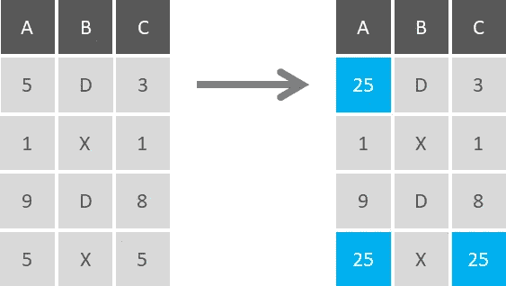

值为 5 的方形观测值

转换和替换之间的主要区别在于，您不需要创建额外的变量或寄存器(您需要修改现有的变量或寄存器)，并且您可以更改变量的性质(例如，将字符变量更改为数字代码)，而无需创建新的记录字段。您可以对所有变量执行替换，为它们设置条件，或者只对特定的寄存器执行替换。

# 组合数据集

数据科学的真正力量来自于数据量。实际上，数据托管在不同的服务器上，并存在于许多不同的文件中。当您需要的数据来自多个来源时，知道如何组合它们是非常重要的。让我们探讨一些通常用于利用这一问题的技术:

## 连锁的

通常，可以通过向数据集中添加更多行或更多列来添加信息。当数据集具有相同的一组列(变量)或相同的一组行(观察值)时，可以分别垂直或水平地连接或绑定它们。

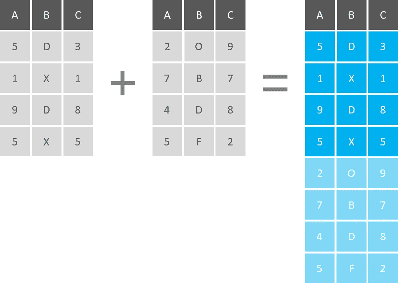

如果要添加更多的行，数据集必须具有相同的变量(列)集，但是观察值不必按照相同的顺序排列。

如果您要添加更多的列，您应该检查观察的**数量和顺序**是否相同。

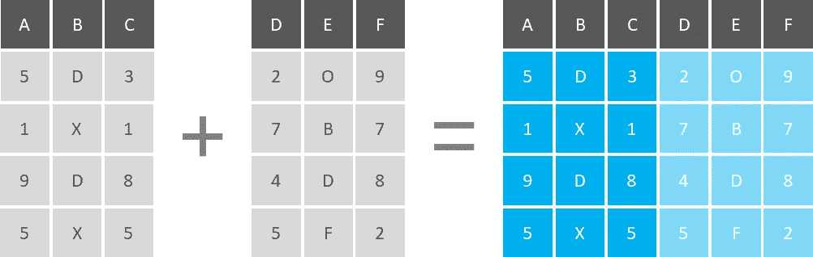

需要注意的是，如果您在多个数据集上有相同的观察值，并且您将它们垂直连接起来，那么您的表中就会出现重复的观察值。

## 合并

连接是将数据集合并到单个表中的标准方式。**连接用于根据两个或多个数据集中的相关列来组合它们。**连接有多种类型，主要有:

*   **内部连接:**只产生在两个数据集中匹配的记录集。在编程逻辑中，你可以用和来思考。
*   **完全外部连接:**产生两个数据集中的所有记录的集合，其中匹配的记录来自两边。如果不匹配，缺失的一方将包含空值。
*   **Left Join:** 从表 x 中产生一组完整的记录，与表 y 中的记录(如果有)匹配。如果没有匹配，右侧将包含空值。
*   **右连接:**返回表 y 中的所有记录以及满足表 x 中某个条件的记录。如果不匹配，输出或结果集将包含空值。

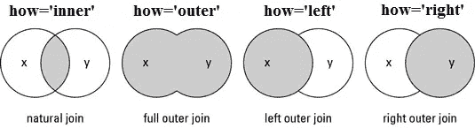

连接的主要类型。来源:[数据科学使之变得简单](http://www.datasciencemadesimple.com/join-merge-data-frames-pandas-python/)

你可以在这个[链接](/python-pandas-dataframe-join-merge-and-concatenate-84985c29ef78)中找到 Python 中的例子

# 缺少值

缺失数据(或**缺失值** s)通常被编码为 NaNs 或 blanks，被定义为没有为感兴趣的观测值中的变量存储的数据值。缺失数据的问题在几乎所有的研究中都相对普遍，并且会对从数据中得出的结论产生重大影响。缺失值可分为以下几类:

*   **完全随机缺失(MCAR):** 当数据缺失的概率与应该获得的特定值或观察到的响应集都不相关时。这是数据因设计而丢失的情况(例如，由于设备故障)。
*   **随机缺失(MAR):** 响应缺失的概率取决于观察到的响应集合，但与期望得到的具体缺失值无关。
*   **非随机缺失(MNAR):** 在这种情况下，获得参数无偏估计的唯一方法是对缺失数据进行建模(例如，高收入人群通常不会在调查中透露他们的收入)

处理缺失数据的策略有很多，但没有一个是普遍适用的。解决这个问题需要基于经验和领域，它从理解缺失值的本质开始。

处理这个问题的一些常用方法包括:

*   删除缺少值的实例
*   删除缺少值的属性
*   输入所有缺失值的属性(如平均值、中值或众数)
*   通过线性回归输入属性缺失值
*   上次观察结转

您也可以制定自己的策略，如删除任何有两个以上缺失值的实例，并使用平均属性值插补剩余值。或者更复杂的是，构建一个[决策树](/the-complete-guide-to-decision-trees-28a4e3c7be14)来填充那些缺失的值。

# 极端值

**异常值**是位于与其他值异常距离处的观察值，偏离了原本结构良好的数据。它们是不属于特定人群的数据点。

为了识别它们，有必要执行探索性数据分析(EDA ),检查数据以检测异常观察，因为它们会以激烈的方式影响我们的分析和统计建模的结果。请看下面的例子:

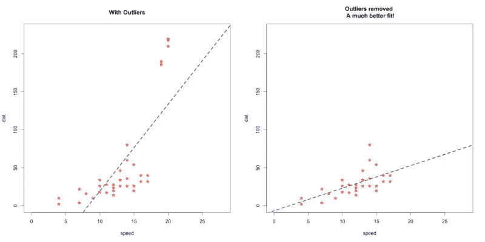

在左侧，一个线性回归建立在一个数据集上，该数据集顶部包含几个异常值。在右边，在移除那些异常值之后，在相同的数据集上建立的线性回归。来源:[分析 Vidhya](https://www.analyticsvidhya.com/blog/2019/02/outlier-detection-python-pyod/?utm_source=Twitter&utm_medium=social-media&utm_campaign=beginner-articles)

你看到这些异常值是如何改变左边回归的斜率的吗？两条回归线中哪一条更能代表数据集？

好了，你找到一个异常值，去掉它，继续你的分析。不要！**简单地从你的数据中删除离群值而不考虑它们会如何影响结果是一个灾难的处方**。

> 离群值不一定是坏事

这就是你的判断发挥作用的地方。异常值会极大地偏离/改变模型的拟合估计和预测，但需要小心处理。检测异常值是数据科学等学科的核心问题之一，您处理它们的方式将影响您的分析和模型性能。检测异常值的一些常用方法有:

*   **Z-Score:** 是一个指标，表示一个数据点距离样本均值有多少标准差，假设为高斯分布。Z-score 背后的直觉是通过找到它们与数据点组的标准差和均值的关系来描述任何数据点。通过这种方式，我们可以重新调整数据的比例并使其居中，同时寻找离零太远的数据点。这些离零太远的数据点将被视为异常值(在大多数情况下，使用阈值 3 或-3)。
*   **四分位数间距(IQR)得分:**是统计离差的[度量，等于第 75 个和第 25 个百分位数之间的差值，或上下四分位数之间的差值，IQR = Q3 Q1。它是离差的一种度量，类似于标准差或方差，但对异常值更稳健。](https://www.purplemath.com/modules/boxwhisk3.htm)
*   **DBSCAN 算法:**是一种基于密度的聚类。虽然本质上不是一种离群点检测方法，但它基于距离度量来增长聚类。DBSCAN 计算点之间的距离(欧几里德距离或一些其他距离)并寻找远离其他点的点:不属于任何聚类的点得到它们自己的类:-1。

异常值可以有两种类型:**单变量**和**多变量**。当我们查看单个变量的分布时，可以发现单变量异常值，而多变量异常值是 n 维空间中的异常值:为了找到它们，您必须查看多维的分布。

与缺失值类似，异常值可以被估算(例如，使用平均值/中值/众数)、封顶(替换某些限制之外的值)，或者由缺失值替换并预测。

# 特征缩放

数据集中变量的范围可能会有很大差异。一些特征可以用千克表示，而另一些用克表示，还有一些用升表示，等等。使用原来的尺度可能会对范围大的变量赋予更多的权重，这可能是一个问题。**特征缩放**是一种统一数据中自变量或特征范围的方法。

当特征的范围非常不同时，一些基于距离的算法，如 K-最近邻、支持向量机或神经网络会受到影响(具有大范围的特征在计算距离时具有高影响)。另一方面，如果算法不是基于距离的(例如朴素贝叶斯或决策树)，特征缩放就不会有影响。

> 那么，如何扩展呢？

*   **正常化:**是一种缩放技术，在这种技术中，值被移动和重新缩放，使得它们最终的范围在 0 和 1 之间。
*   **标准化:**重新调整特征值，使其分布平均值为 0，方差等于 1。

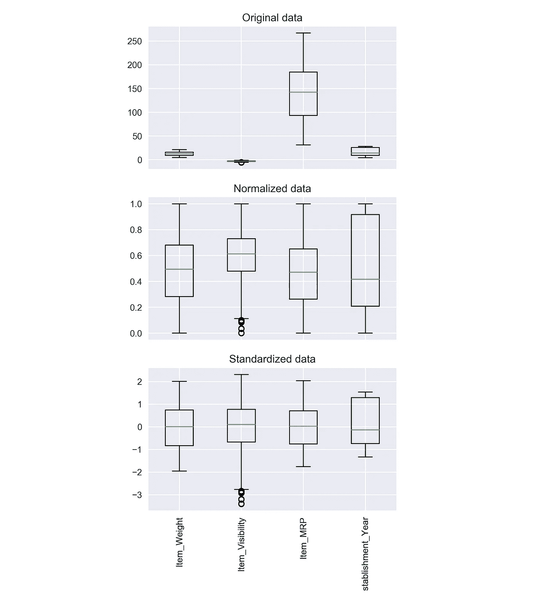

比较未缩放、规范化和标准化的数据。来源:[分析 Vidhya](https://www.analyticsvidhya.com/blog/2020/04/feature-scaling-machine-learning-normalization-standardization/)

使用规范化或标准化的选择将取决于问题和机器学习算法。没有使用其中一种的通用规则，因此您总是可以从将您的模型与原始的、规范化的和标准化的数据进行拟合开始，并比较性能以获得最佳结果。

特征缩放可以显著提高一些机器学习算法的性能，但对其他算法没有影响。

# *编码*

许多机器学习算法无需进一步操作即可支持分类值，但还有许多算法不支持。分类变量只能取有限的、通常是固定的可能值。一些例子包括颜色(“红”、“黄”、“蓝”)、尺寸(“小”、“中”、“大”)或地理名称(州或国家)。

同样，对于如何解决这个问题，没有单一的答案，但让我们介绍一些主要的策略:

*   **替换值:**包括用所需的数字替换类别。这是最简单的编码形式，其中每个值都被转换为整数，对于类别顺序很重要的顺序变量尤其有用。
*   **标签编码:**将非数字标签转换为数字标签。每个类别都被分配了一个唯一的标签，从 0 开始，一直到 n _ categories 每个要素 1。标签编码器适用于对标签的字母对齐或数值很重要的变量进行编码，但缺点是数值可能会被算法误解:编码为 5 的变量应该比编码为 1 的变量多 5 倍的权重吗？
*   **一键编码:**包括将每个类别值转换成一个新列，并为该列分配一个“1”或“0”(真/假)值。这样做的好处是不会对一个值进行不恰当的加权，但是当有许多类别时，这样做不是很有效，因为这会导致形成许多新列。
*   **二进制编码:**首先将类别编码为序数，然后将这些整数转换为二进制代码，二进制字符串中的数字被分割成单独的列。这对高基数数据来说很好，因为它只创建很少的新列:大多数相似的值在许多新列中相互重叠，允许许多机器学习算法学习值的相似性。

除了这些策略之外，还有多种编码变量的方法，因此了解各种选项以及如何在您自己的数据集上实现它们非常重要。

你可以在这里找到 Python [编码的完整教程。](https://www.datacamp.com/community/tutorials/categorical-data)

# 降维

随着数据量的增加，这可能会对某些算法的实现时间产生重大影响，使可视化变得极具挑战性，甚至使一些机器学习模型变得无用。从统计学上来说，我们拥有的变量越多，我们需要的样本数量就越多，这样我们的样本才能很好地代表特征值的所有组合。

**降维**是减少数据集中变量总数的过程，以避免这些陷阱。这背后的概念是，高维数据“表面上”由少量简单变量主导。这样，我们可以找到变量的子集来表示数据中相同级别的信息，或者将变量转换为一组新的变量，而不会丢失太多信息。

处理高维数据的两种常见方法可能是:

*   **主成分分析(PCA):** 可能是我们想到降维时最流行的技术。其思想是降低由大量相关变量组成的数据集的维度，同时尽可能多地保留数据中的差异。PCA 是一种**无监督**算法，它创建原始特征的线性组合。主成分是原始变量的线性组合，其工作方式如下:提取主成分的方式是第一个主成分解释数据集中的最大方差。第二个主成分试图解释数据集中的剩余方差，并且与第一个主成分不相关。第三个主成分试图解释前两个主成分没有解释的方差，以此类推。这样，您可以通过限制基于累积解释方差保留的主成分的数量来降低维度。例如，您可能决定只保留所需数量的主成分，以达到 90%的累计解释方差。

PCA 的 3D 示例。来源: [Setosa 视觉解说](https://setosa.io/ev/principal-component-analysis/)

*   **线性判别分析(LDA):** 与 PCA 不同，LDA 不会最大化解释方差:它最大化类别之间的可分性。它试图为因变量保留尽可能多的判别能力，同时将原始数据矩阵投影到一个低维空间:它以最大化类可分性的方式投影数据。LDA 是一种**监督**方法，只能用于标记数据。来自同一类的例子通过投影紧密地放在一起。来自不同类别的示例被投影放置得相距很远。值得注意的是，LDA 确实对我们的数据做了一些假设。特别是，它假设我们的类的数据是正态分布的(高斯分布)。

你可以在 Python [这里](https://www.kaggle.com/arthurtok/interactive-intro-to-dimensionality-reduction)找到这两种方法的完整实现。

# 结论

在现实世界中，数据分散在多个数据集和许多不同的格式中。不管你喜不喜欢，你都需要面对我们描述的一些问题，你准备得越好，你遭受的痛苦就越少。

重要的是要记住没有免费的午餐。要解决一个问题，你需要做出决定，而这个决定会带来后果。当您丢弃缺失值或移除带有百分点的异常值时，您正在更改数据集。即使您更改了最小的事情(这是您需要做的)，您也在更改您的原始数据。这很好，不需要担心，但是请记住，你的行为(或大或小)会带来后果。

> *对这些话题感兴趣？关注我* [*Linkedin*](https://www.linkedin.com/in/lopezyse/) *或* [*Twitter*](https://twitter.com/lopezyse)