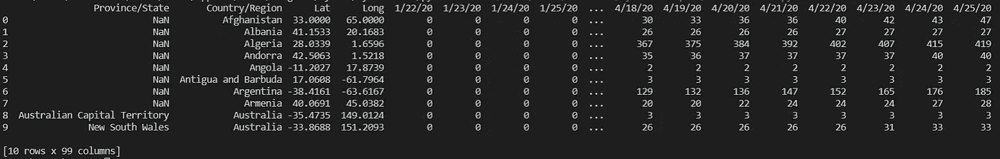
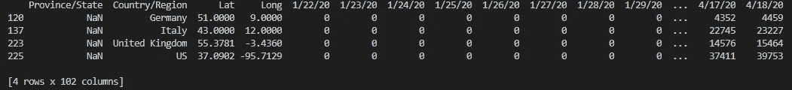
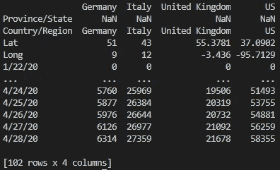
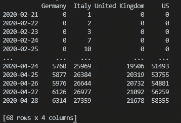
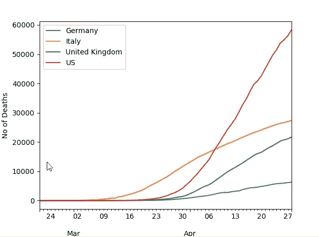
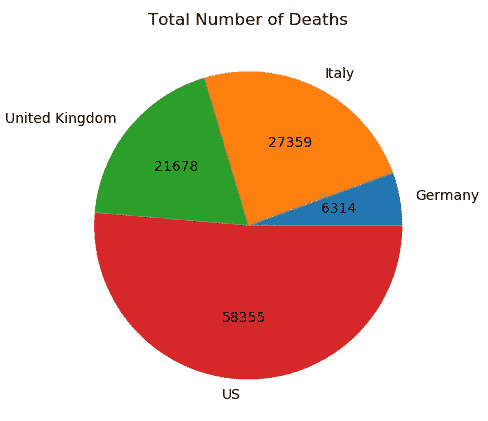
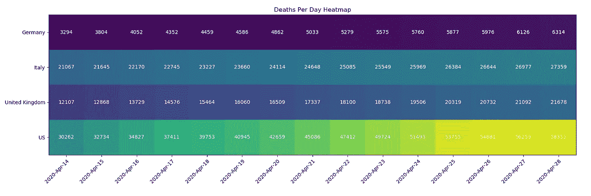

# Python 数据可视化基础

> 原文：<https://towardsdatascience.com/the-basics-of-data-visualisation-with-python-23188aa9fc1a?source=collection_archive---------26----------------------->

## 不到 5 分钟的逐步介绍


[KOBU 机构](https://unsplash.com/@kobuagency?utm_source=medium&utm_medium=referral)在 [Unsplash](https://unsplash.com?utm_source=medium&utm_medium=referral) 上拍摄的照片

在这篇博客中，我们将学习如何获取、转换并最终吸引人地呈现数据。我们将使用新冠肺炎数据集和 Python 来学习基础知识。

> 学习数据，你就可以讲述更多人甚至还不知道却渴望听到的故事。—内森·尤

总之，在不到 5 分钟的时间里，你将学会如何从熊猫的数据框架中获取数据，如何转换数据框架，并最终通过折线图、条形图、饼状图和热图将其可视化。

# 采购数据

任何项目的最大问题之一是找到正确的数据。正如[之前看到的](https://medium.com/financeexplained/learn-to-build-your-own-historical-stock-price-data-sets-2495f8a23d11)，人们可以尝试建立自己的数据集，但在这种情况下，我们没有必要这样做。


马库斯·温克勒在 [Unsplash](https://unsplash.com?utm_source=medium&utm_medium=referral) 上拍摄的照片

在本教程中，我们将使用来自约翰·霍普金系统科学与工程中心的数据。更具体地说，我们将使用[每日死亡人数](https://raw.githubusercontent.com/CSSEGISandData/COVID-19/master/csse_covid_19_data/csse_covid_19_time_series/time_series_covid19_deaths_global.csv)的时间序列数据。

我们可以做的第一件事是在浏览器上打开链接，检查数据以识别一些快速信息。我们可以看到数据是 CSV 格式的(带分隔符'，')。我们还可以看到，每一天都包含死亡总人数(不是每日死亡人数)。最后，我们可以看到国家/地区级别的数据。

事不宜迟，让我们来看看代码。为了方便起见，熊猫图书馆允许我们直接从网上获取数据。

```
import pandas as pdurl = 'https://raw.githubusercontent.com/CSSEGISandData/COVID-19/master/csse_covid_19_data/csse_covid_19_time_series/time_series_covid19_deaths_global.csv'df = pd.read_csv(url, delimiter=',',header = 'infer')
```



# 转换数据

既然我们已经获得了数据，我们需要为处理做好准备。我们需要的必要操作取决于我们试图实现的目标。

在这种情况下，我们应该做的第一件事是以两种方式过滤我们的数据:

1.  仅保留国家级数据(即删除任何定义了省/州的数据)
2.  只保留英国、美国、意大利和德国的国家级数据。

```
df_interest = df.loc[
                df['Country/Region'].isin(['United Kingdom','US', 'Italy', 'Germany'])
                & df['Province/State'].isna()]
```



接下来，我想转置数据，这样每一列是每个国家，每一行是每个日期。

```
df_interest.rename(index=lambda x: df_interest.at[x,'Country/Region'], inplace=True)df1 = df_interest.transpose()
```



最后，我们可以去掉我们不感兴趣的行:

*   省/州、国家/地区、经度和纬度
*   所有国家的死亡率为零的任何列

然后将我们的索引数据类型转换为 DateTime，这样它就可以很好地处理时序操作。

```
df1 = df1.drop(['Province/State','Country/Region', 'Lat','Long'])df1 = df1.loc[(df1 != 0).any(1)]df1.index = pd.to_datetime(df1.index)
```



这样，我们就可以开始可视化我们的数据了。

# 数据可视化

## 线形图

在直线上绘制数据可以显示数据如何随时间变化，并且可以比较不同的变量。一旦数据格式正确，用 Python 创建线图就非常简单了。



```
from matplotlib import pyplotdf1.plot()pyplot.xlabel('Dates')pyplot.ylabel('No of Deaths')pyplot.show()
```

## 条形图

我很确定我从来没有打开过没有条形图的 PowerPoint 演示文稿。在比较单个时间点的不同变量时，条形图非常有效。


```
import matplotlib.pyplot as plt; plt.rcdefaults()import numpy as npimport matplotlib.pyplot as pltobjects = df1.max().indexy_pos = np.arange(len(objects))performance = df1.tail(1).values.tolist()[0]plt.bar(y_pos, performance, align='center', alpha=0.5)plt.xticks(y_pos, objects)plt.ylabel('Deaths')plt.xlabel('Countries')plt.title('Deaths per Country')plt.show()
```

## 圆形分格统计图表

谁不喜欢馅饼…图表！饼状图是显示不同数据集之间相对大小的另一个好方法；很像条形图。



```
from matplotlib import pyplot
import numpy as np#Credit: [https://stackoverflow.com/questions/41088236/how-to-have-actual-values-in-matplotlib-pie-chart-displayed-python](https://stackoverflow.com/questions/41088236/how-to-have-actual-values-in-matplotlib-pie-chart-displayed-python)
def absolute_value(val):
    a  = np.round(val/100.*df1.max().sum(), 0)
    return int(a)plot = df1.max().plot.pie(y=df1.max().index, figsize=(5, 5),autopct=absolute_value, label='')
plot.set_title('Total Number of Deaths', fontsize=12)pyplot.show()
```

## 热图

热图是一种更先进的可视化技术，允许我们呈现不同变量的时间序列数据，并进一步通过颜色进行比较。



```
#Credit [https://matplotlib.org/3.1.1/gallery/images_contours_and_fields/image_annotated_heatmap.html](https://matplotlib.org/3.1.1/gallery/images_contours_and_fields/image_annotated_heatmap.html)import numpy as np
from matplotlib import pyplotdf1 = df1.tail(15)
dates = df1.index.strftime('%Y-%b-%d')
countries = df1.max().indexdf2 = pd.DataFrame(df1, columns=df1.columns).astype(int)matrix = np.array(df2).transpose()fig, ax = pyplot.subplots()
im = ax.imshow(matrix)# We want to show all ticks...
ax.set_xticks(np.arange(len(dates)))
ax.set_yticks(np.arange(len(countries)))
# ... and label them with the respective list entries
ax.set_xticklabels(dates)
ax.set_yticklabels(countries)# Rotate the tick labels and set their alignment.
pyplot.setp(ax.get_xticklabels(), rotation=45, ha="right",
         rotation_mode="anchor")# Loop over data dimensions and create text annotations.
for i in range(len(dates)):
    for j in range(len(countries)):
        text = ax.text(i, j, matrix[j, i],
                       ha="center", va="center", color="w", size = '10')ax.set_title("Deaths Per Day Heatmap")
fig.tight_layout()
pyplot.show()
```

# 结论

好了，伙计们。在不到五分钟的时间里，你已经学会了如何创建数据可视化的一些基础知识。创造这些观想可以成为一个非常强大的工具，帮助你讲述一个故事和理解一个信息。

祝大家学习愉快，平安无事！

在你离开之前，如果你喜欢这篇文章，你可能也会喜欢:

[](/how-to-extract-text-from-pdf-245482a96de7) [## 如何从 PDF 中提取文本

### 学习使用 Python 从 pdf 中提取文本

towardsdatascience.com](/how-to-extract-text-from-pdf-245482a96de7) [](https://medium.com/financeexplained/web-data-scraping-in-python-with-regex-and-beautifulsoup-e57f4a3392e3) [## 用 Python 中的 Regex 和 BeautifulSoup 实现 Web 数据抓取

### 了解如何快速从互联网上抓取数据

medium.com](https://medium.com/financeexplained/web-data-scraping-in-python-with-regex-and-beautifulsoup-e57f4a3392e3) [](/an-introduction-to-sql-4c9eb27995df) [## SQL 简介

### 通过示例学习 SQL 的基础知识

towardsdatascience.com](/an-introduction-to-sql-4c9eb27995df)