# 蒙特卡罗积分的基础

> 原文：<https://towardsdatascience.com/the-basics-of-monte-carlo-integration-5fe16b40482d?source=collection_archive---------6----------------------->

## 用 python 实现。

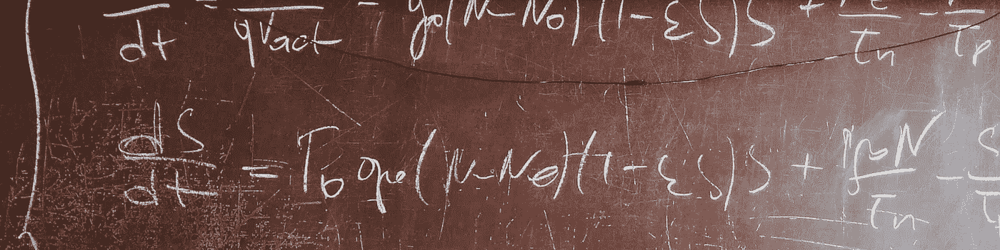

罗马法师在 [Unsplash](https://unsplash.com/s/photos/maths?utm_source=unsplash&utm_medium=referral&utm_content=creditCopyText) 上拍摄的照片

我们都记得高中时必须手动计算的积分。为了做到这一点，我们必须计算一系列或多或少的复杂运算，以找到反导数函数的表达式，然后在所需的区间内进行减法运算。然而，你可能还记得，积分一个函数在图形上相当于计算该函数曲线下的面积。数值积分的原理在于第二种说法。这个想法是在已知函数表达式的情况下，在一个定义的区间内估计函数的积分。对于这样一个目标，蒙特卡罗方法是一个很大的帮助。蒙特卡罗积分是一种使用随机数进行数值积分的技术。

# 蒙特卡罗估计量的基本概念

让我们试着积分一元函数 **f** 。我们将用 **F** 来表示积分的值。

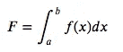

2D 积分

正如我们在引言中所说，这个积分可以解释为函数曲线下的面积。让我们以下面的函数为例:

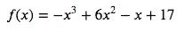

图 1 是 f 和我们想要计算的积分的图示。

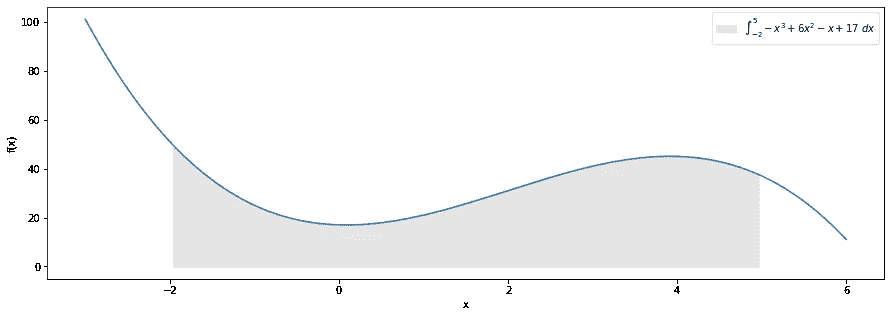

图 1

假设 a=-2，b=5。如果我们在 a 和 b 之间取一个随机点 x_i，我们可以用 f(x_i)乘以(b-a)得到一个宽(b-a)高 f(x_i)的矩形的面积。蒙特卡罗积分背后的思想是通过计算随机选取的 x_i 的矩形平均面积来近似积分值(图 1 上的灰色区域)。如下图 2 所示。

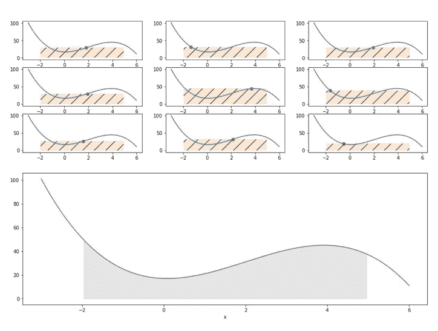

图 2

通过将矩形的面积相加并对总和求平均，得到的数字越来越接近积分的实际结果。事实上，太大的矩形补偿了太小的矩形。所以看起来 f(x)的经验均值是一个很好的积分估计量。这个想法用下面的公式形式化，就是**蒙特卡罗估计量** (N 是 X 的随机抽取次数):

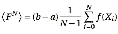

在这个公式中，X 是一个随机变量，FN 也是。大数定律告诉我们，当 N 接近无穷大时，蒙特卡罗估计量以概率收敛于 F，即积分的真值:

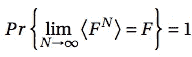

我们从蒙特卡罗估计量中得到的另一个重要结果是估计量的方差: **𝜎^2 / N** 其中𝜎 是函数值的标准差，n 是样本数 x_i，这意味着我们需要 4 倍多的样本才能将估计量的误差减少 2 倍。

在接下来的两个部分中，我们将首先给出用 python (2D 和 3D)实现集成的具体例子，然后我们将解释一种方差减少解决方案:重要性采样。

# 粗糙蒙特卡罗方法

原始蒙特卡罗方法是上述概念的最基本应用:

*   随机抽取 x_i 是按照统一的规律在 X 上进行的。
*   我们计算 f(x_i)的和，乘以(b-a)并除以样本数 n。

为了说明这个过程，我们来看一个具体的用例:我们要在区间**【0；0.55]** ，如下面图 3 中的*所示。如果 X 是遵循这个贝塔定律的随机变量，这个积分对应于 **P(X < = 0.55)** ，可以用贝塔(X，50，50)密度定律的累积密度函数(c.d.f .)精确计算:它给出 **0.8413** 。我们将尝试通过蒙特卡罗积分来接近这个数字。*

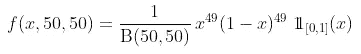

贝塔分布函数进行积分

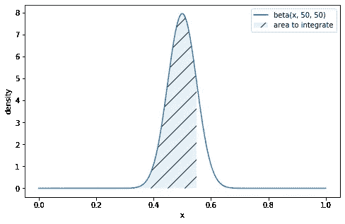

图 3

## 蒙特卡罗估计量

如前所述，我们将使用均匀分布对 x_i 进行 **N = 10 000** 次随机抽取。然后，我们使用以下公式计算积分估计和相关误差:

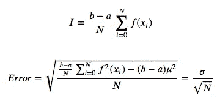

使用 python 的原始方法

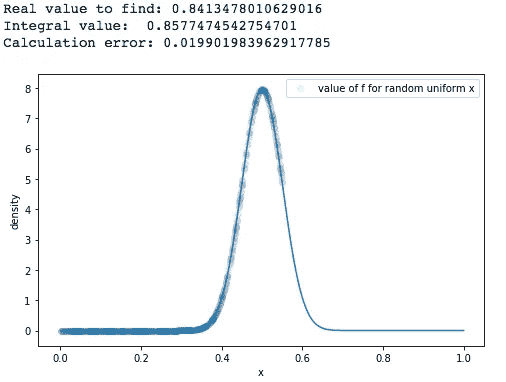

图 4

蓝点对应于 f(x_i)的 10 000 个值，这些值是根据我们在 x 上绘制的均匀图计算出来的。

> 我们已经注意到，因为绘制是在 X(即水平轴)上均匀进行的，所以当曲线的斜率增加时，我们在点之间有相当大的空间和较少的重叠。

## **曲线下面积的几何估计**

另一种计算积分的方法是对积分进行几何近似。实际上，通过在 x **和 y** 轴上使用统一的随机绘制，我们映射了对应于期望范围[x _ min；x_max]并计算曲线下的点与矩形中绘制的总点数之比。这个比率将收敛到曲线下的面积，N 是抽签的次数。这个想法如图 5 所示。

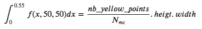

用 python 实现几何近似

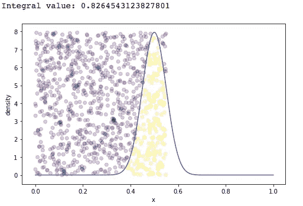

图 5

# **重要性抽样**

重要抽样背后的思想很简单:由于蒙特卡罗估计量的误差与 f(x)的标准偏差除以样本数的平方根成正比，我们应该找到一种比统一法则更聪明的方法来选择 x_i。重要性抽样实际上是画出 x_i 来减少 f(x)的方差的一种方法。事实上，对于函数 beta(x，50，50)我们注意到很多 x_i 超过[0；0.55]会给出一个 f(x) ~ 0，而只有 x 在 0.5 左右的几个值会给出 f(x) ~ 8。

> 重要性抽样的关键思想是，我们使用概率密度函数(p.d.f .)在 X 上抽取样本，这将为要计算的 f(x)的高值提供更多机会，然后我们通过 X 发生的机会(即 p.d.f .的值)对 f(x)的总和进行加权。

根据这个想法，我们试图逼近威尔的积分变成了:

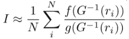

重要抽样下的整数值逼近

使用:

*   n:样本数量
*   f:积分函数
*   g: p.d.f .在 X 上随机抽取
*   g:g 的反函数

并且用于计算估计器误差的 f 的方差变成:

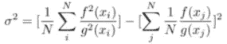

重要抽样下估计量的方差

回到 beta(x，50，50)分布函数的用例，似乎使用以 0.5 为中心的正态分布作为 g 函数可以帮助我们。f 和 g 之间的联系如下图 6 所示。

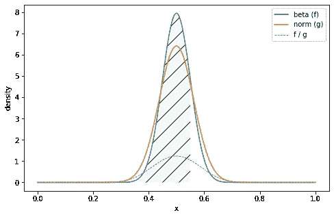

图 6

下面的图 7 显示了使用这种方法在[0；0.55].与选择 x_i 的统一定律相比，点的密度还显示了使用高斯概率分布函数的相关性:x_i 点集中在感兴趣的区域，其中 f(x_i)！= 0.

使用 python 进行重要性采样

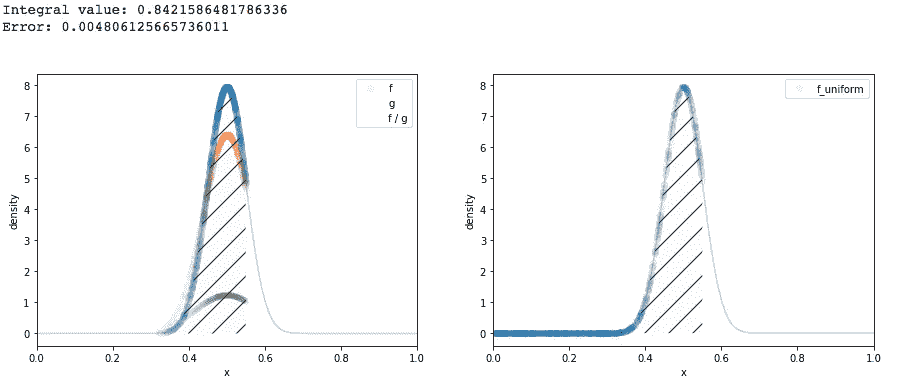

图 7:重要性采样(左)与原油综合(右)

## 方法比较

这里是积分值和相对误差的汇总。我们用重要抽样法减小了误差。

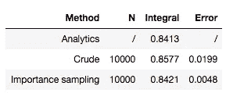

# 集成 3D 功能

图 8 给出了一个映射在 2D 空间(x_A，x_B)上的 3D jointplot 的例子。这个例子取自贝叶斯 A/B 测试的分析。蓝色等高线图对应于 2 个不同变量(A 和 B)的贝塔分布函数。其思想是通过计算联合后验 f 的积分来计算变异 B 优于变异 A 的概率，图中的蓝色等高线图表示 x_A 和 x_B 的值在橙线上(即 x _ B>= x _ A 的值)。

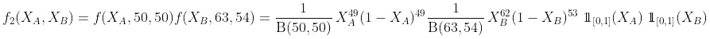

联合概率密度函数积分

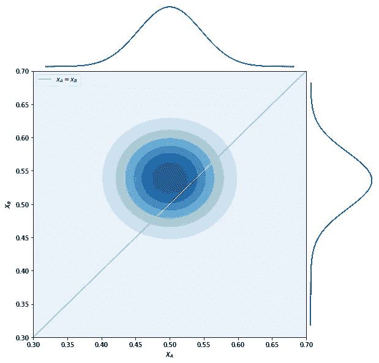

图 8

因此，让我们针对 x_A 和 x_B 的值计算对应于蓝色 3D 钟形下方区域的积分，x_B >= x_A(图中橙色线的上方)。这次我们将抽取 **N = 100 000** 个样本。

## **用粗的方法:**

```
Integral value:  0.7256321849276118
Calculation error: 0.01600479134298051
```

## 重要性抽样

```
Integral value:  0.7119836088517515
Calculation error: 0.0018557917512560286
```

重要性采样方法能够在相同数量的样本下获得几乎 10 倍的精确结果。

# 结论

粗略方法和重要抽样属于蒙特卡罗积分方法的一大类。在这里，您有了用 python 实现这两种技术的所有材料，只需要普通的库，如 numpy 和 scipy。请记住，蒙特卡罗积分对高维积分特别有用。在我们的例子中，3D 的精度提高了 10 倍，而 2D 的精度提高了 4 倍。

# 参考

*   [https://cs . Dartmouth . edu/~ wjarosz/publications/dissertation/appendix a . pdf](https://cs.dartmouth.edu/~wjarosz/publications/dissertation/appendixA.pdf)
*   [https://www . scratchpapixel . com/lessons/mathematics-physics-for-computer-graphics/Monte-Carlo-methods-in-practice/Monte-Carlo-integration](https://www.scratchapixel.com/lessons/mathematics-physics-for-computer- graphics/monte-carlo-methods-in-practice/monte-carlo-integration)