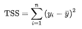
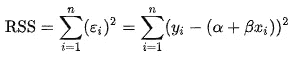
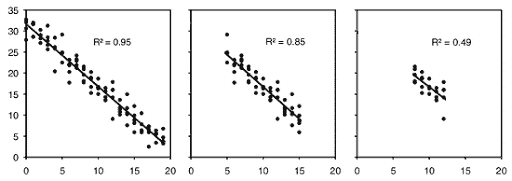
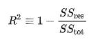

# 简单线性回归的基础(非技术性)

> 原文：<https://towardsdatascience.com/the-basics-of-simple-linear-regression-non-technical-4b559d55d611?source=collection_archive---------14----------------------->


彼得·德·格兰迪在 [Unsplash](https://unsplash.com?utm_source=medium&utm_medium=referral) 上拍摄的照片

自从开始我的数据科学之旅以来，我一直在研究线性回归模型。与财富 300 强公司的多个业务利益相关者一起工作过，我有幸理解了对数据科学家的期望。这是一个非技术性的博客，但它确实包含了一些对模型的数学理解。我鼓励一个非技术人员也参考一下，因为让你的手变脏并理解机器学习的细微差别是值得的。

> 永远不要低估基础知识，尤其是在数据科学领域。

回归是一种监督学习方法，在这种方法中，您使用历史*数字*数据，训练**模型**，然后使用它来获得尽可能多的点的最佳拟合线。在二维空间中，这叫做直线；在 n 维空间中，我们称之为*超平面*。回归是预测分析模型中最常用的方法。

[](/interpret-linear-regression-in-10-mins-non-technical-3f78f1f1dbd1) [## 在 10 分钟内解释线性回归(非技术性)

### 当有那么多伟大的文章和对最常见算法的解释时，为什么还要花力气…

towardsdatascience.com](/interpret-linear-regression-in-10-mins-non-technical-3f78f1f1dbd1) 

**CRISP-DM** 是一个开发模型时应该知道的花哨词。它简单地代表了工业标准流程，数据流程，T21 流程。这类似于软件开发中的 SDLC(软件开发生命周期)。跟着它！或者至少让你的利益相关者知道你会这么做。😛

# 简单线性回归:

这是回归的基础。您有一个**单个**特征，用于预测另一个变量。这个用于预测的单一特征被称为**预测器**或独立变量。您正在预测的值是*因变量*。

你知道直线的方程式是:

```
y = mx + c,Where,
y = Dependent Variable
m = Slope of the line (The angle of the line)
x = Independent Variable
c = Some constant
```

所以，我谷歌了一下*简单线性回归*，这是弹出的第一批图片之一。


来源:[学分](https://www.javatpoint.com/simple-linear-regression-in-machine-learning)

我们在这里理解什么？
X 轴:自变量—工作年限
Y 轴:因变量—工资

我们知道，工资多少取决于工作年限，可以用下面的等式表示:

```
Salary = (slope)*(Years of experience) + some constantEssentially,
Y = mx + cSo, a good way to understand the constant here would be that if your number if years of experience was zero, you would still get some salary.
```

## 最佳拟合线

理解最佳拟合线的最简单方法是画一条穿过这些点的直线，使它尽可能接近所有点。我们只是试图最小化回归线和点之间的距离。为了理解和量化这一点，我们寻求一些指标的帮助。

## RSS:

残差平方和。不要惊慌失措，你还处于初级阶段。

问:什么是剩余？
答:很简单。假设使用线性回归，你已经在呈现线性关系的点之间形成了一条线。

> *待预测的*点到*预测的*线的垂直距离称为残差。


来源:[这里！](/introduction-to-linear-regression-and-polynomial-regression-f8adc96f31cb)

通过最小化 RSS:残差平方和误差找到最佳拟合线。

好吧，现在这很尴尬，我必须承认如果你在这里[或在](https://medium.com/@anishmahapatra) [LinkedIn](https://www.linkedin.com/in/anishmahapatra/) 上关注我，你会意识到我是一名数据科学家，但不是数学的最大粉丝。**数学**，对我来说，是一种**必要的恶**。我建议你详细地研究一下数学，这在我的博客中是绝不会出现的。

> 为了数据科学的应用，我更喜欢优雅的逻辑过程和简单的代码。

如果你想知道术语之外的数学知识，谷歌一下。如果你想理解数学的直觉，请跟随我。


照片由[艾米丽·莫特](https://unsplash.com/@emilymorter?utm_source=medium&utm_medium=referral)在 [Unsplash](https://unsplash.com?utm_source=medium&utm_medium=referral) 上拍摄

# 线性回归的强度

你的模型有多好？因此，有人告诉我，我们可以借助以下指标来计算线性回归模型的强度:

1.  r 或决定系数
2.  剩余标准误差

## 1.r 或决定系数

因此，标题被突出显示，以便您记住 R 的同义词是决定系数。啊！为了给你解释 R，我需要告诉你什么是 TSS 或者总平方和。

现在，当我们想看看一个简单的线性模型做得好不好，我们需要有一个基线。最简单而有效的基线是模型的平均值。如果你不能打败一个模型的平均值，那么，你所拥有的就是坏的，非常坏的。我从维基百科页面[这里](https://en.wikipedia.org/wiki/Total_sum_of_squares)截取的片段很好地代表了这一点。



TSS:总平方和:我们应该预测的值——所有点的平均值([来源](https://en.wikipedia.org/wiki/Total_sum_of_squares))

所以，R 是一个度量(数字)，简单地说，它解释了给定数据的哪一部分。r 介于 0 和 1 之间。总体而言，R 平方值越高，模型就越符合您的数据。

奇怪的是，我不得不在这里再次解释 RSS 是什么意思。RSS 是点的实际值和点的预测值之差，它是由维基百科页面上的另一个片段精确定义的。



RSS:实际值—预测值([来源](https://en.wikipedia.org/wiki/Residual_sum_of_squares))

问:为什么选择 RSS/TSS？
A .很简单。你的模型至少要打败一个在点的中间画直线的家伙。如果值为 0，说明比那个差。R 的值越接近，模型越好。



R 的物理意义([来源](http://www.biostathandbook.com/linearregression.html))

相同的代码库可以在这里找到:

[](https://github.com/anishmahapatra01/MasterDataScience/tree/master/Course02-machineLearning-I/01LinearRegression) [## anishmahapatra 01/masterdata science

### 在 GitHub 上创建一个帐户，为 anishmahapatra 01/masterdata science 开发做出贡献。

github.com](https://github.com/anishmahapatra01/MasterDataScience/tree/master/Course02-machineLearning-I/01LinearRegression) 

[千斤顶 B](https://unsplash.com/@nervum?utm_source=medium&utm_medium=referral) 在 [Unsplash](https://unsplash.com?utm_source=medium&utm_medium=referral) 上拍照

## 高潮:

**R = 1 — (RSS/TSS)** ~决定系数



[维基来源](https://en.wikipedia.org/wiki/Coefficient_of_determination)

# RSE:剩余标准误差


[来源](https://stats.stackexchange.com/questions/204238/why-divide-rss-by-n-2-to-get-rse)

原因是试图获得回归中潜在误差方差的无偏估计量。什么是[它](https://stats.stackexchange.com/questions/57746/what-is-residual-standard-error)？

这并不像上面展示的 R 那样被广泛使用。

[](/running-jupyter-notebook-on-the-cloud-in-15-mins-azure-79b7797e4ef6) [## 在 15 分钟内在云上运行 Jupyter 笔记本电脑#Azure

### 文章做到了标题所说的。在 Azure 笔记本电脑(免费或付费)上运行 Jupyter Notebook，其成本仅为……

towardsdatascience.com](/running-jupyter-notebook-on-the-cloud-in-15-mins-azure-79b7797e4ef6) 

# 结论:

很好地达到了这里，特别是如果你是一个非技术人员。像我们其他人一样成为一名数据科学家的秘诀就是有勇气去谷歌搜索你的想法。正如我所承诺的，我希望你已经成功地理解了简单线性回归。我花了很多时间研究，并且非常喜欢写这篇文章。如果这对你有帮助，给我点爱！😄我也写关于[千禧一代的生活方式](https://medium.com/@anishmahapatra/the-millennial-burn-out-is-real-a0acebff25ae)、[咨询](https://medium.com/@anishmahapatra/my-top-5-learnings-as-a-consultant-accc5989ec34)、[聊天机器人](https://chatbotslife.com/how-you-can-build-your-first-chatbot-using-rasa-in-under-15-minutes-ce557ea52f2f)和[财经](https://medium.com/@anishmahapatra/the-investment-guide-for-smart-noobs-9d0e2ca09457)！如果您对此有任何问题或建议，请随时通过 [LinkedIn](https://www.linkedin.com/in/anishmahapatra/) 联系我或关注我[这里](https://medium.com/@anishmahapatra)，我很乐意听取您的想法！

[](https://www.linkedin.com/in/anishmahapatra/) [## Anish Mahapatra -数据科学家-穆适马公司| LinkedIn

### 我正在努力理解数学、商业和技术如何帮助我们在未来做出更好的决策…

www.linkedin.com](https://www.linkedin.com/in/anishmahapatra/)