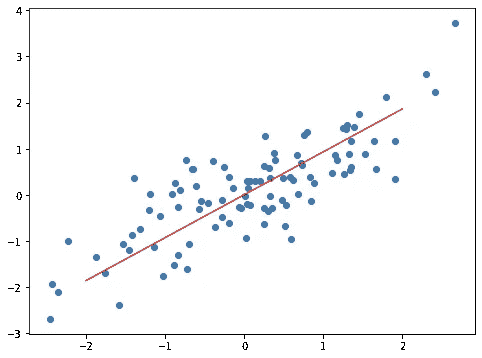

# 基础知识:主成分分析

> 原文：<https://towardsdatascience.com/the-basics-principal-component-analysis-83c270f1a73c?source=collection_archive---------10----------------------->

## 从头开始的数据科学

## 一种无监督的变量分组和降维方法

主成分分析介于无监督学习和数据处理之间。一方面，这是一种无监督的方法，但它将特征组合在一起，而不是像聚类算法那样将点组合在一起。但是，主成分分析最终可能是最有用的，当它与监督模型结合使用时，可以用于降维——减少特征变量的数量。PCA 在一些其他情况下也是有用的，例如从数据中过滤随机噪声的方法，但是我们在这里考虑它是为了降维。

**维度过多时该怎么办**

想象一下，你正在进行某种社会科学研究，包括调查人们并记录他们的各种事情。你可能希望数据集中有各种各样的东西来帮助你的研究。你肯定想要人口统计信息，例如:年龄、性别、他们住在哪里或者他们来自哪里。社会经济信息通常也很有帮助。也许你正在研究某种公共健康问题，也想了解一些医学信息，比如身高、体重和血压。你可能收集信息的变量的数量几乎是无穷无尽的，所以当你这么做的时候，为什么不收集你能想到的所有信息呢？在你兴奋之前，考虑一下有可能有太多的特征变量。

这怎么可能，有太多的功能？数据越多不是越好吗？事实证明，拥有许多不同的特性会带来一系列的挑战。具有许多特征变量的数据集往往会更稀疏，也就是说，其中的点平均来说彼此之间会更远。让我们考虑一个简单的例子来感受一下为什么会这样。

假设你正在做研究，你只有一个独立的特征变量，为了简单起见，它是一个只有两个选项的分类变量，比如受试者是男性还是女性。到目前为止，回答者只能分为两类。如果再加一个类别会怎么样？同样为了简单起见，假设您在只有两个选项的第二个功能后提问，回答者是否有大学学位。现在，类别的数量已经增长到四个:受过大学教育的男性，受过大学教育的女性，以及没有大学学历的男性和女性。如果您添加另一个具有两个可能值的变量，组合的数量将增加到 8。当您以这种方式添加变量时，可能的组合数量以及不同类别的数量会呈指数增长。当然，如果你添加一个有两个以上可能值的变量，比如说被调查者居住在哪个州，组合的数量会增长得更快。

组合的指数增长带来了许多挑战。首先，你需要的回答者的数量基本上也是呈指数增长的。当你只有一个变量时，你可以从每个只有两个回答者的可能类别中得到至少一个例子。当您将变量的数量增加到 3 时，突然您需要至少 8 名受访者来涵盖每个可能的组合(更不用说在您可以确定您从每个组合中随机收集了一名受访者之前，您需要对多少名受访者进行采样)。一个有 100 个这样的变量的数据集，即使每个变量只有两个可能的选项，也会有大量的可能组合，甚至一个相当大的数据集也可能没有每个组合的例子。

另一方面，回想一下像[支持向量机](/the-basics-support-vector-machines-219585f1a107)这样的模型是通过尝试用超平面划分数据点来工作的，超平面将不同类别的点整齐地分开。添加要素时，点与点之间的距离会随着空间变得越来越稀疏而增加，并且更容易拟合分隔点的超平面。即使你添加的变量没有真正的因果或解释价值，你也可能会遇到这个问题，除非你相应地增加样本的大小，这时你可能会开始遇到计算能力的限制。

**用 PCA 削价**

因此，我们需要限制我们的模型使用的变量的数量，但是我们不一定想要简单地删除特性，或者甚至提前知道我们应该删除哪些特性。PCA 允许我们减少模型使用的变量数量，同时尽可能多地考虑所有特征的差异。其中的见解是，特别是当你有许多变量要处理时，不可避免地，它们中的一些会相互关联，允许你同时考虑多个特性。考虑以下两个相关变量:

两个相关变量

这两个变量是相关的，这意味着它们不是完全独立的。如果你知道其中一个的价值，你就可以对另一个的价值做出合理的猜测。也许这些变量是针对身高和体重的。你知道有些人比其他人更苗条，但是一般来说高个子会比矮个子更重。考虑到这一点，让我们在这里重新定义这个问题。让我们从描绘两个变量之间关系的一条线开始:

我们的变量和一条符合它们之间关系的线

这里的见解是，我们可以用沿着这条线的距离作为它自己的变量。不是说一个点有一个高的 x 值和一个高的 y 值，我们可以把一个点描述为沿着线向右远处，隐含地给你关于 x 和 y 坐标的信息。事实上，让我们使用这条线作为绘制点的新轴来重新绘制我们的点:

我们传统的 x 和 y 坐标已经被沿线的距离和线上下的距离所取代

你可能想知道我们在这一切中取得了什么成就。我们以前有两个维度，x 和 y，现在仍然有两个维度，沿线的距离和线上/线下的距离。关键是，现在我们的大部分方差只落在一个维度上。之前，我们的 x 和 y 值的范围是从-2 或-3 到 2 或 3。现在，“沿线距离”变量的范围从-4 到 4，但“线上或线下距离”的范围只有-1 到 1 左右。“上/下距离”变量中的信息较少，因此当我们实际拟合模型时，我们可能会选择单独使用“沿线距离”变量，而完全忽略“上/下距离”变量。

主成分分析概括了这一过程，并允许您对具有许多不同维度的数据集进行分析。它实际上创建了一组新的轴，旋转后第一个轴沿着数据中方差最大的线，第二个轴沿着方差第二大的线，依此类推。就像笛卡尔平面的普通 x 轴和 y 轴一样，新的轴将相互成直角，但它们将相对于您开始时的任何坐标旋转。这些新轴被称为数据集的“主成分”。只有两个变量，很容易想象这是什么样子:

我们的原始数据集和主要成分。每个分量的线的长度代表沿着该分量的变化量

但是对于任何数量的初始维度，原理都是一样的。通过只使用最初具有许多不同维度的数据集中的前几个主成分，即使模型一次只考虑很少的维度，也可以捕获原始数据集中的大部分差异。PCA 如何准确地找到这些适当旋转的新轴需要一些线性代数，这对这个场地来说有点技术性，但你仍然可以在没有复杂数学的情况下对引擎盖下发生的事情建立直觉。

请记住，当你遗漏了一个排名较低的主成分时，你仍然在丢失信息。在我们的例子中，并不是每个点都正好落在我们找到的线上，所以如果我们忽略线以上/线以下的变量，我们绝对会失去精度。但是因为主成分分析已经将数据中尽可能多的方差分组到一个维度中，所以与丢弃原始变量之一相比，丢弃第二个主成分会丢失更少的信息。

**PCA 有多强大**

为了让大家感受一下 PCA 有多有用，让我们来考虑一个最著名的机器学习训练数据集， [MNIST 手写数字](https://en.wikipedia.org/wiki/MNIST_database)。如果您以前从未遇到过，这是一个巨大的手写数字示例集(训练集中有 60，000 行):

MNIST 集合中手写数字的例子

手写数字被数字化，并且数据被表示为 28×28 框中每个像素的一系列灰度值。所以这个数据集总共有 784 个维度！有这么多的维度，完全可视化数据集是不可能的。就此而言，在它上面使用某些模型类型是不可能的(或者至少是不切实际的)。支持向量机可能有效，但将 SVM 拟合到如此大规模、如此多维度的数据集需要花费大量时间。实际上，当您拥有如此大的多维数据集时，一些简单的模型也会变得很麻烦。KNN 模型根本不需要实时拟合(“模型”本质上只是训练数据集)，但 KNN 模型可能需要很长时间来预测，因为当你向它提供新的数据点来考虑时，模型需要遍历所有训练点，以找到最接近新点的数据点。

有了 PCA，我们就不需要一次性考虑那么多维度了！事实证明，数据集中的大部分方差都在前几个主成分中进行了描述。想想看，你能从 MNIST 数据的前两个主要成分中看到多少:

来自 MNIST 数据集中的点，但沿着前两个主成分表示，并根据点所代表的数字进行颜色编码

当然，这个图有点乱，但是你已经可以开始在视觉上区分不同的数字:0 在右边，而 1 在左边。事实证明，只需少数几个主成分，您就可以获得相当高的准确率，即使是像 KNN 这样简单的模型也是如此:

如果你包括前 20 个主成分，一个简单的 KNN 模型(K 设置为 5)的准确率约为 97%，对于一个由 4 行代码解决的复杂机器视觉问题来说，这已经不错了！该模型的预测速度仍然比在完整原始数据集上训练的类似 KNN 模型快 100 倍左右。PCA 使我们能够将模型需要处理的维数从 784 个减少到 20 个，在精度方面牺牲很少，但在性能方面获得了巨大的提高。