# 基础知识:时间序列和季节分解

> 原文：<https://towardsdatascience.com/the-basics-time-series-and-seasonal-decomposition-b39fef4aa976?source=collection_archive---------16----------------------->

## 从头开始的数据科学

## 什么时候时间序列技术是合适的，你如何执行分解？

处理带时间戳的数据是数据科学最直观明显的用例之一。毕竟，我们可以收集的任何数据都必须从过去收集或代表过去，我们经常希望对未来遇到的未知情况做出预测，所以我们的模型可能以某种形式包含重要的时间成分是有道理的。时间序列模型不同于其他类型的预测模型，因为目标变量既是预测的对象(对于未来值)又是模型的输入特征(对于历史值)。

处理时间序列项目的第一步通常是可视化，然后将数据分解为趋势和周期成分。从那里，您可以开始处理更复杂的预测模型，尽管简单地分解序列本身就可以产生一些有价值的见解。本文将关注最简单的分解技术，经典的季节分解，但是即使这样也是非常有用的。

**时间序列技术什么时候合适？**

如今，大多数数据，尤其是程序生成的数据，都带有时间戳。每当填写并提交数字表单时，或者每当在线购物时，通常会记录并存储准确的时间。因此，许多数据集带有某种性质的时间元素，但这并不意味着这里讨论的时间序列技术一定是合适的。这些技术只有在目标变量中存在某种程度的自相关时才有意义，也就是说，当目标变量与早期的自身相关时。如果昨天、上个月或去年的值可以帮助您预测今天的值，那么这些时间序列技术是合适的。如果不是这样，他们就不会帮忙。

例如，考虑股票价格的日常变动，这是[著名的随机](https://en.wikipedia.org/wiki/A_Random_Walk_Down_Wall_Street)。知道一只股票昨天上涨并不能真正告诉你这只股票今天是否可能上涨。例如，这里有一个日常股票价格变动的真实例子:

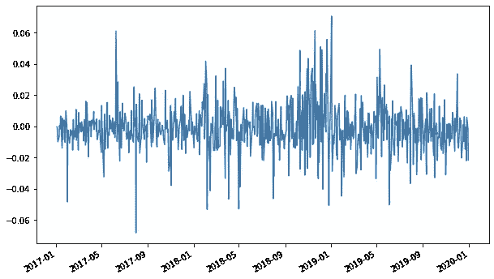

某一股票价格的每日变化。不太适合时间序列分析

问题中的公司实际上是苹果公司，但是你不能仅仅通过每天的运动来判断——像所有的股票一样，苹果公司每天都在以一种挑战预测的方式反弹。时间序列分析不会有帮助。

现在，让我们来考虑一下股票价格本身，而不是看每天的价格变动。与每天的变化不同，价格*确实表现出自相关性。昨天的股价给了我一个很好的指示，告诉我今天的股价会是多少，因为在任何一天，股价的变化通常不会超过百分之一或百分之二。如果昨天的价格是 200 美元，我可以很肯定今天它会收在 190 美元到 210 美元之间，除非发生特殊事件。除了日复一日运动的表面噪音，价格本身呈现出一种趋势，表明时间序列分析可能是有用的:*

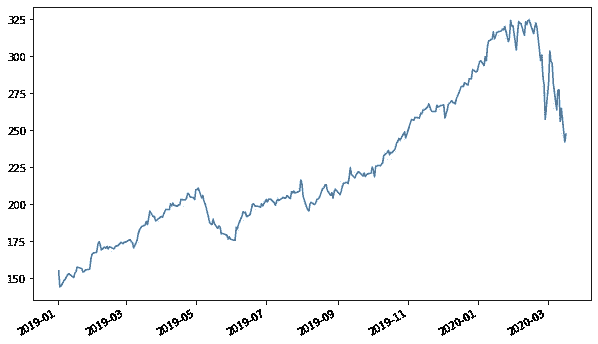

苹果股票的实际价格。也许适合时间序列分析？

但是，股票价格本质上仍然是随机的，虽然根据你所做的分析，平滑这样的图表可能会有一些好处，但你将很难预测未来的价值。所以，让我们考虑最后一个与苹果相关的系列，每个季度全球售出的 iPhones 数量:

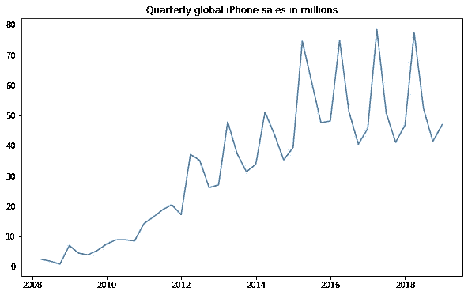

每个季度售出的 iPhones 数量。绝对适合时间序列分析

现在，这是一个我们可以利用的时间序列！请注意，它不仅展示了一个总体趋势，而且在趋势中还有可预测的周期——你会看到每年与苹果第一季度相对应的销售高峰(他们的会计年度从 10 月开始，所以他们的第一季度正在增加假期销售)。我们的时间序列技术的目标通常是找到并利用像这样的可预测模式，即使这些模式比 iPhone 销售的季节性模式更微妙、更难发现。

**时间序列中的滚动平均值和趋势**

在着手一个新的时间序列项目时，常见的第一步是用滚动平均之类的东西来平滑数据。这有两个主要好处。一个是真实世界的数据往往会有一点跳跃，即使有一个明确的潜在趋势，查看滚动平均线可以更容易地看出趋势是如何在噪声下移动的。第二，以这种或类似的方式寻找趋势是创建季节分解的第一步。让我们看一个真实的例子。这是一个常见的起始时间序列数据集，它显示了 50 年代美国每月的航空乘客人数:

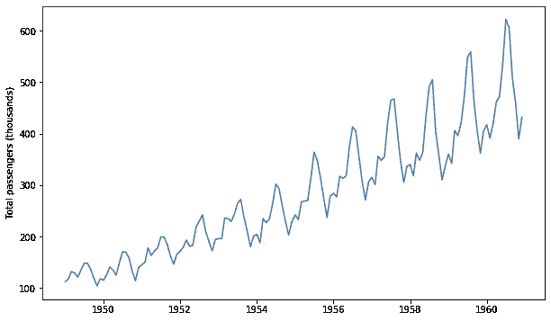

航空旅行在 20 世纪 50 年代蓬勃发展

随着航空旅行从 40 年代后期相对罕见的奢侈品变成 60 年代更加普遍的体验，显然有一个向上的斜坡，但也明显有一个季节性模式，旅行在某些月份持续高于其他月份。月与月之间的差异让人很难看出这种增长到底有多快。我们可以通过考虑连续几个月一起考虑的滚动平均值来平滑每月的波动。因此，一个月中特别高或特别低的值将被滚动窗口中其他月份中不太极端的值所调和。考虑原始数据和六个月的滚动平均值:

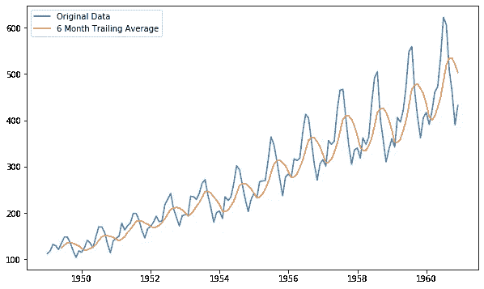

我们的数据具有 6 个月的滚动平均值

滚动平均值在峰值时没有原始数据高，在低谷时也没有原始数据低。关于这个特殊的例子，你可能会注意到的一件事是，它似乎也没有和原始数据在完全相同的时间达到峰值和谷值。更确切地说，这个滚动平均值是一个*跟踪平均值*:构成某个月平均值的六个月是该月的时点和之前的五个月。或者，你可以考虑把你的窗口放在月份的中心。例如，您可以将月份本身、前两个月和后两个月视为一个 5 个月的窗口(这对于奇数个月来说效果更好)，但要与数据的波峰和波谷重合，而不是滞后一个月左右:

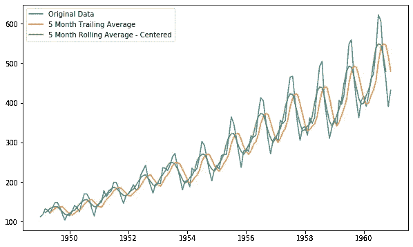

比较等长但不同中心的滚动窗口

您可能已经看到，当您接近数据集的末尾时，这种策略有一个问题——您不能考虑还没有数据的未来一个月的平均值！在上面的例子中，居中的滚动平均在数据集结束前两个月停止，而跟踪平均一直到边缘。有一些方法可以解决这个问题——也许当你接近尾声，开始用完未来的几个月时，你开始考虑用更少的几个月来缩小差距——但这些方法可能并不令人满意。(当然，移动平均也有类似的问题，但是在系列的开始，如果你只是在数据集的第 2 个月或第 3 个月，你不能取过去 6 个月的平均。)

您也可以改变窗口的大小来调整平滑程度。随着窗口的增大，滚动平均值将变得越来越小:

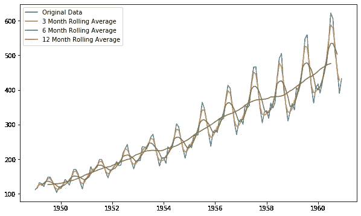

比较不同大小的窗口

还有一些其他的方法来平滑时间序列和寻找趋势线，但它们往往是简单平均的变化。值得一提的一个常见方法是指数加权移动平均线(EWMA ),顾名思义，它对以前的周期进行平均，但对它们进行加权，以便最近的周期在平均值中占更大的比重。

**古典季节分解**

以这种方式创建平滑趋势线的一个用途是执行季节性分解，将原始数据分解为趋势的组成部分、与该趋势的周期性偏差以及剩余的任何残差。我们如何从平滑线到完全分解？请注意，当你增加滚动平均窗口的大小时，季节性波动的影响就消失了。如果您的滚动平均值考虑的窗口大小与您的季节性周期相同，它实际上是通过考虑周期中每个月的一个月来彻底清除季节性周期:

12 个月的滚动平均值不再有“季节”

我们正在寻找一个季节周期，它解释了原始数据和这个无季节滚动平均值之间的差异。有两种方法可以尝试计算这个季节性因素。第一种是作为附加模型。在这种方法中，我们将假设任何给定月份的真实值是该月的趋势值加上一个静态季节性值，该值在一年内逐月变化，但在连续几年的同一个月中大致保持不变，并留下一些(希望很小)误差。让我们从计算一个“去趋势化”序列开始:取我们的原始序列并从中减去趋势:

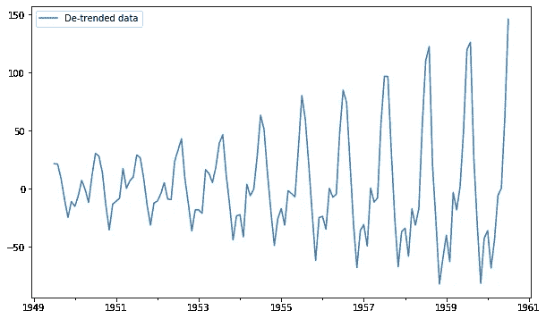

我们的反潮流系列。剧透:季节模式的幅度增长是一个不好的迹象

这个去趋势化的系列只向我们展示了季节周期以及我们数据集中的任何其他噪声。现在我们可以简单地逐个考虑周期内的每个月。一月的平均数据点是高于还是低于趋势多少？还是一般的二月？我们可以简单地采用逐月平均值来获得季节周期的近似值:

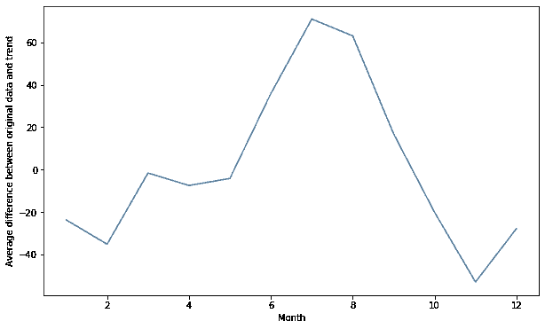

我们的季节性产品

像这样观察这些平均的季节性因素，你可以清楚地看到航空旅行是如何逐月变化的，夏季的旅行比冬季多得多。现在，我们可以将原始数据建模为由趋势和季节性成分组成:

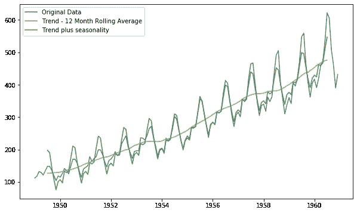

将我们的潮流和季节性元素整合在一起

我们在绿线中的模拟数据并不可怕，但它显然有一个问题——它在最初几年一直超过，在后来几年一直低于。事实上，当我们绘制出去趋势化数据并看到季节性波动变得越来越极端时，我们可以预见到这个问题的出现。在这种情况下，有一个简单的解决办法，就是考虑分解时间序列的第二种方式，乘法模型。

乘法模型的工作原理与加法模型类似，只是在这种情况下，我们说任何给定月份的最终数据都是趋势值*乘以*的某个值，该值在一年中大致保持不变。加法模型显示“航班数量通常比 6 月份的趋势高 40，000”，而乘法模型显示“航班数量通常比 6 月份的趋势高 10%”。通过这种方式，乘法模型随着趋势的上升或下降而调整季节周期的大小。

计算乘法季节周期类似于计算加法季节周期，只是为了找到去趋势序列，我们*将原始数据*除以趋势:

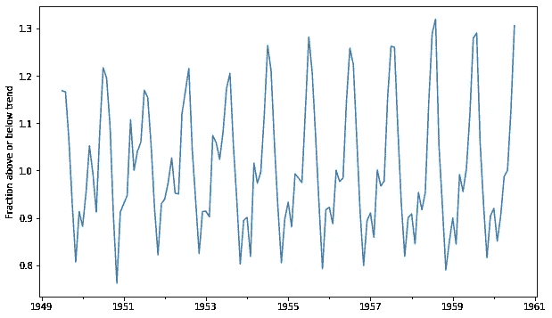

乘法去趋势数列。注意，随着时间的推移，它的振幅不再增长

我们可以通过对该去趋势序列的每个月进行平均来找到每月的调整，然后将我们的数据建模为趋势乘以适当的季节性调整:

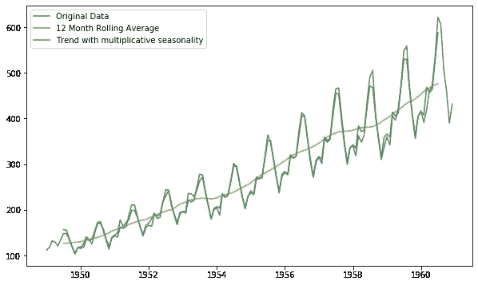

好多了！

您可能已经能够看出，以这种方式成功地分解时间序列集，关键取决于正确识别季节循环的周期。是一年一个周期吗？还是需要两年？还是只有 6 个月？通常有明确的日历周期—周到周、月到月或年到年—但根据您正在处理的数据类型，可能没有任何理由让它符合日历。选择一个不合适的时间段会使你的分解在功能上变得无用。

作为一个例子，假设您正在浏览一个数据集，就像我们一直在考虑的那样，但是您不知道它代表什么，也不假设它的平均年周期为 12 个月。如果选择 11 个月而不是 12 个月，会发生什么？嗯，起初事情似乎进展顺利。当你画出滚动平均值时，看起来你或多或少地去除了季节性:

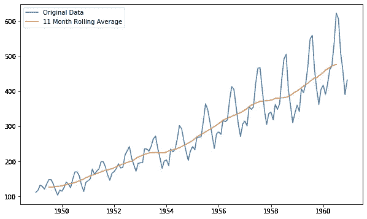

11 个月的滚动平均值似乎工作得很好…

但是，当您执行剩余的步骤来分解这 11 个月的时间序列时，您很快就会发现有些地方不对劲:

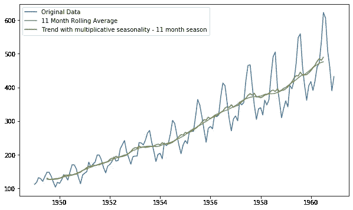

嗯，作为模特，这不是很有帮助

这种季节性分解基本上是无用的，在平滑的趋势线上没有增加任何实际价值。如你所见，经典分解确实依赖于找到一个合理的周期值。

经典分解看起来很简单，从某种程度上来说，它是在 20 世纪 20 年代发展起来的，已经过时了。然而，希望你能看到，虽然它很简单，但它非常强大，能很好地模拟我们的数据。同样清楚的是，你如何扩展这种技术来开始预测未来的价值，画出几个月的趋势，并应用适当的每月调整。

同样值得记住的是它是如何捕捉时间序列过程的:尝试分离趋势，寻找可预测的模式并解释它们。然后，您可以寻找任何重大偏差的解释。有更复杂的方法来分离趋势，但它们基本上都必然会查看多个时间点，尝试从每日、每周或每月的变化中分离出趋势。还有更高级的方法来寻找去趋势数据中的可预测模式，包括考虑同时发生的不同时期的多个模式的方法，但原则上，它们的工作方式也大致相同。

在我关于时间序列的下一篇文章中，我将介绍一些更先进的方法，以及如何扩展它们来预测未来值。