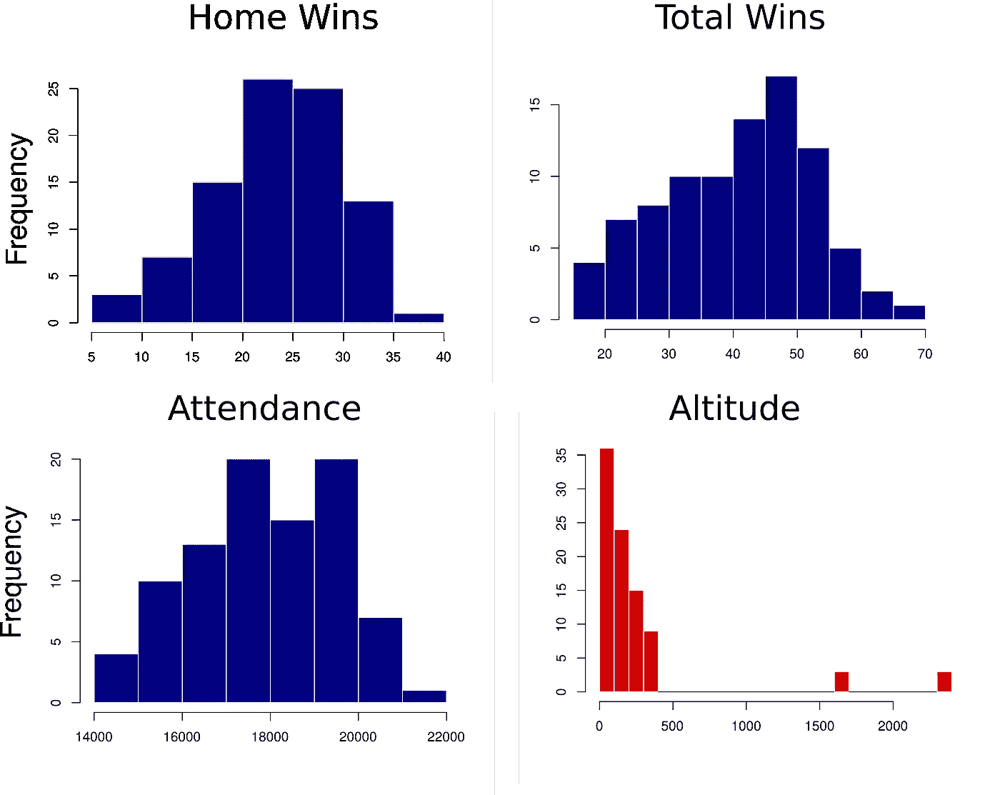
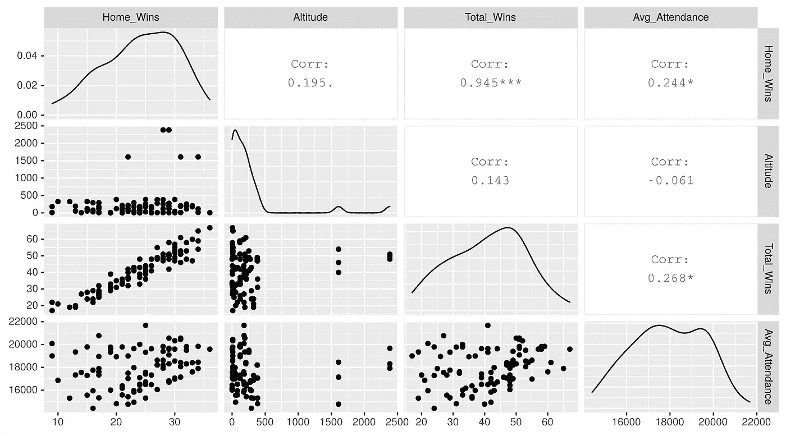
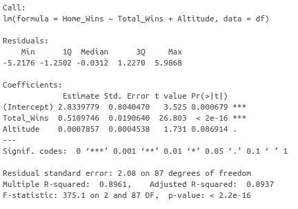

# 泡泡里的篮球

> 原文：<https://towardsdatascience.com/the-basketball-in-the-bubble-cfec7976574b?source=collection_archive---------60----------------------->

## 没有主场优势，职业篮球比赛的结果会被改变吗？


汤米·布德罗在 [Unsplash](https://unsplash.com?utm_source=medium&utm_medium=referral) 上的照片

随着 NBA 赛季在奥兰多的泡沫中升温，有许多不确定因素。目前还不清楚 NBA 保护来自新型冠状病毒的球员和人员的措施是否足够。所有球队都将在一个地方比赛，没有现场观众，也没有真正的主场优势。作为一个通过处理生物数据学会欣赏统计学的人，我想把我在研究生院学到的技能应用到篮球上。

由于 NBA 赛季通常得分很高，有 82 场比赛，球队记录经常区分好队和差队。我一直认为，在决定主场优势方面，一支球队的技术比海拔或体育场内的球迷更重要。

毫无疑问，存在某种主场优势。NBA 球队在主场比赛时往往比在客场比赛时赢得更多。我想我应该采取一个简单的，更具探索性的方法来看看我是否能找出原因！通常，我专注于可视化和分析高维数据集，这是我第一次尝试分析篮球！

关于 NBA 主场优势没有太多的学术背景。尽管如此，我还是翻遍了文献。一项研究通过检查洛杉矶湖人队和洛杉矶快船队的比赛确定了主场优势[1]。作者发现，主场优势将赢得比赛的概率提高了 20%以上。然而，我认为这是令人困惑的，因为这些球队在同一个城市和同一个竞技场比赛。我不知道这一发现是否广泛适用于联盟的其他成员。

让我们概述一些我认为在主场优势中起主要或次要作用的因素。

*   **海拔:**丹佛的海拔比其他城市高得多，这迫使来访的玩家必须适应。这可能会使球员跑步和呼吸困难，影响他们的比赛能力。这是广播中经常提到的一个重要因素。为了纳入海拔，我只需要在谷歌地图上检查每个城市的海拔。
*   **上座率:**一场比赛的观众真的是 X 因素吗？我有点怀疑上座率会影响主场优势。首先，上座率高的球队往往表现得更好。此外，不同团队的平均出勤率没有太大差异。这个数据也很容易合并。我找到了 ESPN 过去三个赛季每个竞技场的平均上座率。之前的一项研究发现，增加出勤率对获胜概率的影响非常小[2]。
*   **背靠背休息:**这个就难衡量多了。与在客场相比，球员在家的旅行和休息时间可能会影响主场优势。我将暂时不讨论这个问题，因为我将进行一个简单的探索性分析。这在之前一项关注个人游戏结果的研究中有所暗示[3]。
*   **总胜场数:**这是一个简单的想法，更好的球队往往在主场比在客场赢的更多。总胜率也代表了 NBA 在一个赛季中的表现。这些数据，以及过去三年的主场胜利都被纳入了我的分析。

# 探索数据集

好了，现在我有了过去三季的数据集。我想确切地了解这些数据看起来如何，并对任何突出的趋势有一个大致的了解。当执行探索性分析时，一种方法是使用直方图。这着眼于你的变量的频率分布。除了海拔高度，其他变量呈正态分布。丹佛和犹他州是异常城市，但也混淆了其余的分析。这些球队在过去的三年里表现很好，所以如果海拔的影响很微妙的话，可能很难解开它的影响。



由作者在 R 中使用 hist 函数生成

# **探索数据中的相关性**

可视化相关性的一个快速方法是使用 R 中 GGally 包中的 ggpairs 函数，选择包含我感兴趣的变量的列。

```
ggpairs(NBA_dataframe, columns = 3:6)
```

下面我们看到一个矩阵，告诉我们一些这方面的信息。它被组织在一个网格中，每个变量都与其他变量相对应。为了读懂这样的图表，比看起来容易多了！我们先从左上角开始。列标题显示主场胜利，行标题也显示主场胜利。由于这是同一个变量，它只是简单地描绘了一支球队在过去三个赛季中赢得一定数量比赛的频率。如果我们向下移动一格，我们仍然在主场获胜列的下面，但是现在这一行被标记为高度。我们看到一个散点图，其中 X 轴测量主场获胜，而 Y 轴测量 NBA 球队的海拔高度。我们可以用同样的方式阅读这些图表的其余部分。

当看图表的右上角时，我们看到一个数字。这种情况下的两个标题是平均上座率和主场胜率。这个数字告诉我们这两个变量之间的关联程度。如果它们强相关，相关值接近 1 或-1。



由作者在 R 中生成

有趣的是，**主场胜利**和**总胜利**之间有很强的相关性，而**主场胜利**和**平均上座率**之间有微弱但显著的相关性。一眼看去，我们看不到海拔影响的证据。数据告诉我们主场胜利的最佳预测是总胜率。很难断定海拔高度对主场优势有广泛的影响。

# 这些因素能在多大程度上衡量主场优势

接下来，我使用线性模型检查了这些变量的预测值。我插入不同的变量组合来观察预测是如何变化的。主场胜利的最佳模型包括仅使用总胜利和海拔作为预测因素，紧随其后的是仅使用总胜利。

最佳模型的 R 值，包括总胜场和高度，表明该模型解释了该数据中 89.37%的方差。此外，数据告诉我们，总胜场数是主场胜场数的最大预测因素，而海拔高度对可预测性的促进作用非常小。然而，在 41 场主场比赛中，海拔可能起了非常小的作用。



由作者在 R 中生成

# **这一切意味着什么？**

从一个快速的探索性分析来看，当考虑到球队获胜时，没有任何证据表明存在广泛的主场优势。虽然海拔可能起很小的作用，但它并没有提供太多的预测价值。最好的球队在主场赢得更多只是因为他们比竞争对手更好。休息或旅行的日子很可能会适度影响主场优势。

我不认为在泡沫中比赛的球队会因为缺乏高度或人群相关因素而表现得比平时差。我也只研究了过去的三个季节，但是纳入更多的季节不太可能将海拔的预测值提高很多。如果我回来做更深入的分析，我必须控制过去几年改变比赛的节奏和三分球的增加。

**参考文献**

[1] Boudreaux，Christopher J .，Shane D. Sanders 和 Bhavneet Walia。"一个自然的实验来确定人群对主场优势的影响."*体育经济学杂志*18.7(2017):737–749。

[2] Kotecki，Jason，“估计主场优势对 NBA 胜利的影响”(2014)。*荣誉项目*。124.https://digitalcommons.iwu.edu/econ_honproj/124
T3

[3]恩廷，奥利弗 a .，和迪伦 S. Small。“休息在 NBA 主场优势中的作用。”*体育定量分析杂志* 4.2 (2008)。