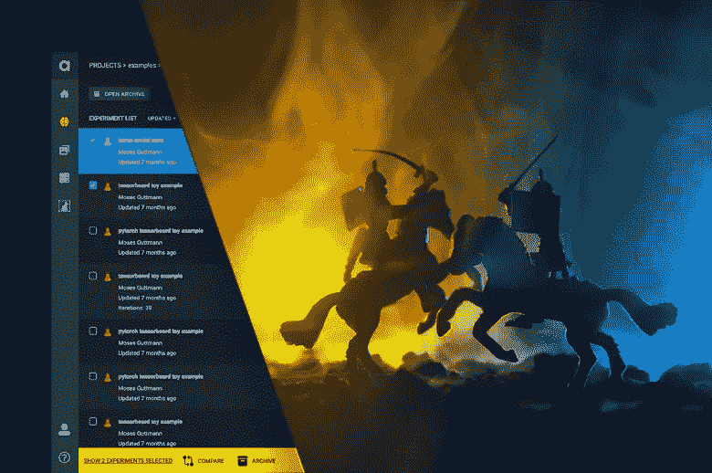
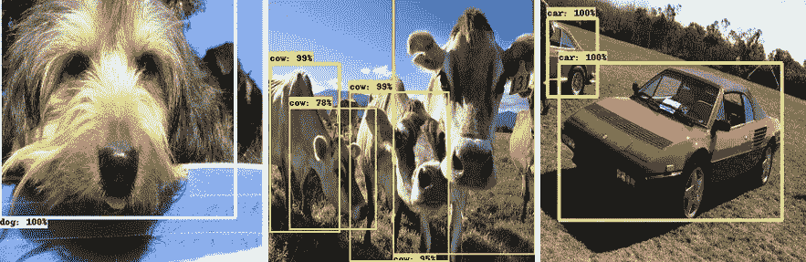
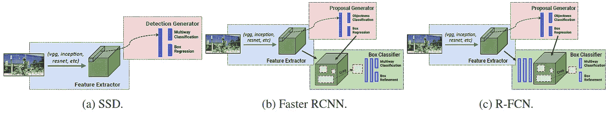
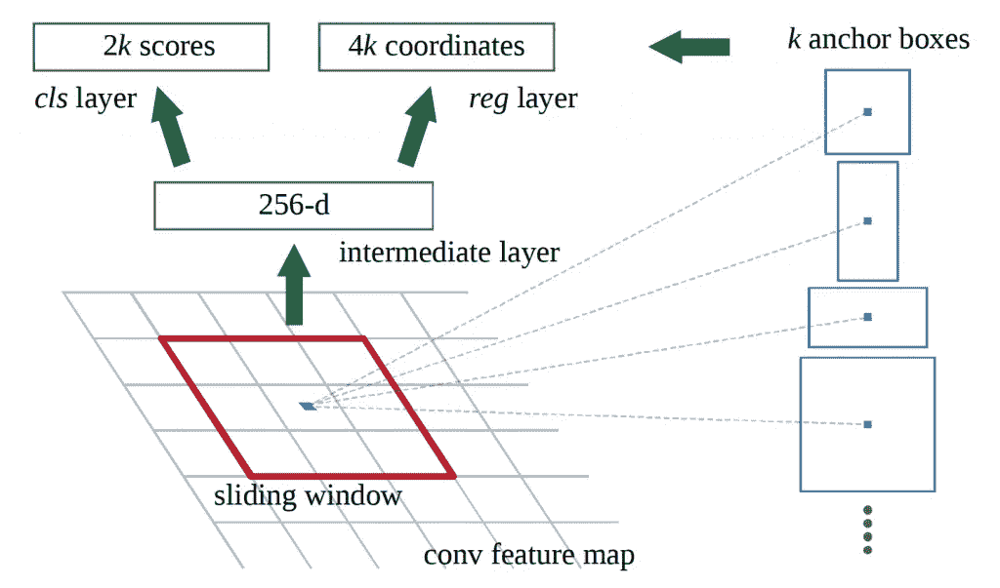
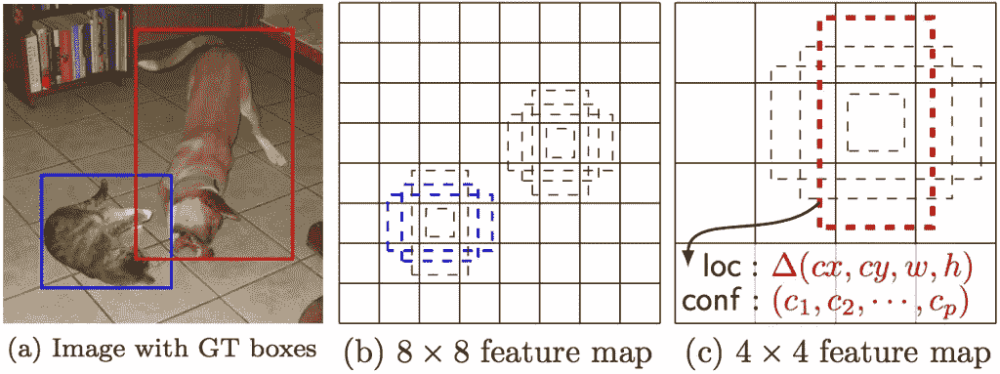
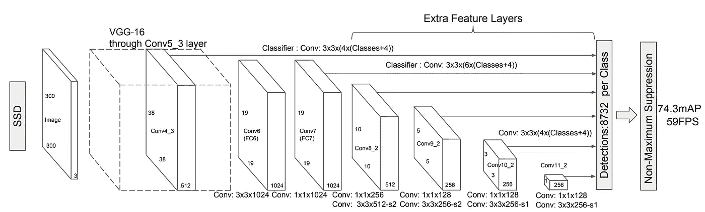
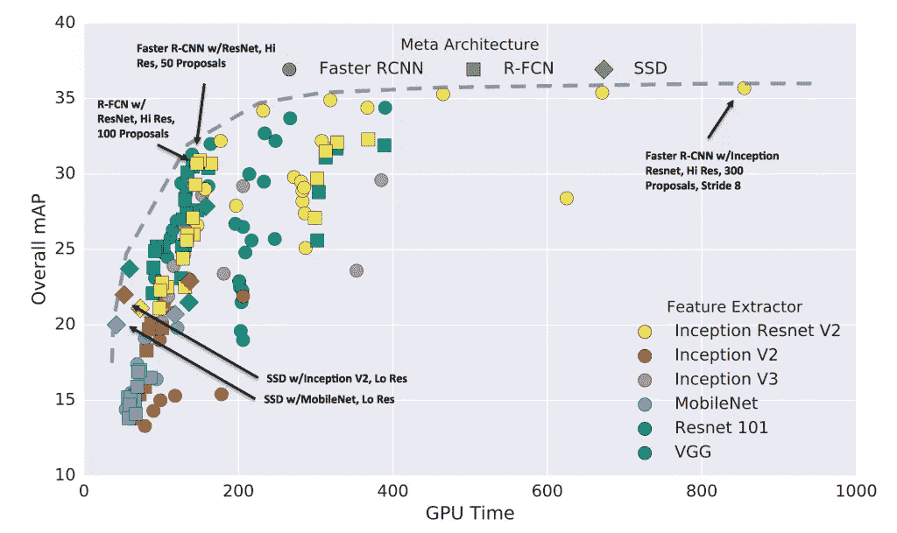

# 速度与精度之战:单镜头与双镜头检测元架构——Allegro AI

> 原文：<https://towardsdatascience.com/the-battle-of-speed-vs-23b61eb4225d?source=collection_archive---------34----------------------->

## [现实世界中的数据科学](https://towardsdatascience.com/data-science-in-the-real-world/home)

## 深度学习代码库系列的英雄之旅——IIA 部分

由 [Gal Hyams](https://www.linkedin.com/in/gal-hyams-2146a662/) 和 [Dan Malowany](https://www.linkedin.com/in/dan-malowany-78b2b21/)
[快板 AI 团队](https://medium.com/u/7743e9a45144?source=post_page-----23b61eb4225d--------------------------------)编写

用于目标检测任务的深度神经网络是一个成熟的研究领域。也就是说，在为目标用例构建给定模型时，在速度和准确性之间做出正确的权衡是一个持续的决策，团队需要在每个新的实现中解决这个问题。虽然多年来已经研究了许多对象检测模型，但是单次拍摄方法被认为是在速度与精度之间权衡的最佳点。在这篇文章(IIA 部分)中，我们解释了单镜头(SSD)和双镜头方法之间的主要区别。自发布以来，在最初的 SSD 上进行了许多改进。然而，为了清晰和简单起见，我们将重点放在了最初的 SSD 元架构上。在下面的帖子(IIB 部分)中，我们将向您展示如何利用预先训练的 Torchvision 特征提取器网络来构建您自己的 SSD 模型。

# 我们为什么需要这款固态硬盘？

在对象检测任务中，该模型旨在围绕图像中的期望类别以及每个对象标签绘制紧密的边界框。参见下面的图 1。

图 1:对象检测示例，VOC-2012 [数据集](http://host.robots.ox.ac.uk/pascal/VOC/voc2012/)

有两种常见的元方法来捕捉对象:双镜头和单镜头检测。

双镜头检测模型具有两个阶段:区域提议，然后对这些区域进行分类，并改进位置预测。单镜头检测跳过了区域提议阶段，并立即产生最终的定位和内容预测。[更快-RCNN](http://papers.nips.cc/paper/5638-faster-r-cnn-towards-real-time-object-detection-with-region-proposal-networks) 变体是两次触发模式的常用选择，而单次触发多盒探测器(SSD)和 [YOLO](https://www.cv-foundation.org/openaccess/content_cvpr_2016/html/Redmon_You_Only_Look_CVPR_2016_paper.html) 是常用的单次触发方法。YOLO 架构虽然比固态硬盘快，但精确度较低。

[R-FCN(基于区域的全卷积网络)](http://papers.nips.cc/paper/6465-r-fcn-object-detection-via-region-based-fully-convolutional-networks.pdf)是另一种流行的二次元架构，灵感来自 fast-RCNN。在这种方法中，区域提议网络(RPN)提议候选 ROI(感兴趣区域)，然后将其应用于评分图上。所有可学习的层都是卷积的，并在整个图像上计算。在那里，几乎所有不同的建议区域的计算都是共享的。与快速 RCNN 相比，每个 RoI 的计算成本可以忽略不计。R-FCN 是单镜头和双镜头方法的混合体。当你真正了解它时，你会发现它实际上是一种两次尝试的方法，具有一些一次尝试的优点和缺点。

虽然双镜头检测模型实现了更好的性能，但是单镜头检测处于性能和速度/资源的最佳点。此外，SSD 训练速度更快，推理速度也比两次检测器更快。更快的培训使研究人员能够高效地进行原型制作和实验，而无需为云计算花费大量费用。更重要的是，当涉及到实时应用程序时，快速推理特性通常是一个需求。由于它涉及更少的计算，因此，每次预测消耗更少的能量。这种时间和能源效率为广泛的用途打开了新的大门，特别是在终端设备上，并使 SSD 成为许多用途的首选对象检测方法。

最近，分层去卷积方法，如去卷积 SSD (DSSD)和特征金字塔网络(FPN)，已经成为任何对象检测架构的必要条件。原始架构之上的分层去卷积后缀使该模型能够在不同对象大小之间达到卓越的泛化性能，从而显著改善小对象检测。由于我们在这里的目的是详细说明一次和二次检测器之间的差异，以及如何轻松构建自己的 SSD，我们决定使用经典的 SSD 和 FasterRCNN。

# 单镜头物体检测和双镜头物体检测的比较

图 2:单触发检测器(SSD)和双触发检测器(更快的 RCNN，R-FCN)元架构的高层图[ [来源](https://arxiv.org/pdf/1611.10012.pdf)

# 更快-RCNN:

更快的 R-CNN 检测分两个阶段进行。第一阶段称为*地区提案*。图像由特征提取器(例如 ResNet50)处理，直到选定的中间网络层。然后，一个小的完全连接的网络滑过特征层，根据空间、比例和纵横比平铺的锚网格来预测类别不可知的框提议(图 3)。

图 3:faster CNN 通过一个小型全连接网络提议的感兴趣区域[ [来源](http://papers.nips.cc/paper/5638-faster-r-cnn-towards-real-time-object-detection-with-region-proposal-networks)

在第二阶段，这些盒建议用于从第一阶段已经计算的中间特征地图中裁剪特征。建议的盒子被馈送到特征提取器的剩余部分，该特征提取器用预测和回归头装饰，在这里为每个建议计算类和类特定的盒子改进。

尽管 fast-RCNN 通过在提议阶段和分类阶段之间共享特征图计算来避免重复计算，但是有一个计算必须在每个区域运行一次。因此，更快的 RCNN *运行时间取决于 RPN* 提出的区域数量。

# 固态硬盘:

图 4:不同特征地图分辨率下的 SSD 锚点和预测[ [来源]。](https://link.springer.com/chapter/10.1007/978-3-319-46448-0_2)

SSD 元体系结构在单次连续的网络传递中计算定位。与 Fast-RCNN 类似，SSD 算法在图像上设置一个锚点网格，平铺在空间、比例和纵横比框中(图 4)。与二次拍摄方法相反，该模型为连续网络过程中的每个框生成预测向量。这个向量保存每个类的置信度得分、本地化偏移量和调整大小。

类置信度得分指示该框中每个类实例的存在，而偏移和调整大小状态指示该框应该经历的变换，以便最好地捕捉它声称覆盖的对象。为了在不同的对象尺寸上获得良好的检测性能，预测是在几个特征图的分辨率上计算的。每个特征图都是从更高分辨率的前身的特征图中提取的，如下图 5 所示。

与 FasterRCNN 相比，多尺度计算使 SSD 能够在更高分辨率的特征地图中检测对象。FasterRCNN 在单个特征地图上进行检测，并且对特征地图分辨率和特征成熟度之间的权衡比较敏感。SSD 可以两全其美。在 512×512 的图像尺寸上，快速 CNN 检测通常在 32×32 像素特征图(conv5_3)上执行，而 SSD 预测从 64×64 特征图(conv4_3)开始，并在 32×32，16×16 上继续，一直到 1×1，总共 7 个特征图(当使用 VGG-16 特征提取器时)。

每个特征图的分离的分类器导致丢失小对象的不幸的 SSD 趋势。通常，模型在训练期间看不到每个类的足够小的实例。缩放增强缩小或放大训练图像，有助于解决这一泛化问题。另一方面，SSD 往往比 FasterRCNN 更准确地预测大型对象。图 4 示出了不同特征地图上的锚点预测。为什么 SSD 比 Faster-RCNN 快？

*图 5: SSD 元架构和多特征图计算[* [*来源*](https://link.springer.com/chapter/10.1007/978-3-319-46448-0_2)*】*

# 为什么 SSD 比 Faster-RCNN 快？

从下面的*图 6 中可以看出，单触发架构比双触发架构速度更快，但精度相当。单次方法实现其卓越效率的原因有两个:*

1.  区域提议网络和分类与定位计算被完全集成。这最大限度地减少了冗余计算。
2.  单次拍摄对于图像中的任何数量的对象都是鲁棒的，并且其计算量仅基于锚的数量。然而，快速 RCNN 计算在每个区域重复执行，导致计算负荷随着 RPN 提出的区域数量而增加。这个数字受到一个超参数的限制，为了更好地执行，这个超参数被设置得足够高，从而导致大量的开销。R-FCN 只是部分地最小化了这种计算负荷。除了 SSD 固有的避免冗余计算的能力之外，图 6 显示了这种元架构成功利用了高效的特征提取器，如 MobileNet，并且在从这些类型的快速模型中获取信息时，明显优于双镜头架构。

图 6:对象检测元架构和特征提取器的速度精度[ [来源](https://arxiv.org/pdf/1611.10012.pdf)

# 为什么 SSD 不如 Faster-RCNN 准确？

[*焦损*](http://openaccess.thecvf.com/content_iccv_2017/html/Lin_Focal_Loss_for_ICCV_2017_paper.html) 论文调查了单镜头性能不佳的原因。毕竟，很难弄清楚为什么双摄方法毫不费力地占据了“最先进的宝座”。文章认为，这种差异在于训练过程中前景/背景的不平衡。

两级检测器很容易处理这种不平衡。RPN 缩小了候选对象位置的数量，过滤掉了大多数背景实例。在此基础上，采样试探法，如在线硬示例挖掘，为两阶段模型的第二阶段检测器提供平衡的前景/背景样本。相比之下，一阶段模型的检测层暴露于更大的候选对象位置集合，其中大多数是在训练期间密集覆盖空间位置、比例和纵横比的背景实例。虽然也可以应用两次分类器样本试探法，但是它们对于单次模型训练来说是低效的，因为训练过程仍然由容易分类的背景例子主导。焦点损失方法将训练损失集中在困难的实例上，这些实例往往是前景实例。通过这样做，它可以平衡不平衡的背景/前景比率，并将单次拍摄检测器引入对象检测模型精度名人堂。

# 那么结论是什么:单镜头还是双镜头？

很明显，以 SSD 为代表的单炮探测器相比双炮探测器，性价比更高。它们在有限的资源使用情况下实现了更好的性能。此外，当两种元架构都利用快速轻量级特征提取器时，SSD 优于双镜头模型。另一方面，当计算资源不是大问题时，二次检测器充分利用重特征提取器并提供更可靠的结果。关于这个问题的主要假设是，准确性的差异在于训练期间前景/背景的不平衡。利用聚焦损耗等技术可以帮助处理这种不平衡，甚至从精度的角度来看，单次检测器也是元架构的首选。

本系列的下一篇文章，IIB 部分，是一个教程代码，我们将使用这里获得的知识，并演示如何在 Torchvision 模型上实现 SSD 元架构。

*原载于 2020 年 3 月 8 日*[*https://allegro . ai*](https://allegro.ai/blog/the-battle-of-speed-accuracy-single-shot-vs-two-shot-detection/)*。*