# 邻里之战——在蒙特利尔开一家电影院

> 原文：<https://towardsdatascience.com/the-battle-of-the-neighborhoods-open-a-movie-theater-in-montreal-355cf5c679b8?source=collection_archive---------27----------------------->

## 利用 follow 和 Foursquare APIs 获得 IBM 数据科学专业证书的顶点项目

我跟随 [Coursera](https://www.coursera.org/) 的 [IBM 数据科学专业证书](https://www.coursera.org/professional-certificates/ibm-data-science)，该专业证书由 9 门课程组成。有很多很好的例子。

最后一项任务是完成一个名为 Capstone project 的项目，该项目要求您利用 Foursquare APIs 从 API 调用中获取数据，并利用 follow map 库可视化数据分析。这是在这个项目中实践数据科学方法和工具集的一个很好的机会。

在这个项目中，我们将涵盖数据科学生命周期的所有阶段来解决问题。我们将深入研究数据科学中的以下工具/库:

*   叶库，包括 choropleth 地图，地图视图中的热图
*   用于树叶地图的蜂窝状网格
*   谷歌地理编码 API
*   四方 API
*   k-均值聚类算法
*   水平条形图
*   熊猫，胖胖的，身材匀称

好了，我们开始吧。

# 简介:业务问题

在这个项目中，我们将寻找一个开设电影院的最佳地点。具体来说，这份报告可以为有兴趣**在加拿大魁北克蒙特利尔**开电影院的利益相关者提供参考。

蒙特利尔是加拿大第二大城市，也是魁北克省最大的城市，位于圣劳伦斯河与渥太华河的交汇处。它坐落在一个岛上。在这篇报道中，我们将关注蒙特利尔岛上的所有地区。蒙特利尔岛上有许多电影院，我们将**推断现存的电影院在哪里**。然后，我们将使用一个聚类模型**来寻找岛上相似的区域**，考虑每个行政区和区域的人口统计数据。首选区域应**远离现有电影院**。

我们将使用数据科学工具获取原始数据，将其可视化，然后**根据上述标准**生成几个最有希望的区域。同时，我们还将向候选人解释他们的优势和特点，以便**利益相关者可以根据分析做出最终决定**。

# 数据

根据我们问题的定义，可能影响我们决策的因素有:

*   人口统计信息，例如人口、密度、教育、年龄、收入
*   附近现有购物中心的数量
*   社区和附近现有电影院的数量

我们决定在整个蒙特利尔岛周围使用一个有规则间隔的位置网格来定义我们的社区。具体来说，我们将使用流行的六边形蜂窝来定义我们的邻域。

在这个项目中，我们将从以下数据源获取或提取数据:

*   [2016 年蒙特利尔人口普查信息](http://ville.montreal.qc.ca/pls/portal/url/ITEM/55637C4923B8B03EE0530A930132B03E)
*   六边形邻域的中心将通过算法生成，这些区域中心的近似地址将使用**谷歌地理编码 API** 获得
*   使用 Foursquare API 可以获得每个街区的购物中心和电影院的数据
*   将使用众所周知的蒙特利尔位置的**谷歌地理编码 API** 获得蒙特利尔中心的坐标
*   从 [Carto](https://jmacman12.carto.com/tables/montreal_shapefile/public) 中获得蒙特利尔市 shapefile

## 蒙特利尔岛形状文件

为了在**叶子**地图中显示蒙特利尔岛的边界，我们需要一个蒙特利尔岛的 **geojson** 定义文件。我们从 [Carto](https://jmacman12.carto.com/tables/montreal_shapefile/public) 网站下载了这个形状文件。

该文件为 JSON 格式，包含蒙特利尔岛每个行政区或自治市的边界定义。在下一步中，我们将使用一个叶子地图来可视化这个 geojson 定义文件。

## 薄层

> `*folium*`建立在 Python 生态系统的数据优势和`*leaflet.js*`库的映射优势之上。用 Python 处理你的数据，然后通过`*folium*`在活页地图上可视化。

使用`folium`并不难，只需要几行代码就可以用边界数据显示蒙特利尔岛。

使用 geojson 定义在 follow 地图中显示蒙特利尔边界。

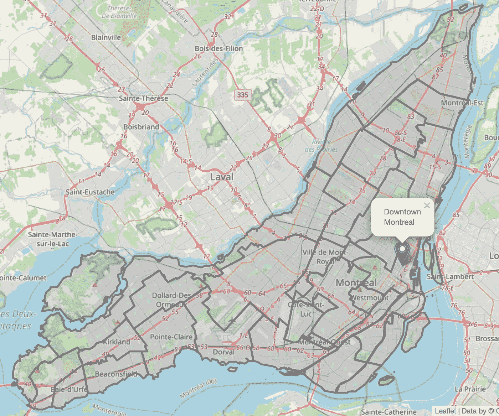

奥利佛地图中的蒙特利尔岛。

下一步，我们希望在地图中生成候选像元，更具体地说，只在蒙特利尔岛内。在处理与地图相关的问题时，通常使用蜂窝状六边形网格。与圆形不同，六边形之间没有间隔，确保没有遗漏区域。此外，任意两个相邻六边形之间的距离是相同的。

不幸的是，`Folium` 不提供在地图视图中绘制六边形的原生支持，我们必须编写一些代码来支持这一功能。

我们编写了一个方法，通过给定质心坐标和边长来计算六边形顶点的坐标。

获取六边形的顶点。

之后，我们在整个岛上生成一个蜂窝状六边形网格。

在蒙特利尔生成蜂窝状六边形网格。

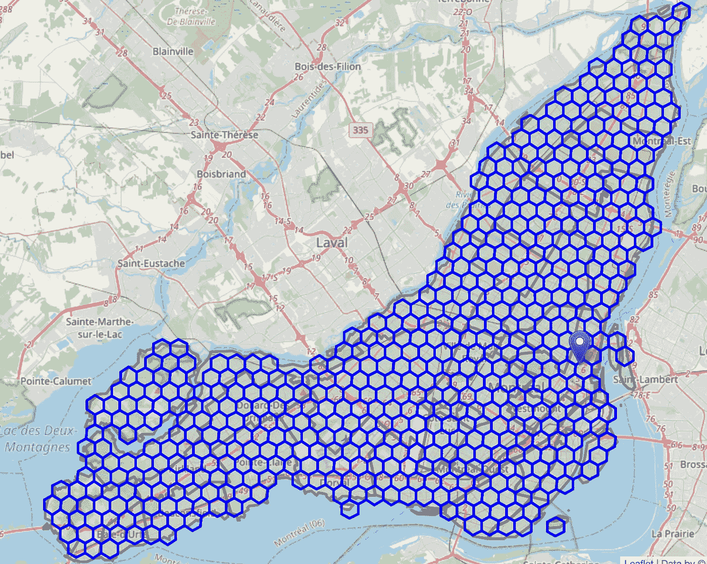

在蒙特利尔地图上显示蜂窝状六边形网格。

看起来棒极了！😄

到目前为止，我们在岛上创建了一个蜂窝网格，并为每个六边形生成了中心坐标。我们将使用`Google Geocoding API`相应地反向查找地址。

## 谷歌地理编码 API

> Google 地理编码 API 是一种提供地址地理编码和反向地理编码的服务。

使用这组 API 需要一个 Google API 密钥。可以从[谷歌开发者控制台](https://console.developers.google.com)应用。

谷歌地理编码 API。

让我们将所有数据放在一个`Pandas Dataframe`中，并显示前 10 项。

每行包含一个六边形的中心地址和对应的经纬度，在 WGS84 球面坐标系中，`X/Y`列在 UTM 笛卡尔坐标系中，使用常用的公制单位——米或千米。

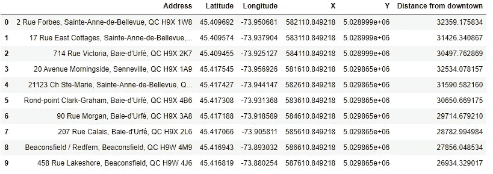

候选六边形的数据框架。

## 四方应用编程接口

> Foursquare Places API 提供对 Foursquare 的全球数据库的实时访问，该数据库包含丰富的场所数据和用户内容，可在您的应用程序或网站中增强您基于位置的体验。

现在我们生成了蒙特利尔岛上所有的候选社区，我们将使用 Foursquare API 获取所有电影院的信息。

从 Foursquare API 文档中，我们可以在[场馆类别](https://developer.foursquare.com/docs/build-with-foursquare/categories)中找到对应的电影院类别。Foursquare API 中**电影院**对应的 ID 是`4bf58dd8d48988d17f941735`，在**艺术&娱乐**主类别下。它包含几个子类别:

*   汽车影院，id: `56aa371be4b08b9a8d5734de`
*   独立电影院，id: `4bf58dd8d48988d17e941735`
*   多路复用，id: `4bf58dd8d48988d180941735`

不像到处都是咖啡店、餐馆，这个地区没有很多电影院，这也是有道理的，因为我们不期望每个社区都有电影院。

让我们先把蒙特利尔岛上所有的电影院都找来。为此，我们将获取每个行政区和自治市的电影院数据。

通过 Foursquare APIs 获取附近的电影院。

从 Foursquare APIs 的回应来看，蒙特利尔岛上一共有 44 家电影院。让我们在地图视图中绘制它。

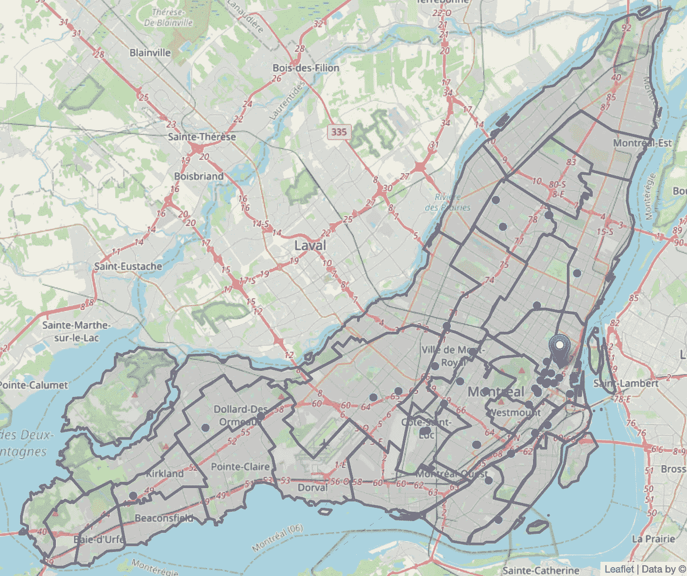

蒙特利尔岛上的电影院。

让我们使用正电子风格在热图中显示它。

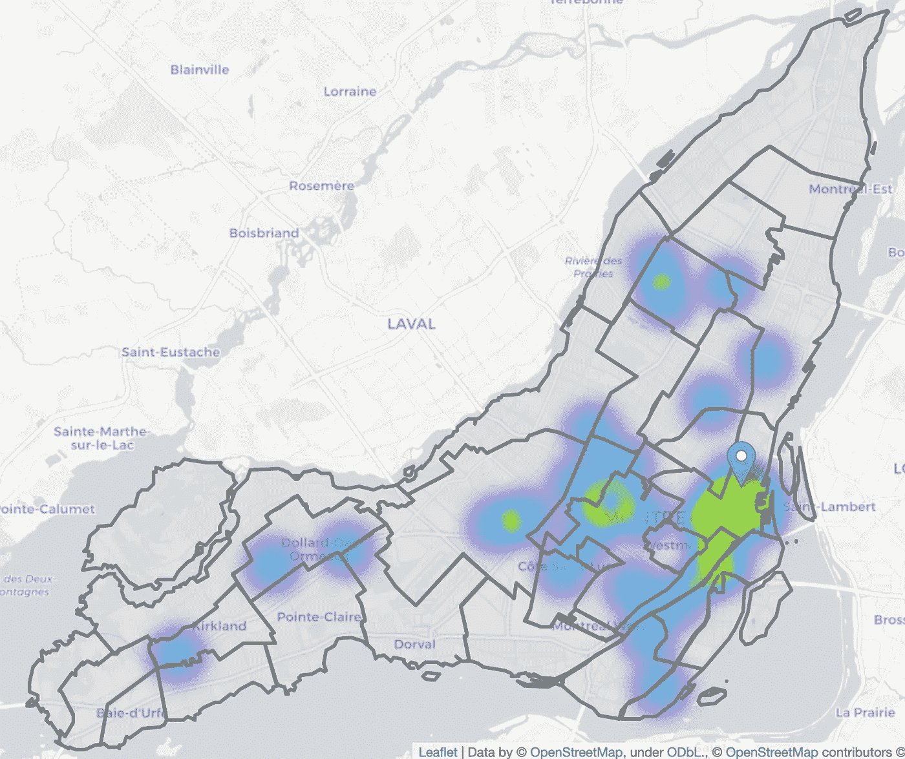

岛上电影院分布热图。

从热图上，我们可以看到电影院主要集中在市中心和岛的中心。通常，附近也有很多购物中心，让我们使用 Foursquare APIs 拉出蒙特利尔岛上的购物中心数据。

从 Foursquare API 文档来看，有几个类别与商场或购物中心有关。

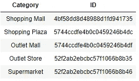

我们将获取上述类别中的所有购物中心数据，并将它们与电影院数据一起显示在地图上。

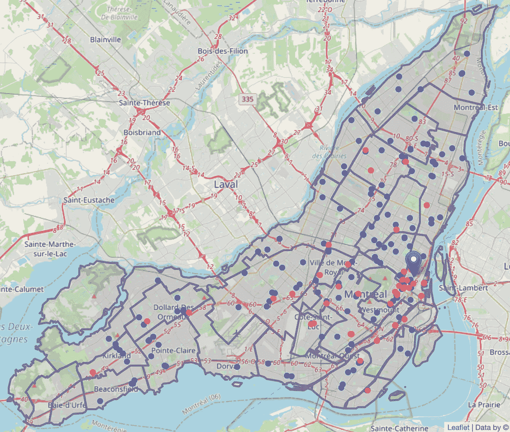

蓝色的购物中心，红色的电影院。

从地图上看，我们可以看到电影院在大多数情况下都位于购物中心附近。

> 我们的目标区域附近应该有更多的购物中心和更少的电影院。

在此之前，我们需要根据某些信息对所有候选六边形进行聚类，在这个项目中，我们提取人口普查数据作为聚类的主要特征。

## 蒙特利尔人口普查信息

现在我们将获取蒙特利尔岛上每个行政区或自治市的人口普查信息。最新数据采集于 2016 年。我们可以从[蒙特利尔市官网](http://ville.montreal.qc.ca/pls/portal/url/ITEM/55637C4923B8B03EE0530A930132B03E)获取。

这是一个包含大量数据的相当大的 excel 文件，我修改了一些表格，以便更容易地将数据提取到熊猫数据框架中。

我们只关注几个基本的普查信息:`Population`、`Density`、`Age`、`Education`、`Income`。

将 excel 加载到 Pandas 数据框架中。

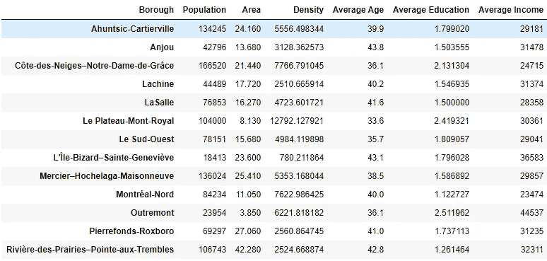

预处理后的普查数据框架

接下来，我们将在 choropleth 地图上显示人口普查数据分布。

> 一张 [Choropleth 地图](https://en.wikipedia.org/wiki/Choropleth_map)是一张由彩色多边形组成的地图。它用于表示一个量的空间变化。⁴

我们也在同一张地图上显示购物中心和电影院的位置。

在地图上显示人口普查信息。

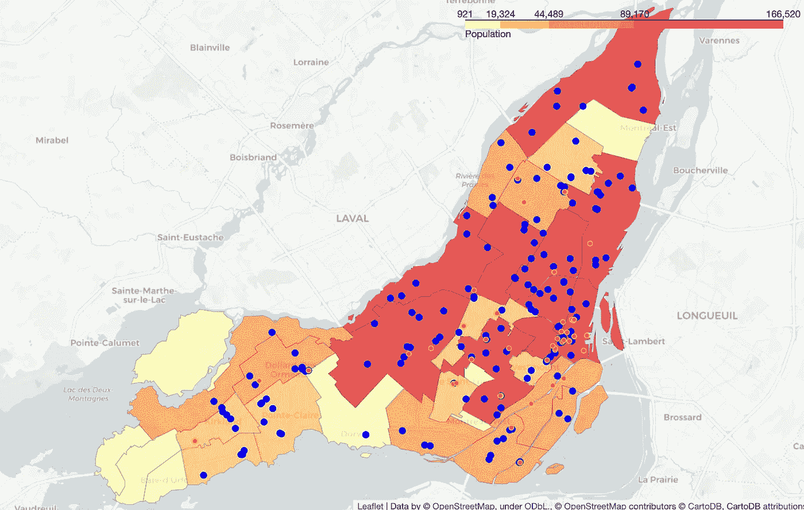

各行政区的人口分布。

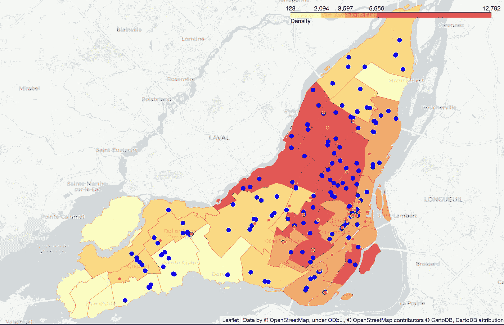

各区的密度分布。

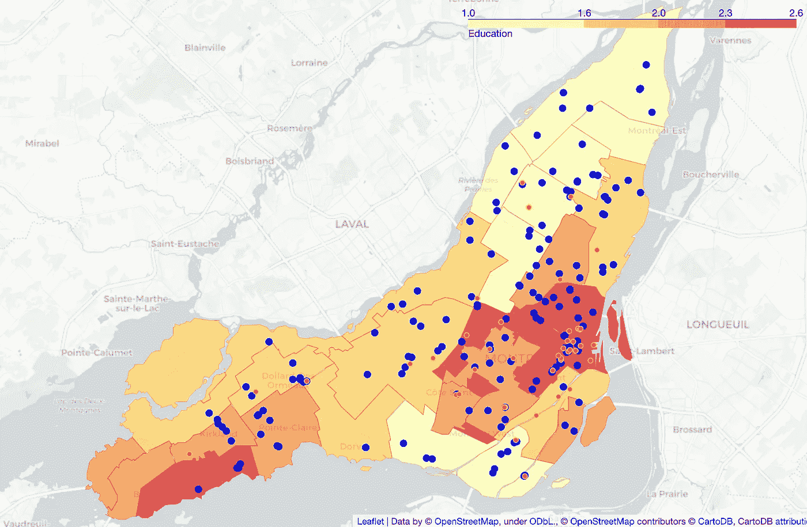

按行政区划分的教育分布。

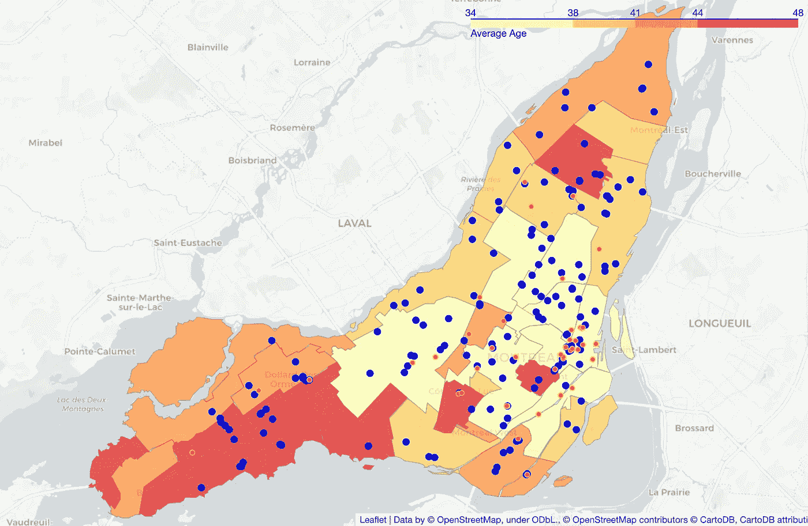

各区的年龄分布。

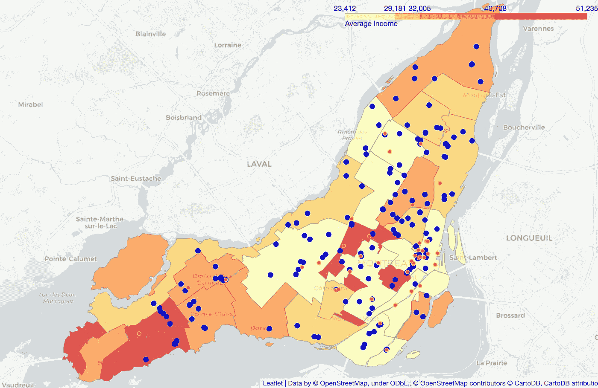

各区的收入分配。

从上面的 choropleth 地图，我们可以看到电影院大多位于人口较多的地区。购物中心的位置也是如此。此外，大多数电影院位于收入较低的地区。收入较高的地区购物中心和电影院较少。

到目前为止，我们检索了所有需要的原始数据，并对它们进行了可视化。在下面的步骤中，我们将操作这些数据集，提取数据，并为机器学习算法生成新的特征。最后，我们将在蒙特利尔岛上找到最适合开设电影院的地方。

# 方法学

这个项目的商业目的是在蒙特利尔岛上找一个合适的地方开一家电影院。

现在我们检索了以下数据:

1.  蒙特利尔岛上所有电影院的数据
2.  蒙特利尔岛上所有购物中心的数据
3.  2016 年蒙特利尔各行政区的人口普查数据，具体而言，蒙特利尔岛内各行政区或自治市的人口、密度、年龄、教育和收入数据
4.  蒙特利尔岛各行政区和自治市的边界数据

我们还生成了一个遍布整个蒙特利尔岛的蜂窝状六边形网格。

基于上述原始数据，我们将尝试相应地生成新的特征，例如每个候选小区的**人口普查信息，以及**本地和附近的**电影院和商场的数量。**

最后一步，我们将把重点放在购物中心多、电影院少的最有前景的地区。我们还将在地图视图中显示候选六边形像元，以便利益相关者做出最终决定。

# 分析

我们得到了每个自治区和直辖市的基本人口普查信息。我们希望获得每个候选六边形像元的人口普查信息，因此，我们根据与像元相交的区和自治市来计算这些人口普查信息。

如果一个六边形完全在一个区内，我们将使用该区的人口普查信息作为六边形的信息。因此，这意味着对于一个行政区内的所有六边形，我们将在人口普查要素中对它们一视同仁。

因此，如果一个六边形与两个区分别有 50%的交集，我们将从这两个区分别生成该六边形的 50%比率的普查数据。

基于这个规则，我们可以计算所有六边形的人口普查。

为每个六边形生成人口普查信息。

让我们将这个数据框与之前的位置数据框合并，生成一个新的:`**candidates_df**`包含每个六边形的基本信息。我们打印几行这个数据帧。

```
candidates_df.iloc[200:206]
```

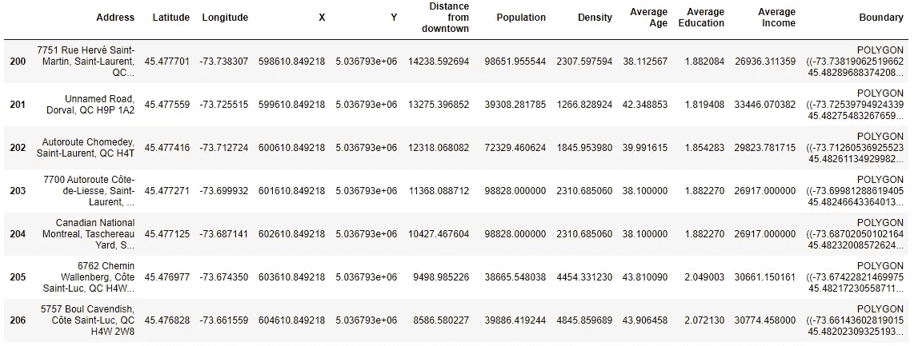

六边形的普查信息

看起来不错。现在我们有了每个六边形区域的人口普查信息。

然后我们将计算每个六边形区域的购物中心和电影院的相关信息。

我们将计算购物中心和电影院的以下特征:

1.  当前六边形单元内的购物中心和电影院的数量。
2.  距离六边形单元中心 1 公里以内的商场和电影院的数量。
3.  距离六边形小区中心 3 公里以内的多个商场和电影院。

为每个六边形生成电影院的数量。

现在我们准备好了我们需要的所有数据，我们可以使用 **K-Means 聚类算法**将相似的候选六边形区域分组到聚类中。

## k 均值聚类

我们选取人口普查特征以及购物中心和电影院的数量作为输入特征。

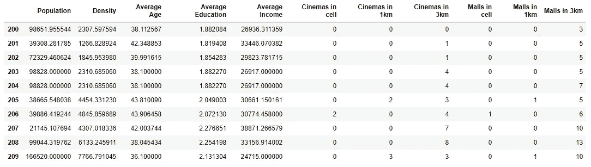

选定的特征作为 K 均值聚类算法的输入参数

我们将首先运行一个评估步骤来选择最佳的`**K**`，这是算法中的类别数。

我们使用**距离平方和**和**轮廓得分**两种方法来评估针对不同`**K**`的 K-Means 算法。

**距离平方和**测量数据点与其指定的聚类质心之间的误差。越小意味着越好。

**剪影评分**也关注于最小化簇内距离的平方和，同时也试图最大化其邻域之间的距离。从它的定义来看，值越大，K 越好。

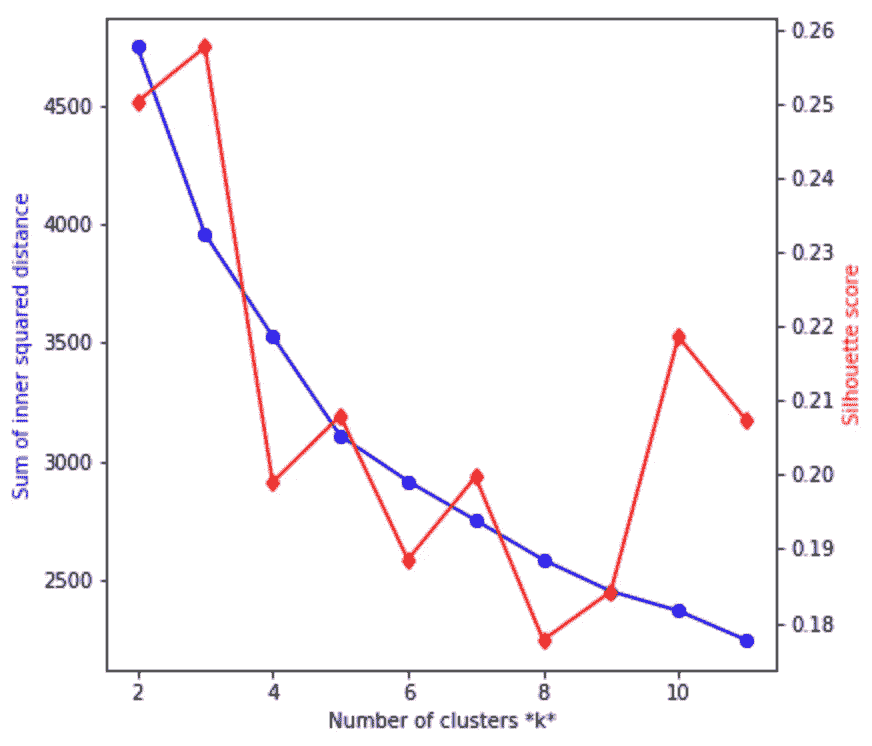

K-均值聚类的 K 选择

从图中，我们可以看到当 K 变大时`Sum of Squared Distance`下降。当 K=2，3 时，`Silhouette Score`较高，但当时上证指数仍然较高，我们选择`K=10`用于本项目，它是`Sum of Squared Distance`和`Silhouette Score`的平衡数。让我们用 **k=10** 再次运行 K 均值算法。

k=10 的 k 均值聚类算法。

让我们在地图视图中用不同的颜色显示聚类结果。

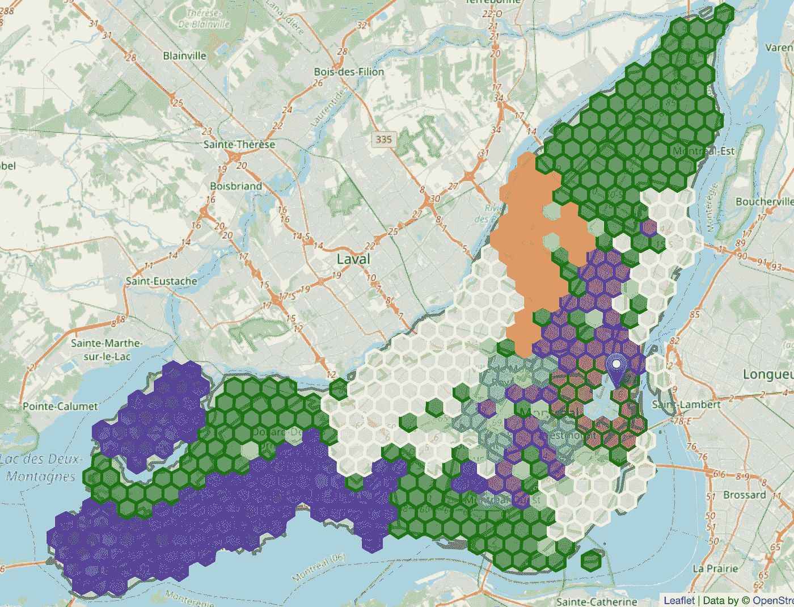

10 组候选六边形

让我们将所有内容放在一个地图视图上:

1.  六边形的彩色簇
2.  蓝点的购物中心
3.  红点的电影院有黄色的环


有购物中心和电影院的集群

从上面的地图视图中的集群图，我们可以看到在市中心有一个由 4 个六边形组成的浅蓝色集群，在这个集群中有很多电影院和购物中心。

紫色集群包含有许多购物中心的区域。除了市中心组团外，浅绿色组团包含更多的购物中心和电影院。

让我们给所有三个电影院相关特征分配权重，并将它们组合成一个特征。商场也一样。便于整理。

我们将计算加权的`Mall Score`和加权的`Cinema Score`，然后生成一个新的`Score`特征用于排序。

最终得分越高，意味着商场越多，电影院越少。

为群集生成一个分数。

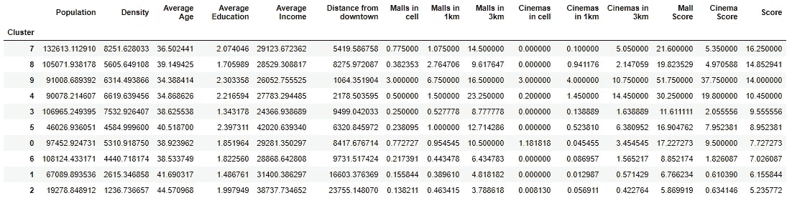

按分数对分类进行排序。

`Cluster 7`得分最高，它的商场多，电影院少。下面我们来探讨一下`cluster 7`的更多特点。

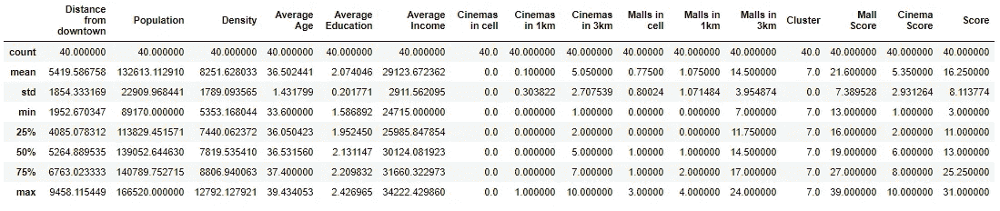

集群 7 的统计信息

`Cluster 7`有 **40 个六边形**平均每个地方有 0.77 个*商场，每个地方*有 0.0 个*电影院。让我们使用 **matplotlib.pyplot** 库绘制所有聚类，以便在条形图中比较每个特性。我们突出显示了目标集群`Cluster 7`。*

为集群绘制水平条形图。

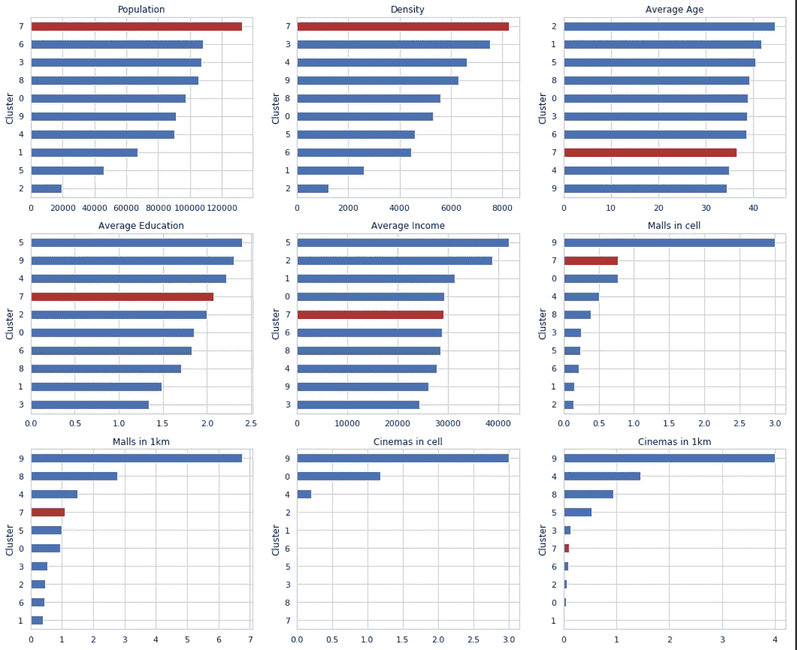

聚类的特征比较

从柱状图中，我们可以看到**星团 7** 在所有星团中拥有最多的人口和密度。此外，它在 hexagon 地区或附近有相当多的购物中心和相对较少的电影院。

接下来，我们按照`Score`降序排列第 7 簇中的所有六边形，并挑选前 5 个六边形。他们将是我们开设电影院的首选位置。

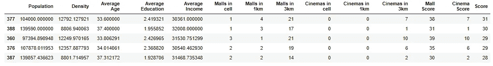

根据以上统计信息，当地有 1~3 家商场，附近有更多商场，但 1 公里范围内没有电影院。看起来不错的选择。

让我们在地图视图中画出`Cluster 7`六边形，将其他的集群变灰，并突出显示我们的 5 个选项。

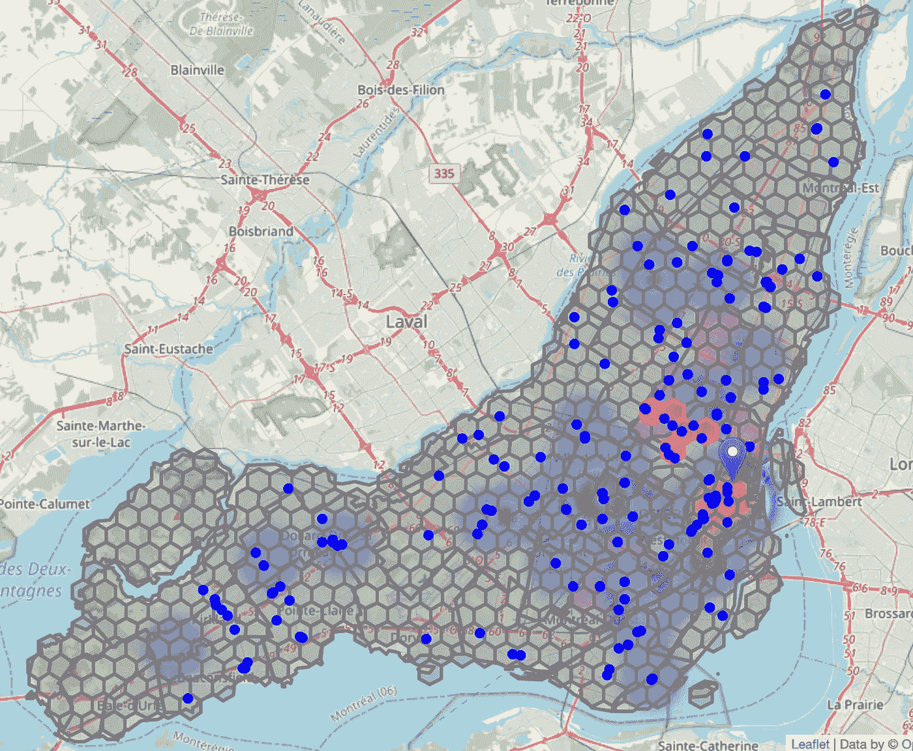

5 个最有希望的候选领域

我们的分析到此结束。我们已经找出了 5 个最有希望的区域，附近有更多的购物中心，电影院较少。每个区域都是正六边形，这在地图视图中很常见。与其他集群相比，集群中的区域具有最多的人口和密度。

# 结果和讨论

我们在整个蒙特利尔岛生成了六边形区域。我们根据包括人口、密度、年龄、教育和收入在内的人口普查数据信息将他们分为 10 类。运行聚类算法时，还会考虑购物中心信息和现有电影院信息。

从数据分析和可视化中，我们可以看到电影院通常都位于购物中心附近，这启发了我们找出购物中心多而电影院少的区域。

经过 K-Means 聚类机器学习算法，我们得到了附近商场最多，平均电影院较少的聚类。我们还发现了星团的其他特征。它显示该集群具有最多的人口和密度，这意味着所有集群中最高的流量。

该群集中有 40 个六边形区域，我们按照购物中心和电影院信息降序排列所有这些六边形区域，目标是覆盖本地小区或附近更多的购物中心和更少的电影院。

我们得出结论，5 个最有希望的六边形区域满足我们的所有条件。这些推荐区域将是进一步分析的良好起点。还可以考虑其他因素，例如实际交通数据和每个电影院、附近停车场的收入。它们将有助于找到更准确的结果。

# 结论

这个项目的目的是在蒙特利尔岛上找一块地方开电影院。

在从几个数据源获取数据并将其处理到一个干净的数据框架中之后，应用 K-Means 聚类算法，我们选择了平均购物中心较多而电影院较少的聚类。通过对聚类中的所有候选区域进行排序，我们得到了最有希望的 5 个区域，这些区域被利益相关者用作最终勘探的起点。

利益相关者将根据每个推荐区域的社区和位置的具体特征，并考虑每个位置的停车场、集群中现有电影院的交通以及它们的当前收入等其他因素，最终决定最佳电影院的位置。

# 密码

[https://github . com/kyokin 78/Coursera _ Capstone/blob/project/Capstone project _ opencinemainmontreal . ipynb](https://github.com/kyokin78/Coursera_Capstone/blob/project/CapstoneProject_OpenCinemaInMontreal.ipynb)

# 参考

[顶点工程——在德国柏林开一家意大利餐厅](https://cocl.us/coursera_capstone_notebook)

1.  【https://python-visualization.github.io/folium/ 
2.  [https://developers . Google . com/maps/documentation/geocoding/start](https://developers.google.com/maps/documentation/geocoding/start)
3.  [https://developer.foursquare.com/docs/places-api/](https://developer.foursquare.com/docs/places-api/)
4.  [https://plotly.com/python/choropleth-maps/](https://plotly.com/python/choropleth-maps/)