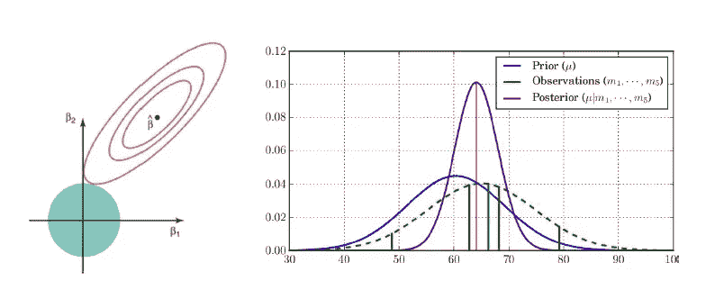
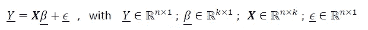
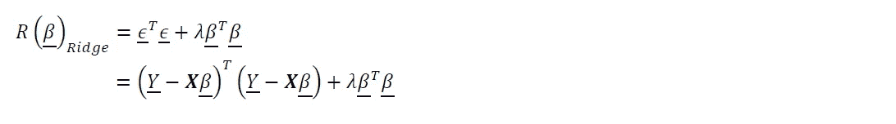
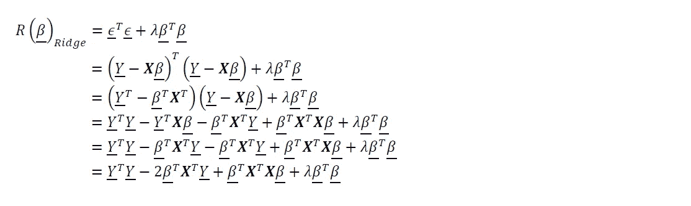
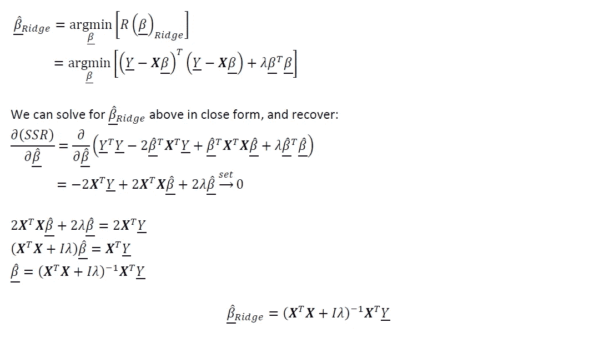
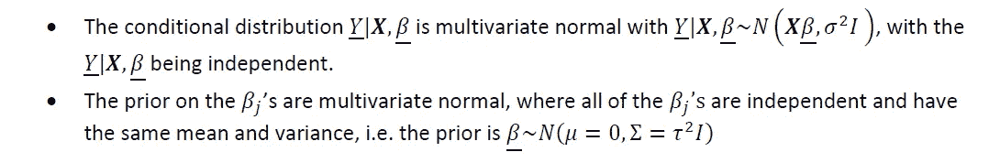
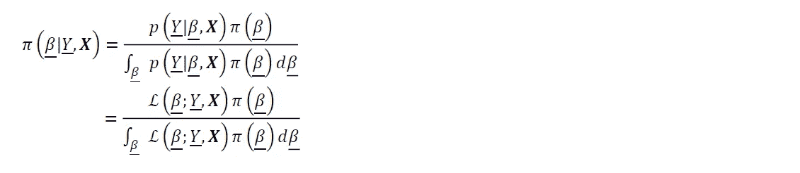
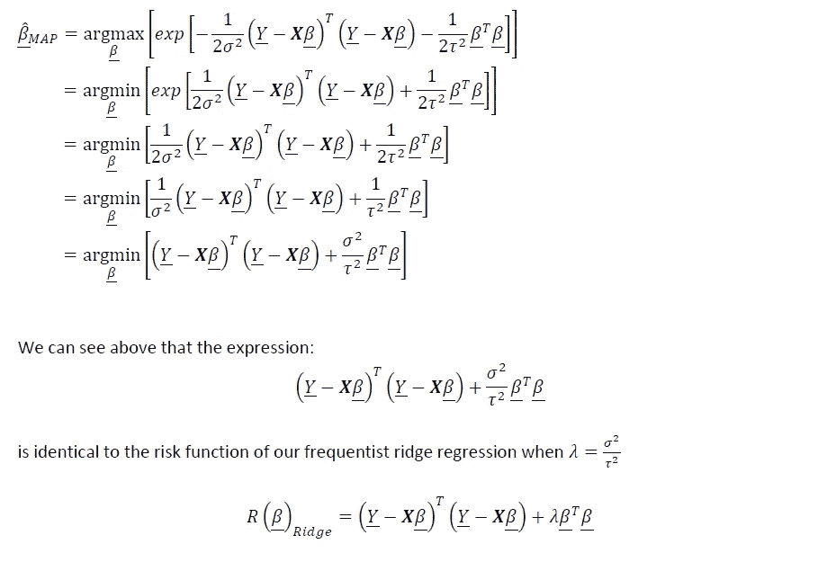

# 贝叶斯范式&岭回归

> 原文：<https://towardsdatascience.com/the-bayesian-paradigm-ridge-regression-418af128ae8c?source=collection_archive---------41----------------------->

## 有联系吗？

照片来自 [Adobe Stock Images](https://stock.adobe.com/)

这篇文章讨论了经典的“岭回归”和贝叶斯推理之间的联系，以及在某些条件下正则化在一个频繁的上下文中如何类似于在贝叶斯上下文中指定先验。

# 背景和动机

岭回归(也称为 Tikhonov 正则化)是一种经典的正则化技术，广泛用于统计和机器学习。在其经典形式中，岭回归本质上是普通最小二乘(OLS)线性回归，在风险函数中嵌入了可调的附加 L2 范数惩罚项。岭回归的发明最初是为了解决不适定的最小二乘问题，该问题在设计矩阵 **X** 的协变量中具有严重或完美的共线性(使矩阵从 **X** 的转置和自身的内积中变得严重不稳定或不可逆)。岭回归的实现“正则化”了所提到的不可逆矩阵，将其调整为可逆的，并为类似于 OLS 的参数估计提供了封闭形式的解决方案。

然而，在现代，岭回归最普遍地被用作统计学习和机器学习中经验风险最小化的通用工具；即，为了极大地减少用于预测的所述统计估计量的方差(从而提高效率),有目的地指定有偏统计估计量。

请注意，术语“岭惩罚”现在经常用于指在大多数统计模型(例如:逻辑回归、神经网络等)的风险函数中嵌入 L2 惩罚。然而，在本文中，我们使用的术语“岭回归”特指其经典定义(具有可调附加 L2 范数惩罚的 OLS)。

原来在经典的岭回归和贝叶斯推断之间是有联系的。一个我觉得有趣又有见地的。让我们首先从频率主义者的角度来探讨岭回归，然后提出一个具有一组特定条件的贝叶斯推断问题，并看看这两者是如何联系在一起的。

# **岭回归——频率主义范式:**

假设我们有一个加性线性模型(其中真正的函数形式是加性线性的):

我们正从一个频率主义者的范例开始工作，即β参数实际上是固定的。我们希望恢复β参数的估计值。然而，让我们假设我们在设计矩阵 **X** 中具有完美的共线性，或者我们对统计学习或机器学习问题感兴趣，并希望出于经验风险最小化的目的有目的地引入正则化。让我们指定岭回归的风险函数:

如上所示，我们有一个类似于 OLS 风险函数的东西，但是增加了一个附加项。让我们扩展一下:

为了求解岭估计量，我们有:

对于那些熟悉 OLS 估计量的人来说，你可以看到上面的岭估计量非常相似。一个区别是可调参数λ。在这种情况下，lambda 从 **X** 的转置和自身的内积中“正则化”矩阵，迫使其可逆。[对于那些想要推导和深入研究 OLS 估计量、高斯马尔可夫定理以及在不同条件下所需的假设的人，请参见我在此发表的文章](/ols-linear-regression-gauss-markov-blue-and-understanding-the-math-453d7cc630a5)。

# **线性回归——贝叶斯范式:**

假设我们有一个加性线性模型(其中真正的函数形式是加性线性的):

但是现在，我们从贝叶斯范式开始工作；事实上，我们不再认为β参数是固定的，而是随机变量。我们希望我们的模型符合数据，但需要指定一组β参数的先验。现在让我们考虑:

现在让我们求解后验分布:

请注意，在上面的术语中，分母只是一个归一化常数。我们可以考虑上面的后验分布的核:

根据上面的表达式，我们可以计算后验分布的模式，或最大后验概率(MAP)估计:

我们已经证明，在一定条件下，贝叶斯回归等价于频率主义范式下的岭回归。在某种意义上，我们可以把频率主义范式中的正则化看作是在某种程度上类似于在贝叶斯范式中指定先验的功能。

# 总结和最后的想法

希望以上有见地。正如我在以前的一些文章中提到的，我认为没有足够的人花时间去做这些类型的练习。对我来说，这种基于理论的洞察力让我在实践中更容易使用方法。我个人的目标是鼓励该领域的其他人采取类似的方法。我打算在未来写一些基础作品，所以请随时在[**【LinkedIn】**](http://www.linkedin.com/in/andrew-rothman-49739630)和 [**上与我联系，并在 Medium**](https://anr248.medium.com/) 上关注我的更新！