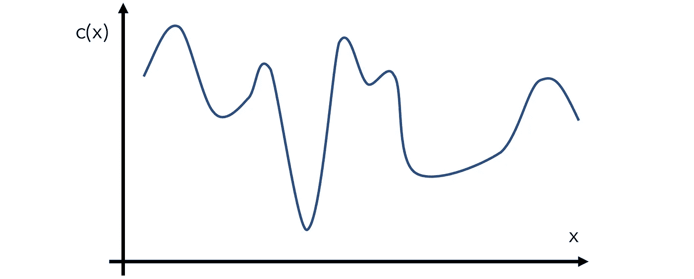
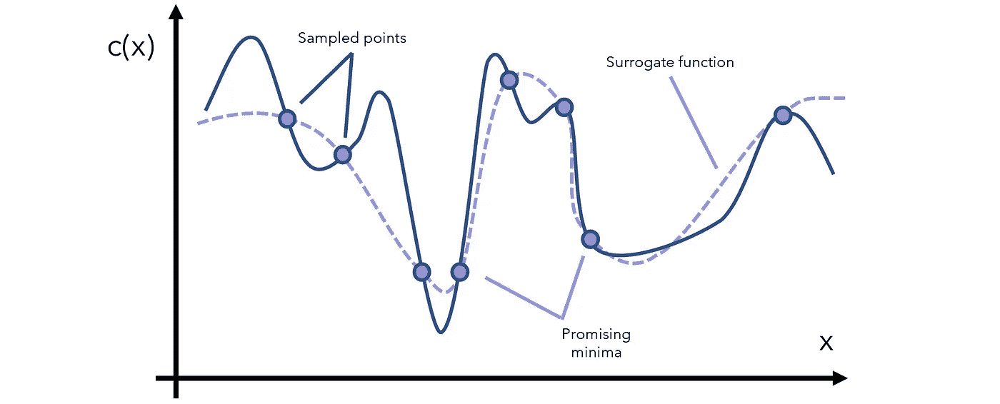
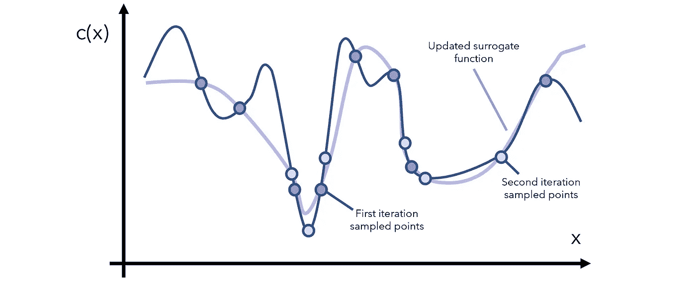
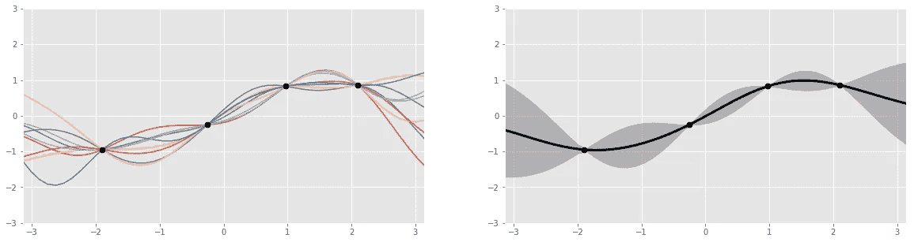

# 贝叶斯优化的美妙之处，用简单的术语解释

> 原文：<https://towardsdatascience.com/the-beauty-of-bayesian-optimization-explained-in-simple-terms-81f3ee13b10f?source=collection_archive---------2----------------------->

来源: [Unsplash](https://unsplash.com/photos/eZQ4gogZeOA)

## 巧妙算法背后的直觉

这里有一个函数: *f* ( *x* )。计算起来很贵，不一定是一个[解析表达式](https://en.wikipedia.org/wiki/Closed-form_expression#Analytic_expression)，也不知道它的导数。

你的任务是:找到全局最小值。

这肯定是一项困难的任务，比机器学习中的其他优化问题更困难。例如，梯度下降法[可以访问函数的导数](https://medium.com/analytics-vidhya/the-engine-of-the-neural-network-the-backpropagation-equation-cf2dd1be2477)，并利用数学捷径来加快表达式求值。

或者，在一些优化场景中，函数的评估成本很低。如果我们可以在几秒钟内获得数百个输入变量 *x* 的结果，那么可以使用简单的网格搜索，并获得良好的结果。

或者，可以使用一整套[非常规非梯度优化方法](https://medium.com/analytics-vidhya/the-fascinating-no-gradient-approach-to-neural-net-optimization-abb287f88c97)，如粒子群集或模拟退火。

可惜现在的任务没有这些奢侈品。我们的优化受到几个方面的限制，特别是:

*   算起来很贵。理想情况下，我们应该能够对函数进行足够的查询，以便从本质上复制它，但是我们的优化方法必须在有限的输入采样下工作。
*   导数未知。这就是为什么[梯度下降及其风格](/a-quick-guide-to-neural-network-optimizers-with-applications-in-keras-e4635dd1cca4)仍然是深度学习最受欢迎的方法，有时也是其他机器学习算法中最受欢迎的方法。知道导数给了优化器方向感——我们没有这个。
*   我们需要找到全局最小值，即使对于像梯度下降这样复杂的方法，这也是一个困难的任务。我们的模型需要某种机制来避免陷入局部最小值。

解决方案:贝叶斯优化，它提供了一个优雅的框架来处理类似于所描述的场景的问题，以最少的步骤找到全局最小值。

让我们构造一个函数 *c* ( *x* )的假设例子，或者给定一些输入的模型的成本 *x* 。当然，函数的样子对优化器来说是隐藏的；这就是 *c* ( *x* )的真实形状。这在行话中被称为“目标函数”。

贝叶斯优化通过一种称为代理优化的方法来完成这项任务。对于上下文，代理母亲是同意为另一个人生育孩子的女性——在上下文中，代理函数是目标函数的近似。

基于采样点形成代理函数。

基于代理函数，我们可以识别哪些点是有希望的最小值。我们决定从这些有希望的区域中采样更多的样本，并相应地更新代理函数。

每次迭代，我们继续查看当前的代理函数，通过采样了解更多感兴趣的领域，并更新函数。注意，替代函数将以评估成本低得多的方式进行数学表达(例如，`*y*=*x*`是更高成本函数的近似值，`*y=*arcsin((1-cos²*x*)/sin *x*)`在一定范围内)。

经过一定次数的迭代后，我们注定会达到一个全局最小值，除非函数的形状非常*怪异(因为它有很大且疯狂的上下波动),这时应该问一个比优化更好的问题:你的数据有什么问题？*

花点时间惊叹这种方法的美妙之处。它不对函数做任何假设(除了它首先是可优化的)，不需要关于导数的信息，并且能够通过巧妙使用不断更新的近似函数来使用常识推理。我们最初的目标函数的昂贵的评价根本不是问题。

这是一种基于代理的优化方法。那么到底是什么让它成为贝叶斯的呢？

[贝叶斯统计](/the-most-fundamental-and-controversial-debate-in-statistics-and-data-science-e8dd1bad737a?source=your_stories_page---------------------------)和建模的本质是根据新信息更新先前(先前)的信念，以产生更新的后验(“后”)信念。这正是代理优化在这种情况下所做的，所以它可以通过贝叶斯系统、[公式](/bayes-theorem-is-actually-an-intuitive-fraction-5f2803998006?source=your_stories_page---------------------------)和想法来最好地表示。

让我们更仔细地看看代理函数，它通常由高斯过程表示，可以认为是掷骰子，返回符合给定数据点(如 sin、log)的函数，而不是数字 1 到 6。该过程返回几个函数，这些函数都带有概率。

左图:四个数据点的几个高斯过程生成函数。右图:聚合的函数。来源:[奥斯卡 Knagg](/an-intuitive-guide-to-gaussian-processes-ec2f0b45c71d) ，图片免费分享。

[Oscar Knagg 的这篇文章](/an-intuitive-guide-to-gaussian-processes-ec2f0b45c71d)对 GPs 如何工作给出了很好的直觉。

有一个很好的理由为什么高斯过程，而不是一些其他的曲线拟合方法，被用来模拟代理函数:它是贝叶斯本质。GP 是一个概率分布，就像一个事件的最终结果的分布(例如，1/2 的机会掷硬币)，但是在所有可能的函数上。

例如，我们可以将当前数据集定义为 40%可由函数 *a* ( *x* )表示，10%可由函数 *b* ( *x* )表示，等等。通过将替代函数表示为概率分布，它可以通过固有的概率贝叶斯过程用新信息更新。也许当引入新信息时，函数 *a* ( *x* )只能表示 20%的数据。这些变化由[贝叶斯公式](/bayes-theorem-is-actually-an-intuitive-fraction-5f2803998006)控制。

比方说，用多项式回归拟合新的数据点，这将是困难的，甚至是不可能的。

代理函数——表示为概率分布，先验——用“获取函数”更新。在探索和开发的权衡中，该功能负责驱动新的测试点的提议:

*   *利用*寻求在替代模型预测有良好目标的地方进行采样。这是利用已知的有希望的地点。然而，如果我们已经对某个区域进行了足够的探索，那么继续利用已知的信息将会收效甚微。
*   *勘探*寻求在不确定性高的地方取样。这确保了空间中没有一个主要区域是未被探索的——全局最小值可能碰巧就在那里。

鼓励过多开发和过少探索的获取函数将导致模型只停留在它首先找到的最小值(通常是局部的——“只去有光的地方”)。首先，一个鼓励对立面的获取函数不会停留在局部或全局的最小值。在微妙的平衡中产生好的结果。

获取函数，我们将把它表示为 *a* ( *x* )，必须同时考虑开采和勘探。常见的获取函数包括预期改善和最大改善概率，所有这些都是在给定先验信息(高斯过程)的情况下，测量特定输入在未来可能产生回报的概率。

让我们把这些碎片拼在一起。贝叶斯优化可以这样执行:

1.  初始化高斯过程“代理函数”先验分布。
2.  选择几个数据点 *x* ，使得对当前先验分布进行操作的采集函数 *a* ( *x* )最大化。
3.  评估目标成本函数 *c* ( *x* )中的数据点 *x* 并获得结果， *y* 。
4.  用新数据更新高斯过程先验分布以产生后验分布(它将成为下一步中的先验)。
5.  重复步骤 2–5，进行多次迭代。
6.  解释当前的高斯过程分布(这样做很便宜)以找到全局最小值。

贝叶斯优化就是把概率的想法放在代理优化的想法后面。这两个想法的结合创造了一个具有许多应用的强大系统，从[药物产品开发](https://link.springer.com/article/10.1007/s12247-019-09382-8)到[自动驾驶汽车](https://www.youtube.com/watch?v=yeDGP5yKzf8)。

然而，在机器学习中最常见的是，[贝叶斯优化用于超参数优化](/4-python-automl-libraries-every-data-scientist-should-know-680ff5d6ad08)。例如，如果我们正在训练一个梯度推进分类器，有几十个参数，从学习率到最大深度到最小杂质分裂值。在这种情况下， *x* 表示模型的超参数， *c* ( *x* )表示模型的性能，给定超参数 *x.*

使用贝叶斯优化的主要动机是在评估输出非常昂贵的情况下。首先，需要用这些参数构建一个完整的树集合，其次，它们需要运行几次预测，这对集合来说是昂贵的。

可以说，对于给定的一组参数，神经网络评估损失更快:简单地重复矩阵乘法，这非常快，尤其是在专用硬件上。这是使用梯度下降的原因之一，梯度下降会进行重复查询以了解它的去向。

总而言之:

*   代理优化使用代理或近似函数，通过采样来估计目标函数。
*   贝叶斯优化通过将代理函数表示为概率分布，将代理优化置于概率框架中，概率分布可以根据新信息进行更新。
*   获取函数用于评估探索空间中某一点将产生“良好”回报的概率，给出当前已知的先验知识，平衡探索与开发。
*   当目标函数的评估成本很高时，主要使用贝叶斯优化，通常用于超参数调整。(这个有很多像 HyperOpt 这样的库。)

感谢阅读！

 [## 蒙特卡罗方法，变得简单

### 用混乱来寻找清晰

towardsdatascience.com](/monte-carlo-methods-made-simple-91758ba58dde) 

*除非另有说明，所有图片均由作者创作。*