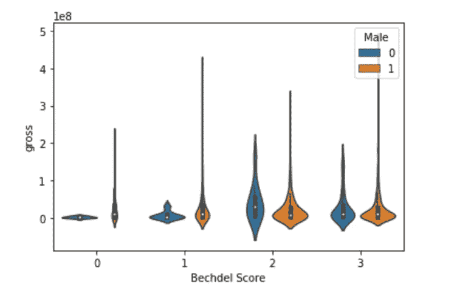

# 贝克德尔测试:分析好莱坞的性别差异

> 原文：<https://towardsdatascience.com/the-bechdel-test-analyzing-gender-disparity-in-hollywood-263cd4bcd9d?source=collection_archive---------16----------------------->

## 使用数据分析技术可视化好莱坞的性别不平等

**什么是贝氏测验？**

贝克德尔测试是以漫画家艾莉森·贝克德尔的名字命名的，她在 1985 年的一个连环漫画中提出了这个想法。要通过测试，故事需要具备:

*   至少两个女人
*   女人们需要互相交流
*   他们需要彼此谈论除了男人以外的东西


照片由[弗兰·霍根](https://unsplash.com/@franagain?utm_source=unsplash&utm_medium=referral&utm_content=creditCopyText)在 [Unsplash](https://unsplash.com/s/photos/women-talking?utm_source=unsplash&utm_medium=referral&utm_content=creditCopyText) 上拍摄

我第一次听说 Bechdel 测试是在看《简·处女》的时候，它引起了我的兴趣。对我来说，测试的标准似乎太低了，电影应该很容易通过。

然而，一个简单的谷歌搜索告诉我不是这样。显然，有大量的电影没有满足通过 Bechdel 测试的要求，包括:

*   贫民窟的百万富翁
*   弱点
*   泰山
*   《模仿游戏》
*   社交网络

读了一些关于 Bechdel 考试的资料后，我受到了启发。我决定对电影数据集进行数据分析，以检查它们是否通过了测试！

**数据问题**

我的目的是从各种不同的来源收集数据，并回答以下关于 Bechdel 测试的问题:

1.  这些年电影的 Bechdel 分数有提高吗？
2.  IMDB 评分越高的电影，Bechdel 评分就越高吗？
3.  有女导演的电影是不是 Bechdel 分数更高？
4.  一部电影的预算对其 Bechdel 评分有影响吗？
5.  Bechdel 分数较高的电影会产生较大的收入吗？

**数据收集**

我从三个不同的来源收集数据:[bechdeltest.com](https://bechdeltest.com/)、[卡格尔](https://www.kaggle.com/rounakbanik/the-movies-dataset)和[这个电影数据集](https://cran.r-project.org/web/packages/ggplot2movies/index.html)。

**数据分析**

我将使用 Python 来执行所有的数据分析和可视化。

首先，我使用了来自 bechdeltest.com 的数据，因为他们的 API 很容易获取。

```
# imports
import urllib, json
import pandas as pddf = pd.read_json('[http://bechdeltest.com/api/v1/getAllMovies'](http://bechdeltest.com/api/v1/getAllMovies'))
```

现在，我将看看数据帧的头部:

```
df.head()
```


作者图片

数据框中有五个变量:

*   评分:电影的 Bechdel 评分从 0 到 3。Bechdel 分数低于 3 表示电影没有通过 Bechdel 测试，Bechdel 分数为 3 表示电影通过。
*   imdbid:电影的 IMDB 编号
*   标题:电影标题
*   id:唯一的电影 ID
*   年份:电影上映的年份

看一下“年份”一栏，你可以看到有 19 世纪的电影，其中很多电影的贝克德尔分数为 0。

我将为 1967 年以后发行的电影创建一个新的数据框，并将在我的其余分析中使用这个新的数据框。

```
dfNew = df[df['year']>=1967]
```

看看新的数据框:

```
dfNew.head()
```


作者图片

我现在将把列“rating”重命名为“Bechdel Score ”,以便于后面的分析。

```
dfNew.rename(columns={'rating':'Bechdel Score'}, inplace=True)
```

现在，我将把“year”列转换成 datetime 对象。

```
dfNew['year'] = pd.to_datetime(dfNew['year'], format='%Y')
```

接下来，我将把 Bechdel 分数改为分类变量。

```
dfNew['Bechdel Score'] = dfNew['Bechdel Score'].astype('category',copy=False)
```

最后，数据准备好了，可以用来做一些数据可视化。

我将首先使用 Seaborn 创建一个计数图，以可视化 Bechdel 分数。

```
sns.countplot(x='Bechdel Score',data=dfNew)
```


作者图片

1967 年以后的大部分电影看起来都有更高的 Bechdel 分数，但是他们通过 Bechdel 测试了吗？

```
li = []
for i in dfNew['Bechdel Score']:
    if(i<3):
        li.append(0)
    else:
        li.append(1)
dfNew['pass_test'] = li
dfNew
```


作者图片

现在有一个数据帧叫做 pass test，所有通过 Bechdel 测试的电影取值为 1，没有通过的电影取值为 0。

我将使用 Seaborn 来可视化这个。

```
sns.countplot(x='pass_test',data=dfNew)
```


作者图片

自 1967 年以来，通过贝克德尔测试的电影比没有通过测试的电影多。

然而，这种差异并不像我预期的那样显著。似乎仍然有非常多的电影没有通过测试。

现在，我将看看 Bechdel 分数如何随时间变化。

女性在电影业的代表性有所提高吗？事情还是一样吗？他们恶化了吗？

为此，我将使用 Plotnine 库。

```
from plotnine import *(ggplot(dfNew)+geom_point(aes('year',color=dfNew['Bechdel Score']),stat='count',show_legend=False)+geom_line(aes('year',color=dfNew['Bechdel Score']),stat='count',show_legend=False))
```


作者图片

在 20 世纪 70 年代和 80 年代，有几部电影通过了贝克德尔测试。在这段时间里，通过测试的电影和没有通过测试的电影没有明显的区别。

在 20 世纪 80 年代和 90 年代之后的几年里，通过贝克德尔测试的电影数量激增，进入 21 世纪后，情况有了很大改善。

现在，我想形象化 IMDB 评级和 Bechdel 分数之间的关系。是 Bechdel 分数越高的电影更有可能获得更高的 IMDB 评分，还是相反？

为此，我将使用名为 movies.csv 的不同数据集，并将其与现有数据框合并。

```
imdb = pd.read_csv('movies.csv')
imdbNew = imdb[['title','rating']]dfNew = pd.merge(dfNew, imdbNew, how='left', left_on=['title'], right_on=['title'])dfNew.head()
```


作者图片

数据帧中的“分级”栏代表 IMBD 电影的分级。该列有几个空值，这些行将被删除。

然后，我将创建一个只有年份、Bechdel 分数和 IMDB 评级的新数据框，这样我就可以直观地看到这三者之间的关系。

```
# Dropping rows with null values:
dfNew = dfNew.dropna()dfNew = dfNew.drop('id',axis=1)# Creating a new dataframe with only year, Bechdel scores, and imdb rating:
new = dfNew.groupby(['year','Bechdel Score']).agg({'rating':'mean'}).reset_index()new.head()
```


作者图片

完美！现在，我将想象这种关系:

```
# Plot year against IMDB rating and Bechdel Score:ggplot(new,aes(x='year',y='rating',color='Bechdel Score'))+ geom_point()+geom_smooth()+scale_y_continuous(name="imdb rating")+labs( colour='Bechdel Score' )
```


作者图片

看起来似乎通过 Bechdel 测试的电影比没有通过测试的电影的 IMDB 评分低得多，这让我很惊讶。

现在，我将试着形象化导演的性别和 Bechdel 分数之间的关系。我假设有女性导演的电影更有可能有更高的 Bechdel 分数，我将在这里尝试绘制。

为此，我将使用来自 Kaggle 的不同电影数据集。然后，我将使用性别预测库根据导演的名字来预测导演的性别，并将其与之前的数据帧合并。

```
import gender_guesser.detector as gen
latest = pd.read_csv('movielatest.csv',encoding = "latin")dfLatest = latest[['name','director']]
dfLatest.rename(columns={'name':'title'}, inplace=True)
dfLatest = pd.merge(dfNew, dfLatest, how='left', left_on=['title'], right_on=['title'])dfLatest = dfLatest.dropna()
dfLatest.head()
```


作者图片

新创建的数据框中现在有一个额外的变量；导演。现在，我将尝试根据名字预测导演的性别，并将其附加到数据框中。

```
# Predicting gender of director from first name:d = gen.Detector()
genders = []
firstNames = dfLatest['director'].str.split().str.get(0)
for i in firstNames[0:len(firstNames)]:
    if d.get_gender(i) == 'male':
        genders.append('male')
    elif d.get_gender(i) == 'female':
        genders.append('female')
    else:
        genders.append('unknown')
dfLatest['gender'] = genders
dfLatest = dfLatest[dfLatest['gender'] != 'unknown']# Encode the variable gender into a new dataframe:
dfLatest['Male'] = dfLatest['gender'].map( {'male':1, 'female':0} )dfLatest.head()
```


作者图片

数据帧有两个附加变量；性别和男性。性别代表导演的性别。如果导演是男性，变量 male 的值为 1，如果导演是女性，变量 male 的值为 0。

现在我有了这些信息，我将继续想象数据中更多的趋势。

我将创建一个变量性别的计数图，以直观显示数据集中男性与女性的数量:

```
sns.countplot(x='gender',data=dfLatest)
```


作者图片

似乎数据集中几乎所有的电影都有男性导演。这也是我预料到的事情，因为众所周知，好莱坞雇佣的女导演非常少。

接下来我会用 Bechdel 评分来可视化导演的性别，看看有女导演的电影是不是评分更高。

```
sns.countplot(x='Bechdel Score',hue='gender',data=dfLatest)
```


作者图片

```
ggplot(aes(x = 'year', y = 'Bechdel Score',color='gender'), data = dfLatest)+geom_point()
```


作者图片

几乎所有有女导演的电影似乎都通过了贝克德尔测试！

接下来，我将看看可变预算，看看电影的预算和它的 Bechdel 分数之间是否有某种相关性。

```
dfLatest['budget']=latest['budget']ggplot(aes(x='year', y='budget',color='Bechdel Score'), data = dfLatest)+geom_point()+geom_smooth()
```


作者图片

这里可以看到的一件事是，随着时间的推移，一部电影的预算显著增加。此外，通过贝克德尔测试的电影似乎比得分为零的电影预算略高，但在这里没有观察到强相关性。

现在，我将设想预算和主管性别之间的关系:

```
ggplot(aes(x = 'year', y = 'budget',color='gender'), data = dfLatest)+geom_point()+geom_smooth()
```


作者图片

导演的性别似乎对电影的预算没有任何关系或影响。

将电影预算、贝克德尔分数和导演性别之间的关系可视化:

```
sns.violinplot(x='Bechdel Score',y='budget',hue='Male',data=dfLatest)
```


作者图片

接下来，我将想象一部电影的类型和贝克德尔分数，以及任何随时间的变化。

```
dfLatest['genre'] = latest['genre']
ggplot(aes(x = 'year', y = 'genre',color='Bechdel Score'), data = dfLatest)+geom_point()
```


作者图片

最后，我将看看电影票房，以及年份、Bechdel 分数和性别:

```
dfLatest['gross'] = latest['gross']# Movie grossing with Bechdel score and gender:
sns.violinplot(x='Bechdel Score',y='gross',hue='Male',data=dfLatest)
```



作者图片

```
# Movie grossing with year and gender:ggplot(aes(x = 'year', y = 'gross',color='gender'), data = dfLatest)+geom_point()
```


作者图片

就是这样！我设法将各种关系可视化，并回答了我着手寻找答案的所有数据问题。

一些有趣的数据发现包括:

1.  没有通过 Bechdel 测试的电影往往有更高的 IMDB 评级。
2.  这些年来，越来越多的电影通过了贝克德尔测试。
3.  有女导演的电影，Bechdel 分更高。
4.  一部电影的预算或收入与其 Bechdel 评分之间没有明显的相关性。

当然，这个分析仅仅是根据我从三个地方收集的数据进行的，可能并不能代表电影的全部。

此外，可能还有其他变量会影响此分析的结果，在得出结论之前，用其他地方的数据进行实验可能是个好主意。

最后，我想提一下，Bechdel 测试不一定是衡量电影中女性代表性的最佳基准。它没有考虑女性角色写得有多好，也没有衡量角色有意义的深度。

然而，这是用来揭露性别偏见的最著名的指标之一，也是我们拥有这类数据的唯一测试。

数据集和完整的代码可以在[这里](https://github.com/Natassha/Bechdel-Test)找到。