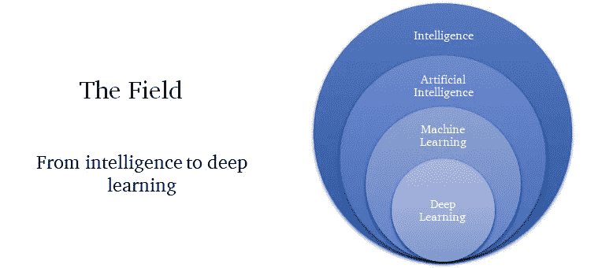
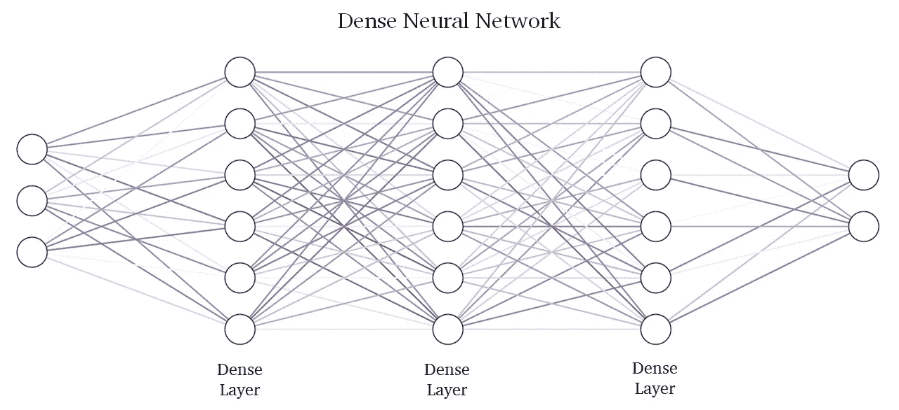

# 神经网络术语词汇表

> 原文：<https://towardsdatascience.com/the-beginners-glossary-of-neural-network-terms-a9617354078?source=collection_archive---------23----------------------->

## 深度学习术语的简短浏览

照片由 [Aaron Burden](https://unsplash.com/@aaronburden?utm_source=medium&utm_medium=referral) 在 [Unsplash](https://unsplash.com?utm_source=medium&utm_medium=referral)

O 对于数据科学和深度学习的新手来说，最大的障碍之一是即使是最入门的课程也有大量的术语。该领域有一个陡峭的学习曲线，因为大多数概念是相互交织和互补的。更糟糕的是，大多数新人几乎没有机器学习背景，这使得任务更加困难。在本文中，我将按顺序分解 field 的一些最重要的概念，将每个新术语与最后一个术语联系起来。

让我们从…的定义开始

围绕“深度学习”的术语层级

智力:[迄今为止，智力还没有一个公认的定义](https://en.wikipedia.org/wiki/Intelligence#Definitions)。这个定义是一个正在进行的辩论，它跨越了广泛的领域和学科，如哲学、心理学、社会学和计算机科学。然而，尽管没有广泛接受的定义，科学几十年来一直试图模仿智能，创造…

**人工智能(AI):** 计算机科学中研究机器“智能行为”的领域。换句话说，系统以不可预测的方式运行。对自身和周围世界做出反应和(似乎)推理的系统。这个定义是模糊的，因为我们甚至不能正确地定义智力。然而，我们可以定义的东西是学习，它把我们带到…

**机器学习(ML):** 向算法显示问题的输入和输出，并让它学习如何解决问题的任务。例如，创建一种算法，通过向它展示数百张宠物照片来识别照片中的狗和猫。在 ML 内部，一种不断发展的方法是:

**深度学习(DL):** 将多个学习算法叠加起来共同解决一个困难任务的思想。当我们是孩子的时候，我们学习字母表，然后我们学习阅读简单的单词，然后是完整的句子，等等。有了实践，我们就在看书，形成观点。在字母和流利之间，涉及几个学习步骤。在模仿中，深度学习算法通过将任务分解为连续的问题来进行学习，每个问题都建立了一个更高的抽象水平。

在实践中，DL 和 ML 算法经常是选择的工具…

**数据科学(DS):** 对数据的研究，如获取、清理、存储、查看和处理数据。一个常见的误解是，DL 和 DS 是一样的东西，因为许多 DS 课程突出了 DL。ML 和 DL 是数据科学家的*工具*，SQL、NumPy 和等也是如此。

**数据工程、数据分析、数据分析、认知计算:**这个领域充满了鲜为人知的同义词和令人困惑的术语。有些似乎只是为了听起来新鲜而存在，有些则是为了引用 DS 中的特定任务。例如，“分析”通常是指探索性的分析，而“工程”是指为生产用途实现系统。每当有疑问时，坚持使用广泛使用的术语，例如“数据科学”。

一个样本全连接神经网络。用 [NN-SVG](http://alexlenail.me/NN-SVG/LeNet.html) 工具构建的可视化。

**人工神经网络(NN):** 在实现深度学习的几种方法中，神经网络是迄今为止最受欢迎的。简而言之，它们是一堆简单的学习算法(称为层)，依次处理输入，产生输出。这体现了通过设计进行深度学习的思想，因为每一层都学习对输入的更精确的理解。

**网络层:**所有的神经网络都是由层组成的(如上图所示)。层定义了一个操作，它接受一些输入、一些参数，并产生一组输出。例如……

**密集层:**是接收一个矢量(输入)并将其乘以一个矩阵(参数)，产生另一个矢量(输出)的层。虽然这是实践中最广泛使用的层之一，但它有一个问题，那就是:

**线性**:当一个事物可以分解成独立的部分时，它就是线性的，这使得它们易于研究。然而，*一个线性系统并不比组成它的部件更有趣*。“A+B”并不比“A”和“B”本身更有趣。这遭到了以下人士的反对:

**非线性:**当一个系统的各个部分交织成一个复杂的整体时，这个系统就是非线性的。非线性系统不容易分解。因此，*整体大于部分之和*。例如，“正弦(A + B)”不能分解为“A”项和“B”项。幸运的是，任何线性系统都可以通过一种方法变成非线性的

**激活功能:**这些是在 DL 中使用的普通非线性功能，其唯一目的是接收输入并使其非线性。在上面的例子中，我们通过使用*正弦*函数使“A + B”非线性。在 DL 中，最著名的激活函数是:

**ReLU:** 缺整流线性单位，定义为 ReLU(x) = max(0，x)。这是制作非线性的最简单(也是最有效)的方法之一。这就是它如此受欢迎的原因:它简单快捷。结合密集层和 ReLU 激活，我们可以建立一个…

**密集网络/全连接网络/多层感知器:**这些都是基本神经网络的同义词:交织着激活函数的密集层的集合。需要强调的是，如果没有激活功能，网络就不会比单一的致密层更有趣。非线性是一种粘合剂，它能从普通零件中创造出强大的模型。

在神经网络的同义词中，有一个具有历史意义…

**感知器模型:**1958 年， [Frank Rosenblatt](https://en.wikipedia.org/wiki/Frank_Rosenblatt) 创造了一个神经元的计算模型:感知器，它是后来大多数事物的基础。简单地说，感知器是一个加权和，后面跟着一个激活函数。形式上，P(x；w) = a(x ⋅ w)。这意味着感知器*接收*一个“x”向量，*拥有*一组权重“w”，而*计算*x 与“w”的点积(加权和)，并将其馈送给激活函数“a”。

**密集层(重访):**如果一个输入被一次馈送到许多感知器，如上图所示，我们可以通过将每个感知器的权重“连接”为一个矩阵来简化数学，创建密集层:D(x；W) = a(x ⋅ W)。使用这个定义，我们可以通过将一个密集层的结果输入到另一个密集层来构建一个两层网络，比如:D(D(x；w₁)；W₂) = a(a(x ⋅ W₁)⋅W₂).这展示了一个重要的概念:*神经网络只是数学函数。*

在这个表达中，我们还没有注意到的是…

**权重:**机器学习模型定义了一个由一组“权重”引导的“操作”。通过改变模型的权重，我们能够让它做不同的事情。例如，我们可以训练同一个网络来识别猫和狗或者鸟和鱼。改变的是权重，而不是网络。这就把我们带到了…

通过提高权重使算法学习的过程

**训练:**实际的“学习”是由训练循环执行的。简而言之，训练意味着向模型提供输入，收集其输出，将它们与预期输出进行比较，并改变权重以校正输出。这个过程的主要组成部分是…

**损失函数:**损失或误差是一个度量模型“错误性”的函数。实际上，我们想要的只是减少模型的损失。换句话说，我们希望它们尽可能正确。为了实现这一点，我们使用一种数学工具，称为…

**梯度下降:**给定一个模型“M”，它的权重“θ”，输入“x”，期望输出“y”和一个损失函数“L”，我们可以*通过考虑“L(y，M(x；θ))”，被称为“∇L".这个“∇L”表示损耗如何随着θ的变化而变化。因此，为了减少损失，我们从θ中减去∇L。这一过程创造了一个“改进的θ”。如果我们一遍又一遍地重复这个过程，我们会得到…*

**纪元:**每次我们用我们拥有的每一个数据例子来训练我们的模型，我们就完成了一个“纪元”。模型通常被训练几十到几百个时期，直到它们的损失减少到很小的值。

**反向传播:**如果你不熟悉数学，上面的过程相当复杂，但是，我提出了一个简化的版本。完整的版本被称为反向传播，并且具有额外的复杂性，即每一层都有其自己的梯度(而不是如所呈现的整个模型的单一梯度)。在这种情况下，需要了解的一些术语是:

**SGD / RMSprop / Adam / Nadam /拉达姆/ Ranger / etc** :这些是*优化器*:增强反向传播的算法，使其更快更好。理解这些方法是一个高级主题。实际上，每个人 95%的时间都在使用 Adam。另一个需要了解的有用术语是…

**学习率:**在训练过程中，最好以小步更新权重。虽然这似乎违背直觉，但它改善了收敛性。常用值为 0.01、0.001 和 0.0001。学习率通常是优化器的一个参数。培训期间的另一个常见做法是将其分成…

**批处理:**我们的数据常常超出了内存或 GPU 的容量。因此，我们不能计算所有例子的梯度。相反，我们可以为一个小的子集(一个*批次*)计算并应用它。例如，一千个例子可以分成十六批 64 个元素，产生十六个训练梯度。

T21:目前就这些了。如果你真的想学习深度学习，这个(简短的)总结中遗漏了许多其他术语。特别是我没有冒险进入卷积神经网络的神奇世界，它有很多很多的名字，比如卷积，池化，块，还有几种广泛流行的架构，比如 ResNets，MobileNets，InceptionNets 等等。

其中几个术语也揭示了整个世界的可能性。当我讨论损失函数是什么的时候，我们甚至没有触及它的表面。激活功能也是如此。

正如在开始时提到的，这篇文章是作为一个介绍，涵盖了大多数的基本方面，其他一切都是建立在这些方面之上的。我希望对你来说这是一个有趣的阅读，就像我写的一样有趣。

如果您对本文有任何问题，请随时发表评论或与我联系。如果你刚接触媒体，我强烈推荐[订阅](https://ygorserpa.medium.com/membership)。对于数据和 IT 专业人士来说，中型文章是 [StackOverflow](https://stackoverflow.com/) 的完美搭档，对于新手来说更是如此。注册时请考虑使用[我的会员链接。](https://ygorserpa.medium.com/membership)

感谢阅读:)