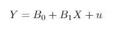
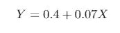
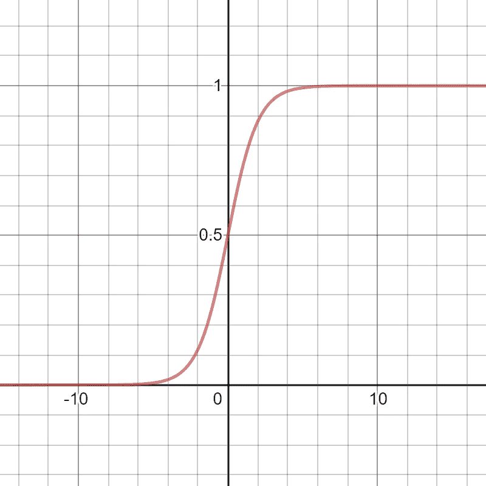
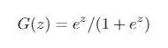
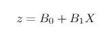
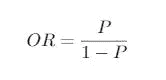
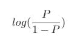

# 逻辑回归初学者指南

> 原文：<https://towardsdatascience.com/the-beginners-guide-to-logistic-regression-part-1-920eda7aea5f?source=collection_archive---------21----------------------->

## 数学和理解之旅

照片由 [Gia Oris](https://unsplash.com/@giabyte?utm_source=unsplash&utm_medium=referral&utm_content=creditCopyText) 在 [Unsplash](https://unsplash.com/s/photos/start?utm_source=unsplash&utm_medium=referral&utm_content=creditCopyText) 上拍摄

逻辑回归是本科统计学学生学习使用的第一个二元反应模型。这也是 MOOCs 教授给有抱负的数据科学家的第一个分类算法。

逻辑回归如此流行有几个原因:

1.  这很容易理解。
2.  它只需要几行代码。
3.  这是对二元反应模型的很好的介绍。

在本文中，我将解释逻辑回归背后的数学原理，包括如何解释逻辑回归模型的系数，并解释逻辑回归相对于更简单的*方法的优势。*

# 用回归估计概率的初级读本

在深入研究逻辑回归之前，让我们首先讨论一个更简单但直观上相似的模型:

## **线性概率模型(LPM)。**

线性概率模型与回归模型相同，除了一个关键的区别:

*回归模型的因变量是连续的，而 LPM 的因变量是二元的*。

如果我们有一个独立变量，那么我们的 LPM 是

作者图片

其中 *Y* 为二元响应变量， *X* 为自变量， *u* 为误差项。

*X* 每变化一个单位， *Y* 等于 1 的概率就变化 *B1* 。如果 *X* 等于 0，那么 *Y* 等于 1 的概率就是 *B0* 。

让我们用一个实际的例子。假设如果一个人有工作，Y 等于 1，如果没有工作，Y 等于 0。 *X* 是他们接受大专教育的年限。

我们进行回归，估计 *B1* 等于 0.07，而 *B0* 等于 0.4。也就是说，

作者图片

如果一个人受过一年的大专教育，那么他有 47%的概率找到工作。如果一个人接受了两年的大专教育，那么他找到工作的概率会增加 7 个百分点(高达 54%)。

一个没有受过高等教育的人有 40%的概率找到工作。

> 线性概率模型的优点是易于解释。然而，LPM 有两个主要缺点，这使得它不能用于任何严肃的研究。

**首先**，如果一个人接受了十年的大专教育(他们已经完成了学士和博士学位)，会发生什么？

**这样的话，这个人有 110%的概率找到工作！**

人们很容易将这一估计解读为，拥有博士学位会让我们过得更好；但是，记住概率只能在 0%到 100%之间。超出这个区间的概率是没有意义的。

线性概率模型的第二个问题是，它们假设 *Y* 等于 1 的概率变化是恒定的。

也就是说，一个受过三年大专教育，然后完成第四年(他们刚刚从学士学位毕业)的人找到工作的概率与受过四年大专教育的人相同，然后完成第五年(他们刚刚从硕士学位毕业)。

这可能不是真的。与获得学士学位相比，获得硕士学位可能会给就业带来更大的变化(或者我们希望如此)。

逻辑回归模型解决了线性概率模型的所有问题。

# **逻辑回归**

## 逻辑回归的图形和方程

逻辑回归如下图所示:

作者图片(德斯莫斯)

上图明确了逻辑回归的几个要点。

**首先是**， **logistic 回归是*非线性*，**。更专业地说，*因变量的变化取决于*自变量的*值，*和*斜率系数。*

第二，逻辑回归的范围(因变量可以取的可能值的区间)被限制在 0 和 1 之间，不包括 0 和 1。因此，逻辑回归避免了概率小于 0%或大于 100%的问题。

如果我们有一个独立变量，那么逻辑回归方程是:

作者图片

在哪里

作者图片

逻辑回归模型在以下情况下增长最快:

1.  z = 0
2.  G(z)接近 0(当 z 接近负无穷大时)
3.  G(z)接近 1(当 z 接近正无穷大时)

第三，逻辑回归不要求同方差(与自变量无关的误差)或高斯误差是精确的。

## 解释逻辑回归的系数

逻辑回归的系数被解释为“对数优势”。对数比值是应用于比值比的自然对数变换。

我们以前见过赔率比(它们在博彩领域很常见)。

例如，假设我们在一场赛马中。

马修·施瓦茨在 [Unsplash](https://unsplash.com/s/photos/horse-racing?utm_source=unsplash&utm_medium=referral&utm_content=creditCopyText) 上的照片

“慢吞吞的那匹马”赢这场比赛的赔率是 1:10。

因此，慢吞吞的马输掉比赛的可能性是赢得比赛的可能性的十倍。

我们可以把比值比，*或，*写成:

作者图片

其中 *P* 是成功的概率，给定 *X* 的值。

对比值比应用自然对数变换，我们得到:

作者图片

让我们回到第一个例子，如果我们有工作，我们的因变量等于 1，如果我们失业，我们的因变量等于 0。自变量是中学后教育的年数。

我们估计了逻辑回归，发现大专教育年数的斜率估计值等于 3。因此，大专教育每增加一年，对数优势增加 3。

**这是什么意思？**

如果 *log* ( *或* ) = 3，那么我们可以对两边取幂得到

*OR = e*

因此，赔率约为 20.1。这告诉我们，一个完成五年大专教育的人找到工作的可能性是完成四年教育的人的二十倍。

随着对照组之间的差异扩大，成功的几率呈指数增长。例如，一个受过六年大专教育的人比一个完成了四年教育的人更有可能找到工作 *400 倍*(在这个虚构的例子中，几率是极端的，但它表达了这一点)。

换句话说，赔率的差异等于

*比较组间的 OR^(Difference)。*

## 逻辑回归假设

逻辑回归模型假设事件的概率可以用 sigmoid 函数(上图中的 S 曲线)来模拟。如果你有任何理由相信概率不遵循 S 曲线，那么你不应该使用逻辑回归函数。

# 结论

在这篇文章中，我们回顾了逻辑回归的假设，它背后的数学，以及它相对于线性概率模型的优势。

在另一篇文章中(谁知道什么时候？)，我将解释如何使用二元和连续自变量的逻辑回归。我还将解释受试者操作特征(ROC)，这是说明逻辑回归(以及其他二元响应模型)诊断能力的常用工具。

每当我有一个二元因变量时，我就使用逻辑回归。对于分类问题*和*来说，这是一个生成因果洞察的强大工具。希望本文鼓励您在下一个数据科学项目中使用它！