# 贝尔曼方程

> 原文：<https://towardsdatascience.com/the-bellman-equation-59258a0d3fa7?source=collection_archive---------0----------------------->

## [深度强化学习讲解— 08](https://towardsdatascience.com/tagged/deep-r-l-explained)

## 解释了 v 函数和 Q 函数

在[的上一篇文章](/cross-entropy-method-performance-analysis-161a5faef5fc)中，我们已经能够用冰湖环境的例子来检验交叉熵方法的局限性。继续这一系列逐渐增加知识的风格，在本帖中，我们将呈现另一种类型的代理，它允许我们解决前面的问题。这些是所谓的**基于价值的代理**，它们存储**价值函数**，并以此为基础做出决策。为此，我们将介绍**贝尔曼方程**，这是许多强化学习算法的核心要素之一，也是本文计算价值函数所必需的。

> [本出版物的西班牙语版本](https://medium.com/aprendizaje-por-refuerzo/3-funciones-de-valor-y-la-ecuaci%C3%B3n-de-bellman-7b0ebfac2be1)

 [## 3.英勇勋章和贝尔曼勋章

### 访问第 3 页的自由介绍

medium.com](https://medium.com/aprendizaje-por-refuerzo/3-funciones-de-valor-y-la-ecuaci%C3%B3n-de-bellman-7b0ebfac2be1) 

# 基于价值的代理

请记住，代理的目标是找到一系列将使回报最大化的行动:在一集或代理的整个生命周期中的奖励总和(折扣或不折扣——取决于 gamma 的值),取决于任务。

在连续任务中，这是无穷大。我们可以借助[文章 2](/drl-02-formalization-of-a-reinforcement-learning-problem-108b52ebfd9a) 中已经介绍的折扣系数来解决这个问题，折扣系数在[0:1]范围内。在时间步 ***t*** 贴现**收益 *G*** 的公式如下:

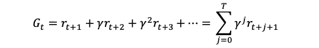

虽然和仍然是无穷大，但如果***γ****<1*，那么 ***Gt*** 就会有一个有限值。如果***γ****= 0*，代理人只对眼前的回报感兴趣，舍弃了长期的回报。反之，如果***γ****= 1*，则代理人会认为所有未来的奖励等于眼前的奖励。

我们可以用递归关系改写这个等式:

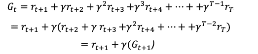

简而言之，代理必须能够利用我们已经能够用这个 **Return *G*** 表达的信息来做出他们的决定。我们也把这个表达式称为**贴现回报。**

几乎所有由代理执行的强化学习算法都涉及估计值函数——状态或状态-动作对的函数。这些就是所谓的**基于价值的代理。**

一个**价值函数**根据收益**G来估计代理处于给定状态有多好(或者在给定状态下执行给定动作有多好)。注意，代理的返回 ***G*** 可能取决于它将采取的动作。相应地，在[帖子 2](/drl-02-formalization-of-a-reinforcement-learning-problem-108b52ebfd9a) 中引入的价值函数是根据特定的行为方式定义的，称为策略，通常由𝜋.表示**

# V 函数:国家的价值

我们要介绍的第一个价值函数是 V 函数。总的来说，我们可以说 V-function 回答了**“**从这里期待什么？”。

更正式的说法是， **V 函数**，也被称为**状态值函数**，甚至是**值函数**，或者简称为 ***V*** ，衡量每个状态的好坏。换句话说，在遵循一个策略 **𝜋** 时，根据 return ***G*** 处于一个特定状态的好坏。

也就是说，我们可以将 V 函数定义为可从该州获得的预期总回报(贴现或未贴现——取决于伽马值)。以正式的方式来说，**【v𝜋(𝑠】**的值是:

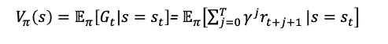

它描述了在时间步*从状态 ***s*** 开始，在时间 ***t*** 然后遵循策略 **𝜋** 时，总回报***g***的期望值。这是用期望𝔼[.因为环境转移函数可能以随机的方式起作用。*

*为了进一步澄清概念，对于初学者，让我们考虑一个具有三种状态的简单环境:*

*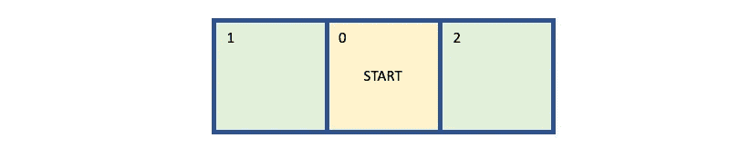*

*   *代理的初始状态 0*
*   *代理在执行从初始状态“离开”的动作后所处的最终状态 1。由此得到的回报是 r=+1*
*   *代理在采取行动“正确”后的最终状态 2 由此得到的回报是 r=+2*

*我们可以用以下带有奖励的环境状态转换来表示这一点:*

*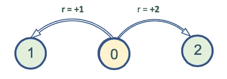*

*环境总是决定性的——每一个动作成功，我们总是从状态 0 开始。一旦我们到达状态 1 或状态 2，这一集就结束了。*

*现在的问题是，状态 0 的值是多少？(用 *V(0)* 表示)。一个重要的细节是，一个状态的值总是根据我们的代理所遵循的一些策略来计算(依赖于)的。即使在一个简单的环境中，我们的代理也可以有不同的行为，每个行为都有自己的状态 0 值。考虑一些策略示例:*

1.  *代理人总是走左边*
2.  *代理人总是向右走*
3.  *代理人向左走的概率为 0.5，向右走的概率为 0.5*
4.  *代理向左走的概率为 0.2，向右走的概率为 0.8*

*上述每个策略中状态 0，V(0) **，**的值为:*

1.  *在“总是向左”代理的情况下，状态 0 的值是 V(0) *=* 1.0(每次向左，它都获得+1，并且剧集结束)。*
2.  *对于“永远正确”的智能体，状态 0 的值为 V(0) *=* 2.0(每次向右，获得+2，剧集结束)。*
3.  *对于“左 0.5 +右 0.5”代理，该值为 V(0)*=*1.0 x 0.5+2.0 x 0.5 = 1.5*
4.  *对于“左 0.2 +右 0.8”代理，该值为 V(0)*=*1.0 x 0.2+2.0 x 0.8 = 1.8*

*由于代理人的目标是获得尽可能多的总报酬，在这个简单的单步环境中，该代理人的最优策略是策略 2，策略“永远正确”。*

*但是，前面的例子可能会给人一种错误的印象，即我们应该“贪婪”，总是以最高的回报采取行动。可惜没那么简单。例如，让我们用另一个可以从状态 2 到达的状态来扩展前面的环境。状态 2 不再是最终状态，而是向状态 3 的过渡，有一个(非常)糟糕的奖励–10:*

**

*带有奖励的新环境的状态转换可以表示为:*

*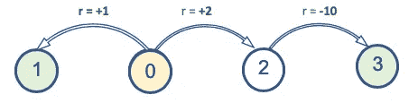*

*添加后，对于每个策略，V(0)将为:*

1.  *对于“始终向左”，情况相同:V(0) *=+* 1.0*
2.  *对于“始终正确”:V(0)*=*2.0+(–10.0)=–8.0*
3.  *对于“左 0.5 +右 0.5”:V(0)*=*1.0 * 0.5+(2.0+(-10.0))* 0.5 =-3.5*
4.  *对于“左 0.2 +右 0.8”:V(0)*=*1.0 * 0.2+(2.0+(-10.0))* 0.8 =-6.2*

*因此，对于这种新环境，现在的最佳策略是策略 1:“始终向左”。请注意，一旦代理人在状态 0 选择了“正确”的行动，坏的回报是不可避免的，因为从状态 2，我们只有一个出口。*

*这个基于*天真*环境的例子追求的是读者意识到这个最优化问题的复杂性，并让他或她准备好看到贝尔曼方程的重要性。什么是贝尔曼方程？*

# *Q 函数:动作的值*

*在 [post 2](/drl-02-formalization-of-a-reinforcement-learning-problem-108b52ebfd9a) 中，我们将状态-值函数的定义扩展到了状态-动作对，为每个状态-动作对定义了一个值，称为**动作-值函数，**也称为**q-函数**或简称为 **Q.** 它定义了在策略 **π** 下采取动作*在状态*下的值，表示为 为预期收益 ***G*** 从*开始，采取行动 **𝑎** ，此后遵循政策***【π***:****

**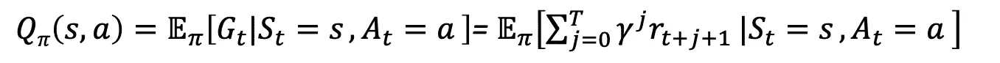**

**在这个等式中，再次使用了期望𝔼[.因为环境转移函数可能以随机方式起作用。**

**现在我们已经定义了 Q 和 V，让我们来形式化它们的关系。我们用 **π(𝑎|𝑠)** 表示给定当前状态下，策略π选择动作 **𝑎** 、 **𝑠** 的概率。注意，从 ***s*** 的所有出站动作的概率之和等于 1:**

****

**我们可以断言，状态值函数等于所有传出(从 ***s*** )动作*的动作值函数之和，乘以选择每个动作的策略概率:***

***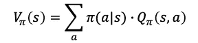***

# ***贝尔曼方程***

***[贝尔曼方程](https://en.wikipedia.org/wiki/Bellman_equation)在强化学习文献中随处可见，是许多强化学习算法的核心元素之一。综上所述，我们可以说**贝尔曼方程将价值函数分解为两部分，即期回报加上贴现后的未来价值**。***

***这个等式简化了价值函数的计算，因此，我们可以通过将复杂问题分解为更简单的递归子问题并找到它们的最优解，而不是在多个时间步骤上求和。***

***为了便于理解以下各节中的公式，接下来的两个备份图总结了变量的命名约定及其关系:***

***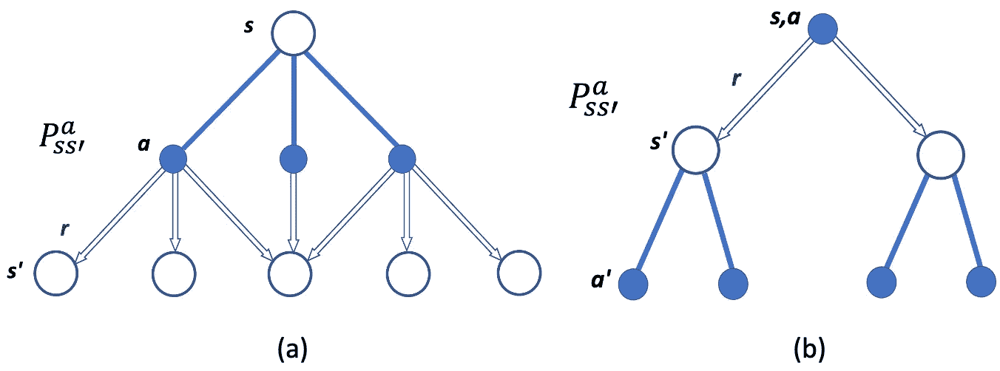***

***(a) *V* 𝜋 *(s)* 和(b) Q𝜋 *(s，a)的备用图。****

***在这些图中， ***P*** 表示动作概率 ***a*** ，发布于状态*，结束于状态*(带奖励 ***r*** )。*****

## **状态值函数的贝尔曼方程**

**我们已经看到，我们可以用递归的方式定义贴现收益， ***G*** 。现在让我们看看如何递归地为状态-值函数定义贝尔曼方程:**

**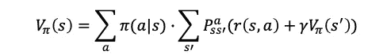**

**这个等式告诉我们如何根据政策 **𝜋** 求出一个状态 ***s*** 的值。我们可以直观地看到，它把价值计算递归地分解成一个来自下一个状态的即时期望回报，***【r(s，a)*** ，加上一个后继状态的值，***v*𝜋*(s’)***，带有一个贴现因子 **𝛾** 。上面的等式也用政策概率的总和来表示环境的随机性。**

**贝尔曼方程很重要，因为它让我们能够描述一个状态的值**v**(s)*，用*状态的值，*v**(s)*，用我们将在下一篇文章[中介绍的迭代方法，我们可以计算](/the-value-iteration-algorithm-4714f113f7c5)****

**遗憾的是，在大多数场景下，我们不知道概率 ***P*** 和报酬 ***r*** ，因此无法直接应用贝尔曼方程求解 MDPs。但是不要担心，在下一篇文章中，我们会展示一些替代方案，从经验中找到它们。**

## **作用值函数的贝尔曼方程**

**我们还有作用值函数的贝尔曼方程:**

**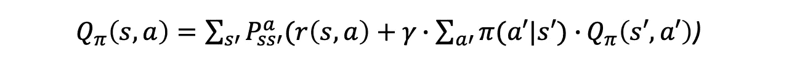**

**与状态-值函数一样，这个等式告诉我们如何递归地找到遵循策略 **𝜋** 的状态-动作对的值。**

**由于我们已经表明，状态值函数**v(*s*)**等价于所有输出动作*的动作值函数 q***(s’，a)***之和，乘以选择每个动作的策略概率***(a“| s”)***，前面的公式可以表示如下:***

**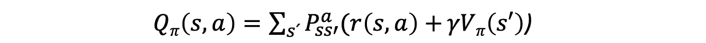**

# **最优策略**

**请记住，代理人的目标是在长期内最大化总累积报酬。使总累积报酬最大化的策略称为**最优策略**。**

## **最优值函数**

**当且仅当对于所有状态 *s* ，策略 *π* 被定义为优于或等于策略 *π* 。一个最优策略***π*∫满足*π*∫≥*π*对于所有策略 *π* 。最优策略肯定存在，但可能不是唯一的。这意味着可能存在不同的最优策略，但它们都共享相同的价值函数，即“最优”价值函数。****

******最优价值函数**是与所有其他价值函数相比产生最大值的函数(使用其他策略)。****

****当我们说我们正在求解一个 MDP 时，实际上意味着我们正在寻找最优值函数。因此，数学上**最优状态值函数**可以表示为:****

****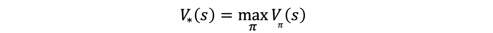****

****上式中，v∫(s)告诉我们状态 ***s*** 我们能从系统中得到的最大回报是什么。****

****同样，**最优状态-行动价值函数**表示如果我们处于状态*并从那里开始采取行动*我们将获得的最大回报:******

*****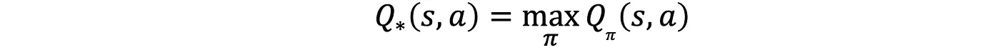*****

*****我们也可以通过 Q(s，a)定义 V(s ),因此某个状态的值等于我们可以从该状态执行的最大动作的值:*****

*****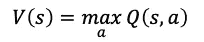*****

*****和*****

*****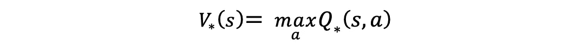*****

## *****贝尔曼最优方程*****

*****贝尔曼证明了一个状态下的最优状态值函数 ***s*** 等于行动*，这给了我们最大可能的预期即时报酬，加上下一个状态下的贴现长期报酬***’s***:******

****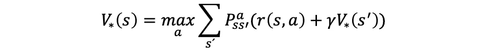****

****贝尔曼还证明了**最优状态-动作值函数**在状态 ***s*** 和采取动作 ***a*** 是:****

****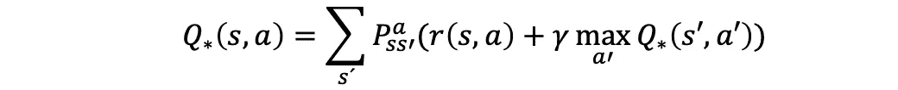****

****在本系列的后续文章中，我们将展示如何使用贝尔曼方程进行优化的例子。正如我们将在本系列中看到的，贝尔曼方程是找到价值函数的最优值以获得代理的最优策略的基础。****

# ****下一步是什么？****

****在以后的文章中，你会看到这些公式在解决冰湖环境中的实际应用。然而，为了能够做到这一点，我们仍然缺少一个重要的东西:计算这些 V 值和 Q 值的通用方法。在下一篇的[中，我们将为其呈现价值迭代方法。](/the-value-iteration-algorithm-4714f113f7c5)****

****[下期](/the-value-iteration-algorithm-4714f113f7c5)见！。****

> ****关于这篇文章内容的更多细节，读者可以阅读理查德·萨顿和安德鲁·巴尔托的优秀著作《T4 强化学习》，第二版。****

# ****深度强化学习讲解系列****

******由** [**UPC 巴塞罗那理工**](https://www.upc.edu/en) **和** [**巴塞罗那超级计算中心**](https://www.bsc.es/)****

****一个轻松的介绍性[系列](https://torres.ai/deep-reinforcement-learning-explained-series/)以一种实用的方式逐渐向读者介绍这项令人兴奋的技术，它是人工智能领域最新突破性进展的真正推动者。****

**** [## 深度强化学习解释-乔迪托雷斯。人工智能

### 本系列的内容](https://torres.ai/deep-reinforcement-learning-explained-series/) 

# 关于这个系列

我在 5 月份开始写这个系列，那是在巴塞罗那的封锁期。老实说，由于封锁，在业余时间写这些帖子帮助了我。感谢您当年阅读这份刊物；它证明了我所做的努力。

**免责声明** —这些帖子是在巴塞罗纳封锁期间写的，目的是分散个人注意力和传播科学知识，以防对某人有所帮助，但不是为了成为 DRL 地区的学术参考文献。如果读者需要更严谨的文档，本系列的最后一篇文章提供了大量的学术资源和书籍供读者参考。作者意识到这一系列的帖子可能包含一些错误，如果目的是一个学术文件，则需要对英文文本进行修订以改进它。但是，尽管作者想提高内容的数量和质量，他的职业承诺并没有留给他这样做的自由时间。然而，作者同意提炼所有那些读者可以尽快报告的错误。

# 别忘了给我们你的👏！****