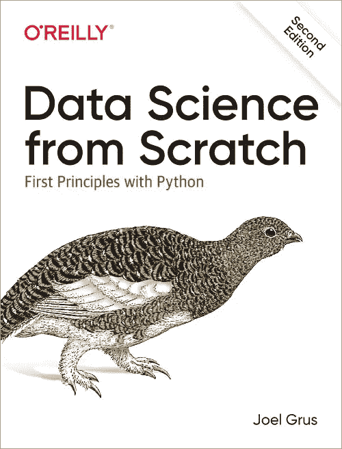

# 开始数据科学之旅的最佳书籍

> 原文：<https://towardsdatascience.com/the-best-book-to-start-your-data-science-journey-f457b0994160?source=collection_archive---------1----------------------->

克里斯多夫·伯恩斯在 [Unsplash](https://unsplash.com?utm_source=medium&utm_medium=referral) 上拍摄的照片

## 数据科学

## 这是你从头开始学习数据科学应该读的书。

D ata 科学。这是 21 世纪最性感的工作，每个人都在谈论它。公司渴望雇佣最优秀的人才，人们也热衷于投身数据科学事业。随着数据呈指数级增长，我们的技术飞速发展，数据科学将成为全球企业的一项基本工作也就不足为奇了。

用数据为[新油](https://www.wired.com/insights/2014/07/data-new-oil-digital-economy/)；这是一笔巨大的、尚未开发的宝贵财富，它将在我们的社会中发挥不可或缺的作用。今天的工作场所由数据科学职位的各种专业化所主导，它从根本上影响了商业模式。在数据上运行的算法和公式将取代人类的直觉，数据科学将成为数据驱动型公司的决策者。

这引发了学习数据科学的热潮，许多人转向互联网，一个有大量资源学习数据科学的地方。也就是说，并不是所有的都是可靠和有用的。随着数据科学的风起云涌，有无数的文章和视频——“一个月学会数据科学”——这些文章和视频具有误导性和肤浅性，是一种营销策略或“clickbait”。因此，如果你打算深入研究什么是数据科学，那么你必须找到合适的资源，以确保你从最好的人那里学习。

这就是我选择这本书的原因。如果你决定学习数据科学，那么你很幸运。但是，如果你已经在学习或正在实践它，这将是对你的资源收集或复习/测试的一个很好的补充，以确保你已经从头开始了解数据科学。

# 为什么要读书？

照片由 [Aaron Burden](https://unsplash.com/@aaronburden?utm_source=medium&utm_medium=referral) 在 [Unsplash](https://unsplash.com?utm_source=medium&utm_medium=referral)

你可能会问，都 2020 年了，为什么还在看书？因为在我看来，读书仍然是最好的学习方式，尽管五花八门的在线课程和视频教程充斥着互联网。原因如下:

1.  更好的保留
2.  更深刻的理解
3.  赞同思维
4.  更高的质量
5.  更好的聚焦

然而，这并不是说阅读这本书会神奇地让你一夜之间成为数据科学家。学习的重要之处在于，你可以通过实际的**行动**将你的知识转化为具体的东西。

在所有花哨的术语和数学背后，数据科学就是解决问题。你不能仅仅通过头脑风暴和阅读手头的困境来解决问题，你需要**行动**。

因此，事不宜迟，适合您开始数据科学之旅的书是…

本·怀特在 [Unsplash](https://unsplash.com?utm_source=medium&utm_medium=referral) 上拍摄的照片

# 从零开始的数据科学:Python 的基本原理，第二版

奥莱利

# 介绍

“[从头开始的数据科学，第二版](https://www.amazon.com/dp/1492041130/ref=emc_b_5_i)”作者是 [Joel Grus](https://medium.com/u/a73767eb121e?source=post_page-----f457b0994160--------------------------------) ，他是一名数据科学家，也是初创公司的分析师和谷歌的工程师。他在加州理工学院获得了博士学位。去他的[网站](https://joelgrus.com/)了解更多。

这本全新的书是第一版[数据科学从零开始:Python 的基本原理](https://www.amazon.com/Data-Science-Scratch-Principles-Python/dp/149190142X)的继承者，Python 代码针对 Python 3.6 进行了更新，这是一个伟大的进步，因为 Python 2.7 已经被视为生命的终结 (EOL)。

在整本书中，Grus 为每个概念提供了一个简单的解释，然后剩下的都是代码片段，教你如何从头开始构建流行的工具和算法，如[决策树](https://en.wikipedia.org/wiki/Decision_tree)和[神经网络](https://en.wikipedia.org/wiki/Artificial_neural_network)。他强调了从基础知识到复杂理论积累知识的重要性——从 Python 的基础知识到构建神经网络。

要学习数据科学，关键是要深刻理解每种算法的基本原理和方法。任何人都可以建立一个神经网络，如果他们只是按照视频教程，但这并不意味着他们知道自己在做什么。因此，一个人不仅应该掌握[工具](https://hackr.io/blog/data-science-tools)——数据科学库、框架、模块和工具包——而且应该彻底了解它们。

# 里面是什么

《从零开始的数据科学》总共有 27 章[章节](https://www.oreilly.com/library/view/data-science-from/9781492041122/)，涵盖了数据科学职业生涯中你需要知道的一切

1.简介
2。Python 速成班
3。可视化数据
4。线性代数
5。统计数据
6。概率
7。假设和推论
8。梯度下降
9。获取数据
10。使用数据
11。机器学习
12。k-最近邻
13。朴素贝叶斯。简单线性回归
15。多元回归
16。逻辑回归
17。决策树。神经网络。深度学习
20。聚类
21。自然语言处理。网络分析
23。推荐系统。数据库和 SQL
25。MapReduce
26。数据伦理
27。去做数据科学吧

# 这本书是给谁的？

这本书不适合完全的初学者，因为讨论了复杂的思想和原理。所以，为了充分利用这本书，你需要了解:

1.  基本的数学、代数和统计知识
2.  初级黑客技能。
3.  算法原理
4.  机器学习基础

尽管如此，即使你是一个完全的初学者，只要你有决心和意愿去学习，你仍然可以试一试这本书。

# 你将学到什么

Grus 将帮助你在数据科学的核心获得舒适的数学和统计学，以及作为数据科学家入门所需的黑客技能。

通过本书，您将:

*   参加 Python 速成班
*   了解线性代数、统计和概率的基础知识，以及它们在数据科学中的使用方式和时间
*   收集、探索、清理、管理和操作数据
*   深入机器学习的基础知识
*   实施 k-最近邻、朴素贝叶斯、线性和逻辑回归、决策树、神经网络和聚类等模型
*   探索推荐系统、自然语言处理、网络分析、MapReduce 和数据库

# 这本书最大的特点

毫无疑问，这本书最棒的地方在于它使用了 Python 3.6 作为所有代码片段的语言。这一点特别有用，因为 Python 的受欢迎程度在过去几年里激增，已经成为编程界的顶级语言之一

Python 现在是数据科学的[中心工具](https://qz.com/1126615/the-story-of-the-most-important-tool-in-data-science/)，这是计算机科学越来越重要的一部分。随着数据科学的兴起，越来越多的公司正在通过机器学习和人工智能来利用他们的数据，这对精通 Python 的开发人员产生了巨大的需求。

因此，拥有用 Python 编码的能力在这个人工智能时代将非常有用，这本书将为你学习 Python 打下基础。

# 如何有效地阅读这本书？

在阅读这本书的时候，我们鼓励你边读边记笔记，突出你不太理解的概念，这样你以后就可以回头再看。

您还应该有一个 IDE，如 Pycharm + Anaconda [setup](https://www.jetbrains.com/pycharm/promo/anaconda/) 或 VScode，这样您就可以在阅读代码片段的同时运行代码。通过这样做，你可以亲身体验使用机器学习算法的感觉，体验数据科学家的日常工作。

最后，利用每章末尾的进一步探索，这样你自己就能更深入地理解这个概念。

# 行动计划

斯科特·韦伯在 [Unsplash](https://unsplash.com?utm_source=medium&utm_medium=referral) 上拍摄的照片

学习数据科学并不容易。这本书肯定不会让它变得更容易。如果你真的对学习充满热情，那么试试这本书。

接触代码，尝试它，理解书中解释的原则和概念。测试你理解能力的一个方法是用更简单的语言向你的朋友或同事解释你所学到的东西，如果他们能理解你，那么这就证明你真的理解了一个概念。

看完这本书，你应该对 Python 有一点了解，对机器学习算法也有密切的关系。你接下来会问什么？

查看这本书，它讲述了如何在 Python 中操作、处理、清理和处理数据集:

**用于数据分析的 Python，第二版**

 [## 用于数据分析的 Python

### 获取在 Python 中操作、处理、清理和处理数据集的完整说明。针对 Python 进行了更新…

shop.oreilly.com](http://shop.oreilly.com/product/0636920050896.do) 

# 收场白

我希望您发现这篇文章很有用，并成功说服您拿起这本书，开始学习数据科学。

祝你旅途顺利，学习愉快！

**这是这本书的链接:**

> [数据科学从零开始:Python 的基本原理第二版](https://www.amazon.com/dp/1492041130/ref=emc_b_5_i)

**这里是 Github repo，它包含了书中的所有代码:**

 [## 乔尔·格鲁什/数据科学从零开始

### 这是我的书《从头开始的数据科学》第二版的所有代码和例子。他们至少需要…

github.com](https://github.com/joelgrus/data-science-from-scratch) 

在推特[和 LinkedIn](https://twitter.com/benthecoder1) 上关注我的更新，并关注我的下一篇文章！

想看更多类似这样的数据科学内容，关注我[中](https://medium.com/@benthecoder07)！

既然您大老远来到这里，请查看我的超学习数据科学系列！值得一读。

 [## 如何“超级学习”数据科学—第 1 部分

### 这是一个简短的指南，基于《超学习》一书，应用于数据科学

medium.com](https://medium.com/better-programming/how-to-ultralearn-data-science-part-1-92e143b7257b)