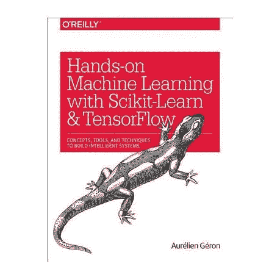

# 机器学习初学者的最佳书籍

> 原文：<https://towardsdatascience.com/the-best-books-for-machine-learning-beginners-b2317d1ee27c?source=collection_archive---------16----------------------->

## 4 本最好的机器学习书籍，以及它们为什么会让你成为下一个大数据科学家。

机器学习是当前数据科学领域最热门的话题。凭借其独特的应用，初创企业和大型公司正在雇用越来越多的数据科学家来实施这些模型，以更好地了解他们的业务和客户。

对于任何参与数据科学的人来说，数据科学家是我们都梦想的职业，但你必须了解自己的东西，这要从理解机器学习的概念开始！！

因此，如果你是一名初学者，并希望在未来成为一名数据科学家，或者只是有兴趣了解有关该主题的更多信息，我将向你提供 4 本最好的机器学习书籍。

金伯利·法默摄于 Unsplash

# 1.Python 机器学习导论:数据科学家指南。

如果你刚刚开始学习机器，这是一本必读的书。它主要侧重于 Scikit-Learn 库，并深入介绍了机器学习中一些最有用的方法——分类、回归、一点聚类、PCA 以及衡量模型结果的所有不同方法。使用 Python 进行机器学习的介绍很容易理解，并且将彻底解释使用 Python 创建一个成功的机器学习应用程序的所有必要步骤。

《T2》是机器学习入门者的必读之书。

【链接*:*[*https://amzn.to/3b6ygSZ*](https://amzn.to/3b6ygSZ)

# 2.百页机器学习书

对于那些希望快速学习机器学习的人来说，这是一本精华的书。这本书可以在一个晚上读完，里面有你用机器学习创建自己的模型所需的所有信息。就页数和内容质量而言，它清晰、简洁，可能是我读过的最好的机器学习书籍。

**链接***:*[*https://amzn.to/3fqMr8y*](https://amzn.to/3fqMr8y)

# 3.Python 机器学习

这是一本关于 python 机器学习的极好的入门书。它提供了足够的背景知识，介绍了每种技术的理论，并附有 python 代码。这本书的一个优点是，它从头开始实现神经网络，为读者提供了真正理解关键基础技术(如反向传播)的机会。更进一步，这本书展示了一种高效(专业)的 python 编码方式，这是数据科学的关键。

我强烈推荐给那些对机器学习原理和 python 有中等程度了解的人。

**链接**:https://amzn.to/2L604fM[T3](https://amzn.to/2L604fM)

# 4.使用 Scikit-Learn 和 TensorFlow 进行机器实践学习

作者 Aurelien Geron 在解释不同的概念方面做了大量工作，主要关注 Scikit-Learn 和 TensorFlow 的实际实现。这本书分为两部分，前半部分介绍 Scikit-Learn，它很好地结合了实践和理论。Scikit-Learn 部分是一个很好的参考资料，它有很好的详细解释和很好的参考资料，可供进一步阅读以加深您的知识。第二部分深入探讨 TensorFlow 的深度学习，这是全面理解机器学习的下一步。深度学习是使用简单易学的 Keras 库与 TensorFlow 的组合和功能来解释的。

**链接**:[*https://amzn.to/3fq1foc*](https://amzn.to/3fq1foc)

这 4 本书将为你提供参加任何数据科学家面试所需的知识，让你自信地面对任何问题。

希望任何对机器学习感兴趣的人赶快阅读这些书，因为你永远不知道它们会带你去哪里。

## 参考

[1] A. Muller 和 S. Guido，《用 Python 进行机器学习导论:数据科学家指南》(2016)，[*https://amzn.to/3b6ygSZ*](https://amzn.to/3b6ygSZ)

[2] A .布尔科夫，《百页机器学习书》(2019 年)，[【https://amzn.to/3fqMr8y】T21](https://amzn.to/3fqMr8y)

[3] S. Raschka 和 V.Mirjalili. Python 机器学习(2017)，[*https://amzn.to/2L604fM*](https://amzn.to/2L604fM)

[4] A. Geron，用 Scikit-Learn 和 TensorFlow 进行机器学习的实践(2017)，[*https://amzn.to/3fq1foc*](https://amzn.to/3fq1foc)