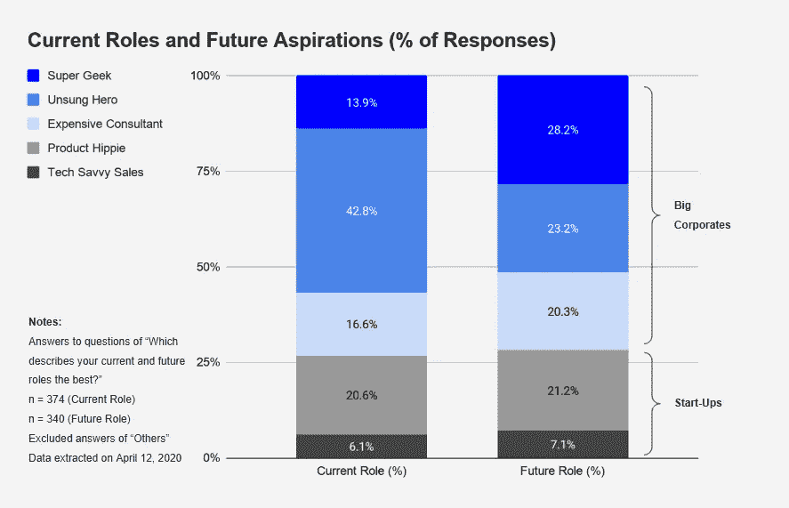
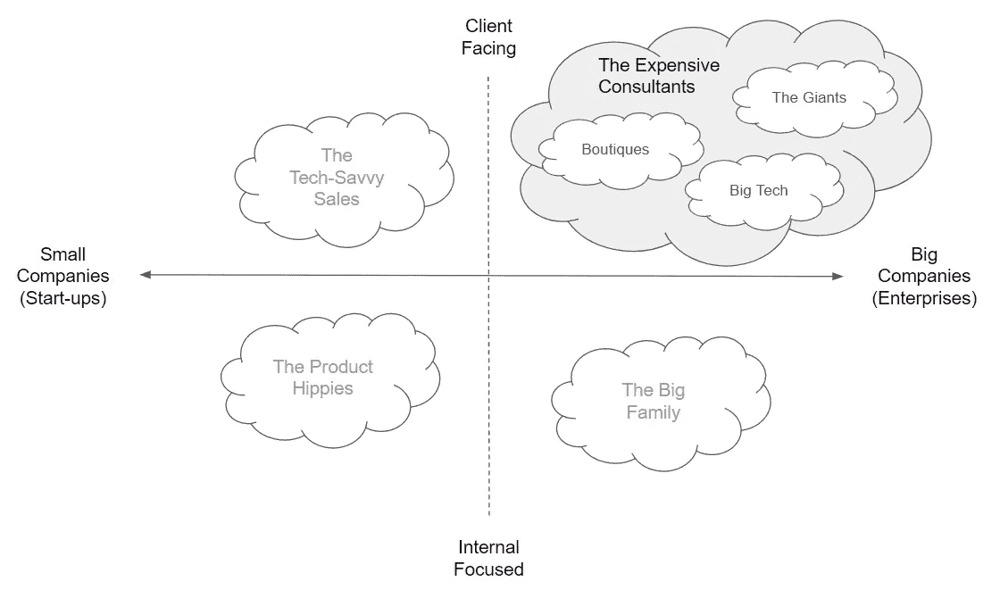
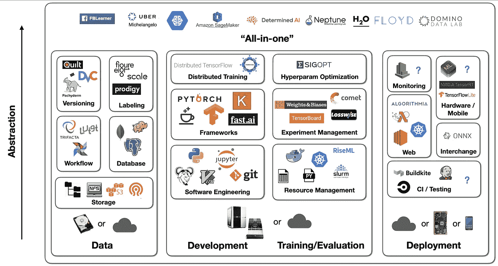
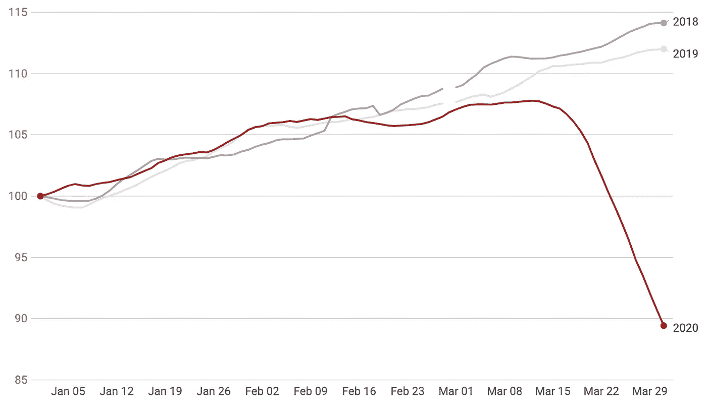

# 下一个最佳数据科学工作

> 原文：<https://towardsdatascience.com/the-best-data-science-transition-routes-e809254934d0?source=collection_archive---------15----------------------->

## 数据科学家最受欢迎的路线

沃伦·王在 [Unsplash](https://unsplash.com/s/photos/roads?utm_source=unsplash&utm_medium=referral&utm_content=creditCopyText) 上的照片

**TL；DR** —如今，许多人正在转型或寻找新的数据科学职位。这篇文章提供了一些关于最流行和可行的路线的事实和见解。

我交替使用 AI、ML 和数据科学。这篇文章不代表我的雇主的观点。

***喜欢读什么？*** *在* [*中*](https://medium.com/@ianxiao) *，*[*LinkedIn*](https://www.linkedin.com/in/ianxiao/)*，或者*[*Twitter*](https://twitter.com/ian_xxiao)*。还有，作为一名数据科学家，要不要学习商业思维和沟通技巧？查看我的《* [*用机器学习影响*](https://www.bizanalyticsbootcamp.com/influence-with-ml-digital) *》指南。*

# 从上一集开始

我介绍了数据科学家的四个原型**来强调退出的可能性，并进行一项调查来了解社区在想什么。**

**以下是截至 2020 年 4 月 12 日的结果:**

****

**调查结果来自[作者的文章](/the-most-realistic-data-science-career-guide-d12c4af87cc8)，2020 年 4 月 12 日**

**这是我的外卖。看到其他见解请留言评论。**

*   ****超级极客是新的性感。我对此并不感到惊讶，因为机器学习的智力本质以及领先机构令人兴奋的突破的新闻报道，如谷歌大脑、优步和网飞。****
*   **无名英雄没得到多少爱。再说一次，我并不感到惊讶。公司的繁文缛节和速度可能令人讨厌。虽然这些英雄致力于核心运营问题，但他们往往没有获得足够的信任，做重复(感知)的无聊工作，并被他们的超级极客同行所掩盖。**
*   **创业公司没有我想象的那么火。只有大约 1/3 的人想在创业公司做数据科学。我原本预计至少有 50%的人会在初创公司任职。鉴于此次调查的时间，这可能是因为新冠肺炎的情况。**

*****告诫*** *:这张图* ***并没有*** *指明人们想要如何过渡。例如，你可能认为大多数无名英雄都想成为超级极客。这可能不是 100%的真实。该调查不跟踪任何个人信息(如 IP)，因此我们无法在个人层面进行跟踪。***

# **那又怎样？**

**每当我们提出一些数据时，人们总是问那又怎样。我的回答永远是“看情况”，“你说的那么——什么是什么意思？”，或者两者都有。😀**

**因此，让我们这样框架:这取决于你是 1)计划转型的数据科学家，2)数据科学团队经理或高管，还是 3)试图加入该领域的有抱负的数据科学家。每个角色都有不同的兴趣和挑战。**

**为了限制本文的范围和给定的受众规模，让我们把讨论的焦点放在正计划转型的**经验丰富的无名英雄身上。如果你属于其他人物角色，请随时在 [LinkedIn](https://www.linkedin.com/in/ianxiao/) 上与我联系或留下评论。乐于交流思想。****

# **无名英雄的光荣之路**

**在我作为一家全球公司的昂贵顾问的工作中，以及在我最近的人工智能创业冒险中，我与相当多的无名英雄进行了互动。大多数无名英雄都觉得自己处于劣势。如果你这样做了，你很幸运地错了。**

**事实上，你有两个优势 : 1)职能专业知识，2)你知道在混乱的业务中设计、部署和管理 ML 需要什么，3)与非数据科学团队密切合作。这些往往被淡化。**

**每个人对自己的职业生涯都有不同的看法。我假设你想:**

*   **最大化你的优势**
*   **尽可能走最短最便宜的路**
*   **处理实际的数据科学问题**
*   **不要让你的职业(如级别和责任)倒退太多**

## ****目的地 1** :超级极客**

**对不起，我没有资格讨论这个。我从未在任何大型科技公司做过超级极客。最接近的时刻是，我得到了华尔街顶级对冲基金的邀请，成为一名极客，但我无法接受这份工作。长话短说:美国签证系统糟透了。**

**取决于对这篇文章的反应，我可以在后续的帖子中讨论我的准备和面试经历。**

**与此同时，这里有一些领先科技公司超级极客的非招聘面试。他们让你很好地了解了他们所做的事情以及 R&D 团队所关心的事情。但是有一点要记住。小公司的 R&D 也做一些很酷的事情。**

## **目的地 2:昂贵的顾问**

**在我们讨论如何过渡到咨询行业之前，让我们看看公司的类型:大型公司、大型科技公司和精品公司。**

****

**咨询公司、作者工作的细分**

**大型公司提供涵盖所有行业和职能的一系列业务和技术解决方案(如德勤、麦肯锡、埃森哲)。大型技术公司的服务部门，专注于集成特定的解决方案(例如，微软、IBM 或谷歌云、亚马逊云)。精品公司通常规模较小，提供非常具体的解决方案，并专注于一个狭窄的行业或功能。**

****最佳入门:**作为一名无名英雄，你最好的选择是加入一般服务公司的数据科学专家行列。走这条路可以让你在第一天就发挥你的优势。**

**这些公司通常有两条路线:多面手和专家。通才通常对新毕业生、工商管理硕士以及专注于客户和销售的经验丰富的专业人士开放。他们将从事广泛的非数据科学项目或任何他们有深厚关系的领域。相比之下，专家是在各自领域领导深入的技术工作和思想领导的专家。一些高级专家可能有销售目标，但这通常不是重点。**

**如果多面手是你感兴趣的，你可能需要准备在学习和建立关系网的层面上迈出一步。或者，你真的需要展示你的商业头脑和对关键商业主题的理解(如经济学、市场营销、运营、技术、金融等。)**

**大型科技公司和精品公司的服务部门并不是最好的首选，因为他们关注的是软件和系统集成。数据科学的工作通常是支持软件的销售，而不是解决一般的问题。**

**在我的[上一篇文章](/the-most-realistic-data-science-career-guide-d12c4af87cc8)中，可以看到作为一名昂贵的顾问的更多好处和坏处。**

## **目的地 3:人工智能创业**

**AI 创业的定义很复杂。我通常将它们分为 1)构建人工智能工具的公司，2)在其产品或服务中使用人工智能的公司，以及 3)提供特殊人工智能算法的公司。**

**对于 **AI 工具初创公司**，他们通常会构建工具来增强 ML 工作流。大多数人工智能创业公司都属于这一类。这张图是我最喜欢的展示整体景观的方式。**

****

**Sergey Karayev 在 2019 年[全栈深度学习](https://full-stack-deep-learning.aerobaticapp.com/b172_eb327323-811b-4de9-8894-76ec4cfd6458/assets/slides/fsdl_4_infra_tooling.pdf)上的演讲**

**对于**在产品**中使用 **AI 的公司，你可以想到早期的优步。他们的主要业务是运输，但他们使用 ML 算法来实现更好的路由、需求匹配和用户体验。****

**对于那些**为特定用例提供人工智能算法**的公司，你可以想到被谷歌收购前的 DeepMind。我想这是大多数人在考虑一家 AI 创业公司的时候想到的，想加入的。不幸的是，这种人不多。**

**最佳参赛作品:在产品中使用人工智能的公司。同样，你可以在第一天运用你的专业知识，解决真正的 ML 问题。如果你加入了一家新的支付公司，你是一名风险专家，你可以用新的算法和有趣的数据(或者没有数据，取决于公司有多早)建立新的风险模型。这就是创造力和乐趣的来源！**

**加入一家人工智能工具公司就像加入一家大型科技公司的服务部门。你不会解决实际的数据科学问题，你会花更多的时间为其他数据科学家构建软件工具。您可以构建一个简单的模型作为软件的演示。**

**祝你好运找到人工智能算法公司。也许你可以在大学的研究实验室里找到它们。如果你找到他们，准备好大幅度减薪和承担责任。任何事情都有成本，包括创业梦想，对吧？**

**在我的[上一篇文章](/the-most-realistic-data-science-career-guide-d12c4af87cc8)中，可以看到作为一名精通技术的销售和产品嬉皮士工作的更多好处和坏处。**

# **对着镜子深深地凝视**

****

**正如 [Recode](https://www.vox.com/2020/3/24/21191742/job-postings-decline-indeed-data-chart-hiring-unemployment) 报道的那样，美国的招聘信息确实在。转贴自[这篇 TDS 文章](/whats-happened-to-the-data-science-job-market-in-the-past-month-88c748a4cd25)**

**我们中的许多人可能认识到，现在——在新冠肺炎风暴期间——不是探讨职业转型的最佳时机。我强烈推荐你阅读 Edouard Harris 的这篇文章，它讨论了数据科学就业市场的现状。**

**我不能(也不想)推测新冠肺炎会议后情况会如何。对我们所有人来说，这是一个深刻、认真照镜子的好时机。**我们当前的数据科学角色真的在创造或增加价值吗？**如果是的话，我们不用担心，总会有机会。如果不是，爱德华认为，我们如何重塑我们的角色，使其变得真正不可或缺？**

**我希望这篇文章能提供一些具体的见解，告诉你，一个在大公司管理 ML 的无名英雄，如何凭借你的绝对优势转换到其他角色。一如既往，我乐于接受反馈并乐于交流想法。**

**直到下一次。**

**伊恩**

**[吉菲](https://media.giphy.com/media/11AuX2SHScQumk/giphy.gif)**

*****喜欢读什么？*** *跟我上* [*中*](https://medium.com/@ianxiao)*[*LinkedIn*](https://www.linkedin.com/in/ianxiao/)*，或者*[*Twitter*](https://twitter.com/ian_xxiao)*。还有，作为一名数据科学家，要不要学习商业思维和沟通技巧？查看我的《* [*用机器学习影响*](https://www.bizanalyticsbootcamp.com/influence-with-ml-digital) *》指南。****

# *****你可能也喜欢:*****

*** [## 12 小时 ML 挑战

### 如何使用 Streamlit 和 DevOps 工具构建和部署 ML 应用程序

towardsdatascience.com](/build-full-stack-ml-12-hours-50c310fedd51)  [## 最有用的 ML 工具 2020

### 每个懒惰的全栈数据科学家都应该使用的 5 套工具

towardsdatascience.com](/the-most-useful-ml-tools-2020-e41b54061c58)  [## 被遗忘的算法

### 用 Streamlit 探索蒙特卡罗模拟

towardsdatascience.com](/how-to-design-monte-carlo-simulation-138e9214910a)  [## 数据科学很无聊

### 我如何应对部署机器学习的无聊日子

towardsdatascience.com](/data-science-is-boring-1d43473e353e)  [## 我们应该留在数据科学领域吗？

### 数据科学家的 4 个现实职业选择

towardsdatascience.com](/the-most-realistic-data-science-career-guide-d12c4af87cc8)  [## ML 和敏捷注定的联姻

### 如何不对 ML 项目应用敏捷

towardsdatascience.com](/a-doomed-marriage-of-ml-and-agile-b91b95b37e35)  [## 又一个 AI 冬天？

### 如何部署更多的 ML 解决方案——五种策略

towardsdatascience.com](/the-last-defense-against-another-ai-winter-c589b48c561)***