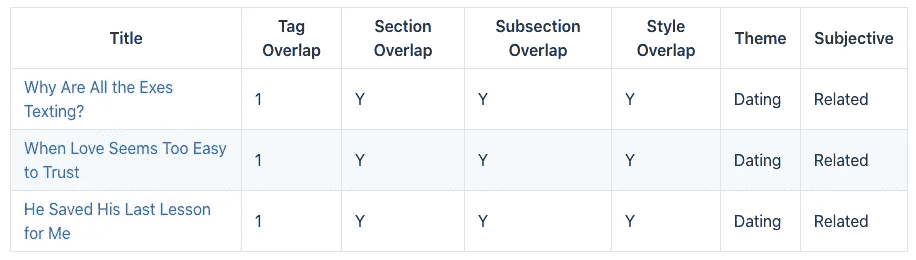
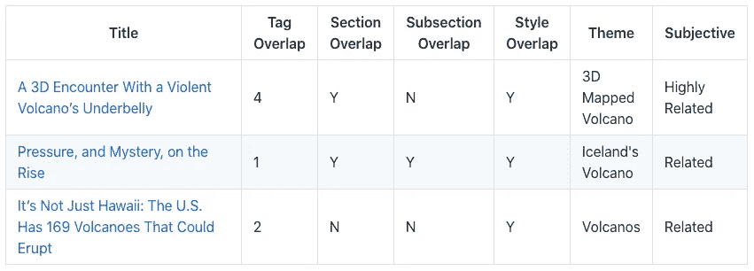
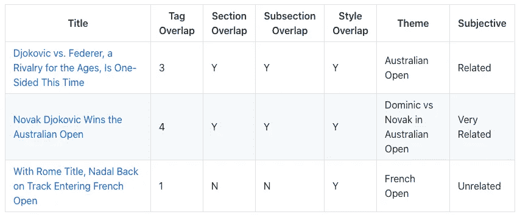
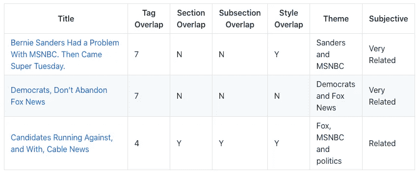

# 最佳文档相似性算法:初学者指南

> 原文：<https://towardsdatascience.com/the-best-document-similarity-algorithm-in-2020-a-beginners-guide-a01b9ef8cf05?source=collection_archive---------2----------------------->

## 根据实验从 5 种流行算法中选出赢家

戴维·克洛德在 [Unsplash](https://unsplash.com/s/photos/twin?utm_source=unsplash&utm_medium=referral&utm_content=creditCopyText) 上的照片

如果你想知道 2020 年文档相似度任务的最佳算法，你来对地方了。

在 33，914 篇《纽约时报》文章中，我测试了 5 种流行的文档相似性算法。它们的范围从传统的统计方法到现代的深度学习方法。

每个实现不到 50 行代码。而且所有用的模型都是从网上拿来的。因此，您将能够在没有任何数据科学知识的情况下使用它，同时期望得到类似的结果。

在这篇文章中，你将学习如何实现每个算法，以及如何选择最好的算法。议程如下:

1.  定义最好的；
2.  实验目标陈述；
3.  数据设置；
4.  比较标准；
5.  算法设置；
6.  挑选获胜者；
7.  对初学者的建议；

你想尝试自然语言处理和人工智能。你想用相关的建议来增加用户体验的趣味。您想要升级旧的现有算法。那你一定会喜欢这个帖子。

我们可以开始了吗？

# 数据科学家主张绝对最好

您决定搜索术语“最佳文档相似性算法”。

然后你会得到从学术论文、博客，到问答的搜索结果，有的侧重于某个具体算法的教程，有的侧重于理论概述。

在学术论文中，一个标题说，这个算法执行了 80%的准确性，击败了所有其他仅实现 75%的准确性。好的。但是这种差异足以让我们的眼睛注意到它吗？2%的涨幅呢？实现这个算法有多容易？科学家们倾向于在给定的测试集中追求最佳结果，而忽略了实际应用。

数据科学家的语言。Src)谷歌研究 BERT 知识库。

在问答中，被炒作的狂热分子主导了对话。有人说今天最好的算法是 BERT。这个算法概念是如此的革命性，它击败了其他一切。另一方面，愤世嫉俗者称一切取决于工作。一些答案来自几年前深度学习之前。看看这个 [Stackoverflow](https://stackoverflow.com/questions/8897593/how-to-compute-the-similarity-between-two-text-documents) 。当 2012 年被投票最多的书出版时，很难判断它对我们真正意味着什么。

谷歌会很乐意投入数百万美元的工程师力量和最新的计算能力，仅仅是为了把他们的搜索提高 1%。这对我们来说既不实际也没有意义。

性能提升和实现所需的技术专长之间的权衡是什么？需要多大的内存？在最少预处理的情况下，它的运行速度有多快？

你想看到的是一种算法在实际意义上如何优于另一种算法。

这篇文章将为您提供一个指南，告诉您下一个文档相似性问题应该使用哪种算法。

# 多样的算法，全长的流行文章，预训练的模型

本实验有 4 个目标:

1.  通过在同一个数据集上运行多个算法，您将会看到哪些算法与另一个算法有冲突，以及冲突的程度。
2.  通过使用来自流行媒体的完整长度的文章作为我们的数据集，你将发现现实世界应用的有效性。
3.  通过访问文章的网址，你将能够比较结果质量的差异。
4.  通过仅使用公开可用的预训练模型，您将能够建立自己的文档相似性并期望类似的输出。

> 预先训练好的模特是你的朋友
> 
> - [Cathal Horan](https://blog.floydhub.com/when-the-best-nlp-model-is-not-the-best-choice/) ，对讲机中的机器学习工程师

# 数据设置— 5 篇基础文章

对于这个实验，选择了 33，914 篇纽约时报文章。分别是 2018 年到 2020 年 6 月。这些数据大部分是从 RSS 提要中收集的，并通过完整的内容进行解析。文章的平均长度是 6500 个字符。

从库中，我们选择 5 作为相似性搜索的基础。每个代表一个不同的类别。

在语义类别之上，我们也将测量书写格式。更多的描述在下面。

1.  [*我最糟糕的约会如何变成我最好的*](https://www.nytimes.com/2020/02/14/style/modern-love-worst-date-of-my-life-became-best.html) (生活方式，人类兴趣)
2.  [*深海岩浆怪物接受身体扫描*](https://www.nytimes.com/2019/12/03/science/axial-volcano-mapping.html) (科学，信息)
3.  [*雷诺和日产在卡洛斯戈恩主政*](https://www.nytimes.com/2019/11/29/business/renault-nissan-mitsubishi-alliance.html) 多年后尝试新的方式【商业、新闻】
4.  [*澳网四分之一决赛多米尼克·蒂姆击败纳达尔*](https://www.nytimes.com/2020/01/29/sports/tennis/thiem-nadal-australian-open.html) (体育、新闻)
5.  [*2020 年民主党在一个不寻常的地点寻求选民:福克斯新闻频道*](https://www.nytimes.com/2019/04/17/us/politics/fox-news-democrats-2020.html) (政治、新闻)

# 判断标准

我们将使用 5 个标准来判断相似性的性质。如果您只想查看结果，请跳过这一部分。

1.  标签重叠
2.  部分
3.  分段
4.  故事风格
5.  主题

在内容相似性方面，标签是最接近人类判断的代理。记者自己手写下标签。您可以在 HTML 标题中的 news_keywords meta 标记处检查它们。使用标签最大的好处是，我们可以客观地衡量两个内容有多少重叠。每个标签的大小从 1 到 12 不等。两篇文章重叠越多，它们就越相似。

第二，我们看截面。《纽约时报》就是这样在最高层次上对文章进行分类的:科学、政治、体育等。URL 的第一部分在域名(nytimes.com/…)后显示 section(或 slug)。

第二个是小节。例如，意见部分可以细分为世界，或世界到澳大利亚。并不是所有的文章都包含它，也没有其他两篇意义重大。

第四是文风。大多数文档比较分析只关注语义。但是因为我们是在实际用例中比较建议，所以我们也想要相似的写作风格。例如，你不希望在学术期刊的“跑鞋和矫正器”之后看到一篇关于“十大跑鞋”的商业报道。我们将根据杰斐逊县学校教授的写作指南对文章进行分组。该列表遵循人类兴趣、个性、最佳(例如:产品评论)、新闻、操作方法、过去事件和信息。

# 5 个候选算法

这些是我们将要研究的算法。

1.  雅克卡德
2.  TF-IDF
3.  Doc2vec
4.  使用
5.  伯特

每个算法针对 33，914 篇文章运行，以找到得分最高的前 3 篇文章。对每个基础制品重复该过程。

输入的内容是全文的文章内容。标题被忽略。

请注意，有些算法不是为文档相似性而构建的。但是互联网上有这么多不同的意见，我们将亲眼看到结果。

我们不会关注概念上的理解，也不会关注详细的代码审查。相反，我们的目标是展示设置有多简单。如果你不理解这里解释的每一个细节，不要担心。跟帖不重要。为了理解这个理论，可以查看下面的阅读列表，看看其他人写的优秀博客。

你可以在 [Github repo](https://github.com/massanishi/document_similarity_algorithms_experiments) 中找到完整的代码库。

如果您只想看到结果，请跳过这一部分。

## 雅克卡德

保罗·雅克卡德在一个多世纪前提出了这个公式[。长期以来，这个概念一直是相似性任务的标准。](https://en.wikipedia.org/wiki/Paul_Jaccard)

幸运的是，你会发现 jaccard 是最容易理解的算法。数学很简单，不需要矢量化。它让你从头开始写代码。

另外，jaccard 是少数不使用余弦相似度的算法之一。它对单词进行标记，并计算并集上的交集。

我们使用 NLTK 对文本进行预处理。

步骤:

1.  小写所有文本
2.  标记化
3.  删除停用词
4.  删除标点符号
5.  把…按屈折变化形式进行归类
6.  计算两个文档的交集/并集

【Jaccard 计算部分的代码片段，其中单词 tokens 是一个字符串列表。

## TF-IDF

这是另一个自 1972 年以来就存在于[的成熟算法。经过几十年的充分测试，它是 Elasticsearch 的默认搜索实现。](https://en.wikipedia.org/wiki/Tf%E2%80%93idf)

Scikit-learn 提供了 TF-IDF 的现成实现。TfidfVectorizer 让任何人都可以在一眨眼的功夫尝试一下。

TF-IDF 词向量的结果是通过 scikit-learn 的余弦相似度计算的。我们将在其余的例子中使用余弦相似性。余弦相似性是许多机器学习任务中使用的一个如此重要的概念，它可能值得你花时间来熟悉自己([学术概述](https://www.sciencedirect.com/topics/computer-science/cosine-similarity))。

多亏了 scikit-learn，这个算法产生了最短的代码行。

[TF-IDF 的代码片段，其中 base_document 是一个简单的字符串，documents 是一个字符串列表。](https://github.com/massanishi/document_similarity_algorithms_experiments/tree/master/tf-idf)

## Doc2vec

2014 年 Word2vec 问世，让当时的开发者们为之屏息。你可能听说过著名的示威游行:

> 国王-男人=王后

Word2vec 非常擅长理解单个单词，矢量化整个句子需要很长时间。更不用说整个文档了。

相反，我们将使用 doc 2 vec——一种类似的嵌入算法，将段落而不是每个单词矢量化( [2014，谷歌公司](https://cs.stanford.edu/~quocle/paragraph_vector.pdf))。以一种更容易理解的方式，你可以看看吉迪·施佩尔的博客中的[。](https://medium.com/wisio/a-gentle-introduction-to-doc2vec-db3e8c0cce5e)

不幸的是，对于 Doc2vec 来说，还没有公司赞助的预训练模型被发布。我们将使用来自[的预训练 enwiki_dbow 模型。它是在英文维基百科上训练的(未指明数量，但模型大小为 1.5gb)。](https://github.com/jhlau/doc2vec)

Doc2vec 的官方文档指出，可以插入任意长度的输入。一旦标记化，我们将使用 gensim 库输入整个文档。

[doc 2 vec infer _ vector 部分的代码片段。首先预处理单词标记。](https://github.com/massanishi/document_similarity_algorithms_experiments/tree/master/doc2vec)

## 通用句子编码器(使用)

这是谷歌最近于 2018 年 5 月发布的一个流行算法(著名的雷·库兹韦尔是该出版物的幕后推手🙃).谷歌的 Tensorflow 很好地记录了实现细节。

我们将使用 Google 最新的官方预训练模型:[通用句子编码器 4](https://tfhub.dev/google/universal-sentence-encoder/4) 。

顾名思义，它是根据一个句子构建的。但是官方文件并没有约束输入大小。没有什么可以阻止我们使用它来完成文档比较任务。

整个文档按原样插入 Tensorflow。没有进行标记化。

[使用比较片段。这是最短的代码。](https://github.com/massanishi/document_similarity_algorithms_experiments/tree/master/use)

## 变压器的双向编码器表示(BERT)

这是个大人物。Google 在[2018 年 11 月](https://ai.googleblog.com/2018/11/open-sourcing-bert-state-of-art-pre.html)开源了 BERT 算法。在接下来的一年中，谷歌负责搜索的副总裁发表了一篇博客文章，称 BERT 是他们在过去 5 年中最大的一次飞跃。

它是专为理解您的搜索查询而构建的。当谈到理解一个句子的上下文时，BERT 似乎比这里提到的所有其他人都要好。

最初的 BERT 任务并不是为了处理大量的文本输入。对于嵌入多个句子，我们会使用 UKPLab(来自德国大学)发布的[句子转换器](https://github.com/UKPLab/sentence-transformers)开源项目，其计算速度更胜一筹。他们还为我们提供了一个预训练的模型，与原始模型相当[。](https://github.com/UKPLab/sentence-transformers#performance)

所以每个文档都被标记成句子。并且结果被平均以在一个向量中表示文档。

[BERT 比较与平均多句嵌入。](https://github.com/massanishi/document_similarity_algorithms_experiments/tree/master/bert)

# 赢家算法

让我们看看每种算法在 5 种不同类型的文章中的表现。我们根据最高分选择前 3 篇文章进行比较。

在这篇博文中，我们将只讨论五种算法中性能最好的算法的结果。关于完整的结果以及单独的文章链接，请参见[报告](https://github.com/massanishi/document_similarity_algorithms_experiments)中的算法目录。

## 1.我最糟糕的约会是如何变成最好的

伯特赢了。

这篇文章是一个有趣的故事，讲述了一个 50 多岁的离婚女人的浪漫约会。

这种文风不带有名人名字之类的特定名词。它也没有时效性。2010 年的一个有趣的人类故事可能与今天同样相关。因此，在比较中没有一个算法差得太远。

这是一次反对使用的千钧一发的机会。虽然一个使用故事迂回到一个社会问题，如 LGBTQ，伯特只专注于浪漫和约会。其他算法转向家庭和孩子的话题，可能是因为看到了“前夫”这个词。

第一篇文章(确定日期)的 BERT 结果—文档相似性实验

## 2.一只深海岩浆怪兽接受身体扫描

TF-IDF 胜。

这篇科学文章讲述了 3D 扫描海洋中的活火山。

3D 扫描、火山和海洋是罕见的术语，很容易理解。所有算法都很公平。

TF-IDF 正确地选择了那些只谈论地球海洋中火山的文章。USE 是一个很好的竞争者，因为它关注的是火星上的火山，而不是海洋。其他人则选择了与科学无关、与主题无关的关于俄罗斯军用潜艇的文章。

第二篇文章(volcano)的 TF-IDF 结果—文档相似性实验

## 3.卡洛斯·戈恩统治多年后，雷诺和日产尝试新的方式

TF-IDF 胜。

这篇文章谈到了前首席执行官卡洛斯·戈恩(Carlos Ghosn)逃脱后，雷诺和日产发生了什么。

理想的匹配会谈到这三个实体。与前两篇相比，这篇文章更受事件驱动，对时间更敏感。相关新闻应该发生在类似这个日期或者之后(是从 2019 年 11 月开始)。

TF-IDF 正确地选择了关注日产 CEO 的文章。其他人选择了谈论通用汽车行业新闻的文章，如菲亚特克莱斯勒和标致的联盟。

同样值得一提的是 Doc2vec 和 USE led 得到了完全相同的结果。

第三篇文章(日产)的 TF-IDF 结果—文档相似性实验

## 4.多米尼克·蒂姆在澳网四分之一决赛中击败纳达尔

Jaccard，TF-IDF 之间的配合和使用。

这篇文章是关于网球运动员多米尼克·蒂姆参加 2020 年澳大利亚网球公开赛的。

新闻是由事件驱动的，对个人来说非常具体。因此，理想的比赛将是多米尼克和澳大利亚网球公开赛。

不幸的是，这一结果因缺乏足够的数据而受到影响。他们都谈论网球。但有些比赛是在说 2018 年法网的多米尼克。或者，关于澳大利亚网球公开赛的罗杰·费德勒。

结果是三种算法打成平手。这说明了至关重要的一点:我们需要尽最大努力收集、多样化和扩展数据池，以获得最佳的相似性匹配结果。

第 4 篇文章(网球)的 Jaccard 结果—文档相似性实验

## 5.2020 年，民主党在一个不寻常的地方寻找选民:福克斯新闻频道

使用 wins。

这篇文章是关于民主党的，特别关注伯尼·桑德斯出现在福克斯新闻频道参加 2020 年选举。

每一个主题本身都可以很大。有大量关于民主党候选人和选举的文章。由于故事的主旨是新奇的，我们优先考虑那些讨论民主党候选人和福克斯关系的故事。

旁注:在实践中，你要小心政治上的建议。将自由派和保守派的新闻混在一起很容易让读者心烦。因为我们是单独与《纽约时报》打交道，所以这不是我们所关心的。

使用找到的关于伯尼·桑德斯和电视电缆的文章，如福克斯和 MSNBC。其他人挑选了讨论 2020 年选举中其他民主党候选人的文章。这些被认为过于笼统。

使用第五篇文章(Fox)的结果—文档相似性实验

## 速度之王

在得出获胜者之前，我们需要谈谈表演时间。就速度而言，每种算法的表现都大不相同。

结果是 TF-IDF 的实现比其他任何方式都要快。从头到尾在单个 CPU 上计算 33，914 个文档(标记化、矢量化和比较)，需要:

*   TF-IDF: 1.5 分钟。
*   雅克卡德:13 分钟。
*   Doc2vec: 43 分钟。
*   使用时间:62 分钟。
*   伯特:50 多个小时(每个句子都被矢量化)。

TF-IDF 只用了一分半钟。这是实际使用量的 2.5%。当然，您可以合并多个效率增强。但是潜在的收益需要首先考虑讨论。这给了我们另一个理由去认真考虑开发难度的权衡。

## 这是每篇文章中的优胜算法。

1.  伯特
2.  TF-IDF
3.  TF-IDF
4.  Jaccard、TF-IDF 和 USE 之间的联系
5.  使用

从结果来看，我们可以说，对于新闻文章中的文档相似性，TF-IDF 是最佳候选。如果您在使用它时只做了最少的定制，那就更是如此。同样令人惊讶的是，TF-IDF 是发明的第二古老的算法。相反，你可能会失望，现代最先进的人工智能深度学习在这项任务中没有任何意义。

当然，每种深度学习技术都可以通过训练自己的模型，更好地预处理数据来提高。但都伴随着开发成本。你需要努力思考相对于简单的 TF-IDF 方法，这种努力会带来怎样的好处。

最后，公平地说，我们应该完全忘记 Jaccard 和 Doc2vec 的文档相似性。与今天的替代方案相比，它们没有带来任何好处。

# 新手建议

假设您决定从头开始在应用程序中实现相似性算法，以下是我的建议。

## 1.首先实施 TF-IDF

尽管深度学习大肆宣传，文档相似性匹配的艺术状态*开箱即用*是 TF-IDF。它给你一个高质量的结果。最棒的是，它快如闪电。

正如我们所见，将其升级到深度学习方法可能会也可能不会给你带来更好的性能。必须事先进行大量的思考来计算权衡。

## **2。积累更好的数据**

吴恩达在 2017 年给出了一个类比“数据是新的石油”。你不能指望你的汽车不用油就能行驶。而且油必须是好的。

文档相似性依赖于数据多样性，也依赖于特定的算法。你应该尽最大努力寻找独特的数据，以提高你的相似性结果。

## 3.升级到深度学习

仅当您对 TF-IDF 的结果不满意时，才迁移到 USE 或 BERT。建立数据管道并升级您的基础设施。你将需要考虑到爆炸计算时间。您可能需要对单词嵌入进行预处理，这样就可以在运行时更快地处理相似性匹配。谷歌写了一个关于这个话题的[教程](https://cloud.google.com/solutions/machine-learning/building-real-time-embeddings-similarity-matching-system)。

## 4.调整深度学习算法

你可以慢慢升级你的模型。训练你自己的模型，将预训练适应特定的领域，等等。现在也有很多不同的深度学习模型。你可以一个一个的试，看看哪个最符合你的具体要求。

# 文档相似性是许多 NLP 任务之一

你可以用各种算法实现文档相似性:一些是传统的统计方法，另一些是尖端的深度学习方法。我们已经在真实世界的《纽约时报》文章中看到了它们之间的比较。

使用 TF-IDF，您可以在本地笔记本电脑上轻松启动自己的文档相似性。不需要花哨的 GPU。不需要大的存储器。有了高质量的数据，你还是会得到有竞争力的结果。

诚然，如果你想做情感分析或分类等其他任务，深度学习应该适合你的工作。但是，尽管研究人员试图推动深度学习效率和性能的边界，但我们所有人都生活在炒作循环中并不健康。这给新来者带来了巨大的焦虑和不安全感。

保持经验主义可以让我们着眼于现实。

希望这个博客已经鼓励你开始你自己的 NLP 项目。

让我们开始动手吧。

这篇文章是结合我正在做的 [Kaffae 项目](https://kaffae.com)的文档集群而写的。沿着这条思路，我计划做另一个关于句子相似性的系列。

敬请期待😃

## *延伸阅读*

*   一篇包含 TF-IDF 和余弦相似度的文章，并附有实例:“[Python 中文本相似性度量的概述](/overview-of-text-similarity-metrics-3397c4601f50)”。
*   一篇讨论余弦相似度如何用于各种 NLP 机器学习任务的学术论文:“[余弦相似度](https://www.sciencedirect.com/topics/computer-science/cosine-similarity)”。
*   不同算法中句子相似度的讨论:“[文本相似度:估计两个文本的相似程度](https://medium.com/@adriensieg/text-similarities-da019229c894)”。
*   文本分析中各种深度学习模型的考察:“[何时不选择最佳 NLP 模型](https://blog.floydhub.com/when-the-best-nlp-model-is-not-the-best-choice/)”。
*   概念上深入到 BERT 模型中:[对基于 BERT 的模型的回顾](/a-review-of-bert-based-models-4ffdc0f15d58)。
*   文档嵌入的文献综述:[文档嵌入技术](/document-embedding-techniques-fed3e7a6a25d)