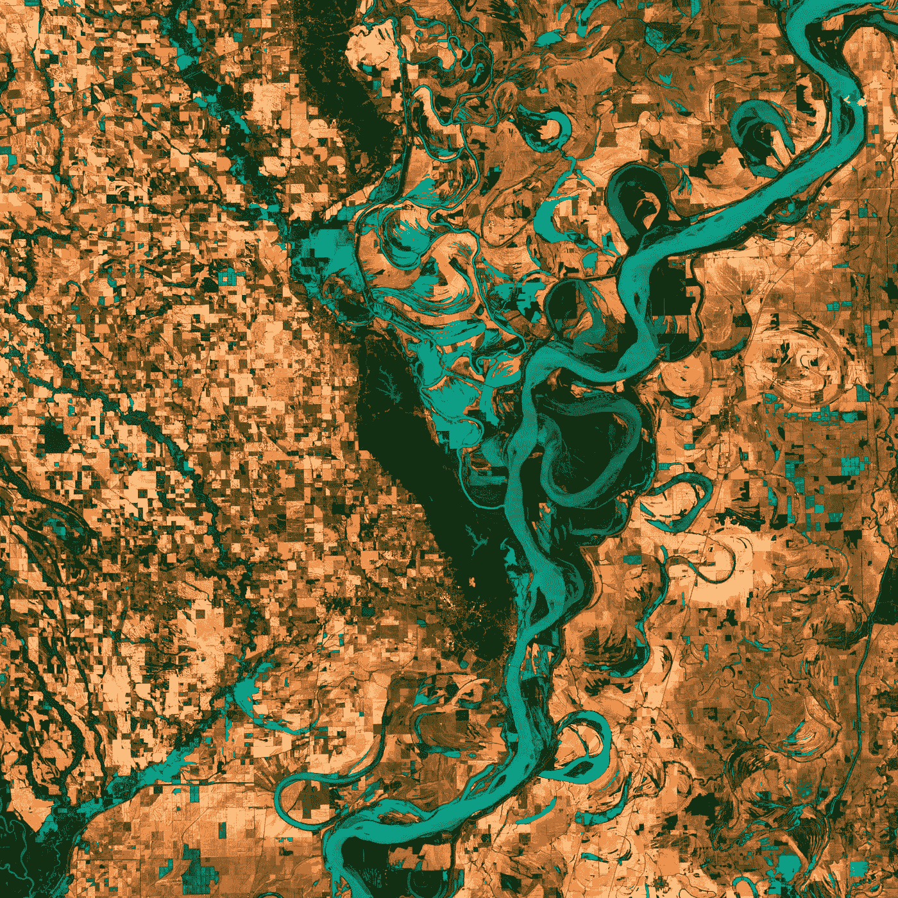

# 最佳地球观测数据科学工具包

> 原文：<https://towardsdatascience.com/the-best-earth-observation-data-science-toolkits-a51d867343a0?source=collection_archive---------26----------------------->

## 面向地理空间/地球观测数据科学家的平台、工具和软件包

美国地质勘探局在 [Unsplash](https://unsplash.com?utm_source=medium&utm_medium=referral) 上拍摄的照片

由于遥感平台的技术发展以及数据收集和存储的突破，基于卫星的地球观测数据正在快速增长。今天，我们在轨道上有超过 768 颗地球观测卫星，而 2018 年只有 150 颗。

作为地理空间或地球观测数据科学家，您有大量的工具和资源可供选择。在本文中，我重点介绍了市场上集成到数据科学生态系统中的最佳开源工具。

## 1.谷歌地球引擎(GEE)

我们的愿望实现了。GEE 都在一个包里。谷歌地球引擎(GEE)是迄今为止为地球观测数据科学家提供的最完整的软件包。它不仅提供地理空间数据处理和分析能力，而且还提供现成的数据集，专注于分析而不是下载数据。

借助 GEE，您可以利用来自 NASA/USGS (Landsat、MODIS)、欧盟(Sentinel 1 & 2)的免费卫星图像以及非卫星或衍生产品(如高程、气候数据和土地覆盖)进行行星级分析。

Google Earth Engine (GEE)拥有 Javascript 和 Python APIs 的全功能开发环境，是地球观测数据科学家/分析师的重要武器库。它还带有代码编辑器(Javascript ),您可以在浏览器中运行您的分析和可视化。

此外，您可以使用 GEE 创建机器学习模型，并可以在浏览器中生成完整的 ML 模型和预测。python 模块与其他 python 包集成得很好，你可以在 Jupyter 笔记本或 Google Colab 中运行。

**这就对了 GEE 中完整的端到端功能，包含数 TB 的卫星图像源、数据处理工具和 ML 算法，就在您的浏览器中。**

这再好不过了！

## 2.EO-学习

运行在 CPU/GPU 上的大规模地球观测管道。EO-Learn 是一个 python 包，它将数据科学和机器学习 Python 生态系统与遥感/地球观测社区紧密联系在一起。有了 eo-learn，即使非专家也可以从卫星图像中提取有价值的信息。

它还使地球观测专家能够高效地携带最先进的深度学习和计算机视觉模型。

Eo-learn 建立在 Numpy 数组和匀称的几何图形上，因此地理空间数据科学家感觉就像在家里一样。通过使用 Geopandas 的边界框，eo-learn 可以在您的环境中下载卫星图像，然后再进行任何分析。

不仅 eo-learn 使您能够执行 ML 和深度学习模型，而且它还具有用于批处理、掩蔽、IO 功能以及几何变换和矢量与光栅数据之间的转换的模块。

使用 eo-learn，您可以创建管道来执行批处理和多批处理，这些批处理可以在并行 GPU/GPU 上运行以进行繁重的处理。例如，[该管道为 200，000 km2](https://medium.com/sentinel-hub/land-cover-classification-with-eo-learn-part-1-2471e8098195) 阵列的一系列任务运行 12 小时，以执行整个国家的土地覆盖分类。

## 辐射中心

F 对于地球观测和机器学习， [Radiant MLHub](https://www.mlhub.earth/) 提供随时可用和开源的地球观测训练数据集。他们目录中的所有数据集都符合[时空资产目录(STAC)](https://github.com/radiantearth/stac-spec) 的要求，并且该列表还在增长——目前已有 14 个数据集可用。

训练数据集涵盖了不同的机器学习应用，包括图像分类、分割和对象检测。这里提供的流行的 ML 地球观测训练数据集包括 SpaceNet、BigEarthNet 和 LandCoverNet。

任何人都可以通过 API 免费访问这些数据。关于如何访问不同数据集的 Jupyter Notebook 示例可在 [MLHub 教程资源库](https://github.com/radiantearth/mlhub-tutorials/tree/master/notebooks)中找到。

## 打开数据立方体

作为一个平台和开源地理空间数据管理工具， [Open Data Cube](https://www.opendatacube.org/) 提供了对大量地球观测数据的简单和开放的数据访问。Python API 使地球观测分析师能够高性能地查询和访问数据，允许他们对存储的数据进行国家级到洲级的处理。

开放数据立方体目前支持**数字地球澳大利亚**和**非洲区域数据立方体**，并且还为它们的用户提供教程、指南、文档。

他们还提供了一个慷慨的免费 [ODC 沙盒](https://www.opendatacube.org/sandbox) (16 GB 内存)，里面有预配置的 Jupyter 笔记本，你可以在云上运行，无需配置和安装。有了这个功能，许多地球观测发现开始分析数十亿字节的数据变得很容易，而不用担心软件。

这些平台使成千上万的地球观测数据科学家能够完成日常任务。虽然其中一些工具包可以独立使用，也可以在完整的端到端管道中使用，但我倾向于将它们与其他地理空间/地球数据科学包和库一起使用。

因此，我将通过提供我最常用的处理地球观测数据集的包来结束本文，您可能会发现这些包很有用。

*   [**Rasterio**](https://rasterio.readthedocs.io/en/latest/#)**:**一个必不可少的轻量级灵活的遥感影像读写 Python 包。
*   [**白盒工具:**](https://jblindsay.github.io/ghrg/WhiteboxTools/index.html) 是一种高级地理空间数据分析工具，包括大量图像处理任务，如图像增强、过滤操作、聚类算法和其他图像处理功能，如水文和地貌分析。它可以有效地处理激光雷达数据，使您能够分割、分块或连接栅格激光雷达数据并获取输出。
*   EarthPy: 这是一个 python 包，使用开源工具可以更容易地绘制和处理空间栅格和矢量数据。EarthPy 弥合了栅格数据和矢量数据之间的差距，因此您可以在两种不同的数据类型之间有效地工作。
*   [**GDAL**](https://gdal.org/)**:**GDAL 是大多数地球观测用户使用的可爱工具。这是一个光栅和矢量地理空间数据格式的翻译库，并提供了大量的卫星图像处理工具。
*   PDAL:是点数据抽象库。PDAL 的重点是激光雷达数据，但也提供其他工具。它还通过 Numpy 提供了一个简单的 python 绑定，支持使用 Jupyter notebooks 和 python 等地球观测工具。

## 最后的想法

我们生活在地球观测的黄金时代。我们不仅见证了太空和空中探险的突破，而且拥有难以置信的资源来分析和研究地球及其环境。这些平台使地球观测数据科学家能够研究气候、天气、农业、交通和基础设施以及自然灾害。

虽然列表并不广泛，但我相信这些是最好的资源。如果你认为，我已经离开了一些你最喜欢的工具；请让我知道。