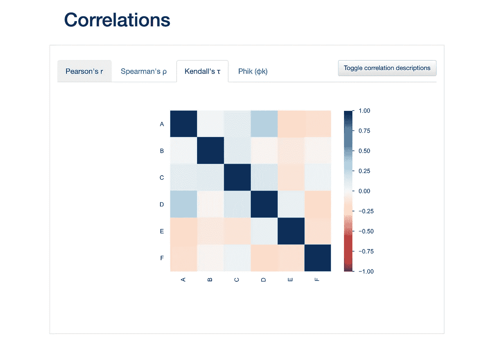
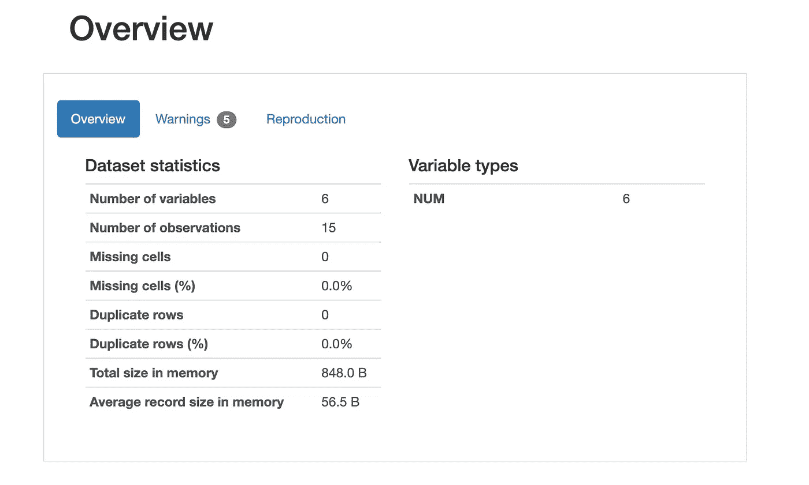
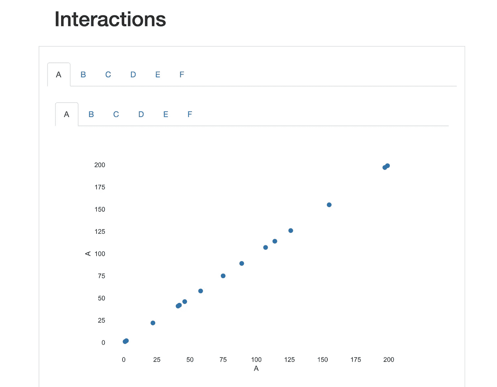
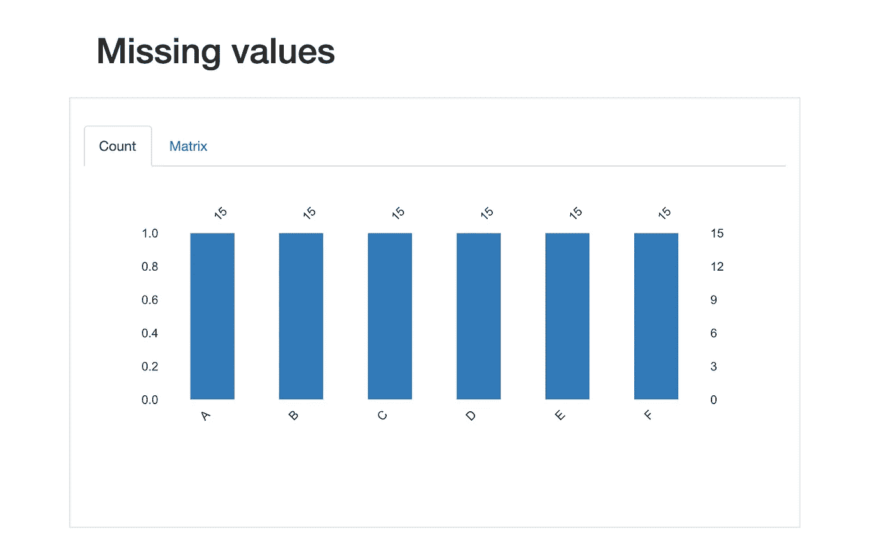
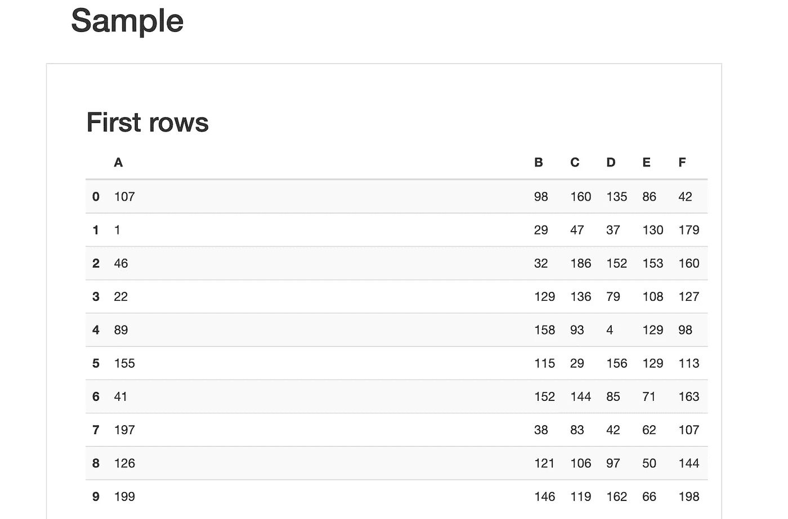

# 熊猫图谱的最佳探索性数据分析

> 原文：<https://towardsdatascience.com/the-best-exploratory-data-analysis-with-pandas-profiling-e85b4d514583?source=collection_archive---------21----------------------->

## 一行代码解决你所有的 EDA 问题。



熊猫简介报告相关性示例。作者截图[1]。

# 目录

1.  介绍
2.  概观
3.  变量
4.  相互作用
5.  相关
6.  缺少值
7.  样品
8.  摘要
9.  参考

# 介绍

在 Python ( *和 R* )中有无数种方法可以执行探索性数据分析(EDA)。我大部分都是在流行的 Jupyter 笔记本上写的。一旦我意识到有一个库可以用一行代码总结我的数据集，我就确保在每个项目中都使用它，从这个 EDA 工具的易用性中获得无数好处。在为所有数据科学家执行任何机器学习模型之前，应该首先执行 EDA 步骤，因此，来自[Pandas Profiling](https://github.com/pandas-profiling/pandas-profiling)【2】的善良而聪明的开发人员使得以漂亮的格式查看数据集变得很容易，同时也很好地描述了数据集中的信息。

Pandas Profiling report 是一款出色的 EDA 工具，可以提供以下好处:概述、变量、交互、相关性、缺失值和数据样本。我将使用随机生成的数据作为这个有用工具的例子。

# 概观



概述示例。作者截图[3]。

报告中的 overview 选项卡可以快速查看您有多少变量和观察值，或者行数和列数。它还将执行一个计算，以查看与整个 dataframe 列相比，您缺少了多少个单元格。此外，它还会指出重复的行并计算百分比。这个标签最类似于熊猫的描述功能的一部分，同时提供了更好的*用户界面* ( *UI* )体验。

概述分为数据集统计数据和变量类型。您也可以参考警告和复制，以获得有关您的数据的更具体的信息。

*我将讨论变量，变量也被称为数据框架的列或特征*

# 变量


变量示例。作者截图[4]。

要在描述性统计数据中获得更多的粒度，可以使用 variables 选项卡。您可以查看数据框要素或变量的不同、缺失、聚合或计算，如平均值、最小值和最大值。您还可以看到您正在处理的数据类型(*，即 NUM* )。当你点击*切换细节*时，图中未显示。这种切换会提示大量更有用的统计信息。详细信息包括:

***统计—分位数和描述性***

> 分位点

```
Minimum
5th percentile
Q1
Median
Q3
95th percentile
Maximum
Range
Interquartile range (IQR)
```

> 描述的

```
Standard deviation
Coefficient of variation (CV)
Kurtosis
Mean
Median Absolute Deviation (MAD)
Skewness
Sum
Variance
Monotonicity
```

这些统计数据也提供了与我今天看到的大多数数据科学家使用的 describe 函数类似的信息，然而，还有更多，它以一种*易于查看的*格式呈现它们。

***直方图***

直方图为您的变量提供了一个易于理解的视觉效果。您可以在 *y 轴*上看到变量的频率，在 *x 轴*上看到固定大小的箱(*箱=15 是默认的*)。

***常用值***

公共值将为您的变量提供最常见的值、计数和频率。

***极值***

极值将提供数据帧的最小值和最大值中的值、计数和频率。

# 相互作用



互动示例。作者截图[5]。

概要分析报告的交互功能是独一无二的，因为您可以从您的列列表中选择位于提供的 *x 轴*或 *y 轴*上。比如上图是*变量 A* 对*变量 A* ，这就是你看到重叠的原因。您可以轻松地切换到其他变量或列，以实现不同的绘图和数据点的出色表示。

# 相关


相关性示例。作者截图[6]。

有时，如果你是从*逐行* Python 代码中制作相关图，制作更花哨或更多彩的相关图可能会很耗时。然而，有了这个关联图，您可以很容易地将数据中变量之间的关系可视化，这也是很好的*颜色编码*。您可以显示四个主要图:

*   *皮尔森的 r*
*   *斯皮尔曼的ρ*
*   *肯德尔的τ*
*   *Phik (φk)*

您可能只习惯于这些关联方法中的一种，因此其他方法可能听起来令人困惑或不可用。因此，关联图还提供了一个切换按钮，用于显示每个关联的详细含义——当您需要复习关联时，以及当您决定使用哪个图( *s* )进行分析时，该功能非常有用

# 缺少值



缺失值示例。作者截图[7]。

从上面的图中可以看出，报告工具也包括缺失值。您可以看到每个变量丢失了多少，包括计数和矩阵。在使用数据执行任何模型之前，这是一种可视化数据的好方法。您可能更希望看到类似上面的图，这意味着您没有丢失值。

# 样品



样本示例。作者截图[8]。

Sample 的行为类似于 head 和 tail 函数，它返回数据帧的前几行或最后几行。在本例中，您还可以看到第一行和最后一行。当我想知道我的数据从哪里开始，从哪里结束时，我会使用此选项卡—我建议进行排名或排序，以查看此选项卡的更多好处，因为您可以通过直观的相应表示来查看数据的范围。

# 摘要


Elena Loshina 在[Unsplash](https://unsplash.com/s/photos/panda?utm_source=unsplash&utm_medium=referral&utm_content=creditCopyText)【9】上拍摄的照片。

我希望这篇文章为您接下来的探索性数据分析提供一些启发。成为一名数据科学家可能令人不知所措，EDA 经常被遗忘，或者不像*建模*那样经常被实践。使用 Pandas Profiling 报告，您可以用最少的代码执行 EDA，同时提供有用的统计数据和可视化。这样，你就可以专注于数据科学和机器学习的有趣部分，即模型过程。

> 总之，Pandas Profiling 报告的主要功能包括概述、变量、交互、相关性、缺失值和数据样本。

下面是我用来安装和导入库的代码，以及为这个例子生成一些虚拟数据的代码，最后，这一行代码用来根据您的 Pandas dataframe [10]生成 Pandas Profile 报告。

```
# install library 
#!pip install pandas_profilingimport pandas_profiling
import pandas as pd
import numpy as np# create data 
df = pd.DataFrame(np.random.randint(0,200,size=(15, 6)), columns=list('ABCDEF'))# run your report!
df.profile_report()# I did get an error and had to reinstall matplotlib to fix
```

如果您有任何问题或者以前使用过这个功能，请随时在下面评论。还有一些信息我没有描述，但是你可以在我上面提供的链接中找到更多的信息。

> 谢谢你的阅读，希望你喜欢！

# 参考

[1] M.Przybyla，熊猫简介报告相关性示例的截图，(2020 年)

[2] pandas-profiling， [GitHub 文档和所有贡献者](https://github.com/pandas-profiling/pandas-profiling)，(2020)

[3] M.Przybyla，概览示例截图，(2020 年)

[4] M.Przybyla，变量示例截图，(2020 年)

[5] M.Przybyla，互动实例截图，(2020 年)

[6] M.Przybyla，相关性示例截图，(2020 年)

[7] M.Przybyla，缺失值示例的屏幕截图，(2020 年)

[8] M.Przybyla，示例截图，(2020 年)

[9]Elena Loshina 在 [Unsplash](https://unsplash.com/s/photos/panda?utm_source=unsplash&utm_medium=referral&utm_content=creditCopyText) 上拍摄的照片，(2018)

[1] M.Przybyla，熊猫概况报告代码示例，(2020)