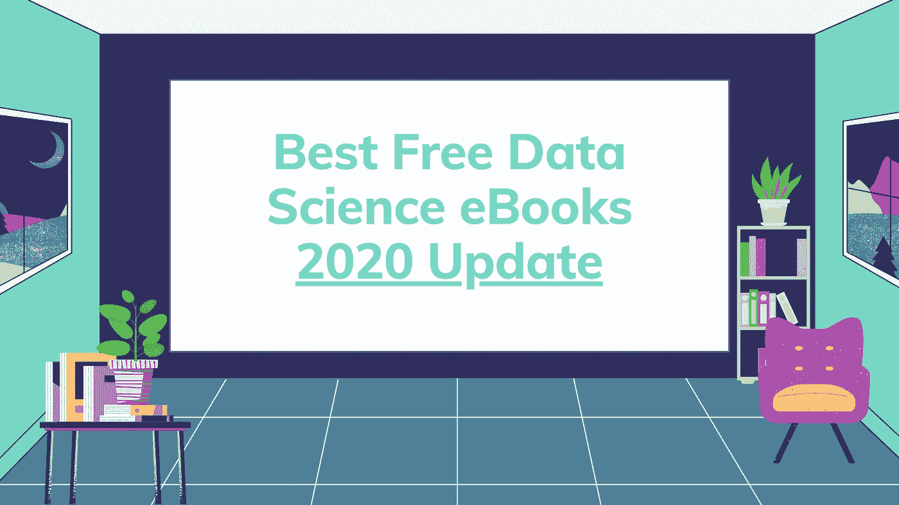
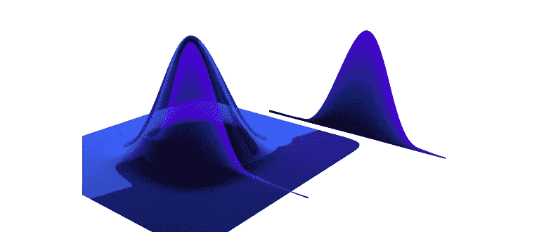

# 最佳免费数据科学电子书— 2020 年更新

> 原文：<https://towardsdatascience.com/the-best-free-data-science-ebooks-2020-update-dac5e170a478?source=collection_archive---------4----------------------->

## 理论、代码和练习

作者图片(布伦达·哈利)

我们处在一个不断发展的行业，学习资源是无限的。

去年，我收集了一些电子书，这些书在我的数据科学学习道路上帮助了我，并且被导师和教授推荐来解决特定的项目或深化概念。

随着我花时间深化我的学习，我发现了我在[之前没有推荐过的新书，或者发现了我推荐过的所有书的更新](/the-best-free-data-science-ebooks-b671691e5231)。所有的电子书在法律上都是免费的，或者是“想付多少就付多少”的概念，最低价格是 0 美元。

如果你喜欢一本书，并且你有资源这样做，我建议你寻找一种方式来支持作者，通过购买印刷版本，在 Patreon 上支持他们，或者给他们买一杯咖啡。

**让我们为大众提供高质量的教育内容。**

免责声明:Python 和有时 R 是我最喜欢的编程语言，这也是为什么大多数书都是基于这些语言的原因。如果你有其他语种的其他书籍的推荐，请在评论里分享或者 [*给我发个* tweet](https://twitter.com/brendahali) *我会补充的。*

# 概率与统计

*   **open intro Statistics(2019)**作者[大卫·迭斯](https://leanpub.com/u/diez)，[米恩·切廷卡亚-伦德尔](https://leanpub.com/u/mine-cetinkaya-rundel)，[克里斯多佛·巴尔](https://leanpub.com/u/cdbarr)，以及 [OpenIntro](https://leanpub.com/u/openintro)

描述:一个完整的统计学基础，也是数据科学的基础。OpenIntro Statistics 提供了大学水平的统计学的传统介绍。这本教科书在大学里被广泛使用，为从社区大学到常春藤联盟的学生提供了一个特别的和容易理解的介绍。

 [## OpenIntro 统计

### 一个完整的统计学基础，也是数据科学的基础。Leanpub 收入支持 OpenIntro…

leanpub.com](https://leanpub.com/openintro-statistics) 

*   **概率介绍***——*2019 年哈佛统计 110 z 官方书籍，作者约瑟夫·k·布利茨坦和杰西卡·黄

本书提供了理解统计、随机性和不确定性的基本语言和工具 *。这本书探索了各种各样的应用和例子，从巧合和悖论到谷歌 PageRank 和马尔可夫链蒙特卡罗(MCMC)。探索的其他应用领域包括遗传学、医学、计算机科学和信息论。*

*作者以通俗易懂的方式呈现材料，并使用真实世界的例子激发概念。做好准备，这是一本大书！。*

[probabilitybook.net](http://www.probabilitybook.net/)

图片由 probabilitybook.net 拍摄

此外，查看他们的大概率备忘单:

 [## 概率备忘单

### 这是一份 10 页的概率备忘单，由乔教授的哈佛概率导论课程汇编而成

www.wzchen.com](http://www.wzchen.com/probability-cheatsheet) 

*   **概率规划&黑客的贝叶斯方法(2020)** 作者 Cam Davidson-Pilon

*描述:面向黑客的贝叶斯方法旨在从计算/理解第一，数学第二的角度介绍贝叶斯推理。当然，作为一本入门书，我们也只能到此为止:一本入门书。对于受过数学训练的人来说，他们可能会对这篇文章产生的好奇心和其他用数学分析设计的文章产生兴趣。对于数学背景不太好的爱好者，或者对数学不感兴趣，而只是对贝叶斯方法的实践感兴趣的人来说，这篇文章应该是足够的和有趣的。*

 [## 黑客的贝叶斯方法

### 贝叶斯方法是推理的自然方法，但它隐藏在慢…

camdavidsonpilon.github.io](http://camdavidsonpilon.github.io/Probabilistic-Programming-and-Bayesian-Methods-for-Hackers/) 

使用 TensorFlow repo 查看他们令人惊叹的 Github:

 [## 面向黑客的概率编程和贝叶斯方法

### 使用 Python 和 PyMC，贝叶斯方法是推理的自然方法，但它对读者来说是隐藏的…

github.com](https://github.com/CamDavidsonPilon/Probabilistic-Programming-and-Bayesian-Methods-for-Hackers) 

*   **数据科学家实用统计(2017)** 作者:Peter Bruce 和 Andrew Bruce

*描述:这本书的目标读者是对 R 编程语言有所了解，并且之前接触过统计学(也许是零星的或短暂的)的数据科学家。我们都是从统计世界来到数据科学世界的，所以我们对统计能够为数据科学艺术做出的贡献有所了解。与此同时，我们很清楚传统统计学教学的局限性:统计学作为一门学科已经有一个半世纪的历史，大多数统计学教科书和课程充满了远洋客轮的动力和惯性。*

# **编程**

*   Roger d. Peng 的数据科学编程

*描述:这本书为您带来了 R 编程的基础，使用了作为行业领先的 Johns Hopkins 数据科学专业的一部分开发的相同材料。本书教授的技能将为您开始学习数据科学奠定基础。*

 [## 数据科学编程

### 这本书给你带来了 R 编程的基础知识，使用了与……

leanpub.com](https://leanpub.com/rprogramming) 

*   **用 R** 进行探索性数据分析

*描述:这本书教你使用 R 有效地可视化和探索复杂的数据集。探索性数据分析是数据科学过程中的一个关键部分，因为它允许您明确您的问题并改进您的建模策略。这本书是基于行业领先的约翰霍普金斯数据科学专业。*

 [## 用 R 进行探索性数据分析

### 这本书教你使用 R 有效地可视化和探索复杂的数据集。探索性数据分析是一种…

leanpub.com](https://leanpub.com/exdata) 

*   **命令行中的数据科学(2020)** 作者耶鲁安·扬森斯

*描述:本书从网站、API、数据库和电子表格中获取数据*

*   *对文本、CSV、HTML/XML 和 JSON 执行清理操作*
*   *浏览数据，计算描述性统计数据，并创建可视化效果*
*   *管理您的数据科学工作流*
*   *从一行程序和现有的 Python 或 R 代码中创建可重用的命令行工具*
*   并行化和分布数据密集型流水线
*   *使用降维、聚类、回归和分类算法对数据建模*

 [## 命令行中的数据科学，1e

### 本实践指南演示了命令行的灵活性如何帮助您成为一个更高效的…

www.datascienceatthecommandline.com](https://www.datascienceatthecommandline.com/1e/) 

*   **Python 3 101 (2019 —更新**)作者:Michael Driscoll

*描述:从头到尾学习如何用 Python 3 编程。Python 101 从 Python 的基础开始，然后在您从那里学到的基础上进行构建。这本书的读者主要是过去做过编程，但想学习 Python 的人。除了初级材料，这本书还涵盖了相当数量的中级材料。*

[https://python101.pythonlibrary.org/](https://python101.pythonlibrary.org/)

*   Steven Bird、Ewan Klein 和 Edward Loper 用 Python 进行自然语言处理

描述:这本书是 NLP 的实用介绍。你将通过实例学习，编写真正的程序，并理解通过实现来测试一个想法的价值。如果你还没有学过，这本书会教你编程。与其他编程书籍不同，我们提供了 NLP 的大量插图和练习。我们采用的方法也是有原则的，因为我们涵盖了理论基础，并且不回避仔细的语言和计算分析。我们试图务实地在理论和应用之间取得平衡，找出联系和矛盾。最后，我们认识到，除非它也是令人愉快的，否则你不会通过它，所以我们试图包括许多有趣和娱乐性的应用和例子，有时是异想天开的。

 [## NLTK 图书

### Steven Bird、Ewan Klein 和 Edward Loper 这本书的 NLTK 版本针对 Python 3 和 NLTK 3 进行了更新。第一个…

www.nltk.org](https://www.nltk.org/book/) 

*   **海量数据集挖掘(2019)** 作者Jure Leskovec(斯坦福大学)、Anand Raja Raman(rocket ship Ventures)、Jeffrey D. Ullman(斯坦福大学)

*描述:这本书专注于大量数据的数据挖掘，也就是说，数据大到主存都装不下。因为强调大小，他们的很多例子都是关于 Web 或者从 Web 派生的数据。此外，该书从算法的角度出发:数据挖掘是将算法应用于数据，而不是使用数据来“训练”某种机器学习引擎。*

*   **机器学习的向往(2016)** 作者吴恩达

*描述:人工智能正在改变众多行业。机器学习向往，教你如何构造机器学习项目。*

这本书的重点不是教你 ML 算法，而是如何让 ML 算法发挥作用。读完《机器学习向往》，你就能:

*   *优先考虑人工智能项目最有前途的方向*
*   *诊断机器学习系统中的错误*
*   *在复杂设置中构建 ML，例如不匹配的训练/测试集*
*   *建立一个 ML 项目来比较和/或超越人类水平的绩效*
*   知道何时以及如何应用端到端学习、迁移学习和多任务学习。

 [## 机器学习向往- deeplearning.ai

### 人工智能正在改变众多行业。来自吴恩达的免费电子书《机器学习向往》教你如何…

www.deeplearning.ai](https://www.deeplearning.ai/machine-learning-yearning/) 

# 领导数据科学团队

*   **高管数据科学(2018)** 作者:布莱恩·卡弗、罗杰·d·彭和杰弗里·莱克

*描述:这本书教你如何组建和领导一个数据科学企业，以便你的组织能够从大数据中提取信息。*

 [## 执行数据科学

### 这本书教你如何组装和领导一个数据科学企业，使您的组织可以走向…

leanpub.com](https://leanpub.com/eds) 

有没有另一本电子书必须在这个列表中？请在评论中与我分享，或者给我发一条推文【https://twitter.com/brendahali 