# 邮件分类的最佳机器学习算法

> 原文：<https://towardsdatascience.com/the-best-machine-learning-algorithm-for-email-classification-39888e7b1846?source=collection_archive---------5----------------------->

## 实施机器学习算法对电子邮件进行分类

**邮件分类**是一个机器学习问题，属于**监督学习的范畴。**


照片由[莎拉·库菲](https://unsplash.com/@stereophototyp?utm_source=medium&utm_medium=referral)在 [Unsplash](https://unsplash.com?utm_source=medium&utm_medium=referral) 拍摄

这个电子邮件分类的迷你项目的灵感来自 J.K .罗琳以笔名出版的一本书。Udacity 的**“机器学习简介”**提供了对算法和项目的全面研究。

[](https://www.udacity.com/course/intro-to-machine-learning--ud120) [## 机器学习课程介绍| Udacity

### 机器学习是当今数据分析领域最令人兴奋的职业的头等舱门票。作为数据源…

www.udacity.com](https://www.udacity.com/course/intro-to-machine-learning--ud120) 

几年前，罗琳以罗伯特·加尔布雷斯的名字写了一本书，书名是《布谷鸟的呼唤》。这本书获得了一些好评，但没有人太关注它——直到 Twitter 上的一位匿名线人说这是 J.K .罗琳。伦敦《星期日泰晤士报》邀请了两位专家将《布谷鸟》的语言模式与罗琳的《偶然的空缺》以及其他几位作者的书进行比较。在他们的分析结果强烈指向罗琳是作者后，时报直接问出版商他们是否是同一个人，出版商证实了。这本书一夜之间大受欢迎。

电子邮件分类基于相同的基本概念。通过检查电子邮件的文本，我们将使用机器学习算法来预测电子邮件是由一个人还是另一个人写的。

# 数据集

数据集可以从以下 GitHub 存储库中获取:

[](https://github.com/MahnoorJaved98/Email-Classification) [## mahnoorjaved 98/电子邮件-分类

### 使用不同机器学习算法的电子邮件分类。几年前，J.K .罗琳(哈利·波特…

github.com](https://github.com/MahnoorJaved98/Email-Classification) 

在这个数据集中，我们有一组电子邮件，其中一半是一个人(Sara)写的，另一半是同一家公司的另一个人(Chris)写的。数据基于字符串列表。每个字符串都是经过一些基本预处理的电子邮件文本。

我们将根据邮件的内容将邮件分类为一个人写的或另一个人写的。我们将逐一使用以下算法:**朴素贝叶斯、支持向量机、决策树、随机森林、KNN 和 AdaBoost 分类器。**

存储库有两个 pickle 文件:word_data 和 email_authors。

email_preprocess python 文件用于处理来自 pickles 文件的数据。它将数据分成 0.1 个测试数据的训练/测试。

# 朴素贝叶斯:

朴素贝叶斯方法是一组基于贝叶斯定理的监督学习算法，假设给定类变量的值，每对特征之间条件独立且贡献相等。贝叶斯定理是一个简单的数学公式，用于计算条件概率。

**高斯朴素贝叶斯**是一种朴素贝叶斯，其中假设特征的似然性为高斯。假设与每个特征相关联的连续值按照高斯分布分布。绘制时，它给出一条钟形曲线，该曲线关于特征值的平均值对称。

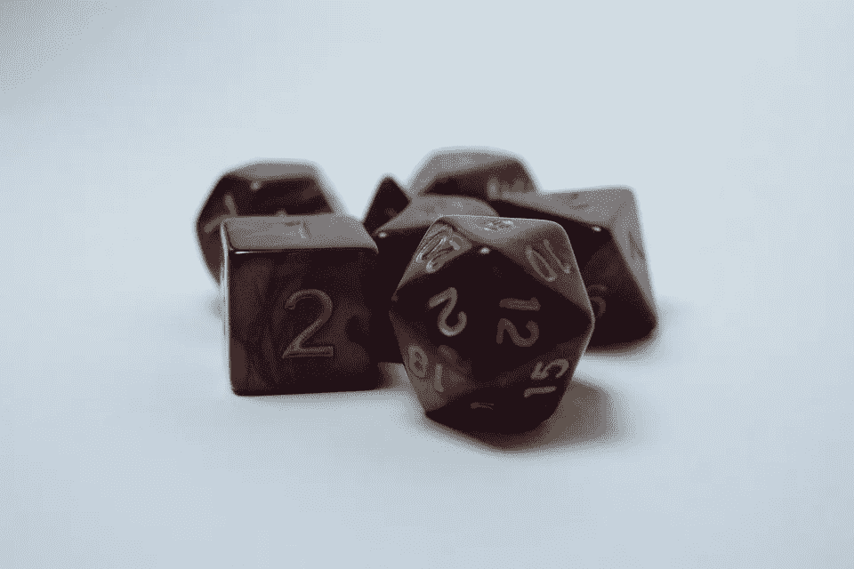

图片来自 [Pixabay](https://cdn.pixabay.com/photo/2019/08/27/03/56/dice-4433289_960_720.jpg)

我们将使用 scikit-learn 库中的高斯朴素贝叶斯算法来对这两位作者的电子邮件进行分类。

下面是您可以在任何 python IDE 上实现的 Python 代码，系统上安装了所需的库。

```
import sys
from time import time
sys.path.append("C:\\Users\\HP\\Desktop\\ML Code\\")
from email_preprocess import preprocess
import numpy as np# using the Gaussian Bayes algorithm for classification of emails.
# the algorithm is imported from the sklearn library
from sklearn.naive_bayes import GaussianNB
from sklearn.metrics import accuracy_score# initializaing the test and train features and labels
# the function preprocess is imported from email_preprocess.py 
features_train, features_test, labels_train, labels_test = preprocess()# defining the classifier
clf = GaussianNB()#predicting the time of train and testing
t0 = time()
clf.fit(features_train, labels_train)
print("\nTraining time:", round(time()-t0, 3), "s\n")
t1 = time()
pred = clf.predict(features_test)
print("Predicting time:", round(time()-t1, 3), "s\n")#calculating and printing the accuracy of the algorithm
print("Accuracy of Naive Bayes: ", accuracy_score(pred,labels_test))
```

运行代码会产生以下结果:

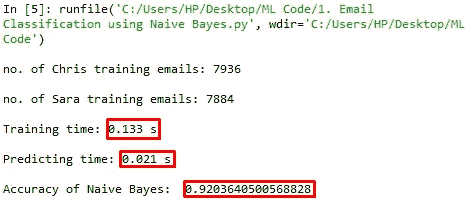

朴素贝叶斯结果(图片由作者提供)

在 **0.9203** 中，朴素贝叶斯对于这个特殊问题的准确性。相当不错吧？甚至算法的训练和预测次数也相当合理。

# 支持向量机

支持向量机也是一种监督学习，用于分类、回归以及异常值检测。我们可以使用 SVM 算法将数据点分成两类，通过一个平面将它们分开。SVM 有一个直的决策边界。SVM 算法非常通用，可以为决策函数指定不同的核函数。

SVM 算法基于将两类分开的超平面，间隔越大，分类越好(也称为间隔最大化)。

我们的分类器是具有线性核和 C = 1 的值的 C-支持向量分类器

clf = SVC(内核= '线性'，C=1)

```
import sys
from time import time
sys.path.append("C:\\Users\\HP\\Desktop\\ML Code\\")
from email_preprocess import preprocess
from sklearn.svm import SVC
from sklearn.metrics import accuracy_score### features_train and features_test are the features for the training
### and testing datasets, respectively
### labels_train and labels_test are the corresponding item labels
features_train, features_test, labels_train, labels_test = preprocess()#defining the classifier
clf = SVC(kernel = 'linear', C=1)#predicting the time of train and testing
t0 = time()
clf.fit(features_train, labels_train)
print("\nTraining time:", round(time()-t0, 3), "s\n")
t1 = time()
pred = clf.predict(features_test)
print("Predicting time:", round(time()-t1, 3), "s\n")#calculating and printing the accuracy of the algorithm
print("Accuracy of SVM Algorithm: ", clf.score(features_test, labels_test))
```

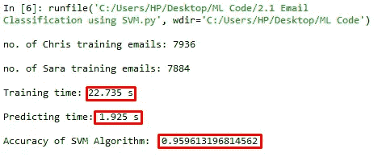

SVM 结果(作者图片)

SVM 算法的精度是 **0.9596** 。我们可以看到准确性和训练时间之间的明显权衡。算法准确性的提高是训练时间更长的结果(22.7 秒，而在朴素贝叶斯的情况下为 0.13 秒)。我们可以利用**训练数据**以及**内核**来进行最佳选择，这将在更少的训练时间内产生**良好的准确度分数！**

我们将首先将训练数据集分割成其原始大小的 **1%** ，从而丢弃 99%的训练数据。在代码的其余部分不变的情况下，我们可以观察到训练时间的显著减少和准确性的相应降低。代价是**当我们减少训练数据**时，准确性几乎总是下降。

使用以下代码将定型数据分割为 1%:

```
features_train = features_train[:len(features_train)//100]
labels_train = labels_train[:len(labels_train)//100]
```

可以看出，使用 1%的训练数据，算法的训练时间已经减少到**0.01 秒**，精度减少到 **0.9055** 。

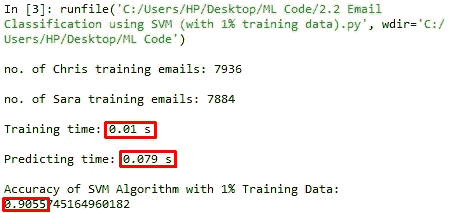

1%训练数据的 SVM(图片由作者提供)

10%的训练数据，精度为 **0.9550** ，训练时间**0.47 秒**。

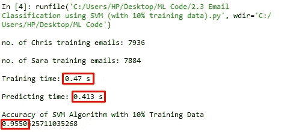

具有 10%训练数据的 SVM(图片由作者提供)

我们也可以改变 scikit-learn 的 C-支持向量分类中的核和 C 的值。

使用 100%的训练数据、RBF 核，并且 C 的值设置为 10000，我们得到的精度为 **0.9891** ，训练时间为 **14.718** 。

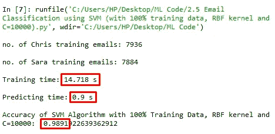

具有 100%训练数据、RBF 核和 C=10000 的 SVM(图片由作者提供)

# 决策树

决策树是一种用于分类和回归的非参数监督学习方法。决策树可以对数据集进行多类分类。使用从数据特征推断出的一些决策规则，在每个节点上对数据进行逐步分类。决策树很容易可视化。我们可以通过可视化贯穿树的数据集来理解该算法，并在各个节点做出决策。


图片来自 [Unsplash](https://images.unsplash.com/photo-1535127022272-dbe7ee35cf33?ixlib=rb-1.2.1&ixid=eyJhcHBfaWQiOjEyMDd9&auto=format&fit=crop&w=750&q=80)

让我们看看这个算法如何在我们的数据集上工作。

```
import sys
from time import time
sys.path.append("C:\\Users\\HP\\Desktop\\ML Code\\")
from email_preprocess import preprocess
from sklearn import treefrom sklearn.metrics import accuracy_score### features_train and features_test are the features for the training
### and testing datasets, respectively
### labels_train and labels_test are the corresponding item labels
features_train, features_test, labels_train, labels_test = preprocess()# defining the classifier
clf = tree.DecisionTreeClassifier()print("\nLength of Features Train", len(features_train[0]))#predicting the time of train and testing
t0 = time()
clf.fit(features_train, labels_train)
print("\nTraining time:", round(time()-t0, 3), "s\n")
t1 = time()
pred = clf.predict(features_test)
print("Predicting time:", round(time()-t1, 3), "s\n")#calculating and printing the accuracy of the algorithm
print("Accuracy of Decision Trees Algorithm: ", accuracy_score(pred,labels_test))
```

运行上面的代码，我们得到的准确度为 **0.9880** ，训练时间为**6.116 秒。**这是一个非常好的准确度分数，不是吗？我们有 100%的训练数据用于训练模型。

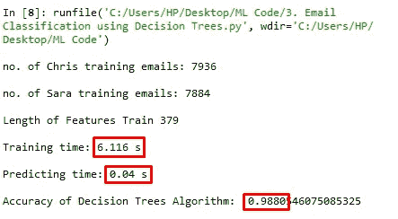

决策树算法(作者图片)

# 随机森林


图片来自 [Unsplash](https://images.unsplash.com/photo-1504868584819-f8e8b4b6d7e3?ixlib=rb-1.2.1&ixid=eyJhcHBfaWQiOjEyMDd9&auto=format&fit=crop&w=755&q=80)

随机森林是建立在决策树上的集成监督学习算法。随机森林用于回归和分类任务。该算法的名字来源于随机选择的特征。

我们可以在数据集上使用 sklearn 库中的随机森林算法:**RandomForestClassifier()**。

下面是用于在我们的电子邮件分类问题上运行随机森林算法的代码。

```
import sys
from time import time
sys.path.append("C:\\Users\\HP\\Desktop\\ML Code\\")
from email_preprocess import preprocess
from sklearn.ensemble import RandomForestClassifier
from sklearn.metrics import accuracy_score### features_train and features_test are the features for the training
### and testing datasets, respectively
### labels_train and labels_test are the corresponding item labels
features_train, features_test, labels_train, labels_test = preprocess()# defining the classifier
clf = RandomForestClassifier(max_depth=2, random_state=0)#predicting the time of train and testing
t0 = time()
clf.fit(features_train, labels_train)
print("\nTraining time:", round(time()-t0, 3), "s\n")
t1 = time()
pred = clf.predict(features_test)
print("Predicting time:", round(time()-t1, 3), "s\n")#calculating and printing the accuracy of the algorithm
print("Accuracy of Random Forest Algorithm: ", accuracy_score(pred,labels_test))
```

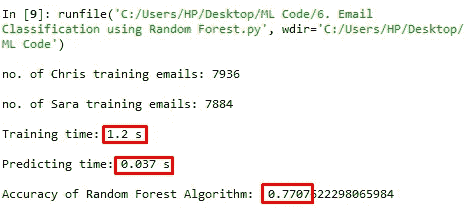

随机森林算法(图片作者提供)

算法的准确率相当低，即；0.7707.训练时间是 1.2s，这是合理的，但总的来说，它不是解决我们问题的好工具。准确率低的原因是特征选择的随机性，这是随机森林的一个特性。随机森林是由许多决策树组成的模型。这个模型不是简单地对树(我们可以称之为“森林”)的预测进行平均，而是使用了两个关键概念，这两个概念赋予了它随机的名称:在构建树时对训练数据点进行随机采样。

# KNN — K 个最近邻居

k 最近邻是一种受监督的机器学习算法，可用于分类和回归预测问题。KNN 是一个懒惰的学习者。它依赖于距离进行分类，因此规范化训练数据可以显著提高其准确性。


图片来自 [Unsplash](https://images.unsplash.com/photo-1586449480558-33ae22ffc60d?ixlib=rb-1.2.1&ixid=eyJhcHBfaWQiOjEyMDd9&auto=format&fit=crop&w=750&q=80)

让我们看看使用来自 sklearn 库 **KNeighborsClassifier()** 的 KNN 算法对电子邮件进行分类的结果，该算法具有 5 个最近邻居和欧几里德度量。

```
import sys
from time import time
sys.path.append("C:\\Users\\HP\\Desktop\\ML Code\\")
from email_preprocess import preprocess
from sklearn.neighbors import KNeighborsClassifier
from sklearn.metrics import accuracy_score### features_train and features_test are the features for the training
### and testing datasets, respectively
### labels_train and labels_test are the corresponding item labels
features_train, features_test, labels_train, labels_test = preprocess()# defining the classifier
clf = KNeighborsClassifier(n_neighbors=5, metric='euclidean')#predicting the time of train and testing
t0 = time()
clf.fit(features_train, labels_train)
print("\nTraining time:", round(time()-t0, 3), "s\n")
t1 = time()
pred = clf.predict(features_test)
print("Predicting time:", round(time()-t1, 3), "s\n")#calculating and printing the accuracy of the algorithm
print("Accuracy of KNN Algorithm: ", accuracy_score(pred,labels_test))
```

算法的精度为 **0.9379** ，训练时间为 **2.883s** 。然而，可以注意到，模型工具需要相当长的时间来预测类别。

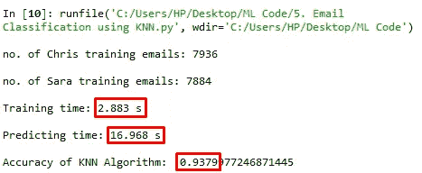

KNN 算法(图片作者提供)

# **AdaBoost 分类器**


图片来自 [Unsplash](https://images.unsplash.com/photo-1461749280684-dccba630e2f6?ixlib=rb-1.2.1&ixid=eyJhcHBfaWQiOjEyMDd9&auto=format&fit=crop&w=1500&q=80)

Ada-boost 或自适应 boosting 也是一种集成 Boosting 分类器。它是一种元估计器，首先在原始数据集上拟合一个分类器，然后在同一数据集上拟合该分类器的附加副本，但是其中调整不正确分类的实例的权重，使得后续分类器更加关注困难的情况。

我们将使用 scikit 库中的分类器。以下是代码:

```
import sys
from time import time
sys.path.append("C:\\Users\\HP\\Desktop\\ML Code\\")
from email_preprocess import preprocess
from sklearn.ensemble import AdaBoostClassifier
from sklearn.metrics import accuracy_score### features_train and features_test are the features for the training
### and testing datasets, respectively
### labels_train and labels_test are the corresponding item labels
features_train, features_test, labels_train, labels_test = preprocess()# defining the classifier
clf = AdaBoostClassifier(n_estimators=100, random_state=0)#predicting the time of train and testing
t0 = time()
clf.fit(features_train, labels_train)
print("\nTraining time:", round(time()-t0, 3), "s\n")
t1 = time()
pred = clf.predict(features_test)
print("Predicting time:", round(time()-t1, 3), "s\n")#calculating and printing the accuracy of the algorithm
print("Accuracy of Ada Boost Classifier: ", accuracy_score(pred,labels_test))
```

分类器的精度为 **0.9653** ，训练时间为**17.946 秒**。准确度相当好，但是，训练时间比要求的时间稍长。

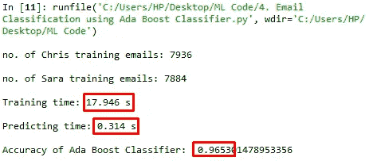

Ada Boost 分类器(图片由作者提供)

# 结论

在这篇文章中，我们使用了几种机器学习算法来分类 Chris 和 Sara 之间的电子邮件。这些算法产生了 0.77-0.98 之间的不同准确度分数。从下表中可以看出，模型是按照精度递增的方式排列的:

*   随机森林算法的准确率最低
*   SVM 算法的训练时间最长
*   优化参数为 C=10000 和 RBF 核的 SVM 算法的准确率最高
*   朴素贝叶斯算法具有最快的预测时间

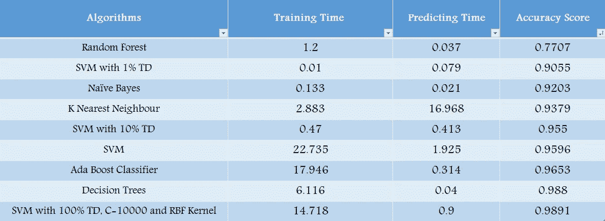

结论(图片由作者提供)

虽然有许多其他分类算法可用于我们的任务，但对数据集上运行的基本算法的比较得出结论，对于我们的特定问题，SVM 是最准确的，考虑到其参数根据我们正在处理的任务进行了优化。

你认为其他算法或模型会做得更好，或者同样好吗？

分享经验，关注我更多文章！