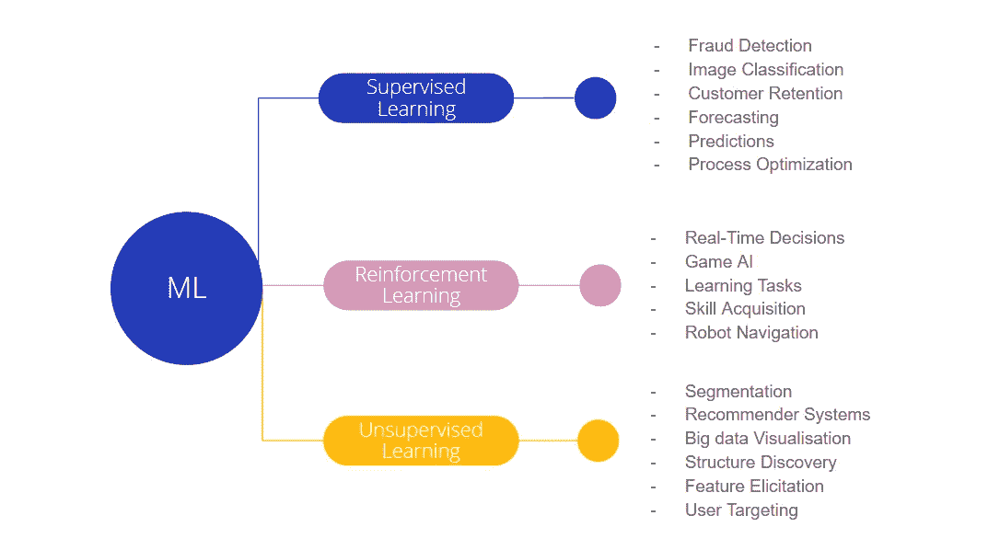

# 21 世纪 20 年代获得顶级对冲基金职位的最佳机器学习算法

> 原文：<https://towardsdatascience.com/the-best-machine-learning-algorithms-to-learn-for-landing-a-top-hedge-fund-job-in-the-2020s-c58b660ac27f?source=collection_archive---------27----------------------->

## 通过学习供给不足而需求增加的技能，你可以最大化你被雇佣的机会

对冲基金分析师的角色代表了所有金融行业(如果不是任何行业的话)中一些竞争最激烈的角色。这份工作变化多端，极具挑战性，这使得这些工作成为许多雄心勃勃的大三学生的长期目标，他们来自不同的背景，如计算机科学、金融、经济、物理等等。这造成了激烈的角色竞争。反过来，挑战不仅仅是获得一个角色，还要保持足够的相关性，以便长期保持这个角色。

对冲基金正在投资的领域之一是增加他们内部的数据科学和机器学习人才。在最近的一项调查中，56%的公司表示，到 2021 年，他们将在交易流程中使用机器学习(Greenwich Associates，2019)。如果我们更深入地研究这一点，我们可以看到买方公司对“人工智能”的采用仅落后于行业其他公司 21%。然而，36%的受访者表示，他们将在未来两年内实施“人工智能”系统。要做到这一点，他们将不得不雇用大量的新人来建立、管理和维护这些系统。

对于门外汉来说，答案可能是成为机器学习专家——句号。对于我们这些对这个领域有更深理解的人来说，这不是一个现实的目标。当然，对不同技能——深度学习、优化、无监督方法——有一个基本的了解是很重要的。但是，要想在成千上万的候选人中脱颖而出，你必须具备对某个特定领域的深刻理解和专业知识。问题是，你应该把哪个区域变成你自己的？

ML 技能及其部分用途 Auquan - 2020

# 为什么你应该把自然语言处理作为你的重点

不想拐弯抹角，或者拖拖拉拉，我们认为你应该认真考虑让 NLP 成为你的核心专长。这有两个主要原因:

*   你将能够产生独一无二的阿尔法
*   你会更有适应能力，能够申请更多的公司

**提供独特的边缘**

> 部署在股票价格上的机器学习会失败。价格没有记忆；非结构化 ML 导致过度拟合、反直觉的预测、不合逻辑的聚类和虚假结果。“ML 应用于 CEO 真实性或聊天室情绪的自然语言处理，将比基本面分析师更好地预测业绩”——盘安资产管理公司 CEO Eric Sorensen

虽然这句话有点耸人听闻，对一些量化基金的成功不屑一顾，但这里也有一个教训。成千上万才华横溢的人每天都在分析每一条结构化数据，看它能否预测股票价格，他们至少在过去 50 年里一直在这么做。这种漫长的竞争意味着在这里赢得比赛并不容易，机会也很少持续很久。也许获得优势的更好方法是做一些不同的事情。例如，RenTec 通过收集高质量的大数据找到了自己的优势，这比其他人想的要早了几十年。

NLP 为这种情况的发生提供了下一个前沿。人类产生的大部分信息是非结构化的，以人类可读的格式存储，例如:年度报告、新闻文章、评论和对话。大规模利用这一点有望帮助各种不同风格的投资经理:

> 不仅是拥有物理学家和数据科学家团队的复杂对冲基金，还有更传统的经理人。例如，基本面管理人员正在使用机器学习来分析收益报表，并根据过去的公司或宏观经济新闻来检查市场走势。——Greenwich Associates，2018 年

因为 NLP 有能力处理大量的文本和表面的关键见解，以便人类采取行动，它不一定要用在纯粹的量化策略中。这意味着它可以通过帮助传统基本面投资者识别关键信息，为他们的投资过程增加价值。对你来说，这意味着有更多的公司将寻找这些角色，因此 NLP 熟练的数据科学家有更多的机会。

综上所述，NLP 很有可能通过开放自动分析大量非结构化数据的能力，开启下一个重大投资机会。当这种情况发生时，它不仅会改变量化风格经理的工作流程，还会改变每个投资专业人士。这意味着，通过学习 NLP，你将自己置于一个重要雇员和几乎所有投资商店的位置。

# 如何开始学习面向金融的 NLP

有很多免费资源可以帮助你从头开始学习 NLP。下面我们已经链接到了每种方法的一个例子，并且看了实际方法的更多细节。最好找到适合你的，可能是其他选项的组合。

*   **博客**(如 https://nlpers.blogspot.com/[，【https://medium.com/huggingface】](https://nlpers.blogspot.com/)
*   **书籍**(如 https://web.stanford.edu/~jurafsky/slp3/的[或 https://nlp.stanford.edu/fsnlp/](https://web.stanford.edu/~jurafsky/slp3/)的
*   **课程**(如[http://cs224d.stanford.edu/syllabus.html](http://cs224d.stanford.edu/syllabus.html)或参见 Coursera.com)

还有许多其他的指南有各种资源的链接，只是谷歌如何学习自然语言处理或类似的。

尽管这些资源是很好的入门资源，但是它们并没有特别关注将 NLP 用于金融。当处理现实世界的问题时，这可能会造成知识缺口。我们 QuantQuest 平台上 NLP 竞赛的许多参与者都面临着同样的问题。这促使我们创造一些内容来弥补这一差距

# 变得实际

在我们的团队中，我们花了很多心思在人们如何学习新技能上。这部分是因为我们需要在内部培训人员，也因为学习是我们用户的一大动力。我们发现教授这些主题的最好方法是基于问题的学习。一种在解决问题时根据需要获得技能的学习方式，与先学习理论，然后在解决问题时试图记住理论相反。事实证明，这在许多领域都更有吸引力，也更有效。

为了介绍金融中的 NLP，我们创建了一个短期课程，让你在一天内解决一个真正的分析师问题。当你处理这个问题时，你会学到你需要的特定的库和方法。目的是让你知道你已经使用 NLP 做了一些有趣的事情，这样你会更有动力前进。

一旦你完成了，你将能够开始自动分析年度报告的见解。然后选择你的下一个项目，增加复杂性。

[你可以在这里查看](https://links.quant-quest.com/nlpStarterProject)

# 结束注释:

不管你喜欢什么样的学习方式，我们都希望你能仔细研究一下自然语言处理在金融领域的实际应用。在 Auquan，我们为顶级对冲基金工作，帮助它们创造更多利润，避免损失。我们越来越多地使用 NLP 来解决我们客户的挑战，并看到一些对该主题有深刻理解的候选人。这种技能短缺可以成为你脱颖而出的机会。

## 参考

[1]埃里克·索伦森/贾丝汀娜·李/彭博，[十六位领先的量化分析师畅想全球金融的下一个十年](https://www.bloomberg.com/graphics/2020-quants-predict-next-decade-in-global-finance/) (2020)

[2] Greenwich Associates，未来交易研究(2019)，via:[https://www . refinitiv . com/en/resources/special-report/automation-Trading-and-Future-technologies](https://www.refinitiv.com/en/resources/special-report/automation-trading-and-future-technologies)

[3]格林威治协会，[投资的未来是“量化的”](https://www.greenwich.com/press-release/future-investing-quantimental) (2018)