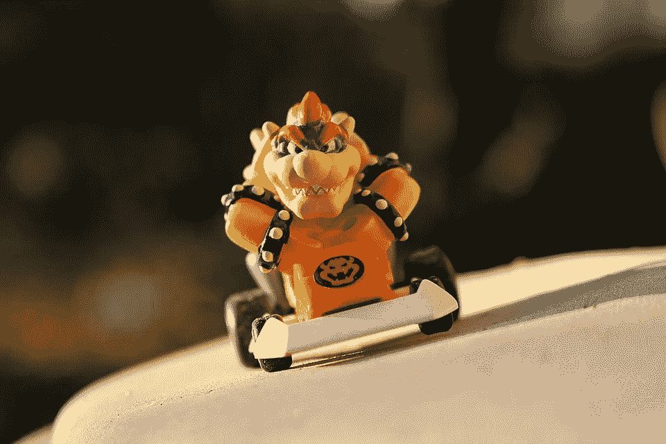
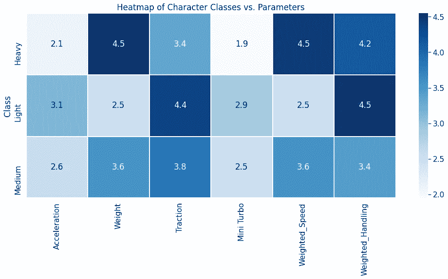
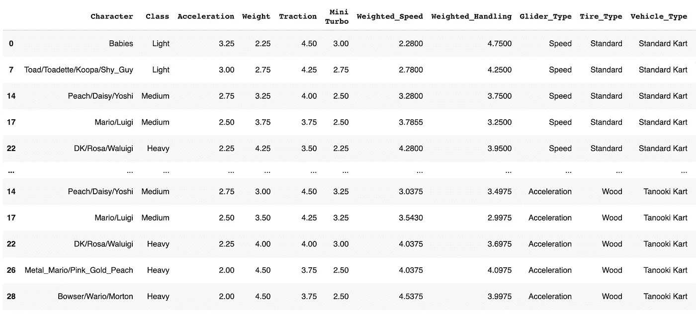
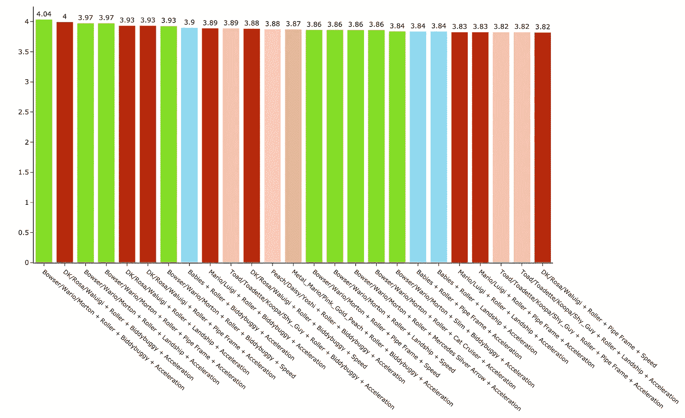
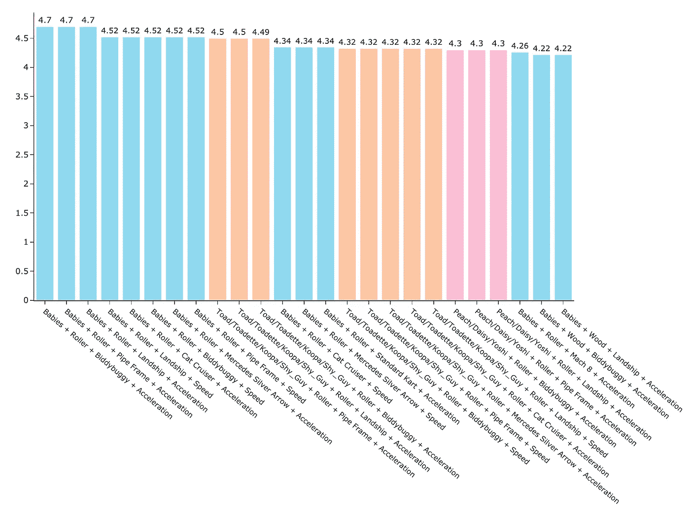
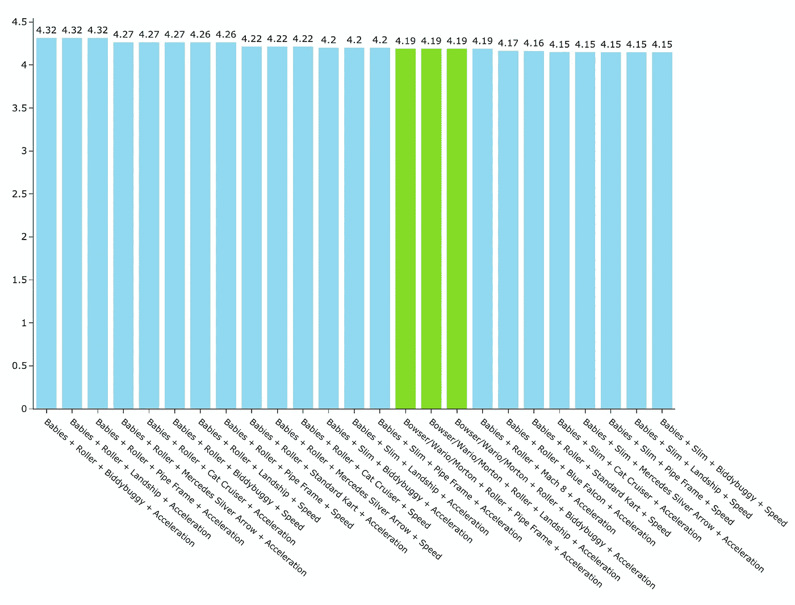
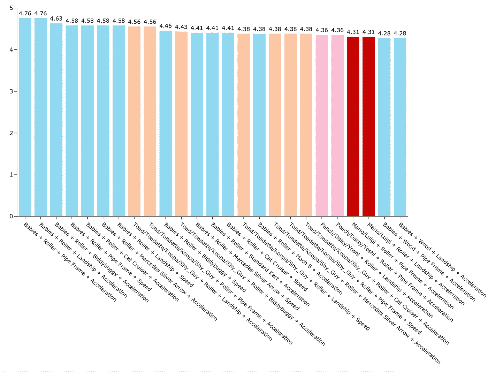

# 根据数据科学，最好的马里奥赛车 8 角色

> 原文：<https://towardsdatascience.com/the-best-mario-kart-8-character-according-to-data-science-d300dd7a645a?source=collection_archive---------2----------------------->

图片来自 Pixabay，作者 [Niap3d](https://pixabay.com/users/niap3d-529886/)

## 抬起轮子！

马里奥赛车一直是一个选择的游戏。在每个角色和卡丁车组合的背后，都有大量的深度数据。你作为玩家选择的每个部分，包括滑翔机和轮胎，都会影响设置的速度、操作和涡轮“加速”等。

马里奥赛车 8 和马里奥赛车 8 豪华版延续了这一传统，提供新老角色和赛车部件。我将使用来自 [Kaggle](https://www.kaggle.com/barelydedicated/mariokart8) 的数据来决定“最好”和最差的角色和卡丁车设置。

# 探索数据

游戏给出了不同赛道类型的单独速度和操控数据，所以为了更容易分析，我根据赛道类型的频率对参数进行了加权。我对主要参数的权重大致为 70%，地面 15%，空气 10%，水 5%。然后，我使用热图来显示体重等级的参数。

如你所见，*较重的*角色往往拥有*最快的速度*，但拥有*最少的涡轮*。*灯光*人物有*最佳操控性*但*最低速度*。

接下来，我为每一个可能的角色[职业](https://www.ign.com/wikis/mario-kart-8/Weight_Classes)、车辆、轮胎和滑翔机组合制作了一个数据集，总共有 2500 多种组合。如果我们使用单个字符，将会有近 150，000 种组合！

# 分析

有许多方法可以达到“最佳”配置。其他分析使用了帕累托效率，但每次只能观察 2 个左右的变量。为了查看所有参数，我将通过对每个参数进行加权来单独查看每个参数，并查看前 25 个组合。然后，我将尝试一个更平均的权重来确定最佳的整体组合。

**速度**

将速度和加速度加权 35%,将所有其他参数加权 10%,这为我们提供了一个最佳组合:

*   **布瑟/瓦里奥/莫顿·库帕/Mii(重型)+ Biddybuggy +滚轮轮胎+加速滑翔机**

**加速度**

将加速度和 mini turbo 加权 35%,将所有其他参数加权 10%,可以得到以下最佳组合:

*   **婴儿/Lemmy Koopa/Mii(轻型)+ Biddybuggy +滚轮轮胎+加速滑翔机**

**处理**

加权处理 50%和所有其他参数 12.5%为我们提供了*相同的最佳组合*:

*   **婴儿/Lemmy Koopa/Mii(轻型)+ Biddybuggy +滚轮轮胎+加速滑翔机**

**涡轮增压**

将 turbo 权重设为 50%，将所有其他参数权重设为 12.5%，这为我们提供了以下最佳组合:

*   **婴儿/Lemmy Koopa/Mii(轻型)+管架+滚轮轮胎+加速滑翔机**

**同等重量**

速度权重为 30%，其余参数权重为 20%(除了 10%的涡轮增压器)，这给出了以下参数的最佳组合:

*   **布瑟/瓦里奥/莫顿·库帕/Mii(重型)+biddy 越野车+滚轮轮胎+加速滑翔机**

# 结论

一般来说，速度的增加伴随着加速度的减小。较重的角色有最好的速度，因此在加权时会做得更好。婴儿和他们班上的其他角色在操控性、加速和涡轮增压方面是明显的赢家。对于初学者来说，它们可能是不错的选择。

“最佳”马里奥赛车组合是主观的，只要你有一个统计数据均匀分布的设置，**最佳选择之间的差异充其量是微不足道的**。也就是说，对于那些*喜欢速度和/或平衡设置*的玩家来说，这项分析将支持最好的组合，如**布瑟/瓦里奥/莫顿·库帕/米伊(重型)**使用**带**滚轮轮胎**和**加速滑翔机**的**双座越野车**。**

这些权重是任意的，所以这些结果不一定是可靠的，但从列出的最佳结果中挑选组合应该会给你大多数课程一个坚实的开端。

你同意这个结果吗？为什么或为什么不？