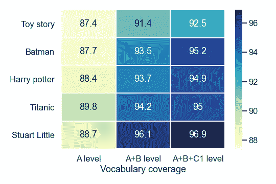
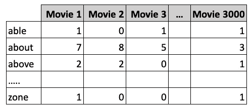
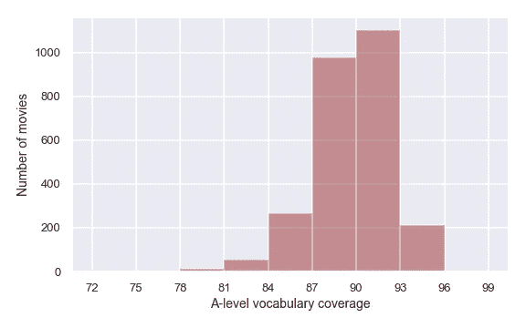
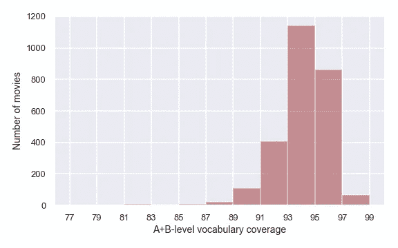

# 根据数据科学，学习外语的最佳电影

> 原文：<https://towardsdatascience.com/the-best-movies-to-learn-english-according-to-data-science-2dccb4b3ee23?source=collection_archive---------1----------------------->

## **有史以来对**电影**对白**词汇**的最大分析**。找出 3000 部电影中最适合学习外语的电影。


照片由 [Georgia Vagim](https://unsplash.com/@georgiavagim?utm_source=medium&utm_medium=referral) 在 [Unsplash](https://unsplash.com?utm_source=medium&utm_medium=referral) 上拍摄

电影是学习外语的好工具。如果你在谷歌上输入“学习英语或西班牙语的最佳电影”，会出现无数的推荐。那些推荐大多来自个人选择，这很好；然而，作为一名数据科学爱好者，我转向数据来回答问题。这次也不例外，所以我将分析排名前 3000 的电影来回答这个问题，“学习外语最好的电影是什么？”

```
**Table of Contents**[1\. Ranking Of The 3000 Most Popular Movies](#1d92) [2\. Which movie is easier to understand ‘Titanic’ or ‘Toy Story’?](#0fa4)
[3\. Methodology](#e3c8)
[4\. The best movies for people at B1 level](#6b7d)
[5\. The best movies for people at C1 level](#1b54)
[6\. Final note](#71e0)
```

# 前 3000 部电影排名

为了找到学习外语的最佳电影，我比较了 IMDb 的 3000 部最受欢迎的电影中对话中使用的词汇。你可以在下面的方框中搜索你最喜欢的电影中的词汇，看看它们有多容易或多难。在那里你会发现电影对白中的等级和词汇。**词汇量越大，电影就越容易理解**(在所有分析的电影中，前十名的电影词汇量最简单)。列表中的一些电影可能不适合你，所以请先在 IMDb 上查看它们的描述。

我还对 3000 部电影进行了中级(CA)和高级(CB)级别的排名，就像我在以前的文章中对《老友记》、《T2》【权力的游戏】、《辛普森一家》、《生活大爆炸》、《绝命毒师》[、](https://medium.com/learn-languages-with-tv/learn-english-with-breaking-bad-the-best-episodes-according-to-data-science-dd8eca1a7d2b)[和【海绵宝宝】](https://medium.com/learn-languages-with-tv/learn-a-new-language-with-spongebob-the-best-episodes-according-to-data-science-c04220f8a117)所做的那样。最右边的电影在每一层都有更多的基本词汇。同时，上面的电影是每个栏目最受欢迎的。希望你能找到你喜欢的在对话中使用基本词汇的流行电影。

我还对网飞和迪士尼+ 网站上的最佳电影和节目做了类似的排名，这些电影和节目对学习外语很有帮助。如果你订阅了其中一个，可以去看看。

如果你想知道更多关于如何通过看电视节目和电影来学习语言，我写了一个完整的指南来解释我是如何通过看电视来学习 3 种语言的。

[](https://medium.com/better-humans/a-data-driven-approach-to-learning-any-language-by-watching-tv-and-movies-95525ddff52e) [## 通过看电视和电影学习任何语言的数据驱动方法

### 我用我在编程和自然语言方面的知识分析了 3000 部电影，找到了最适合学习的…

medium.com](https://medium.com/better-humans/a-data-driven-approach-to-learning-any-language-by-watching-tv-and-movies-95525ddff52e) 

现在让我们比较一下顶级电影，这样你就会知道哪些流行电影对你来说很难理解，哪些容易理解。

# 《泰坦尼克号》和《玩具总动员》哪部电影更容易理解？

你可能听说过像《玩具总动员》这样的儿童电影比其他类型的电影更容易理解。我们将通过比较电影*《玩具总动员》*、*《蝙蝠侠诞生》、《哈利波特与火焰杯》*、*《泰坦尼克号》*和*斯图尔特·利特尔中涵盖的词汇来验证这是否属实。下面的热图显示了五部电影的词汇覆盖范围。*



作者图片

在第一列中，我们看到电影*玩具总动员*的盒子具有最浅的颜色，表明它在五部电影中具有最低的 A 级词汇覆盖率(87.4%)。虽然*玩具总动员*是为儿童准备的，但电影中的角色“巴斯光年”倾向于使用像这样的特定短语:

> 我驻扎在第四区的伽玛象限。作为太空突击队精英宇宙保护部队的一员，我保护银河
> 免受银河联盟死敌邪恶皇帝楚格入侵的威胁。

也许当你看到上面这样写的单词时很容易，但如果英语是你的第二语言或你学习英语，听那些短语就不会那么容易理解了。

所以毫无疑问为什么*玩具总动员*的 A 级词汇覆盖率最小。结果还提示，A 级和 A+B 级覆盖率最高的电影分别是*泰坦尼克号* (89.8%)和*斯图尔特·利特尔* (96.1%)。也就是说，与列出的其他电影相比，B1 水平的学习者更容易理解电影*泰坦尼克号*，而*斯图尔特·利特尔*将是 C1 水平的人最好看的电影。此外，请注意，当我们在第三列中计算 C1 词汇时，覆盖范围略有不同，因为 C1 词汇水平在电影中很少被提及。

如果你仔细检查热图，你可能会注意到电影中 A 或 A+B 级别的覆盖率值彼此相差不远(A 列中的差距为 2.4%，A+B 列中的差距为 4.7%)。然而，1%的词汇量对英语理解的影响可能会让你吃惊。

## 为什么 1%的覆盖率如此重要？

根据国家语音和演讲中心的数据，在美国，说英语的人的平均会话速率约为每分钟 150 个单词。覆盖率低 1%代表每 100 个单词中有 1 个未知单词。也就是说，*玩具总动员*和*泰坦尼克号*在 A-level 词汇覆盖率上 2.4%的差距表明*玩具总动员*的对话每分钟比*泰坦尼克号*多 3 个左右的未登录词。这个百分比可能看起来很小，但这可能决定了你是否会享受看电影的乐趣，或者很难理解一个角色在说什么。

# 方法学

要回答“学习外语最好的电影是什么？”我们可能需要一个经常看大量电影的超级影迷的帮助。这样的人可能很难找到；然而，影迷们转录的电影对白在网上可以找到。一旦我收集了电影的抄本，我就可以一个一个地阅读它们，从中找出最佳选择，但阅读 3000 份抄本可能要花去我几个月的时间。

幸运的是，有像 CountVectorizer 这样的工具可以为我们标记每个抄本。记号化将原始文本分解成称为记号的单词。比如电影*终结者*中著名的阿诺德·施瓦辛格的台词“Hasta la vista，baby”就可以拆分成四个代币:‘Hasta’，‘la’，‘vista’，‘baby’。这样，就有可能建立一个表格，告诉我们每部电影中使用的词汇。这在下图中很容易解释。



作者图片

每个单元格代表一个单词在电影中被提及的次数。在上表中，术语“能力”在电影 1 和 3 中出现过一次，但在电影 2 中没有出现，因此赋值为 0。这就是我们如何找到每部电影中所说的所有单词，但要确定学习语言的最佳电影，我们还需要知道电影对话中使用的词汇水平。

词汇是达到足够理解电影的最关键因素之一，因此本分析旨在根据牛津单词表确定涵盖 A1-A2 (A)和 B1-B2 (B)英语水平大部分词汇的电影。为了分析，我使用了[牛津的 5000 个单词列表](https://www.oxfordlearnersdictionaries.com/wordlists/oxford3000-5000)，它提供了每个英语学习者都应该知道的从 A1 到 C1 的单词分类。

经常在对话中使用 A 级词汇的电影对于至少具有 B1 级水平的人来说容易理解，而具有最高 A+B 词汇覆盖率的电影对于 C1 水平的学习者来说是完美的。也就是说，让我们为 B1 和 C1 水平的学习者找出前 50 部电影！

# B1 级人群的最佳电影

通过使用 Python，可以获得所有电影的词汇覆盖，就像我们之前对五部电影所做的那样。3000 部电影的 A 级词汇覆盖率的分布呈现在下面的直方图中。



作者图片

根据上面的直方图，许多电影覆盖了大约 90%的 A 级词汇，因此 B1 级的人可以识别 90%的电影对白。然而，正如我们之前所说，覆盖率的每一个百分比都很重要，那么推荐覆盖率最高的电影(由右边最短的条形表示)会好得多。请注意，最小的条形包含大约 200 部电影，覆盖率至少为 93%，但并不是所有这些电影都是你的最佳选择(比如，你不喜欢电影的类型或电影对你来说不够吸引)。出于这个原因，我不得不在词汇覆盖和电影受欢迎程度之间进行权衡(根据 [IMDb 评分](https://www.imdb.com/interfaces/))，以得出前 50 部电影。以下是 10 部最受欢迎的电影，至少有 93%的 A 级词汇覆盖率。

1.  [纪念品(2010 年)](https://www.imdb.com/title/tt0209144/?ref_=nv_sr_srsg_0)
2.  [盗亦有道(1990)](https://www.imdb.com/title/tt0099685/?ref_=nv_sr_srsg_0)
3.  [小丑(2019)](https://www.imdb.com/title/tt7286456/?ref_=nv_sr_srsg_0)
4.  [疤面煞星(1983)](https://www.imdb.com/title/tt0086250/?ref_=nv_sr_srsg_0)
5.  [囚徒(2013)](https://www.imdb.com/title/tt1392214/?ref_=nv_sr_srsg_0)
6.  [驱动(2011)](https://www.imdb.com/title/tt0780504/?ref_=nv_sr_srsg_2)
7.  [摄于(2008)](https://www.imdb.com/title/tt0936501/?ref_=nv_sr_srsg_0)
8.  [她(2013)](https://www.imdb.com/title/tt1798709/?ref_=nv_sr_srsg_0)
9.  [笔记本(2004)](https://www.imdb.com/title/tt0332280/?ref_=nv_sr_srsg_0)
10.  [《谍影重重》(2002)](https://www.imdb.com/title/tt0258463/?ref_=nv_sr_srsg_0)

这些电影中有你值得看的吗？

其余前 50 名的电影都列在了帖子的最后，以防你想查看你最喜欢的电影是否在里面。

# 给 C1 人看的最好的电影



作者图片

第二个直方图显示，1000 多部电影涵盖了大约 94%的 A+B 级词汇。然而，最吸引人的一组 C1 级别的电影提供了至少 96%的覆盖率。以下是 10 部最受欢迎的电影，至少有 96%的 A+B 级词汇覆盖率。

1.  [及时(2011)](https://www.imdb.com/title/tt1637688/?ref_=nv_sr_srsg_3)
2.  [红色(2010)](https://www.imdb.com/title/tt1245526/?ref_=nv_sr_srsg_3)
3.  [克洛弗菲尔德巷 10 号(2016)](https://www.imdb.com/title/tt1179933/?ref_=nv_sr_srsg_0)
4.  [调局(2011)](https://www.imdb.com/title/tt1385826/?ref_=nv_sr_srsg_0)
5.  维基·克里斯蒂娜·巴塞罗那(2008 年)
6.  [电锯惊魂二(2005)](https://www.imdb.com/title/tt0432348/?ref_=nv_sr_srsg_0)
7.  [婚姻故事(2019)](https://www.imdb.com/title/tt7653254/?ref_=nv_sr_srsg_0)
8.  [温暖的身体(2013)](https://www.imdb.com/title/tt1588173/?ref_=nv_sr_srsg_0)
9.  [誓言(2012)](https://www.imdb.com/title/tt1606389/?ref_=nv_sr_srsg_0)
10.  [未来三天(2010 年)](https://www.imdb.com/title/tt1458175/?ref_=nv_sr_srsg_0)

正如你所料，许多已经推荐给 B1 级的电影也将被推荐给 C1 级，但我没有把它们包括在内，以避免在前 50 名中出现重复。如果你的级别是 C1，请随意观看之前为 B1 级推荐的任何电影。

# 最后一个音符

最后，关于我如何处理数据的一些观察:

*   牛津单词表只提供单词的基本形式。也就是说，您可能会发现单词“write”被归类到 A1 级别，但形式“writes”、“writing”和“written”不会显示在列表中。显然，电影的对话包括所有的单词形式，所以为了解决这个问题，我使用了提供列表中 5000 个单词的所有单词形式的数据。
*   本分析中的 A 级和 B 级覆盖假设了解专有名词，如“John”和边缘词，如“ah”、“oh”、“mmm”。两者都占电影总代币的 3-4%左右。
*   在电影中听不到的词，如场景描述和发言者的名字，都从文字记录中删除了。

如果你想看这个分析背后的代码，你可以在这里找到。请记住，词汇并不是很好地理解电影的唯一因素。发音、口音和语速也可能会提高或降低你的理解水平。

**更像这样:**

[](https://medium.com/learn-languages-with-tv/the-best-episodes-to-learn-english-with-friends-according-to-data-science-c28a31bbda62) [## 根据数据科学，和朋友一起学英语的最佳剧集

### 用数据找出《老友记》236 集最适合你学习英语和人物趣事

medium.com](https://medium.com/learn-languages-with-tv/the-best-episodes-to-learn-english-with-friends-according-to-data-science-c28a31bbda62) [](https://medium.com/learn-languages-with-tv/learn-english-with-the-big-bang-theory-the-best-episodes-according-to-data-science-50cb0ce659ad) [## 用生活大爆炸理论学习英语:根据数据科学的最佳剧集

### 用数据找出哪 279 集《生活大爆炸》最适合你学英语。

medium.com](https://medium.com/learn-languages-with-tv/learn-english-with-the-big-bang-theory-the-best-episodes-according-to-data-science-50cb0ce659ad) [](/the-simpsons-is-the-best-tv-show-to-increase-your-english-vocabulary-f433fe060a74) [## 《辛普森一家》是增加你英语词汇量的最佳电视节目

### 《辛普森一家》和 83 部电视剧中所有剧集所用词汇的数据分析。找出辛普森一家的…

towardsdatascience.com](/the-simpsons-is-the-best-tv-show-to-increase-your-english-vocabulary-f433fe060a74) 

**最适合 B1-B2 水平学习者的 50 部电影(至少 93%的 A 级词汇覆盖率)**

《记忆碎片》(2000)、《好家伙》(1990)、《小丑》(2019)、《疤面煞星》(1983)、《囚徒》(2013)、《驱力》(2011)、《夺情》(2008)、《她》(2013)、《笔记本》(2004)、《伯恩的身份》(2002)、《啦啦地》(2016)、《夏日五百日》(2009)、《追捕海蓓娜斯》(2006)、《世界大战》(2005)、《电锯惊魂》(2004)、《房间》(2009) 《热天午后》(1975)、《死者的黎明》(2004)、《后裔》(2011)、《夜行动物》(2016)、《日落之前》(2004)、《我是第四号》(2011)、《暴力史》(2005)、《灵异活动》(2007)、《无条件》(2011)、《大人物》(1988)、《It 第二章》(2019)、《不可能》(2012)、《革命之路》(2008)、《巴巴多克》(2014)、《大吉岭有限公司》

**C1 水平学习者的前 50 部电影(至少 96%的 A+B 级词汇覆盖率)**

《时间》(2011)、《红色》(2010)、《克洛弗菲尔德巷 10 号》(2016)、《调整局》(2011)、《维姬·克里斯蒂娜·巴塞罗那》(2008)、《电锯惊魂》(2005)、《婚姻故事》(2019)、《温暖的身体》(2013)、《誓言》(2012)、《未来三天》(2010)、《副作用》(2013)、《忧郁症》(2011)、《Rec》(2007)、《第一个男人》(2018)、《公路旅行》(2007) 《怪物》(2010)、《埃莱克特拉》(2005)、《不可思议》(2010)、《海威尔》(2011)、《索拉里斯》(2002)、《双子杀手》(2019)、《诱拐》(2011)、《第四种》(2009)、《我是母亲》(2019)、《隔离》(2008)、《寻找糖人》(2012)、《曲线的烦恼》(2012)、《茧》(1985)、《犯罪与轻罪》(1989)、《原罪》(2001)、《九个女王》(2012)