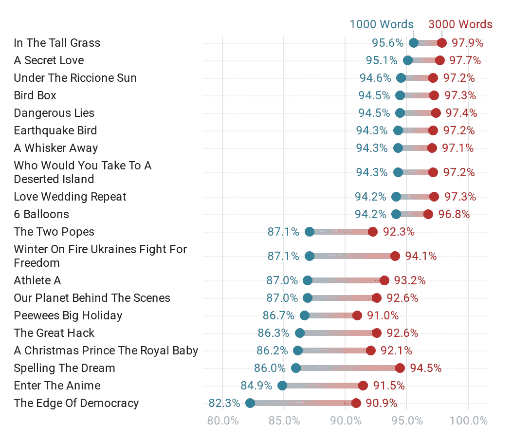

# 根据数据科学，学习外语的最佳网飞电影和系列

> 原文：<https://towardsdatascience.com/the-best-netflix-movies-series-to-learn-english-according-to-data-science-dec7b047b164?source=collection_archive---------5----------------------->

## 找出 1500 个网飞系列和电影中哪一个是学习外语的最佳选择。


在 [Unsplash](https://unsplash.com?utm_source=medium&utm_medium=referral) 上由 [Thibault Penin](https://unsplash.com/@thibaultpenin?utm_source=medium&utm_medium=referral) 拍摄的照片

截至 2020 年，网飞上大约有 3712 部电影和 1845 部电视节目。如果你正在学习英语或西班牙语，有很多内容可供选择，但你可能没有时间看完所有的内容。这就是为什么我用我的数据科学技能来分析网飞上排名前 1500 的电影和电视节目。

做了这么多工作后，我在网飞上找到了学习语言的最佳内容。这样做的目的是给你很多好的选择，让你可以找到你喜欢的电影或电视节目，这对学习语言也有好处，而不是强迫你看一个你不喜欢的电视节目，但你的老师和朋友坚持你必须看，因为“它帮助每个人学习语言。”

为了找到网飞最好的电影和电视节目，我比较了对话中使用的词汇。让我们来看看哪些是最好的电视剧和电影吧！

```
**Table of Contents** [1\. The Best TV Shows on the Netflix Catalog](#478e)
[2\. The Best Movies on the Netflix Catalog](#1f07)
[3\. The Best and Worst Netflix Originals](#4d9b)
[4\. Methodology](#ddd7)
 - [Data Collection](#4404)
 - [Tokenization](#56e9)
 - [Lemmatization](#4493)
 - [Data Cleaning](#4404)
[5\. Final Notes](#9840)
```

# 网飞目录上的最佳电视节目

自然，美国和英国在网飞的电视节目是为以英语为母语的人制作的。这就是为什么如果英语不是你的母语，你可能在某些场景中理解对话会有一些困难。幸运的是，我按照词汇难度对网飞目录上的 500 部一流电视剧(223 部网飞原创)进行了排名。

因为词汇简单，《T4 老友记》被认为是学习外语的最佳电视节目之一。然而，这部电视剧在网飞目录中只排在第 78 位，这意味着还有其他 77 部电视剧和《老友记》一样好——甚至更好！ *—* 在网飞上可以学习语言并从中获得乐趣。例如，根据我的发现，像*世界末日*(排名第 13)或 *13 个理由*(排名第 40)这样的电视剧在剧集中使用的词汇甚至更简单。

你可以在下面的方框中搜索你最喜欢的电视节目中的词汇，看看它们有多简单或多难。你会发现他们的排名和词汇覆盖面。排名前十的电视节目拥有整个网飞目录中最简单的词汇。

作者图片

例如，电视节目 *La casa de papel* 在英语配音中也被称为 *Money Heist* 排在第 342 位。这表明这个电视节目可能有一些难以理解的硬词汇。这是“再见贝拉”场景的一个片段。你觉得用的词汇高级吗？

如果你正在为你的语言水平寻找完美的电视节目，那么我有好消息告诉你！我还对所有级别(初级、中级、高级)的剧集进行了排名，就像我在之前的文章中对《老友记》、《[、【权力的游戏】、](https://medium.com/learn-languages-with-tv/learn-english-with-game-of-thrones-the-best-episodes-94eb4fba11d2)[、《辛普森一家》、](/the-simpsons-is-the-best-tv-show-to-increase-your-english-vocabulary-f433fe060a74)[、《生活大爆炸》、](https://medium.com/learn-languages-with-tv/learn-english-with-the-big-bang-theory-the-best-episodes-according-to-data-science-50cb0ce659ad)、[、【绝命毒师】、](https://medium.com/learn-languages-with-tv/learn-english-with-breaking-bad-the-best-episodes-according-to-data-science-dd8eca1a7d2b)[和【海绵宝宝】](https://medium.com/learn-languages-with-tv/learn-a-new-language-with-spongebob-the-best-episodes-according-to-data-science-c04220f8a117)所做的那样。最右边的节目在每一层使用更多的词汇。覆盖率越高，你就越容易理解电视节目中的情节。

作者图片

请记住，这些是网飞目录中的顶级电视节目。有些你喜欢的电视节目在网飞上看不到，但别担心；我已经分析了其中一些电视节目，如[](https://medium.com/learn-languages-with-tv/learn-english-with-game-of-thrones-the-best-episodes-94eb4fba11d2)**[*《辛普森一家》*](/the-simpsons-is-the-best-tv-show-to-increase-your-english-vocabulary-f433fe060a74) 以及[迪士尼电影](/the-best-disney-movies-to-learn-a-foreign-language-according-to-data-science-45e7fd084a78)。此外，网飞目录在您的国家可能略有不同。这就是为什么我列出了最有可能在全球发售的网飞原版。**

**如果你想知道更多关于如何通过看电视节目和电影来学习语言，我写了一个完整的指南来解释我是如何通过看电视来学习 3 种语言的。**

**[](https://medium.com/better-humans/a-data-driven-approach-to-learning-any-language-by-watching-tv-and-movies-95525ddff52e) [## 通过看电视和电影学习任何语言的数据驱动方法

### 我用我在编程和自然语言方面的知识分析了 3000 部电影，找到了最适合学习的…

medium.com](https://medium.com/better-humans/a-data-driven-approach-to-learning-any-language-by-watching-tv-and-movies-95525ddff52e) 

以下是学习外语的 10 大网飞原创节目:

1.  神灵
2.  早上好电话
3.  潮淹区
4.  容易的
5.  黑色的夏天
6.  夏季
7.  婴儿
8.  顶级男孩
9.  血统
10.  该死的世界末日

# 网飞目录上最好的电影

如果你更喜欢电影，那么网飞也有很好的选择。我按照词汇难度对网飞最受欢迎的 950 部电影(173 部网飞原版)进行了排名。排名前 100 的一些受欢迎的电影是*鸟盒(30)，蜘蛛侠进入蜘蛛世界(84)* 和*追求海蓓娜斯* (81)。

通过玩下面的方框，找到排名前 100 的其他电影。你还可以发现你最喜欢的电影和词汇覆盖范围的排名！

作者图片

你可以通过下面的情节找到适合你语言水平的完美电影。最右边的电影有更多的初级、中级和高级词汇。请记住，这些是网飞目录中的顶级电影。你不会在网飞上找到《T4》哈利波特、*阿凡达*或*玩具总动员*之类的电影，但如果你仍然打算看这类电影，你应该看看我的另一篇文章，我在那里分析了最受欢迎的 3000 部电影。这里可以找到[。](/the-best-movies-to-learn-english-according-to-data-science-2dccb4b3ee23)

作者图片

我还列了一个网飞原创电影的列表，这些电影很可能会在全球发行，以防网飞的目录在你的国家有所不同。

以下是学习外语的十大网飞原创电影:

1.  在高高的草丛里(2019)
2.  暗恋(2020)
3.  在里乔内·孙(2020)的带领下
4.  危险的谎言(2020)
5.  鸟箱(2018)
6.  你会带谁去荒岛(2019)
7.  地震鸟(2019)
8.  爱情婚礼重演(2020)
9.  帕德尔顿(2019 年)
10.  6 个气球(2018 年)

现在让我们来比较一下网飞上对语言学习者来说最好和可能最差的内容。

# 最好和最差的网飞原作

下图揭示了排名前十的网飞原创电影在英语词汇难度方面的差异。如你所见，后 10 个单词所用的词汇更难。比如你只需要知道最常见的 1000 个英语单词就能听懂电影*鸟盒子*中 94.5%的口语，但你至少需要 3000 个单词才能覆盖电影*拼梦*中 94.5%的对话。那多出来的 2000 字，可能就是你听不懂人物说什么的原因——哪怕你水平再高！



作者图片

# 方法学

我用 Python 做了所有这些分析，以下是我遵循的步骤:

## 数据收集

在这个分析中，我使用了 3 个主要的数据集，包括抄本、网飞目录和一个网飞原件的列表。我一直在谷歌上搜索，直到我找到足够数量的分析记录。我用目录把抄本和网飞上的书目进行了匹配。你可以在 [Kaggle](https://www.kaggle.com/shivamb/netflix-shows) 上找到网飞星表数据集。它由截至 2019 年网飞上可用的标题组成，因此可能有些电影或电视节目今天在网飞上不可用。最后，我在这里找到了一份 2020 年前发行的网飞原作列表，这对分析很有用。

## **标记化**

为了分析抄本中的词汇，我标记了所有由人物说出的单词。Python 中有许多用于标记化的工具，但我使用了 CountVectorizer，因为它将收集的副本转换成标记计数的数据帧，从而简化了分析。在我分析了 [3000 部电影](/the-best-movies-to-learn-english-according-to-data-science-2dccb4b3ee23)的文章中，我解释了更多关于 CountVectorizer 如何工作的内容。

## **词汇化**

在标记化之后，我必须找到每个标记的基本形式。您可以通过使用诸如 lemmatization 之类的技术来实现这一点，您可以在 NLTK 库中找到这些技术。然而，我使用了词族列表，它做了类似的工作，但也根据每个单词的频率给出了它的难度。截至 2020 年，共有 29 个单词家族列表，你可以在这里找到其中的一些。这些列表是根据语言学和作为第二语言的英语学习相关的研究论文主题进行评估的。

## **数据清理**

我删除了电影或剧集中听不到的单词，如场景描述和演讲者姓名。我还排除了对话中有超过 3.5%的单词与单词家族列表不匹配的抄本(它们可能是离群值或损坏的数据)。

所有代码都可以在 [Github](https://github.com/ifrankandrade/netflix.git) 上找到！

# 最终注释

*   我用来对电视节目中的词汇进行分类的大部分词汇表都是从语料库中获得的。词汇级别基于一个词在语料库中出现的频率，这意味着这些文本中最常见的词被标记为级别 1。尽管之前的研究已经证明了这些列表是可靠的，但是对于有多重含义的单词来说就不那么准确了。例如，单词“draw”在列表中被标记为级别 1。这可能会发生，因为这个词通常用于指“制作图片”，但如果意思是“拿出武器攻击某人”或“得出结论”，它可能不会是第一级
*   我花了几周时间寻找抄本，清理，处理数据，然后理解得到的结果。然而，这些发现并不完美。电影中的发现可能比电视节目中的更准确。来自电影的抄本是独特的，但是电视节目有不同的集播出，增加了每个电视节目抄本的数量。这就是为什么我收集了每部电视剧 3 到 10 集的样本，以获取该电视剧平均每集所涵盖的词汇。
*   总的来说，这些发现揭示了许多非常适合每个词汇水平的内容，但其中一些仍然让我感到惊讶。例如，我惊讶地发现*行尸走肉*排在 62 位。我不太喜欢那个电视节目，但我不认为一个有僵尸的小说节目在对话中使用了简单的词汇。在检查了剧本之后，我核实了《行尸走肉 T2》中的词汇需求在整个剧集中有很多起伏。也就是说，有些情节可能比其他情节更难理解。

## 更像这样:

如果你喜欢读这篇文章，那么你可能也会喜欢这些:

[](https://medium.com/learn-languages-with-tv/the-best-episodes-to-learn-english-with-friends-according-to-data-science-c28a31bbda62) [## 根据数据科学，和朋友一起学英语的最佳剧集

### 用数据找出《老友记》236 集最适合你学习英语和人物趣事

medium.com](https://medium.com/learn-languages-with-tv/the-best-episodes-to-learn-english-with-friends-according-to-data-science-c28a31bbda62) [](/the-best-movies-to-learn-english-according-to-data-science-2dccb4b3ee23) [## 根据数据科学，学习英语的最佳电影

### 电影是学习英语的好工具。如果你在谷歌上输入“学习英语的最佳电影”,无数…

towardsdatascience.com](/the-best-movies-to-learn-english-according-to-data-science-2dccb4b3ee23) [](/the-simpsons-is-the-best-tv-show-to-increase-your-english-vocabulary-f433fe060a74) [## 《辛普森一家》是增加你英语词汇量的最佳电视节目

### 《辛普森一家》和 83 部电视剧中所有剧集所用词汇的数据分析。找出辛普森一家的…

towardsdatascience.com](/the-simpsons-is-the-best-tv-show-to-increase-your-english-vocabulary-f433fe060a74)**