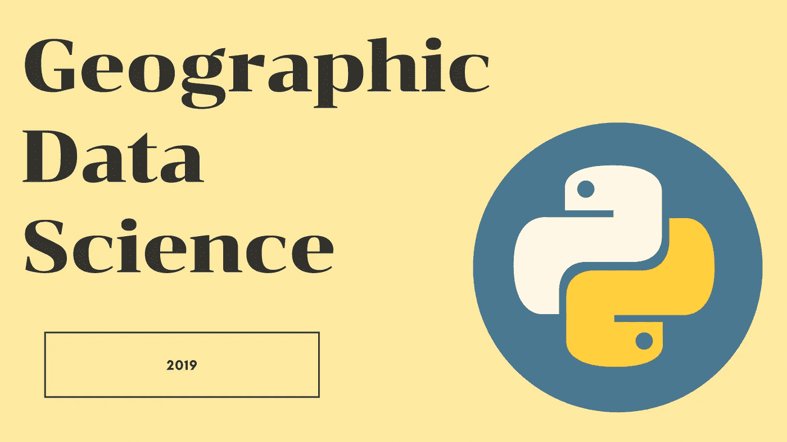
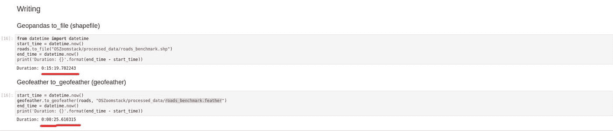
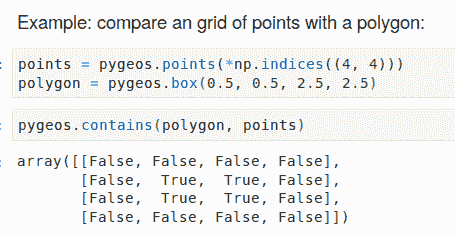

# 2019 年最佳新地理空间数据科学图书馆

> 原文：<https://towardsdatascience.com/the-best-new-geospatial-data-science-libraries-in-2019-7f0174e2a0eb?source=collection_archive---------10----------------------->

## 2019 年出现了这么多新的、令人惊叹的地理空间 Python 库。以下是我 2019 年名单中最好的补充

地理空间数据科学

作为一名地理空间数据科学家，2019 年带来了一些新工具，让我的生活变得更加轻松。在这篇文章中，我分享了 Python 生态系统中这些新增加的最好的东西和一些资源，以帮助你入门。您将找到使用 GPU、高级地理空间可视化工具和一些简单、有用的地理处理工具来加速地理空间数据科学管道的工具。希望你能从列表中找到一两个能帮到你的。

## 1. [cuSpatial](https://github.com/rapidsai/cuspatial) : GPU 加速的空间和轨迹数据管理和分析库

它是开源库的一部分，具有完全在 GPU 中执行的 GPU 加速数据科学管道。它是 2019 年持续发展的图书馆之一，也是这些生态系统的一部分，cuSpatial 为地理空间数据科学进程提供了加速工具。一个展示 GPU 加速地理空间数据科学能力的项目可以在这里找到:[我该往哪里走？](/where-should-i-walk-e66b26735de5)和[发布博客](https://medium.com/rapids-ai/releasing-cuspatial-to-accelerate-geospatial-and-spatiotemporal-processing-b686d8b32a9)。

到目前为止，cuSpatial 支持以下功能，并计划在未来推出其他功能:

1.  空间窗口查询
2.  多边形中点测试
3.  哈弗线距离
4.  豪斯多夫距离
5.  从点位置数据导出轨迹
6.  计算轨迹的距离/速度
7.  计算轨迹的空间包围盒

## 2. [KeplerGL Jupyter 笔记本](https://github.com/keplergl/kepler.gl/blob/master/docs/keplergl-jupyter/user-guide.md)

KeplerGL Jupyter 是 Jupyter 笔记本中地理空间数据可视化的便捷而出色的工具。该库为 Big 提供了优步先进的地理可视化工具，并于 2019 年 6 月发布。它允许用户轻松地在 Jupyter 笔记本中绘制地图，还带有交互式用户界面(UI)。

如果你想开始使用这个工具，这里有一个如何在 Jupyter 笔记本上使用的逐步指南。

 [## 开普勒。GL & Jupyter 笔记本:优步开源开普勒的地理空间数据可视化。标距长度

### 在 Jupyter 笔记本中绘制地理空间数据&轻松地与开普勒的用户界面交互以调整可视化。

towardsdatascience.com](/kepler-gl-jupyter-notebooks-geospatial-data-visualization-with-ubers-opensource-kepler-gl-b1c2423d066f) 

## 3. [Pysal 2.0](https://pysal.readthedocs.io/en/latest/) : Python 空间分析库

Pysal 主要用于在 python 中进行空间统计，随着 2.0 的发布，它与其他地理空间库(如 Geopandas)的集成水平有所提高。Pysal 现在为 Python 中的地理数据科学包提供了一系列工具，包括探索性空间数据分析(ESDA)。

这里有一个关于如何和派萨尔一起表演 ESDA 的指南。

 [## 什么是探索性空间数据分析(ESDA)？

### 提示:不是通常的 EDA。关于如何使用空间探索性数据分析(空间分析)从数据中获得洞察力的指南

towardsdatascience.com](/what-is-exploratory-spatial-data-analysis-esda-335da79026ee) 

## 4. [GeoFeather](https://pypi.org/project/geofeather/)

Geofeather 很小，但却是 Python 生态系统的一大补充。该库为 Geopandas 存储几何带来了更快的基于文件的格式，就像羽毛对于 python 一样。通过一个简单的实验，我发现 Geofeather 超级快。我必须等待 15 分钟才能用 Geopandas 编写 shapefile。用 Geofeather 用 Feather 写同样的文件只需要 25 秒。

## 5. [PlotlyExpress](https://github.com/plotly/plotly_express)

PlotlyExpress 虽然不是专门用于地理空间数据可视化的，但它用更少的代码为地理数据可视化带来了一个简单而直观的 API。您可能已经在《走向数据科学》的其他文章中看到过 PlotlyExpress 图表或地图，因为它立即被数据科学社区采用。

## 6.[朴实](https://github.com/earthlab/earthpy)

EarthPy 承诺将矢量和栅格数据处理集成到一个 python 包中。它建在 Geopandas 和 Rasterio 的顶部。对于当前的空间分析，我们处理多个库。在许多情况下，将这些功能结合起来具有一定的价值。这里有一些资源和例子。

## 7. [PyGeos](https://github.com/pygeos/pygeos)

PyGeos 是地理空间 Python 生态系统的新成员。它提供了矢量化函数来处理几何数组(Numpy)，为这类用例提供了更好的性能(比 Shapely)和便利。

PyGeos 示例

## 8. [Momepy](https://github.com/martinfleis/momepy) :城市形态测量工具包

MomePy 于 2019 年底发布，是城市规划师和地理空间数据科学家的优秀补充，使他们能够对城市形态进行高级定量分析。该库提供了大量使用 Jupyter 笔记本的示例

其他令人兴奋的不是专门针对 python 和地理空间数据科学的新增功能包括 Streamlit(针对 web 应用程序)、BigEarthNet(地理空间大数据集)、 [#Aerialod](https://twitter.com/hashtag/Aerialod?src=hashtag_click) (3D 地理空间可视化)和 BlazingSQL (GPU 数据库)。

## 结论

又一年过去了，开源项目做出了重大而有意义的贡献。这些是 2019 年我个人最喜欢的一些工具，让我知道 2019 年你最喜欢的一些 Python 地理空间数据科学库。