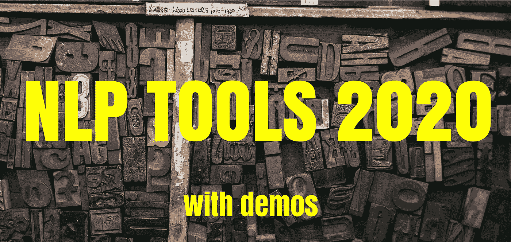
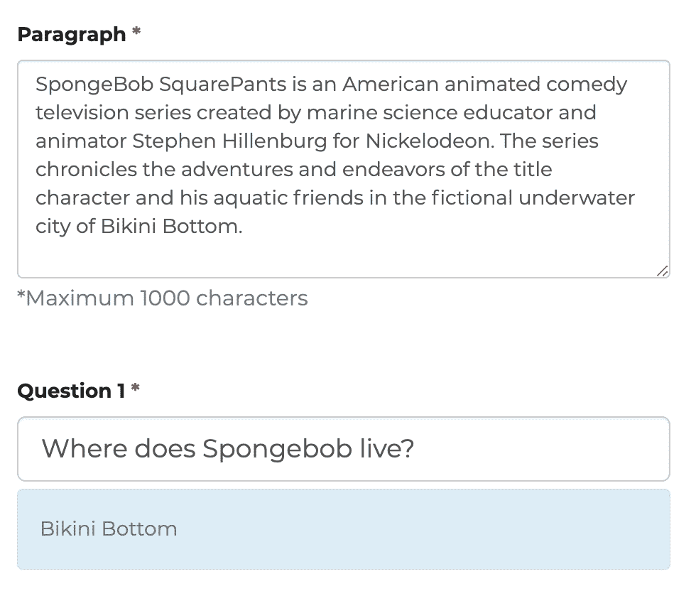
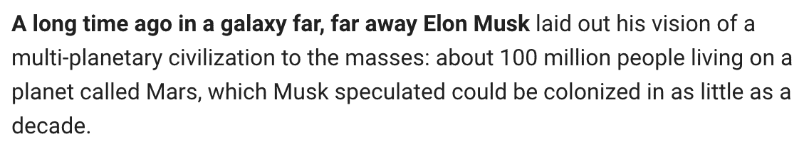
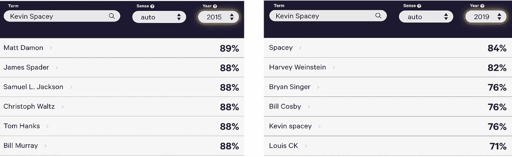
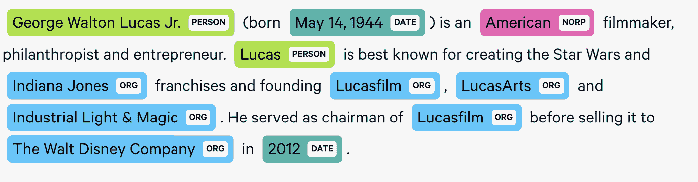
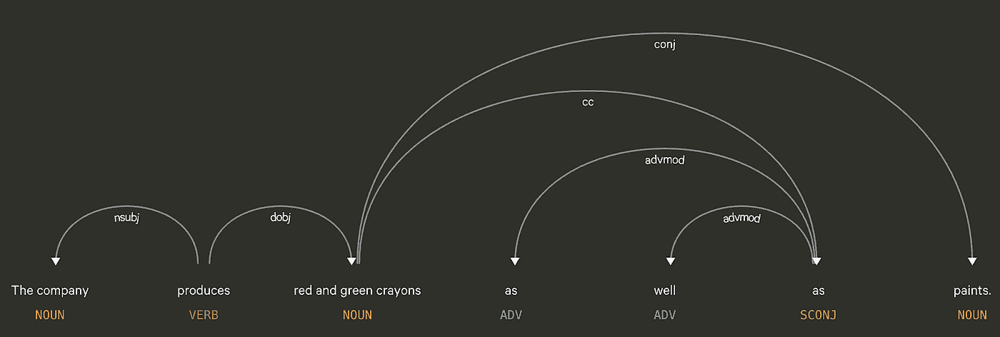
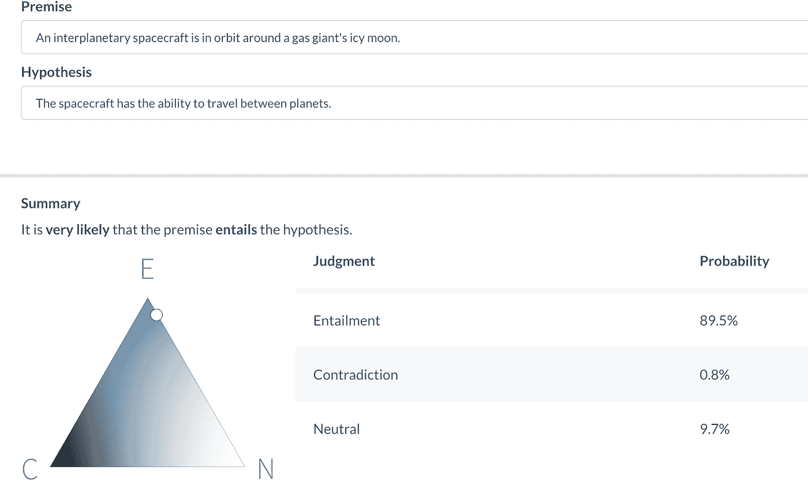
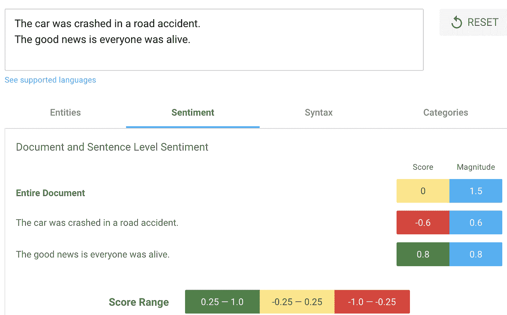
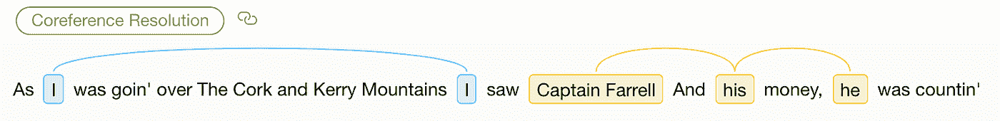
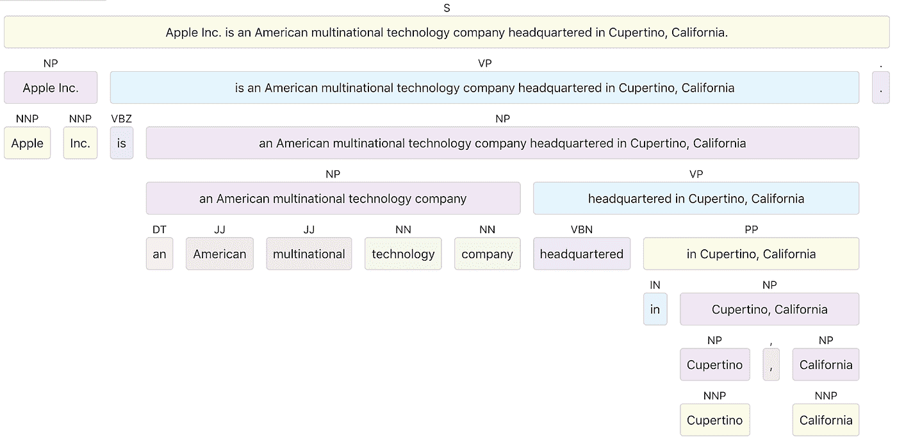

# 2020 年初最好的 NLP 工具:现场演示

> 原文：<https://towardsdatascience.com/the-best-nlp-tools-of-early-2020-live-demos-b6f507b17b0a?source=collection_archive---------8----------------------->

## 在项目中开始使用 NLP 的最简单方法

2019 年是 NLP 年。由谷歌、OpenAI、脸书和其他人开发的前沿模型对更广泛的受众公开可用。

在本文中，我收集了自然语言处理(NLP)和自然语言理解(NLU)工具的最佳现场演示，这些工具在市场上以开源或服务的形式提供(不需要注册或编码技能)。通过这些演示，我将为您提供一个截止到 2020 年初在自然语言分析方面取得的成就的高层次概述。

本文的目的不是深入探究技术的各个方面或涵盖这些工具提供的所有功能，而是为了弄清楚现代 NLP 世界中正在发生的事情，并更好地理解哪些成就可以作为开箱即用的实用工具。我个人使用这些演示来快速验证想法。

# 伯特——理解文本

**演示** : [环节](https://www.pragnakalp.com/demos/BERT-NLP-QnA-Demo/)。

BERT 是谷歌发布的一个预训练模型，旨在更好地理解人们搜索的内容。

试着给它一段文字，问一些问题

与 word2vec 或 GloVe 等旧的上下文无关方法不同，BERT 会考虑单词的周围环境(上下文),以便在特定情况下理解用户输入，因为同一个单词在不同的上下文中可能有不同的含义或意义。它于 2018 年首次发布，从 2019 年 12 月开始，BERT 已正式用于谷歌搜索。

# GPT-2 —创建文本

**演示** : [环节](https://talktotransformer.com/)。

GPT-2 是 OpenAI 的变压器模型。2019 年 2 月首次发布。它的主要目的是在给定文本中所有前面的单词的情况下，预测下一个单词。直到 2019 年底，由于担心它会被用来传播假新闻、垃圾邮件和虚假信息，只有更小、更不连贯的 GPT-2 版本被发布。然而，在 2019 年 11 月，OpenAI 表示已经看到“没有滥用的有力证据”，并完整发布了该模型。

现在，您可以使用它来完成您提供的文本。

粗体文本是手写的…

…其余的是由 GPT 2 号产生的

另一个玩 GPT-2 和 XLNet 的地方是在[用变形金刚](https://transformer.huggingface.co/)写。

# 空间—在生产中实施 NLP

**演示** : [链接](https://explosion.ai/demos/)。

SpaCy 是由 ExplosionAI 开发的免费开源 NLP 库。它旨在帮助开发人员完成生产任务，我个人非常喜欢它。它还具有很好的可视化功能。让我们来看看它的一些特性。

**文本标记化**——用简单的话来说，将文本分割成有意义的片段:单词、文章、标点符号。稍后，这些片段可以一起或单独地被矢量化，以便相互比较(单词嵌入)。举个简单的例子，单词“猫”和“毛毛”在向量空间中比“猫”和“飞船”更接近。

这是另一个在 Reddit 评论上训练的例子，它显示了与你输入的单词最接近的概念:[**【sense 2 vec】**](https://explosion.ai/demos/sense2vec)。

让我们来看看与“凯文·史派西”相近的概念。2015 年，我们有其他演员，但 2019 年，我们主要有#metoo 背景。

2015 年对比 2019 年

**命名实体识别** (NER)提供一组现成的实体(人员、组织、日期、位置等)。).你也可以用你自己的标签(即地址、交易对手、商品编号或其他)来训练它——你想从文件中提取的任何东西。

这里可以在标准类上试试: [**displaCy 命名实体可视化器**](https://explosion.ai/demos/displacy-ent) 。

命名实体识别示例

**依存关系识别** —当你需要从句子中提取连接结构时，这有助于建立规则。演示: [**显示依赖可视化器**](https://explosion.ai/demos/displacy) 。

依赖关系及其类型

# allenlp—一个著名的替代方案

**演示** : [链接](https://demo.allennlp.org/)。

强大的原型设计和良好的文本预处理功能。没有 SpaCy 那么适合生产任务，但是广泛用于研究，并且可以通过 PyTorch 进行定制。因为它与 SpaCy 有很多共同的功能，所以回顾一下文本蕴涵演示是很有趣的。

[文本蕴涵](https://demo.allennlp.org/textual-entailment)获取一对句子，并预测第一个句子中的事实是否必然隐含第二个句子中的事实。它并不总是工作得很好，但这是对话式人工智能的挑战之一，以揭示这种含义。

# 文本摘要—TL；速度三角形定位法(dead reckoning)

**演示** : [链接](http://textsummarization.net/text-summarizer)。

通常，有如此多的可用信息，在处理之前对其进行提取是非常重要的。一般来说，有两种方法:基于抽取和基于抽象的摘要。基于抽取意味着只留下代表文章内容的最有价值的单词/句子。

这个演示使用了基于抽取的方法:您唯一需要做的事情就是说出您想要看到的结果句子的数量。基于抽象的方法让机器以更短的方式重新表述文本。

我之前的文章太长了(顺便说一句，你可以在这里找到它，所以我想把它的内容缩短到两句话。这是我得到的:

> 在过去的三年里，我在 DataArt 领导机器学习和数据科学，研究不同业务的要点，提出技术解决方案并进行实施。
> 
> 云提供商正在快速开发 ML 服务，走着大数据服务在他们之前走过的路。

哦，好吧，让我们继续讨论云提供商:)

摘录摘要的其他 web 演示:[Summary Zr](https://smrzr.io/)、[在线文本摘要生成器—免费自动文本摘要工具](http://autosummarizer.com/)、[文本分析 API 演示| AYLIEN](https://developer.aylien.com/text-api-demo)

# Google AutoML 自然语言

**演示** : [链接](https://cloud.google.com/natural-language/#natural-language-api-demo)。

谷歌可以说是世界上处理文本数据量最大的公司。当您进行自定义命名实体识别时，Google AutoML 通常比开箱即用的开源工具提供更高的准确性。它还有一个方便的注释 UI，所以你可以快速启动。它在其他任务上也同样出色。

我们来看一下情感分析的例子，从正面或负面内涵来给每一句话和整篇文章打分。

第二句是肯定的，而第一句是否定的

# IBM 沃森

**演示** : [链接](https://natural-language-understanding-demo.ng.bluemix.net/)。

IBM 也是一个非常强大的竞争对手。除了 Google AutoML 可以做的，在 IBM Watson 中你可以检查文本中描述的情感特征和概念。让我们在对话中试试:

> “你知道，”阿瑟说，“每当我和一个来自参宿四的男人被困在沃贡气闸里，快要窒息而死在太空深处的时候，我真希望我年轻时听了我母亲对我说的话。”
> 
> “为什么，她告诉你什么？”
> 
> “不知道，我没听。”

沃森认为这是 72%的悲伤，这些概念还包括“银河系漫游指南”，这是文本的起源。

—

就提一下微软 Azure 文本分析，这里演示的是[这里是](https://azure.microsoft.com/en-us/services/cognitive-services/text-analytics/)。Amazon understand 演示需要注册，功能非常有限。

**其他几件事也值得一提……**

# 拥抱脸——对生产非常有用

**演示** : [环节](https://huggingface.co/hmtl/)。

HuggingFace 通过对不同的 NLP 模型进行额外的训练或者将它们包装成易于插入的库，使得不同的 NLP 模型易于在生产中使用。特别地，基于 AllenNLP 的共指消解模块是市场上最流行的解决方案之一。

当您需要预处理文本以理解内部依赖关系时，这非常有用。

# 伯克利神经分析器

**演示** : [链接](https://parser.kitaev.io/)。

Berkley 解析器通过将句子分解成嵌套的子短语来注释句子的句法结构。

如果你需要从可以用某种模板描述的句子中提取知识，这是很方便的(例如，名词短语是我正在寻找的)。

—

还有几个要看的是 [NLTK](http://text-processing.com/demo/) 、[斯坦福 CoreNLP](https://corenlp.run/) 和 [TextRazor](https://www.textrazor.com/demo) 。这些库通常用于学习目的，有时支持上面提到的工具。