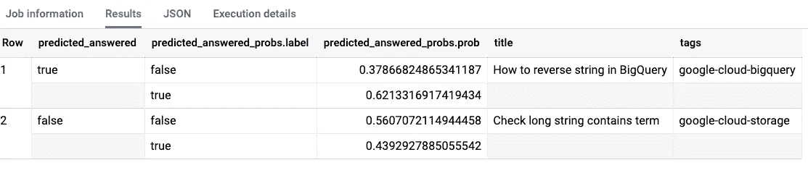

# 两全其美:从 BigQuery 调用 Auto ML

> 原文：<https://towardsdatascience.com/the-best-of-both-worlds-calling-auto-ml-from-bigquery-9dfd433a45d6?source=collection_archive---------55----------------------->

## 在 SQL 中进行预处理，然后使用自动 ML 表构建复杂的模型

我们现在在 BigQuery ML 中有了一个新的 model_type。除了线性模型、DNN 和提升树，我们现在可以直接从 BigQuery SQL 中使用 big kahuna ( [Auto ML Tables](https://cloud.google.com/automl-tables) )。


## 培养

这里的模型训练堆栈溢出标题和标签的模型，并预测帖子是否会有可接受的答案:

```
CREATE OR REPLACE MODEL advdata.so_answered_automl
OPTIONS(**MODEL_TYPE = 'automl_classifier'**, budget_hours=2.0, INPUT_LABEL_COLS=['answered'])
ASSELECT
  title, 
  REPLACE(tags, '|', ' ') AS tags,
  IF(accepted_answer_id IS NULL, False, True) AS answered
FROM `bigquery-public-data`.stackoverflow.posts_questions
WHERE REGEXP_CONTAINS(tags, 'google')
```

因为 Auto ML 根据空格标记文本，所以我们在 SQL 中做了一些预处理，将|字符转换成空格，然后将数据传递给 Auto ML。

## 预言

两个小时后(注意预算时间:预算越高，模型越好，通常，尽管如果模型没有改进，Auto ML 将缩短训练)，我们有了一个训练好的模型。

我们可以使用该模型进行批量预测，就像它是一个原生的 BigQuery ML 模型一样:

```
SELECT * FROM ML.PREDICT(MODEL advdata.so_answered_automl,(
  SELECT 'How to reverse string in BigQuery' AS title, 'google-cloud-bigquery' AS tags
  UNION ALL
  SELECT 'Check long string contains term' AS title, 'google-cloud-storage' AS tags
))
```

结果是:



这似乎有道理。贴有正确产品标签的清晰问题比贴有错误产品标签的模糊句子更有可能得到回答。

## 为什么这这么棒

这对 Google Cloud 上的通用 ML 工具包的补充是，我们现在可以利用 SQL 的能力来进行数据准备，然后将其交给 Auto ML 来进行神经架构搜索，以建立一个复杂的模型，甚至是一个包括自然语言处理的模型。

因此，我们现在有了 BigQuery 提供的数据准备的便利性和 Auto ML 表提供的最佳模型准确性。当然，我们也获得了 BigQuery 提供的数据工程能力，比如调度查询和大规模批量预测。不喜欢什么？

尽情享受吧！