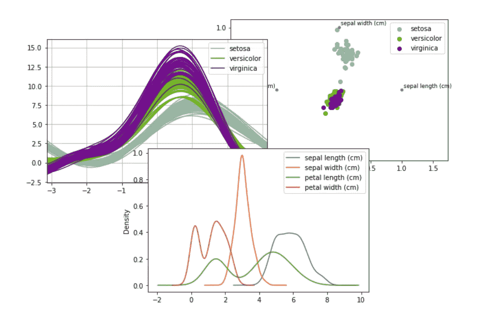

# 用熊猫快速绘图

> 原文：<https://towardsdatascience.com/the-best-pandas-plotting-features-c9789e04a5a0?source=collection_archive---------12----------------------->



## 使用这些简单的内置函数快速可视化您的数据

Pandas 最好的特性之一是其 Series 和 DataFrame 对象中内置的`plot`函数。

但是用熊猫绘图的官方教程假设你已经熟悉 Matplotlib，并且相对来说对初学者来说是不宽容的。

所以我认为简单概述一下`plot`的功能对任何想要可视化他们的熊猫数据而不需要学习整个绘图库的人都是有用的。

要开始使用`plot`函数，你需要安装 Matplotlib(尽管你不需要直接使用 Matplotlib)。

```
pip install matplotlib 
```

您还可以使用 iPython *魔法命令，指示 Jupyter 笔记本直接在笔记本中自动打印熊猫图。*

```
In [1]: %matplotlib inline
```

每当使用熊猫的`plot`功能时，你的 Jupyter 笔记本将自动在笔记本中生成一个图表。

## 绘制系列对象

要自动可视化 series 对象中的数据，可以调用它的`plot`方法。

```
In [2]: import pandas as pdIn [3]: series = pd.Series([1,2,3,5], index=['a', 'b', 'c', 'd'])In [4]: series.plot()
```


熊猫系列中的一个简单情节

请注意 Pandas 如何将系列的*索引*用于 X 轴，而系列的*值*用于 Y 轴。

> 提示:您可以通过 **shift 右键单击图像**，然后选择“图像另存为…”来从笔记本中导出绘图

如果对系列使用数字索引而不是分类索引，Pandas 将正确调整 X 轴的刻度。

```
In [5]: series.index = [1, 1.75, 2, 4]In [6]: series.plot()
```


如果 X 轴的索引是数字，熊猫会自动缩放它

正如您已经看到的，Pandas 将在使用`plot`函数时创建一个折线图。您可以使用功能`plot.[option]`创建其他绘图类型。例如，您可以使用`plot.area`创建一个面积图。

```
In [7]: series.plot.area()
```


Pandas 支持多种类型的视觉效果，包括区域图表

您可以从系列对象生成的可用图表的完整列表可在[文档](https://dev.pandas.io/docs/reference/series.html#plotting)中找到。

## 绘制数据框架对象

Pandas 还在 DataFrame 对象上提供了一个`plot`方法。

```
In [8]: data = {'a': [2, 1, 2, 9], 'b': [1, 0, 1, 2]}In [9]: df = pd.DataFrame(data, index=[-1, 0, 1, 2])In [10]: df.plot()
```


Pandas 支持一次绘制多个列

注意 Pandas 是如何在一个 Y 轴上绘制数据帧的两个列的，并且它使用数据帧的索引作为 X 轴。它还在左上角添加了一个标签。

还有其他专门用于数据帧的内置绘图方法，如`plot.scatter`方法。

```
In [11]: df.plot.scatter(x="a", y="b")
```


Pandas 使得从数据帧创建散点图变得容易

数据帧绘图方法的完整列表可在[文档](https://dev.pandas.io/docs/reference/frame.html#plotting)中找到。

## 其他绘图方法

最后，您可以使用来自`pandas.plotting`模块的附加绘图功能。例如，您可以从数据帧创建散布矩阵。

```
In [12]: df['c'] = [3, 6, 4, 1]In [13]: from pandas.plotting import scatter_matrixIn [14]: scatter_matrix(df)
```


熊猫也能从数据帧中快速生成散点图

其他方法的完整列表可在[文档](https://dev.pandas.io/docs/reference/plotting.html)中找到。

感谢阅读！如果你觉得这篇文章有用，我写的是关于数据科学和编程的文章，所以请关注我以获得更多类似的内容。