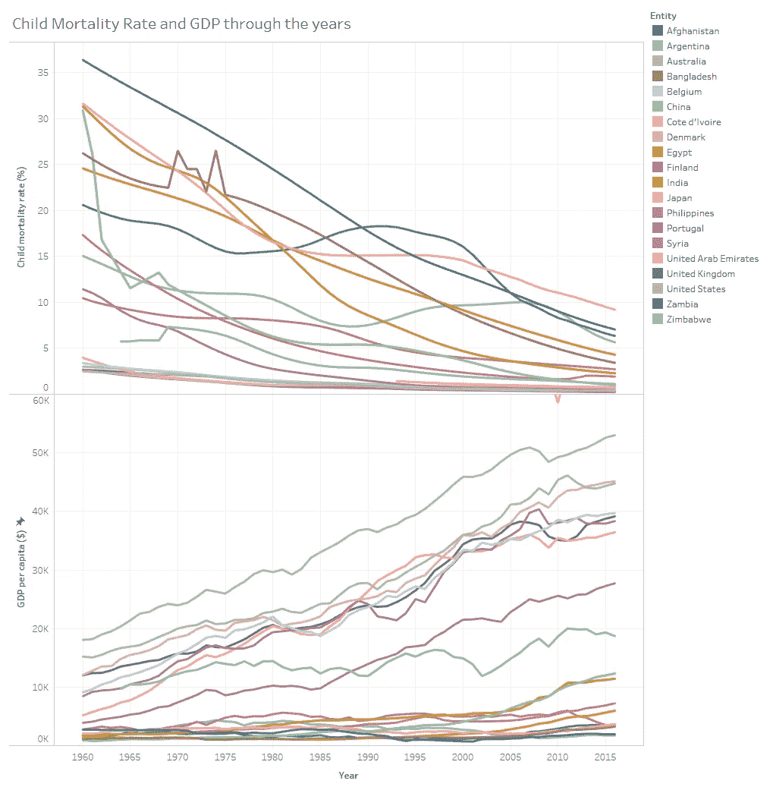
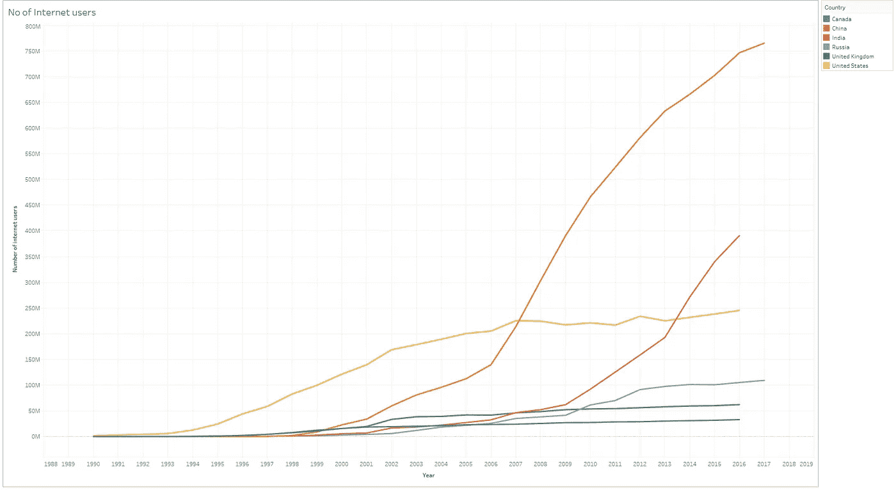

# 你见过的最好的数据

> 原文：<https://towardsdatascience.com/the-best-stats-youve-ever-seen-ec46479e371d?source=collection_archive---------46----------------------->

## 用酷酷的数据可视化来看看这个世纪以来的世界状况。

照片由 [slon_dot_pics](https://www.pexels.com/@slon_dot_pics-129524?utm_content=attributionCopyText&utm_medium=referral&utm_source=pexels) 发自 [Pexels](https://www.pexels.com/photo/blur-cartography-close-up-concept-408503/?utm_content=attributionCopyText&utm_medium=referral&utm_source=pexels)

在*研讨会*上，你结束了一晚上的政治讨论和音乐。当你回家的时候，你会在集市上停下来买些东西。你穿着你的便服走向你的家，你发现你的妻子正在纺羊毛做新衣服。

这就是你作为古希腊贵族的生活。

事情已经发展到现在。

我们开发了对抗各种疾病的系统，建立了让你在任何时间联系到世界上任何人的技术。我们的社会从古希腊的阶级发展而来，我们的边界被重新划定。

过去的一个世纪见证了我们社会的一些剧烈变化。为了理解这种变化对世界的影响，我利用现有的数据创造了强大的可视化，这可以让你深入了解它。

让我们停止喋喋不休，直接进入冷静的想象。

# 预期寿命和生育率

从动画中可以明显看出，在 60 年代，亚洲和非洲国家的**生育率(每名妇女平均生育子女数)**超过 5。这些国家的预期寿命低于大多数西方国家。

随着时间的推移，生育率降低，预期寿命缩短。这两者之间似乎有着直接的联系，因为随着生育率的下降，国家的预期寿命变长，而 T21 的预期寿命变短。

这可以从下面的动画中推断出来。

# 儿童死亡率和 GDP

一个国家的人均 GDP 和儿童死亡率之间几乎是线性关系。

北美国家和西欧的人均国内生产总值高，儿童死亡率低。

在像叙利亚这样的东欧国家，像缅甸这样的亚洲国家，像肯尼亚和安哥拉这样的非洲国家，情况是不同的。他们仍然有相对较高的儿童死亡率和较低的人均国内生产总值。

随着人均国内生产总值的增加，儿童死亡率逐年下降。

# 谁得到的报酬更多？

北美人、西欧人和澳洲人的收入似乎比世界其他地方的人高。

你可以看到俄罗斯和乌克兰的收入随着苏联的兴衰而变化，中东的收入随着油价的波动而变化。

下面的动画更深入，让我们深入了解社会中哪些阶层的收入份额更大。

可见，在全世界范围内，收入最高的 10%的人所占的份额是最高的。

随着时间的推移，曲线向右倾斜，也就是说，富人越来越富。

# 谁在上网？

啊……互联网……这个神奇的东西让你有能力在网飞重播《T2 老友记》。

来自 [Pexels](https://www.pexels.com/photo/couple-love-sitting-evening-4009409/?utm_content=attributionCopyText&utm_medium=referral&utm_source=pexels) 的 [cottonbro](https://www.pexels.com/@cottonbro?utm_content=attributionCopyText&utm_medium=referral&utm_source=pexels) 摄影

网上的人都是哪里人？我们来看看吧！

在互联网诞生之初，它仅限于美国，主要由大学和军队使用。

随着世纪之交，新技术的快速发展使人们能够接触到打开互联网大门的电脑。

中国拥有最多的互联网用户，其次是印度。

随着在过去十年中新的廉价设备的发布，人们和更便宜的数据计划，现在普通公民很容易负担得起互联网。

这可以从过去十年印度和中国用户的突然激增中看出来。

我们作为一个社会在这 100 年里已经走了很远，我们还有很长的路要走。去一个更美好的世界，在那里每个人都是自由的…

这里有一个显示完整数据的[网页](https://navendu.me/best-stats-you-have-ever-seen/)。

# 来源

世界银行:[databank.worldbank.org](https://databank.worldbank.org)

**灵感来源:** [**汉斯·罗斯林**](https://www.ted.com/talks/hans_rosling_the_best_stats_you_ve_ever_seen)