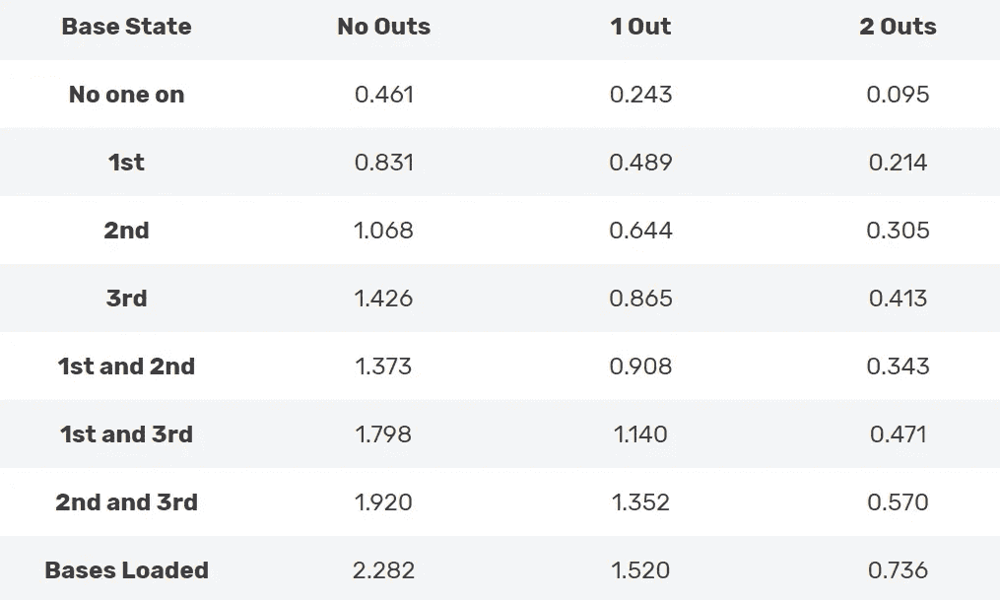
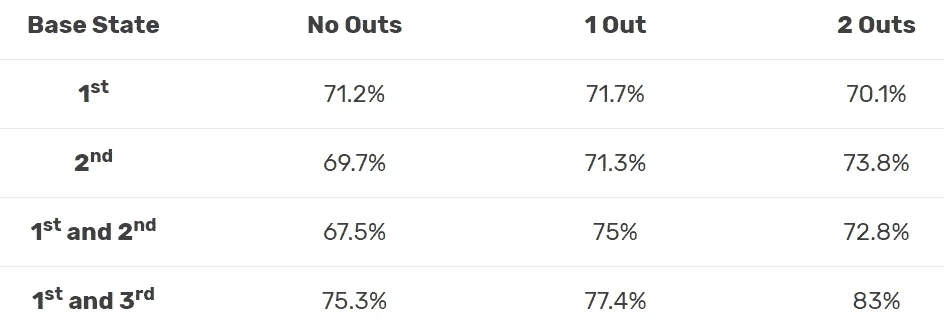

# 棒球运动中决策的最佳工具

> 原文：<https://towardsdatascience.com/the-best-tool-for-decision-making-in-baseball-24d1a7eb96b4?source=collection_archive---------38----------------------->

## [体育分析](https://towardsdatascience.com/sports-analytics/home)

## 运行预期矩阵提供了比第一眼更多的洞察力

我一直认为棒球经理是专家。他们知道什么时候换投手对比赛有利。他们通过三垒上的一个跑垒员来穿越牺牲的模糊性。有时他们甚至不得不[决定跑步前进，而不是让庞然大物撞到](https://www.baseball-reference.com/boxes/SFN/SFN199805280.shtml)。

大联盟级别的管理经验看起来令人眼花缭乱。在我开始研究 sabermetrics 和发现 RE24 之前，我是这样认为的。

在这篇文章中，我将展示一个经理如何使用运行预期矩阵，这是 RE24 计算的核心，通知他们在游戏中的决策。我们可以用这种技术来帮助许多领域的决策，但今天我们进行一个关于偷垒的案例研究。

# RE24 的基础:运行预期矩阵

RE24 代表基于 24 种基本/输出状态的运行预期。这里重要的是理解什么是基本/输出状态。在每场比赛中，一名球员以特定的*状态*来到本垒。状态是指跑垒员在特定的垒上，以及有多少出局数。一个例子:“一垒和二垒上的跑垒员，没有出局”是一种状态。

击球手总是让你在不同的状态间转换。出局数可以改变，滑道的位置可以改变，或者两者都改变，或者都不改变。重要的是每一个州在这一局都有平均得分的分数。举例来说，当一名跑垒员在三垒上且有一人出局时，一个队在那一局中平均会多得 0.865 分。下面列出了基/出状态的预期运行的完整列表。

一局结束时得分的预期次数(数据来自 https://library.fangraphs.com/misc/re24/,[图片由作者提供)](https://library.fangraphs.com/misc/re24/)

该表应理解如下。如果你在一垒有一名跑垒员，在一局结束前，你的球队平均会得 0.489 分。类似地，如果满垒没有出局，你的球队在一局结束时平均得分为 2.282 分，

# RE24

这张桌子怎么会导致统计？利用这个表格，我们可以给每个球员的击球赋予一定的“附加值”。让我们看一个具体的例子来强调这一点。如果你在第三垒和第一个出局时出现了一个跑垒员，几乎可以肯定你会被要求打一个牺牲高飞球。你会因为一次打点而获得荣誉，但是你并没有完成与那次跑垒相关的所有工作。你应该得到多少学分？

“三垒跑，一垒出局”的跑垒期望值是 0.865。你的击球从“三垒跑垒，一人出局”转变为“无人上场，两人出局”的状态，跑垒期望从 0.865 减少到 0.095。然而，有 1 次跑垒得分。因此，你对那次跑步的贡献是**次跑步得分**——**开始状态期望+结束状态期望= 1–0.865+. 095 = 0.23。**也就是说，你成功完成牺牲飞的技能为你的团队增加了 0.23 点跑值。换句话说，大约 23%的 sac 苍蝇奔跑的工作是由牺牲的玩家完成的。

如果你搞砸了牺牲，那么你就会从“三垒跑，一人出局”的状态过渡到“三垒跑，两人出局”的状态，而没有得分。在这种情况下，你用**0–0.865+0.413 =-0.452**(用同样的公式)**得到积分。**你将你的团队平均得分减少了 0.45 分。

如果你查看每个球员在赛季中的击球次数，并将这些数值相加，你就会得到球员的得分，这是一个衡量你的球队总得分相对于联盟平均得分的指标。

# 使用运行预期矩阵进行决策

我不想说 RE24，我想说的是运行期望矩阵。我认为你可以在游戏中用这个矩阵来做决定。本文将是讨论如何使用这一思想的系列文章的第一篇。稍后我们将展示如何将[击球模拟](https://thedatajocks.com/batting-order-doesnt-really-matter/)和跑步期望矩阵的思想结合起来回答问题。但是，今天我们从简单开始。再来说说偷垒。我们的中心问题是:什么样的偷窃率才是值得偷窃的呢？

让我们假设你是第一个没有出局的。该州的运行预期为 0.831。如果你成功抢到第二名，你的跑步期望值会一直上升到 1.068。一次成功的抢断广告 0.237 次运行的平均值。如果你错过了，你已经过渡到“无人开，1 人出局”状态，其值为 0.243，减少了 0.588 次运行。成功偷窃的概率有多大保证了这种风险？

解决办法:71.2%左右。

如果你的成功抢断率至少是 71.2%，那么如果你在第一个没有出局的情况下，你应该抓住一切机会抢断第二个**。**

# 在其他情况下，什么时候应该偷窃？

我们刚刚计算了一下，在第一次没有人出局的情况下，你需要在大约 71%的情况下成功抢断，才值得去抢断。其他情况呢？我是说，不同的出局，不同的跑垒员。下表显示了在每种垒/出局状态下，你的成功盗球率需要达到多少，才能让盗球增加你的平均跑预期。也就是说，如果你的偷窃率至少是显示的值，偷窃是一个好主意。注意:对于一垒和三垒的跑垒员，我们假设二垒被盗，对于一垒和二垒的跑垒员，我们假设三垒被盗。

增加预期运行所需的盗球百分比(图片由作者提供)

# 结论和细节

运行预期矩阵提供的工具允许我们进行许多类似上述的计算。我们可以模拟类似'[的事情，什么时候故意保送一个球员是值得的？](https://thedatajocks.com/using-run-expectancy-to-value-intentional-walks/)’或者‘什么时候你应该让一名球员挥棒离开，而不是牺牲一名三垒手？’和许多其他人。

这篇文章不一定是关于偷窃率的结论。相反，我们希望引入一个框架。主要的收获是，运行期望矩阵实际上可以以不同于最初预期的方式使用:为经理在游戏中可能做出的不同决策赋予价值。