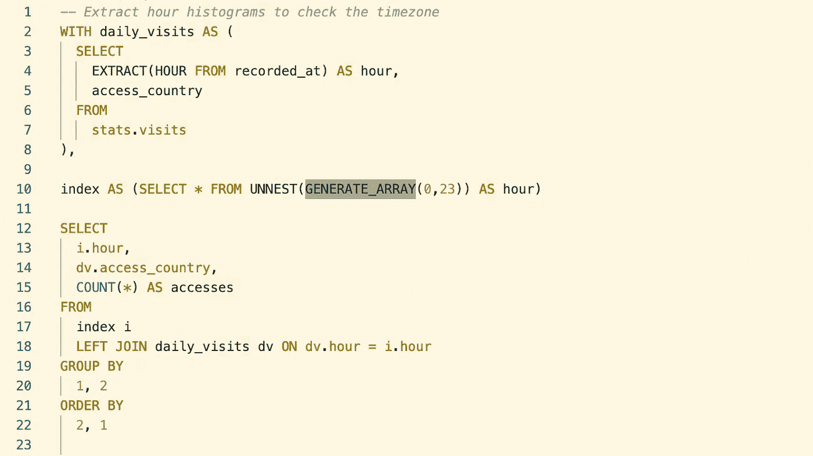

# 在 BigQuery 中生成索引的最佳方式

> 原文：<https://towardsdatascience.com/the-best-way-to-generate-indices-in-bigquery-f3a09f71b175?source=collection_archive---------20----------------------->

## 对直方图使用 GENERATE_ARRAY 等等



是的，我在截图的时候不小心高亮了 GENERATE_ARRAY，但是它有点工作，不是吗？

当您偶然发现在 BigQuery 中创建直方图的第一个任务时，您可能会用一个简单的 GROUP BY 来处理它，类似于:

```
SELECT
    hour,
    COUNT(*) AS num_accesses
FROM
    accesses
GROUP BY
    hour
ORDER BY
    hour
```

这很好，它做了一件体面的工作，会让你友好的同事拍拍你的背。但是它没有处理丢失时间的情况。例如，您可能在一天的大部分时间都有访问，但是在凌晨 3 点没有人访问您的站点，对不起。这会在你的直方图上留下一个缺口，这不是很好，是吗？在某些情况下，看起来很傻。

相反，我们可以使用各种技术来获得额外的一小时，我最喜欢的是结合 UNNEST 和 GENERATE_ARRAY 的和谐组合。

总体思路是生成一个包含所有可能值的数组，将该数组转换为行，然后使用这些行作为索引将结果连接到——您说这是初等的！让我们试试这个:

```
SELECT * FROM UNNEST(GENERATE_ARRAY(0, 23)) AS hour
```

该查询将生成一个包含数字 0、1、…、23 的数组，传递给 UNNEST，UNNEST 获取这些值并将其放入行中，最后标记为 hour。

有了这个索引，我们就可以做一个左连接(我们希望保留索引中的空行，否则一切都是徒劳的)。我们最后的查询看起来像这样:

```
WITH index AS (SELECT * FROM UNNEST(GENERATE_ARRAY(0, 23)) AS hour),hourly_counts AS (
    SELECT
        hour,
        COUNT(*) AS num_accesses
    FROM
        accesses
    GROUP BY
        hour
    )SELECT
   hour,
   COALESCE(num_accesses, 0) AS num_accesses
FROM
    index
    LEFT JOIN hourly_counts USING (hour)
ORDER BY
    hour
```

## 可变界限

代替我们上面使用的方便的预定义边界，您可能有可变的边界。例如，如果您试图生成一天中访问次数的直方图。同样，您可以尝试应用一个`GROUP BY`，但是您不会有丢失的索引。

```
WITH daily_accesses AS (
    SELECT
        day,
        COUNT(*) AS num_accesses
    FROM
        accesses
    GROUP BY
        day
    )SELECT
    num_accesses,
    COUNT(*) AS num_days
FROM
    daily_accesses
GROUP BY
    num_accesses
ORDER BY
    num_accesses
```

不行！因此，让我们再次尝试生成索引，但这次使用可变边界，因为任何给定日期的`num_accesses`都是不受约束的。

```
SELECT
    *
FROM
    UNNEST(GENERATE_ARRAY(
        (SELECT MIN(num_accesses) FROM daily_accesses)mi,
        (SELECT MAX(num_accesses) FROM daily_accesses)ma
        )) AS num_accesses
```

从我们的每日访问表中，我们取出了最小值和最大值，分别给出了下限和上限。将所有这些结合在一起，我们得到:

```
WITH daily_accesses AS (
    SELECT
        day,
        COUNT(*) AS num_accesses
    FROM
        accesses
    GROUP BY
        day
    ),day_counts AS (
    SELECT
        num_accesses,
        COUNT(*) AS num_days
    FROM
        daily_accesses
    GROUP BY
        num_accesses
    ),index AS (
    SELECT
        *
    FROM
        UNNEST(GENERATE_ARRAY(
            (SELECT MIN(num_accesses) FROM daily_accesses)mi,
            (SELECT MAX(num_accesses) FROM daily_accesses)ma
            )) AS num_accesses
    )SELECT
    num_accesses,
    COALESCE(num_days, 0) AS num_days
FROM
    index
    LEFT JOIN day_counts USING (num_accesses)
ORDER BY
    num_accesses
```

比上一个例子稍微复杂一点，但是原理是一样的。

## 日期索引

最后，在数据之旅中，您可能会遇到日期索引。您可以使用 GENERATE_ARRAY 生成一个数字，然后使用 DATE_ADD 之类的东西来获取日期，但是 Bigquery 有一个内置函数 GENERATE_DATE_ARRAY。

现在考虑一下，如果我们想获得 2020 年网站的日访问量(现在是复习时间！).因为这是充满变数的一年，可能会有几天没有任何访问。

同样，我们的基本查询:

```
SELECT
    date,
    COUNT(*) AS num_accesses
FROM
    accesses
GROUP BY
    date
ORDER BY
    date
```

我们创建的索引是这样的:

```
SELECT * FROM UNNEST(GENERATE_DATE_ARRAY(
    '2020-01-01',
    CURRENT_DATE()
    )) AS date
```

这将为 2020 年的今天之前的每一天创建一个日期。给出最终的查询。

```
WITH index AS (
    SELECT * FROM UNNEST(GENERATE_DATE_ARRAY(
        '2020-01-01',
        CURRENT_DATE()
        )) AS date
   ),daily_counts AS (
    SELECT
        date,
        COUNT(*) AS num_accesses
    FROM
        accesses
    GROUP BY
        date
    )SELECT
   date,
   COALESCE(num_accesses, 0) AS num_accesses
FROM
    index
    LEFT JOIN daily_counts USING (date)
ORDER BY
    date
```

## 间隔

到目前为止，在所有的例子中，我们假设间隔是 1(或 1 天)，但是使用不同的步长是完全合理的，比如每 7 天。为了实现这一点，您可以向 GENERATE 函数传递一个额外的参数，该函数将返回一个调整后的索引。在这种情况下，在如何连接底层数据方面，您需要更加巧妙一些，但是对于坚定的数据鼓吹者来说，这是可以实现的！

希望这种生成索引的简单方法能在下次需要定义良好的索引时帮到你。如往常一样，如果您想了解更多信息，请查看 [Bigquery 文档](https://cloud.google.com/bigquery/docs/reference/standard-sql/array_functions#generate_array)。

如果你使用任何其他有趣或方便的方法，请告诉我！