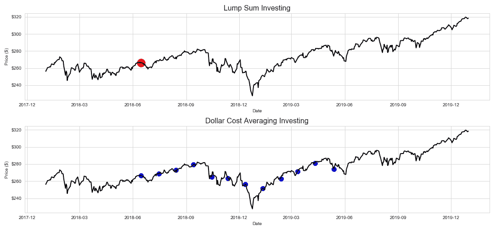
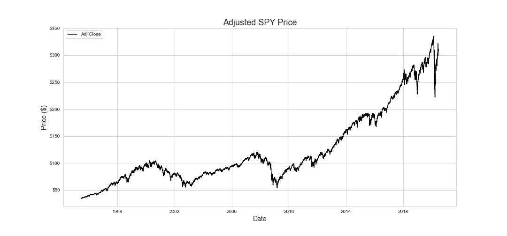
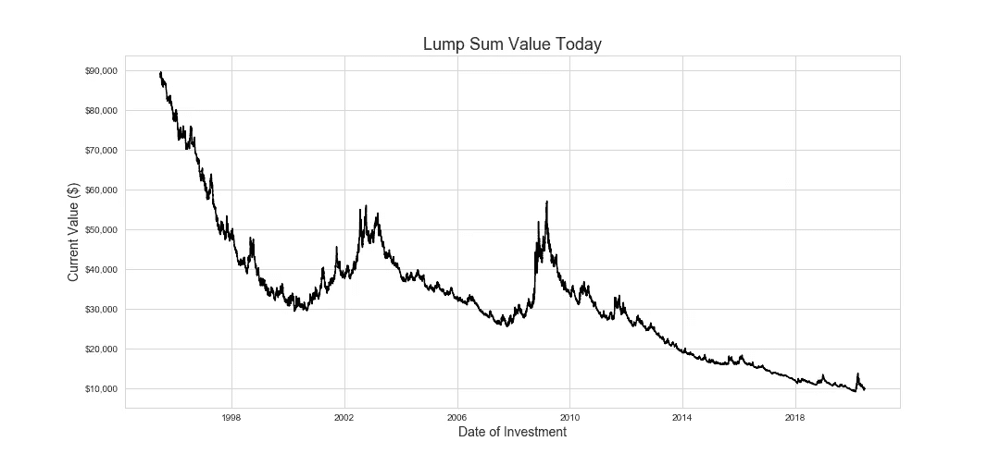
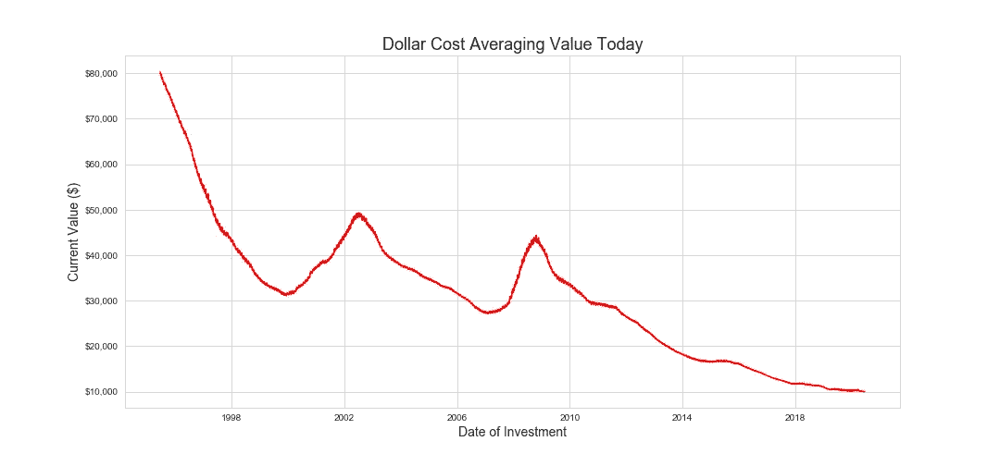
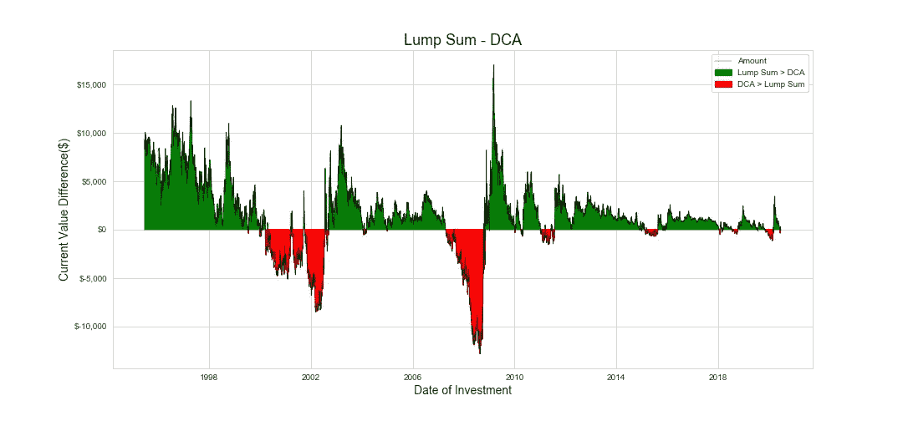
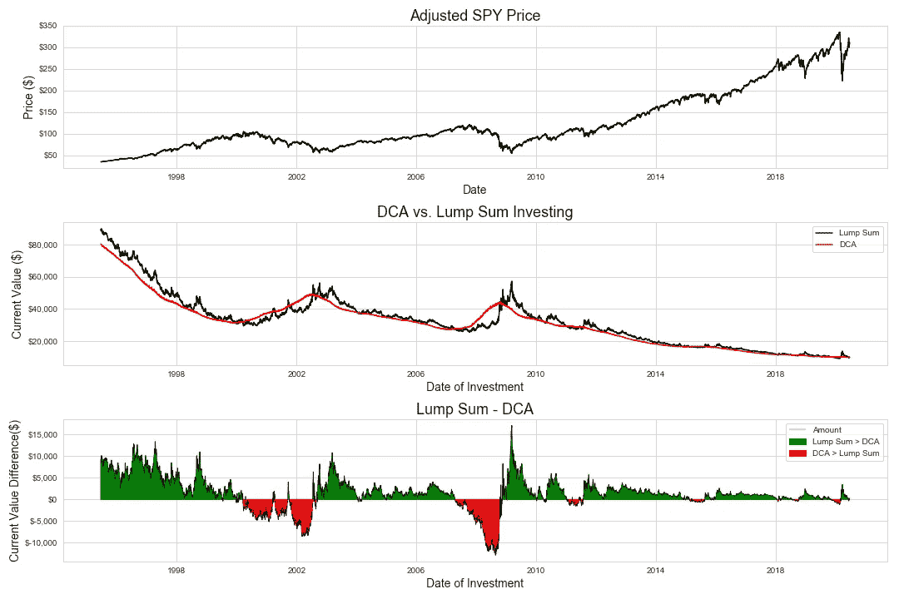

# 投资市场的最佳策略

> 原文：<https://towardsdatascience.com/the-best-way-to-invest-in-the-market-3b4f0f50990c?source=collection_archive---------45----------------------->

## 使用 Python 比较一次性投资与美元成本平均的实证分析

在金融界工作，我不可避免地会被问到“我应该买什么股票？”。因为我很清楚我没有机会持续跑赢市场，所以我每次都用同样的三个字来回应，“买间谍”对于那些不熟悉的人来说，SPY 是一种跟踪标准普尔 500 的交易所交易基金，所以以 300 美元左右的价格购买一股 SPY 就像是购买标准普尔 500 每只股票的很小一部分。这就回答了“*什么*”。

接下来是“*为什么*”。为简洁起见，我将提到的主要优势是多样化。购买《间谍》的股票是获得多元化投资组合的一种非常廉价的方式，它允许一个人将所有鸡蛋放在许多不同的篮子里，以降低特殊风险。

大家都知道“*当”:*低买高卖。历史表明，很少有人(如果有的话)能够真正预测市场的波峰和波谷，所以今天实际上和其他任何一天一样适合投资。

最后，我们到达“*如何*”。我将在本文中比较的两种投资策略是一次性投资和美元成本平均法(DCA)。

一次总付投资是指一个人把她的钱一次性全部投资，而美元成本平均法是把这些钱分成大小相等的几笔，在固定的时间间隔内进行投资。例如，假设我们有 10，000 美元可以投资。如果投资者进行一次性投资，她会在一个日期投资所有的 1 万美元，如下面第一个图表中的单个红点所示。然而，当她一年的平均成本为美元时，她每月投资 10，000 美元/12 = 833.33 美元，持续 12 个月，如第二个图表中的 12 个蓝点所示。

一次性投资让投资者更快地接触到市场，但可能比平均成本投资更不稳定。话虽如此，我还是很好奇，想看看在股票市场的历史上，一种策略是否胜过另一种策略。

我们可以通过在过去的每个交易日模拟一次总付和 DCA 投资策略，并比较它们今天的回报，来测试这两种策略的历史表现。为此，我首先需要使用 DataReader 获取历史间谍价格。请注意，这些是考虑到股息收益率和股票分割的调整价格。

这些价格看起来准确干净，下一步就是模拟一次性投资。我使用的是大约 10，000 美元的投资，并跟踪它到今天会增长到多少，因此我们阅读下面的图表，假设在 2006 年 1 月 3 日(x 轴上的日期)进行的 10，000 美元投资今天会增长到大约 33，000 美元(y 轴值)。有趣的是，在 2008/2009 年衰退前的绝对高点投资，今天仍然会留下大约 1.5 万美元，这证明了杰里米·西格尔的*长期股票*。

现在来看美元成本平均模拟。这稍微有点微妙，因为我将 1 万美元的投资分散到 12 个块中，每个块间隔 1 个月，其中一些日期不在开市的那一天。幸运的是，Github 用户 explation 有一个使用 Panda 的解决方案。searchsorted()方法来获取下一个最接近的有效投资日期。有了有效投资日期的列表，我就可以使用之前的一次性投资函数来模拟在每个日期投资$ 10k/13 = 833.33 美元。对于不到 1 年前的开始日期，我持有未投资的现金，并在结束时简单地增加现值。

显而易见，这种策略比一次性投资要顺利得多，但它一定更好吗？

下面我用正的绿色值画出了这两种策略的区别，这些值代表了今天一次总付比 DCA 赚更多钱的时间。红色负值表示 DCA 策略今天比一次性投资回报更多的时间。在导致衰退的时候，缓慢而稳定的 DCA 策略会取得胜利，但在市场大幅下跌后，一次性投资会大有斩获。

简单地看一下在过去 25 年的数据中，哪种策略每天都能产生更高的资金量，我们看到一次性投资在 76.48%的时间里击败了美元成本，平均而言，投资者的口袋里多了 1，324.84 美元(基于 1 万美元的投资)！市场长期上涨的总体趋势似乎使一次性投资比平均成本投资更具优势。

作为最后一点，我应该提到，与保持头脑冷静、不在糟糕时期恐慌性抛售或过度投资泡沫的能力相比，这两种策略之间的差异相对较小。更多规避风险的投资者可能更喜欢 DCA 而不是一次性付款，但这两种策略的关键是在没有情绪影响的情况下买入市场，并长期持有你的投资。

## 奖金即:所有三个图表排队

Github 用户,“说明”获得了巨大的荣誉，其原始的总额与 DCA 分析是本次分析的主要参考。

感谢阅读，完整代码可在[这里](https://github.com/eonofrey/DollarCostAverage_vs._LumpSum)找到。要获得所有媒体文章的完整访问权限，请点击[此处](https://eonofrey.medium.com/membership)！

***注来自《走向数据科学》的编辑:*** *虽然我们允许独立作者根据我们的* [*规则和指导方针*](/questions-96667b06af5) *发表文章，但我们不认可每个作者的贡献。你不应该在没有寻求专业建议的情况下依赖一个作者的作品。详见我们的* [*读者术语*](/readers-terms-b5d780a700a4) *。*