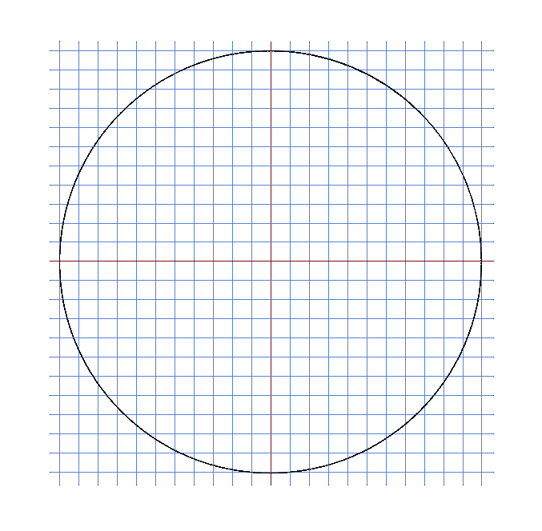
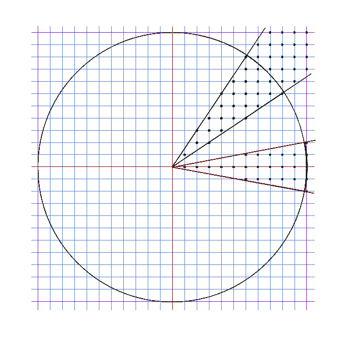
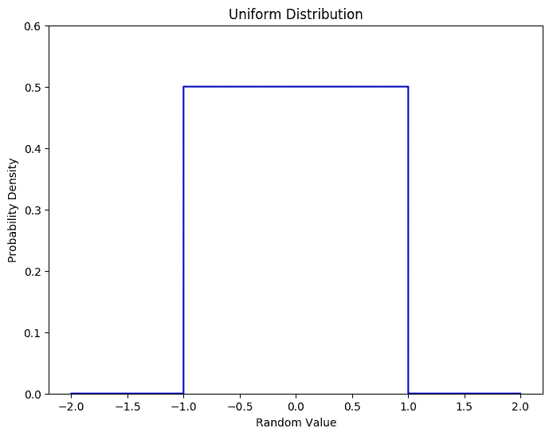
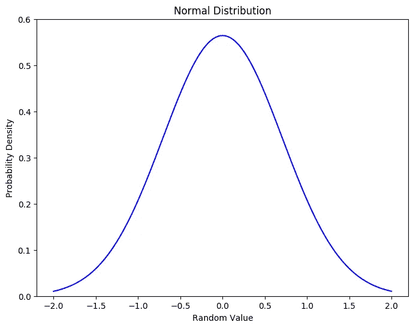

# 选择单位向量的最好方法

> 原文：<https://towardsdatascience.com/the-best-way-to-pick-a-unit-vector-7bd0cc54f9b?source=collection_archive---------34----------------------->

## 使用 Box–Muller 变换在一个 *n* 维空间中生成无偏随机方向


[加利纳·察尔科娃](https://unsplash.com/@galchonog?utm_source=medium&utm_medium=referral)在 [Unsplash](https://unsplash.com?utm_source=medium&utm_medium=referral) 上的照片

## 问题是

有时，模拟或数值解算器需要生成随机单位向量，这些向量公平地表示一个 *n* 维空间中的所有方向。也许你正在模拟气体中的分子，你想模拟它们的随机碰撞。也许你想探索高维空间中一个点的邻域，以找到一个函数的局部最小值。或者，您可以渲染一个光线跟踪场景，该场景包含来自粗糙表面的光子散射。

在这种情况下，在你的科学编程工具箱中有一个随机单位向量生成器是很方便的。理想的算法将挑选在 n 维空间中指向随机方向的单位向量，没有任何偏差。这意味着，随着时间的推移，单位向量将均匀地分散在以原点为中心的一个 *n* 维单位超球的表面上。

## 天真的解决方法

最明显的解决方案是从范围[1，+1]中均匀选择 *n* 个随机数，形成一个向量:

然后除以向量的长度，归一化为单位向量:

## 为什么它不起作用

这种幼稚的算法偏向某些方向，远离其他方向。更具体地说，它代表了与你选择的笛卡尔轴成对角线的方向。为了证明这一论断，考虑二维情况。让我们从一个刻有单位圆的网格开始:



选取一对随机向量分量就像从网格中选取一对相交的线。线相交的点定义了从原点开始的方向向量。

现在考虑从原点发出的两个不同的饼图切片，一个围绕正 *x* 轴，另一个与 *x* 轴成大约 45 度角:



假设两个切片包含相等的角度跨度。假设我们从这个网格中选择随机的 *x* 和 *y* 值，并且都来自范围[1，+1]。然后，每个随机点( *x* ， *y* )将位于单位圆外的紫色正方形内或正方形上。

绿色对角线之间的点比横跨 *x* 轴的红线之间的点多。这是因为对角线方向的圆外点比水平方向的多。

随着网格变得越来越小，线之间的间隙越来越接近零，每个区域中的点数与相应的封闭区域成任意比例。对角线区域比水平区域包含更多的区域。如果你想象随机向镖靶投掷飞镖，它更有可能击中面积更大的区域。

因此，使用统一笛卡尔坐标选择的点更可能出现在对角线上，而不是正交线上。简单的方法无法通过偏倚测试:它不能以相等的概率从所有方向进行选择。

## 更好的解决方案

在这种二维情况下，一个有效的替代方法是在半开范围[0，2π]内选取一个随机角度 *θ* 。那么无偏单位向量就变成了(cos *θ* ，sin *θ* )。然而，这仅在二维情况下有效。我们想要一个在任何正数维度上都能工作的解决方案。

再次看上面的图表，我们看到偏差的出现是因为正方形内圆外的点数随着角度的变化而变化。如果我们总能在圆内选择一个点，偏差就会消失。

这表明了一种改进的算法:为每个矢量分量选取一系列随机坐标，但如果它位于圆、球或 n 维空间的超球之外，则拒绝选取。换句话说，继续挑选另一批 *n 个*随机数，直到它们满足

一旦你在边界半径内找到一个点，每个方向都被相等地表示，并且单位向量有一个无偏的方向。

这种方法适用于二维或三维，但在一般情况下会有一个问题。

## 高维空间的低效率

循环直到我们在 n 维超球中找到一个点的问题是，随着 n 维超球的增加，效率越来越低。上述总和中的每个平方项可以取从 0 到 1 的值。有了 *n* 项，平方和的范围可以从 0 到 *n* 。

随着 n 的增加，总和超过 1 的可能性越来越大。当维数足够高时，你的程序将花费越来越多的时间循环，直到找到一个单位半径内的点。

(有趣的是，这揭示了一个关于高维几何的令人惊讶的事实:随着维度无限制地增加，超球体的体积与其包围的超立方体的体积之比趋近于零。)

如果有一种算法可以选择一个随机的方向向量而不需要繁琐的循环，那就更好了。

## 一般解决方案:高斯分布

因为均匀随机分布不适合选择空间中的无偏方向，所以问题的解决方案是找到一些补偿任何方向偏差的非均匀分布。期望的分布将抵消由坐标轴的选择引入的任何人为偏差。

事实证明，答案对任何一个学统计学的学生来说都是熟悉的:高斯(或“正态”)分布。这是一个随机分布，其概率密度函数呈现著名的钟形曲线形状。

概率密度函数对你来说可能很陌生。让我们后退一步，重新审视我们开始时的原始均匀分布。这种均匀分布是一种机器，它输出一系列始终在范围[1，+1]内的随机数。一致意味着该数在[-1，+1]内的任何小范围内的概率，比如[+0.37，+0.38]，与在任何其他相同大小范围内的概率完全相同，例如[0.67，0.66]。

因为每个均匀选择的随机数必须在[1，+1]范围内，所以我们说在该范围内的概率为 1。同样，数字超出该范围的概率为 0，这意味着永远不会发生这种情况。

用总概率 1 除以范围大小(+1)(1)= 2，得到概率密度。这个密度值告诉我们，随机数在[+0.7，+0.8]范围内的概率是范围大小的一半，即(0.8-0.7)= 0.05。

均匀概率密度的图形看起来像这样:



显而易见，如果使用均匀分布来挑选矢量分量导致结果矢量偏离笛卡尔坐标轴，则期望的非均匀分布必须具有每个分量朝向零的补偿偏差。高斯正态分布函数为:

其中σ是分布偏离平均值 0 的标准偏差。正如我们将在后面看到的，一旦我们归一化为单位向量，我们可以为σ选择任何正数来获得无偏方向。正态分布图产生以下钟形曲线:



这种分布当然更经常地选择接近 0 的数字，而不是远离 0 的数字，随着 *x* 在两个方向上远离 0，概率逐渐变小。

## 为什么有效

上面的推理很模糊，并不能证明什么。我们怎么知道一个向量的分量是从正态分布中选取的，它一定指向一个完全无偏的方向？有一个简单的方法可以证明。

第一步是将每个向量分量的概率密度函数与整个向量的概率密度相关联。上面显示的正态函数， *p* ( *x* )，描述了在 *x* 的任何特定值附近选择一个值的相对可能性。在二维情况下，我们将相同的函数应用于另一个坐标 *y* 。由于我们选择使用相同正态分布的 *x* 和 *y* ，因此 *p* ( *y* )描述了在任何给定值附近选择 *y* 的概率密度。

当你有两个独立的事件时，这两个事件发生的概率是它们各自概率的乘积。所以在任意给定值附近选择一个向量( *x* ， *y* )的概率用乘积*p*(*x*)*p*(*y*)来描述。

在我们进一步讨论之前，让我们选择一个使事情尽可能简单的值σ:

那么 *p* ( *x* )就变成了:

看看产品*p*(*x*)*p*(*y*)发生了什么:

神奇的事情就发生在这里。数量 *x* + *y* 可以用 *r* 代替，其中 *r* 是矢量的长度( *x* ， *y* )。换句话说，当使用正态分布选择 *x* 和 *y* 时，选择给定对( *x* ， *y* )附近的向量的可能性为

关键见解:落在( *x* ， *y* )的无穷小邻域内的可能性只取决于向量( *x* ， *y* )的长度 *r* 。向量指向的方向不会影响你选择它的可能性。

换句话说，我们找到了一种将乘积*p*(*x*)*p*(*y*)从笛卡尔坐标( *x* ， *y* )转换到极坐标( *r* ， *θ* )的方法，其中 *r* 是到原点的距离因为 *θ* 从来不会出现在概率密度函数中，所以它不能影响我们在任何给定的角度 *θ* 选择一个向量的可能性。各个角度可能性都是一样的！这正是我们一直想要的财产。

更好的是，这种角度无关性适用于任何数量的维度。在一般情况下，n 维概率密度积变成

因为毕达哥拉斯距离公式适用于任何维数，我们可以用 *r* 代替 *n* 平方分量之和，得到一个只取决于向量长度的概率分布。

## box–Muller 变换

高斯正态分布听起来很棒，但是如何生成具有这种分布的随机数呢？大多数编程语言中都有统一的随机数生成器。将均匀分布转换成正态分布会有所帮助。

1958 年，George E. P. Box 和 Mervin E. Muller 发表了一篇两页的关于随机正态离差产生的笔记[,展示了如何做到这一点。他们的方法成对产生正态分布的随机数。给定两个均匀分布的随机数 *A* 和 *B* ，均来自半开范围(0，1)，Box-Muller 变换计算一对独立的正态分布数，如下所示:](https://projecteuclid.org/download/pdf_1/euclid.aoms/1177706645)

值得强调的是 *A* 绝对不能为零，因为零的对数没有定义。继续使用这些公式生成数字对，直到有 *n* 个数字来完成一组矢量分量。如果 *n* 是奇数，您可以保留剩余的生成值，并将其用作您生成的下一个向量的第一个分量，或者您可以简单地丢弃它。无论哪种方法，作为最后一步，除以得到的向量的长度，得到单位向量 **v** :

以这种方式生成的单位向量将是完全无偏的，在 *n* 维空间中具有指向任何方向的相等概率。

## 用 C 语言实现

我已经用 C 编程语言提供了一个示例实现:

[](https://github.com/cosinekitty/randomvector) [## 余弦猫/随机向量

### 使用 Box-Muller 变换生成具有无偏方向的随机单位向量 GitHub 是超过 50…

github.com](https://github.com/cosinekitty/randomvector) 

## 在 Python 中甚至更容易

对于 Python 程序员来说，`numpy`项目提供了一个现成的随机生成器，可以生成正态分布的值:

```
>>> **import numpy**
>>> **numpy.random.normal()**
0.3850365612479212
>>> **numpy.random.normal()**
0.8785540204204144
>>> **numpy.random.normal()**
-0.32533367867722596
```

随机单位向量生成器非常简单。只需调用`randomvector`,将维数作为`n`传入，您将得到一个包含无偏单位向量分量的列表。

## 参考

1.  [超球点拾取](https://mathworld.wolfram.com/HyperspherePointPicking.html)【Wolfram MathWorld】。
2.  [Box–Muller 变换](https://en.wikipedia.org/wiki/Box%E2%80%93Muller_transform)【维基百科】。
3.  [样本 C 源代码](https://github.com/cosinekitty/randomvector)作者【GitHub】。