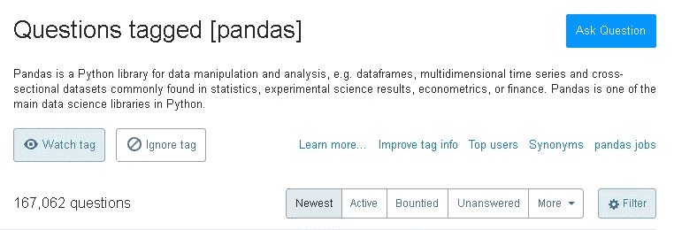
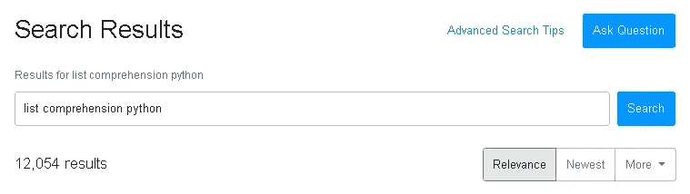

# 实践数据科学工具的最佳方式

> 原文：<https://towardsdatascience.com/the-best-way-to-practice-data-science-tools-7435fa5ca87d?source=collection_archive---------33----------------------->

## 磨砺你的技能。

图片由[皮克斯拜](https://pixabay.com/?utm_source=link-attribution&utm_medium=referral&utm_campaign=image&utm_content=2877134)的 Gerd Altmann 提供

数据科学是一个跨学科的领域。创建数据科学产品需要数学、统计学和软件技能。除了这些工具，您还需要具备分析思维技能和领域知识，以便能够提出从数据中创造价值的想法。

在如此广阔的领域，你既需要理论知识，又需要实践技能，才能做出色的工作。虽然一些公司在创建产品的管道中划分角色，但数据科学家的角色应该在某种程度上覆盖整个管道。

在本帖中，我们将关注实践方面，以及如何以这种方式提高你的技能。

由于数据科学是一个如此受欢迎的领域，因此有各种各样的软件工具，并且新的工具很快就会发布。学习这些工具的最好方法是实践。您可以阅读文档、文章或观看教程。然而，当涉及到实际的“学习”时，你需要大量的练习。

有许多练习的选择，但我认为最好的是 **Stackoverflow** 。我会试着解释为什么。

Stackoverflow，如果你还没有访问过的话，是一个人们提问并从其他人那里得到答案的网站。它包含了大量不同主题的知识。自从我开始了我的数据科学之旅，我不记得有哪一天我不在 Stackoverflow 上寻找一些东西。

在这篇文章中，我将会讲述 Stackoverflow 可以并且应该如何用于实践。

首先**资源是无限的**。例如，到目前为止，有超过 167 K 个问题标记为 Pandas，这是使用最广泛的数据分析库。

再具体一点，搜索“列表理解 python”。有 12 K 多题对于练习来说绰绰有余。

很可能在 Stackoverflow 上没有讨论过某个常见问题。因此，它提供的是一本无限页数的练习题书。

只是看问题，想办法解决。问题会在很短的时间内得到回答，因此您有机会评估您的解决方案。

如果你不能想出一个解决方案，那就去看看别人是怎么做的。试着理解他们是如何处理问题和解决问题的。

图片来自[皮克斯拜](https://pixabay.com/?utm_source=link-attribution&utm_medium=referral&utm_campaign=image&utm_content=3255140)

注意解决方案的不同。一个问题几乎总是有不止一个解决方案。通过比较和评估不同的观点，你将对一个主题有全面的了解。

这些问题通常来自**现实生活中的**用例。数据科学领域的工作人员可能会询问他们日常工作中出现的问题。因此，您将处理作为数据科学家工作时可能遇到的典型问题。

也有来自正在从事项目或任务的数据科学爱好者的问题。在这些问题上花时间也会提高你的技能。

学习东西的最好方法是把它教给别人。在 Stackoverflow 上，你不仅要解决一个问题，还需要解释你的解决方案。它需要清晰和良好的沟通，以获得更多的选票。你必须善于交付你所做的。这肯定会提高你讲故事的技巧，这是数据科学家的一项基本任务。

最后但同样重要的是，你有机会**帮助那些努力解决自己的任务、问题或任务的人**。帮助一个你甚至不认识的人感觉很好。那是一种高效的激励！

# **总结**

让我们抓住要点:

*   在 Stackoverflow 上有无限的练习机会。
*   疑问和问题通常来自现实生活中的案例。
*   你有机会提高你讲故事的技巧。
*   你可以帮助别人。

感谢您的阅读。如果您有任何反馈，请告诉我。